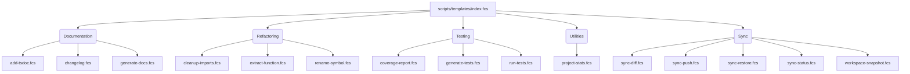

# scripts — templates

The `scripts/templates` module serves as a comprehensive library of reusable FCS (FCS Script) templates designed to automate common development tasks. These scripts cover areas such as documentation generation, code refactoring, workspace synchronization, testing, and general project utilities.

The module is structured to provide a central entry point (`index.fcs`) for discovering available templates, which are then organized into logical subdirectories.

## Module Structure

The `scripts/templates` module is organized into the following subdirectories, each containing related scripts:

*   `documentation`: Scripts for generating and enhancing project documentation.
*   `refactoring`: Scripts to assist with code refactoring tasks.
*   `sync`: Scripts for managing and synchronizing workspace state.
*   `testing`: Scripts for generating, running, and analyzing tests.
*   `utilities`: General-purpose scripts for project analysis and information.

The `index.fcs` script provides a categorized list of all available templates, their descriptions, usage examples, and required/optional environment variables.



## Getting Started

To explore the available templates and their usage, run the `index.fcs` script:

```bash
/fcs run scripts/templates/index.fcs
```

This will print a detailed list of all templates, categorized by their purpose, along with instructions on how to run them and the environment variables they accept.

To run a specific template, use the `/fcs run` command followed by the script's path and any necessary environment variables:

```bash
FILE=src/utils/helper.ts /fcs run scripts/templates/documentation/add-tsdoc.fcs
```

## Core Concepts and Utilities

Many scripts in this module leverage common FCS features and global objects:

*   **Environment Variables (`env()`):** All scripts are configured via environment variables, making them flexible and reusable without modifying the script code directly. The `env("VAR_NAME", "default_value")` function is used to retrieve these values.
*   **File System Operations (`tool`):** The `tool` global object provides functions for interacting with the file system, such as `tool.read()`, `tool.write()`, `tool.glob()` (for finding files by pattern), `tool.grep()` (for searching file content), `tool.ls()`, and `mkdir()`.
*   **Git Integration (`git`):** Scripts interacting with version control use the `git` global object, providing functions like `git.log()`, `git.