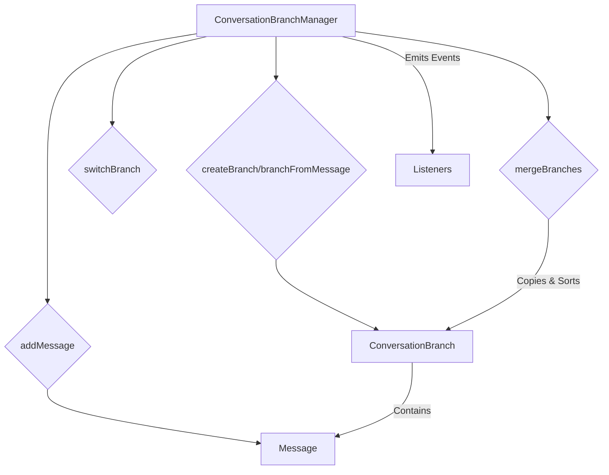
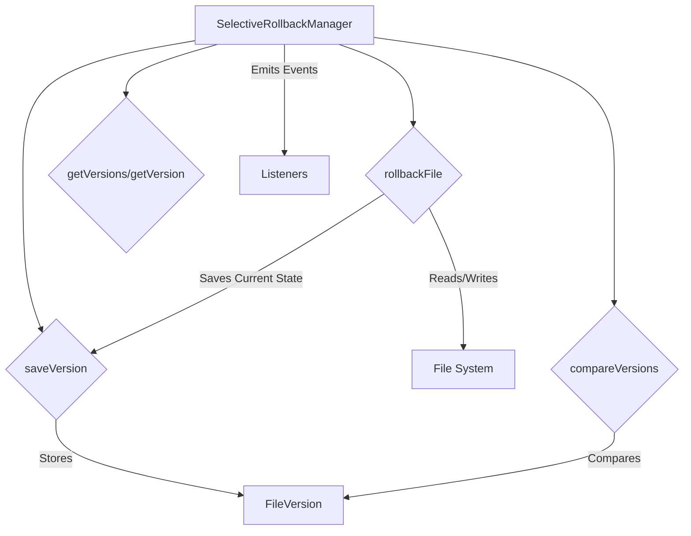
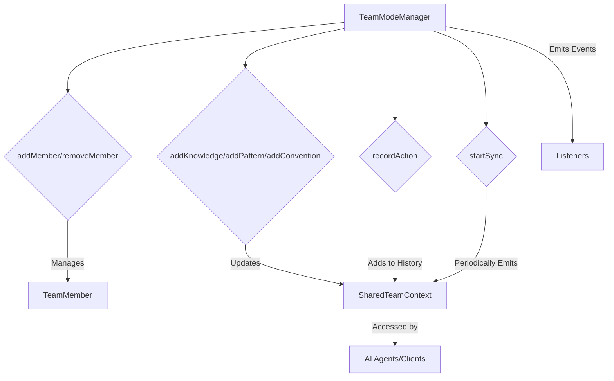

# src — advanced

The `src/advanced` module provides a suite of sophisticated functionalities designed to enhance the core capabilities of the system, offering features typically found in advanced development environments. These components address complex challenges such as collaborative development, intelligent code assistance, and robust version control.

This document details each major component within the `src/advanced` module, explaining its purpose, internal workings, key APIs, and how it integrates with other parts of the codebase.

---

## Module Overview

The `src/advanced` module encapsulates several distinct, high-value features:

*   **Conversation Branching and Merging**: Manage divergent conversation paths and integrate them.
*   **Distributed Caching**: Provide a shared, performant cache for team environments.
*   **Project Style Learning**: Automatically adapt to and enforce project-specific coding styles.
*   **Selective File Rollback**: Offer granular version control for individual files.
*   **Deterministic Session Replay**: Record and replay user interactions for debugging and analysis.
*   **Specialized Language/Framework Agents**: Utilize AI agents optimized for specific tech stacks.
*   **Team Mode with Shared Context**: Enable collaborative AI assistance with shared knowledge.
*   **Three-Way Diff for Conflict Resolution**: Facilitate advanced merging and conflict handling.

Most components follow a singleton pattern, providing a `get<ComponentName>()` factory function to ensure a single instance across the application, and extend `EventEmitter` for event-driven communication.

---

## Conversation Branching and Merging (`conversation-branching.ts`)

This module provides a mechanism to manage divergent conversation threads, allowing users to explore alternative responses or ideas without losing the original context, similar to how version control systems handle code branches.

### Purpose

To enable non-linear conversation flows, allowing users to:
*   Branch off a conversation at any message.
*   Explore different paths or prompts.
*   Merge successful branches back into a main or target branch.
*   Maintain a clear history of conversation evolution.

### How it Works

The `ConversationBranchManager` class is the central orchestrator. It maintains a collection of `ConversationBranch` objects, each representing a distinct conversation path.

1.  **Branch Creation**: When `createBranch` or `branchFromMessage` is called, a new `ConversationBranch` is created. If a `parentBranchId` and `branchPointMessageId` are provided, the new branch inherits all messages from its parent up to and including the branch point message.
2.  **Message Management**: Messages are added to the `currentBranch` using `addMessage`. Each message is assigned a unique ID.
3.  **Branch Switching**: `switchBranch` changes the active conversation context.
4.  **Merging**: The `mergeBranches` method attempts to combine messages from a `sourceBranch` into a `targetBranch`. Currently, it primarily adds unique messages from the source to the target and sorts them by timestamp. Conflict detection is outlined in the `MergeConflict` interface but not fully implemented for resolution in `mergeBranches`.
5.  **History**: `getHistory` traces a branch back to its root parent.

### Key Components

*   **`ConversationBranchManager`**: The main class for managing branches. Extends `EventEmitter` to signal branch and message events.
*   **`ConversationBranch`**: Represents a single conversation thread, including its ID, name, parent, branch point, and an array of `Message` objects.
*   **`Message`**: Defines the structure of a single message within a conversation, including its role, content, and timestamp.
*   **`MergeResult`**, **`MergeConflict`**: Interfaces for defining the outcome of a merge operation and any identified conflicts.

### Usage

```typescript
import { getConversationBranchManager } from './conversation-branching';

const manager = getConversationBranchManager();

// Initial branch is 'main'
const mainBranch = manager.getCurrentBranch();
manager.addMessage('user', 'What is the capital of France?');
manager.addMessage('assistant', 'Paris.');

// Branch off from the assistant's message
const newBranch = manager.branchFromMessage(mainBranch.messages[1].id, 'explore-germany');
manager.switchBranch(newBranch.id);
manager.addMessage('user', 'And Germany?');
manager.addMessage('assistant', 'Berlin.');

// Switch back to main and add more messages
manager.switchBranch(mainBranch.id);
manager.addMessage('user', 'What about Italy?');
manager.addMessage('assistant', 'Rome.');

// Attempt to merge 'explore-germany' into 'main'
const mergeResult = manager.mergeBranches(newBranch.id, mainBranch.id);
console.log('Merged branch messages:', mergeResult.mergedBranch.messages);
```

### Integration

*   **`EventEmitter`**: Emits events like `branch-created`, `branch-switched`, `message-added`, `branches-merged`, `branch-deleted`, `branch-renamed` for external listeners.
*   **`crypto`**: Used for generating unique IDs for branches and messages.

### Architecture Diagram



---

## Distributed Caching (`distributed-cache.ts`)

This module provides a local, in-memory cache designed for shared use within a team context, offering performance benefits by storing frequently accessed data.

### Purpose

To provide a fast, temporary storage for responses or computed values, reducing redundant computations and improving response times. It includes features like Time-To-Live (TTL) and size-based eviction to manage memory usage.

### How it Works

The `DistributedCache` class manages a `Map` of `CacheEntry` objects.

1.  **Configuration**: The cache is initialized with `maxSize` (total cache size), `ttl` (entry expiration), and `syncInterval` (for periodic cleanup).
2.  **Key Generation**: All keys are hashed using SHA256 to ensure consistency and fixed-size storage.
3.  **Setting Entries**: `set` adds a new entry. It checks if the entry is too large or if adding it would exceed the `maxSize`. If necessary, it triggers `evictIfNeeded` to remove older entries.
4.  **Retrieving Entries**: `get` retrieves an entry. It checks for expiration and increments a `hits` counter. If expired or not found, it increments `misses`.
5.  **Eviction**: `evictIfNeeded` implements a basic Least Recently Hit (LRH) eviction strategy, removing entries with the lowest hit count until space is available.
6.  **Cleanup**: `startSync` initiates a timer that periodically calls `cleanup` to remove expired entries and emits cache statistics.

### Key Components

*   **`DistributedCache`**: The main class managing cache operations. Extends `EventEmitter`.
*   **`CacheEntry`**: Defines the structure of a cached item, including its key, value, and metadata (createdBy, createdAt, expiresAt, hits, size).
*   **`DistributedCacheConfig`**: Configuration options for the cache.
*   **`CacheStats`**: Provides metrics like total entries, total size, hit rate, and miss rate.

### Usage

```typescript
import { getDistributedCache } from './distributed-cache';

const cache = getDistributedCache({ maxSize: 10 * 1024 * 1024, ttl: 60000 }); // 10MB, 1 minute TTL

cache.on('set', ({ key, size }) => console.log(`Cache set: ${key}, size: ${size}`));
cache.on('hit', ({ key }) => console.log(`Cache hit: ${key}`));
cache.on('sync', (stats) => console.log('Cache sync stats:', stats));

cache.set('my-data-key', 'some important data', 'user123');
console.log('Retrieved:', cache.get('my-data-key'));

cache.startSync(); // Start periodic cleanup and stats emission

// Later...
cache.dispose(); // Clean up resources
```

### Integration

*   **`EventEmitter`**: Emits `set`, `hit`, `cleared`, and `sync` events.
*   **`crypto`**: Used to generate SHA256 hashes for cache keys.
*   **`NodeJS.Timeout`**: Used for the `syncInterval` timer.

---

## Project Style Learning (`project-style-learning.ts`)

This module enables the system to learn and adapt to the specific coding style of a given project by analyzing its source code.

### Purpose

To automatically infer and document a project's coding conventions (e.g., naming, formatting, quote style, semicolon usage, indentation) and apply these preferences when generating or modifying code.

### How it Works

The `ProjectStyleLearner` class performs a deep analysis of a project's codebase.

1.  **File Discovery**: `analyzeProject` first calls `findSourceFiles` to recursively scan the project directory for common source code files (`.ts`, `.js`, `.py`, etc.), ignoring common non-source directories like `.git` or `node_modules`.
2.  **Content Analysis**: For each discovered file, its content is read, and `extractPatterns` is invoked. This method uses regular expressions to detect prevalent patterns:
    *   **Naming Conventions**: Compares occurrences of `camelCase` vs. `snake_case` variables.
    *   **Quote Style**: Counts single vs. double quotes.
    *   **Semicolon Usage**: Checks for semicolons at the end of lines.
    *   **Indentation**: Detects tabs vs. spaces (specifically 2 spaces).
3.  **Style Storage**: The inferred preferences are stored in a `ProjectStyle` object associated with the `projectPath`.
4.  **Style Application**: `applyStyleToCode` can take a string of code and modify it to conform to the learned preferences (e.g., changing double quotes to single quotes, removing semicolons).
5.  **Style Guide Generation**: `generateStyleGuide` produces a human-readable summary of the learned style.

### Key Components

*   **`ProjectStyleLearner`**: The main class for analyzing projects and applying styles. Extends `EventEmitter`.
*   **`ProjectStyle`**: Stores the learned preferences, analyzed file count, and last analysis timestamp for a project.
*   **`StylePattern`**: An interface for more granular style patterns, though the current implementation focuses on `preferences`.

### Usage

```typescript
import { getProjectStyleLearner } from './project-style-learning';

const learner = getProjectStyleLearner();

learner.on('analysis-complete', (style) => {
  console.log(`Analysis complete for ${style.projectPath}. Preferences:`, style.preferences);
});

async function runAnalysis() {
  const projectPath = '/path/to/your/project';
  const style = await learner.analyzeProject(projectPath);

  const styleGuide = learner.generateStyleGuide(projectPath);
  console.log(styleGuide);

  const originalCode = 'const myVar = "hello";\nconsole.log(myVar);';
  const styledCode = learner.applyStyleToCode(originalCode, projectPath);
  console.log('Original:\n', originalCode);
  console.log('Styled:\n', styledCode);
}

runAnalysis();
```

### Integration

*   **`fs-extra`**: Used for asynchronous file system operations (`readFile`, `readdir`, `ensureDir`, `pathExists`).
*   **`path`**: Used for path manipulation (`join`, `normalize`).
*   **`EventEmitter`**: Emits `analysis-complete` when a project's style has been fully analyzed.

---

## Selective File Rollback (`selective-rollback.ts`)

This module provides a lightweight versioning system for individual files, allowing users to save snapshots and revert to previous states without relying on a full-fledged version control system like Git.

### Purpose

To offer granular control over file versions, enabling users to:
*   Save specific versions of files as checkpoints.
*   View a history of changes for any tracked file.
*   Roll back a file to any saved version.
*   Compare different versions of a file.

### How it Works

The `SelectiveRollbackManager` stores an array of `FileVersion` objects for each tracked file.

1.  **Saving Versions**: `saveVersion` takes a file path and its content, creates a `FileVersion` with a unique ID, hash, and timestamp, and adds it to the beginning of the file's version history. It avoids saving duplicate content.
2.  **Retrieving Versions**: `getVersions` returns all saved versions for a given file, while `getVersion` retrieves a specific version by ID.
3.  **Rolling Back**: `rollbackFile` is the core rollback mechanism. Before overwriting the file, it first saves the *current* state of the file (if it exists) as a new version. Then, it writes the content of the target `versionId` to the file system.
4.  **Multiple Rollbacks**: `rollbackMultiple` allows rolling back several files in a single operation.
5.  **Comparison**: `compareVersions` provides a basic line-by-line comparison between two specified versions of a file, counting added, removed, and changed lines.

### Key Components

*   **`SelectiveRollbackManager`**: The main class for managing file versions and rollbacks. Extends `EventEmitter`.
*   **`FileVersion`**: Represents a snapshot of a file at a specific point in time, including its content, hash, timestamp, and source (e.g., 'manual', 'checkpoint').
*   **`RollbackResult`**: Provides the outcome of a rollback operation, indicating success or failure.

### Usage

```typescript
import { getSelectiveRollbackManager } from './selective-rollback';
import fs from 'fs-extra';

const manager = getSelectiveRollbackManager();

manager.on('version-saved', (version) => console.log(`Version saved for ${version.path}: ${version.id}`));
manager.on('file-rolled-back', ({ path, versionId }) => console.log(`File ${path} rolled back to ${versionId}`));

async function demonstrateRollback() {
  const filePath = 'temp_file.txt';
  await fs.writeFile(filePath, 'Initial content\nLine 2', 'utf-8');

  // Save initial version
  const v1 = manager.saveVersion(filePath, await fs.readFile(filePath, 'utf-8'));

  // Modify file and save new version
  await fs.writeFile(filePath, 'Modified content\nNew Line 2\nLine 3', 'utf-8');
  const v2 = manager.saveVersion(filePath, await fs.readFile(filePath, 'utf-8'));

  console.log('Current file content:', await fs.readFile(filePath, 'utf-8'));

  // Rollback to v1
  const result = await manager.rollbackFile(filePath, v1.id);
  if (result.success) {
    console.log('File rolled back successfully.');
    console.log('Content after rollback:', await fs.readFile(filePath, 'utf-8'));
  }

  // Compare versions
  const comparison = manager.compareVersions(filePath, v1.id, v2.id);
  console.log('Comparison v1 vs v2:', comparison);

  // Clean up
  await fs.remove(filePath);
}

demonstrateRollback();
```

### Integration

*   **`fs-extra`**: Used for file system operations (`pathExists`, `readFile`, `ensureDir`, `writeFile`).
*   **`path`**: Used for normalizing file paths.
*   **`EventEmitter`**: Emits `version-saved`, `file-rolled-back`, and `versions-cleared` events.
*   **`crypto`**: Used for generating unique IDs and content hashes for versions.

### Architecture Diagram



---

## Deterministic Session Replay (`session-replay.ts`)

This module provides functionality to record and replay user interaction sessions, capturing a sequence of events for debugging, analysis, or demonstration purposes.

### Purpose

To enable the capture of a user's interaction flow with the system, including inputs, outputs, tool calls, and state changes. These recorded sessions can then be deterministically replayed to reproduce issues, understand user behavior, or demonstrate features.

### How it Works

The `SessionReplayManager` manages the recording, storage, and replay of `ReplaySession` objects.

1.  **Recording**:
    *   `startRecording` initializes a new `ReplaySession` and sets the manager to a recording state.
    *   `recordEvent` captures individual actions or state changes as `ReplayEvent` objects, adding them to the `currentSession`. Each event includes a timestamp, type, data, and a hash of the data for integrity verification.
    *   `stopRecording` finalizes the current session.
2.  **Storage**: `saveSession` serializes a `ReplaySession` to a JSON file within a dedicated `.codebuddy/replays` directory. `loadSession` and `listSessions` handle retrieving and listing saved sessions.
3.  **Replay**: The `replay` method takes a `sessionId` and iterates through its recorded events. It introduces delays between events to simulate the original timing (adjustable via `speed` option) and emits each event for external processing (e.g., UI updates).
4.  **Integrity**: `verifyIntegrity` re-computes the hash for each event's data and compares it to the stored hash, ensuring the session data has not been tampered with.

### Key Components

*   **`SessionReplayManager`**: The main class for managing session recording and replay. Extends `EventEmitter`.
*   **`ReplaySession`**: Represents a complete recorded session, including its ID, name, start/end times, a list of `ReplayEvent`s, and metadata.
*   **`ReplayEvent`**: Defines a single event within a session, capturing its type (e.g., 'input', 'output', 'tool'), data, timestamp, and a content hash.

### Usage

```typescript
import { getSessionReplayManager } from './session-replay';
import fs from 'fs-extra';

const manager = getSessionReplayManager();

manager.on('recording-started', (sessionId) => console.log(`Recording session ${sessionId}`));
manager.on('event-recorded', (event) => console.log(`Recorded event: ${event.type}`));
manager.on('replay-event', (event) => console.log(`Replaying event: ${event.type} - ${JSON.stringify(event.data)}`));

async function demonstrateReplay() {
  const metadata = { model: 'gpt-4', systemPrompt: 'You are a helpful AI.', toolsEnabled: ['search'] };
  const session = manager.startRecording('My Test Session', metadata);

  manager.recordEvent('input', { text: 'Hello AI' });
  await new Promise(r => setTimeout(r, 100));
  manager.recordEvent('output', { text: 'Hello user!' });
  await new Promise(r => setTimeout(r, 50));
  manager.recordEvent('tool', { name: 'search', query: 'latest news' });

  const savedSession = manager.stopRecording();
  if (savedSession) {
    const filePath = await manager.saveSession(savedSession);
    console.log(`Session saved to ${filePath}`);

    console.log('\nStarting replay...');
    await manager.replay(savedSession.id, { speed: 2, onEvent: (e) => console.log(`Custom handler: ${e.type}`) });
    console.log('Replay completed.');

    const integrity = manager.verifyIntegrity(savedSession);
    console.log(`Session integrity verified: ${integrity}`);
  }

  // Clean up
  await fs.remove('.codebuddy/replays');
}

demonstrateReplay();
```

### Integration

*   **`fs-extra`**: Used for file system operations (`ensureDir`, `writeJson`, `readJson`, `readdir`, `pathExists`) to persist and load sessions.
*   **`path`**: Used for constructing file paths for session storage.
*   **`EventEmitter`**: Emits `recording-started`, `recording-stopped`, `event-recorded`, `replay-started`, `replay-event`, and `replay-completed` events.
*   **`crypto`**: Used for generating unique IDs for sessions and events, and for hashing event data for integrity checks.
*   **`../utils/logger.js`**: Used for logging potential errors during session file parsing.

### Architecture Diagram

```mermaid
graph TD
    A[SessionReplayManager] --> B{startRecording}
    B -- Creates --> C[ReplaySession]
    A --> D{recordEvent}
    D -- Adds to --> C
    A --> E{stopRecording}
    E -- Finalizes --> C
    A --> F{saveSession}
    F -- Writes JSON --> G[File System (.codebuddy/replays)]
    A --> H{loadSession}
    H -- Reads JSON --> G
    A --> I{replay}
    I -- Reads Events --> C
    I -- Emits Events --> J[Listeners]
    A --> K{verifyIntegrity}
    K -- Checks Hashes --> C
```

---

## Specialized Language/Framework Agents (`specialized-agents.ts`)

This module manages a registry of AI agents that are specifically optimized for different programming languages and frameworks.

### Purpose

To allow the system to select and utilize AI agents that possess deep expertise in a particular technology stack, leading to more accurate, context-aware, and high-quality code generation, analysis, and refactoring.

### How it Works

The `SpecializedAgentManager` maintains a collection of `SpecializedAgent` objects.

1.  **Agent Registry**: The manager is initialized with a predefined set of `SPECIALIZED_AGENTS` (e.g., TypeScript Expert, Python Expert, React Expert), each detailing its `capabilities` (languages, frameworks, specialties) and a `systemPrompt`. Additional agents can be registered dynamically using `registerAgent`.
2.  **Agent Selection**:
    *   `getAgent` retrieves an agent by its unique ID.
    *   `selectAgentForLanguage` and `selectAgentForFramework` find the first agent that supports the specified language or framework.
    *   `autoSelectAgent` attempts to select an agent based on a provided context, prioritizing framework-specific agents over language-specific ones.
3.  **Current Agent**: `setCurrentAgent` sets an agent as the active one, and `getCurrentAgent` retrieves it.

### Key Components

*   **`SpecializedAgentManager`**: The main class for managing and selecting specialized agents. Extends `EventEmitter`.
*   **`SpecializedAgent`**: Defines an AI agent, including its ID, name, description, `AgentCapability`, `systemPrompt`, and examples.
*   **`AgentCapability`**: Specifies the languages, frameworks, and other specialties an agent possesses.
*   **`Language`**, **`Framework`**: Type definitions for supported languages and frameworks.

### Usage

```typescript
import { getSpecializedAgentManager } from './specialized-agents';

const manager = getSpecializedAgentManager();

manager.on('agent-selected', (agent) => console.log(`Selected agent: ${agent.name}`));

// Get all available agents
console.log('Available agents:', manager.getAgents().map(a => a.name));

// Select an agent for a specific language
const tsAgent = manager.selectAgentForLanguage('typescript');
console.log('TypeScript agent:', tsAgent?.name);

// Auto-select based on context
const reactContextAgent = manager.autoSelectAgent({ language: 'typescript', framework: 'react' });
console.log('Auto-selected for React context:', reactContextAgent?.name);

// Set a specific agent as current
manager.setCurrentAgent('python-expert');
console.log('Current agent:', manager.getCurrentAgent()?.name);

// Register a new custom agent
manager.registerAgent({
  id: 'vue-expert',
  name: 'Vue.js Expert',
  description: 'Specialized in Vue.js and frontend development',
  capabilities: { languages: ['javascript', 'typescript'], frameworks: ['vue'], specialties: ['composition API', 'state management'] },
  systemPrompt: 'You are a Vue.js expert. Focus on Vue 3, Composition API, and reactivity.',
  examples: [],
});
console.log('New agent registered:', manager.getAgent('vue-expert')?.name);
```

### Integration

*   **`EventEmitter`**: Emits `agent-selected` when an agent is set as current, and `agent-registered` when a new agent is added.

---

## Team Mode with Shared Context (`team-mode.ts`)

This module facilitates collaborative development by providing a shared context and communication mechanisms for a team working with the AI.

### Purpose

To enable multiple team members to interact with the AI in a shared environment, where the AI maintains a consistent understanding of the project, shared knowledge, and team activities. This fosters better collaboration and more relevant AI assistance.

### How it Works

The `TeamModeManager` orchestrates shared context and team member management.

1.  **Initialization**: The manager is created with `TeamConfig` (e.g., `teamId`, `syncInterval`, `maxMembers`). It initializes a `SharedTeamContext`.
2.  **Member Management**: `addMember` and `removeMember` manage the team roster, assigning roles and tracking activity.
3.  **Shared Context**:
    *   `addKnowledge`: Allows team members to contribute key-value pairs to a shared knowledge base.
    *   `addPattern`, `addConvention`: Enables the team to define and share common code patterns and conventions.
    *   `recordAction`: Logs significant team activities (queries, edits, commits, reviews) to a shared history.
4.  **Synchronization**: `startSync` initiates a timer that periodically emits the entire `SharedTeamContext`, allowing connected clients or other modules to stay updated.
5.  **Access**: `getContext` and `getMembers` provide read-only access to the current shared state.

### Key Components

*   **`TeamModeManager`**: The main class for managing team collaboration and shared context. Extends `EventEmitter`.
*   **`TeamMember`**: Defines a team member with ID, name, role, and activity timestamps.
*   **`SharedTeamContext`**: The central object holding all shared information: project details, knowledge base, code patterns, conventions, and action history.
*   **`TeamAction`**: Records a specific action performed by a team member.
*   **`TeamConfig`**: Configuration options for the team mode.

### Usage

```typescript
import { createTeamMode } from './team-mode';

const teamManager = createTeamMode({ teamId: 'dev-team-alpha', maxMembers: 10 });

teamManager.on('member-joined', (member) => console.log(`${member.name} joined the team.`));
teamManager.on('knowledge-updated', ({ key, value }) => console.log(`Shared knowledge updated: ${key} = ${value}`));
teamManager.on('sync', (context) => console.log('Team context synced:', context.history.length, 'actions'));

const member1 = teamManager.addMember('Alice', 'admin');
const member2 = teamManager.addMember('Bob');

teamManager.addKnowledge('project-goal', 'Build a scalable microservice architecture.');
teamManager.addPattern('use-async-await', 'Prefer async/await over callbacks.');
teamManager.addConvention('commit-message-format', 'feat: (scope) message');

teamManager.recordAction(member1.id, 'query', 'How to implement feature X?');
teamManager.recordAction(member2.id, 'edit', 'Refactored auth module.');

console.log('Current team members:', teamManager.getMembers().map(m => m.name));
console.log('Shared knowledge:', teamManager.getContext().sharedKnowledge.get('project-goal'));

teamManager.startSync(); // Start periodic context synchronization

// Later...
teamManager.dispose(); // Clean up resources
```

### Integration

*   **`EventEmitter`**: Emits `member-joined`, `member-left`, `knowledge-updated`, `action-recorded`, and `sync` events.
*   **`crypto`**: Used for generating unique IDs for team members and actions.
*   **`NodeJS.Timeout`**: Used for the `syncInterval` timer.

### Architecture Diagram



---

## Three-Way Diff for Conflict Resolution (`three-way-diff.ts`)

This module provides a robust implementation of a three-way diff algorithm, essential for identifying and resolving merge conflicts between different versions of text content.

### Purpose

To accurately compare three versions of a file (a common ancestor, "ours," and "theirs") to:
*   Identify changes made in "ours" and "theirs" relative to the "base."
*   Automatically merge non-conflicting changes.
*   Clearly mark conflicting sections where "ours" and "theirs" diverge from the base in incompatible ways.
*   Provide tools for programmatic conflict resolution.

### How it Works

The `ThreeWayDiff` class implements the core diffing logic.

1.  **Diffing (`diff`)**:
    *   Takes three strings (`base`, `ours`, `theirs`) representing the content.
    *   Splits each string into lines.
    *   Iterates through the lines, comparing `ours` and `theirs` against `base`.
    *   Identifies "hunks" of changes. A `DiffHunk` captures a contiguous block of lines where at least one of `ours` or `theirs` differs from `base`.
    *   Each hunk is assigned a `status`:
        *   `clean`: No changes in this hunk (not captured by `diff` directly, but implied by lines outside hunks).
        *   `auto-merged`: Changes were made in `ours` OR `theirs` (but not both in conflicting ways), or both made the same change.
        *   `conflict`: Changes were made in both `ours` AND `theirs` to the same `base` lines, and the resulting `ourLine` and `theirLine` are different.
    *   If no conflicts are found, `autoMerge` is called to produce a fully merged result.
2.  **Conflict Formatting (`formatConflictMarkers`)**: Generates a string with standard Git-style conflict markers (`<<<<<<< OURS`, `=======`, `>>>>>>> THEIRS`) for a given `DiffHunk`.
3.  **Conflict Parsing (`parseConflictMarkers`)**: Extracts `DiffHunk` objects from a string containing Git-style conflict markers.
4.  **Conflict Resolution (`resolveConflicts`)**: Takes a `ThreeWayDiffResult` (which contains conflicts) and an array of `ConflictResolution` objects. For each specified hunk, it applies the chosen resolution strategy ('ours', 'theirs', 'both', or 'custom content') and then reconstructs the merged string.

### Key Components

*   **`ThreeWayDiff`**: The main class for performing three-way diffs and conflict resolution. Extends `EventEmitter`.
*   **`DiffHunk`**: Represents a block of changes, containing the `base`, `ours`, and `theirs` lines for that block, and its `status`.
*   **`ThreeWayDiffResult`**: The overall result of a diff operation, including all `DiffHunk`s, a flag for conflicts, and the auto-merged content if no conflicts exist.
*   **`ConflictResolution`**: Specifies how a particular `DiffHunk` should be resolved.

### Usage

```typescript
import { getThreeWayDiff } from './three-way-diff';

const diffManager = getThreeWayDiff();

const base = `Line 1
Line 2
Line 3
Line 4`;

const ours = `Line 1
Our change on Line 2
Line 3
Line 4 added by ours`;

const theirs = `Line 1
Their change on Line 2
Line 3
Line 4 added by theirs`;

// Perform a diff
const result = diffManager.diff(base, ours, theirs);
console.log('Has conflicts:', result.hasConflicts);
console.log('Conflict count:', result.conflictCount);

if (result.hasConflicts) {
  console.log('\nConflicts found:');
  result.hunks.filter(h => h.status === 'conflict').forEach((hunk, index) => {
    console.log(`--- Hunk ${index + 1} ---`);
    console.log(diffManager.formatConflictMarkers(hunk));
  });

  // Resolve conflicts (e.g., choose 'ours' for the first conflict)
  const resolutions = [{ hunkIndex: 0, choice: 'ours' }];
  const resolvedContent = diffManager.resolveConflicts(result, resolutions);
  console('\nResolved content (choosing ours for first conflict):');
  console.log(resolvedContent);
} else {
  console.log('\nAuto-merged content:');
  console.log(result.merged);
}

// Example of parsing conflict markers
const conflictString = `Line A
<<<<<<< OURS
Our version of B
=======
Their version of B
>>>>>>> THEIRS
Line C`;
const parsedHunks = diffManager.parseConflictMarkers(conflictString);
console('\nParsed conflict hunks:', parsedHunks);
```

### Integration

*   **`EventEmitter`**: While `ThreeWayDiff` extends `EventEmitter`, the current implementation does not emit any events. This could be extended to emit events for `diff-completed`, `conflict-resolved`, etc.

### Architecture Diagram

```mermaid
graph TD
    A[ThreeWayDiff] --> B{diff(base, ours, theirs)}
    B -- Generates --> C[ThreeWayDiffResult]
    C -- Contains --> D[DiffHunk]
    D -- Status --> E{clean, auto-merged, conflict}
    A --> F{autoMerge}
    F -- If no conflicts --> C
    A --> G{resolveConflicts}
    G -- Takes --> C & H[ConflictResolution]
    G -- Produces --> I[Merged Content]
    A --> J{formatConflictMarkers}
    J -- Formats --> D
    A --> K{parseConflictMarkers}
    K -- Parses --> D
```