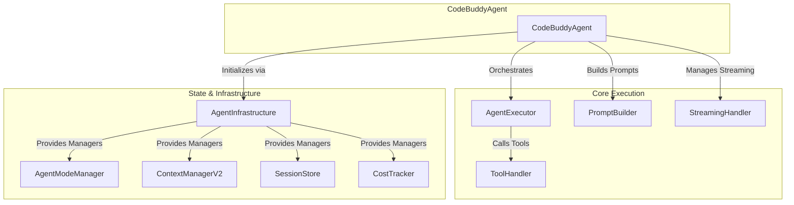

# src — agent

The `src/agent` module is the core intelligence and orchestration layer of CodeBuddy. It encapsulates the logic for interacting with Large Language Models (LLMs), executing tools, managing conversational state, and adapting its behavior based on user input and operational context. This module transforms raw user requests into structured plans, executes them, and provides a rich, interactive experience.

## Core Agent Architecture

At the heart of the `src/agent` module are two key classes: `BaseAgent` and `CodeBuddyAgent`.

*   **`BaseAgent`**: This abstract class provides the foundational structure and common functionalities for any agent within the CodeBuddy system. It employs a **Facade pattern**, delegating responsibilities to specialized internal facades (e.g., `AgentContextFacade`, `SessionFacade`, `ModelRoutingFacade`, `InfrastructureFacade`, `MessageHistoryManager`). This design promotes modularity, testability, and a clear separation of concerns. Subclasses must implement the core interaction methods: `processUserMessage`, `processUserMessageStream`, and `executeTool`.

*   **`CodeBuddyAgent`**: This is the primary concrete implementation of `BaseAgent` and serves as the central orchestrator for most CodeBuddy interactions. It initializes and coordinates a wide array of managers and services, including the LLM client, tool execution, prompt construction, streaming, and various middleware components. It's responsible for:
    *   Setting up the agent's operational environment (models, cost limits, YOLO mode).
    *   Managing the conversation history and LLM message context.
    *   Applying advanced features like skill matching, model routing, and self-healing.
    *   Handling the full lifecycle of a user request, from parsing to execution and response generation.

The relationship between `CodeBuddyAgent` and its key collaborators can be visualized as follows:

## Key Components & Functionality

The `src/agent` module is composed of several specialized files, each handling a distinct aspect of agent behavior:

### 1. Agent Lifecycle & State Management

*   **`agent-state.ts`**: This module defines the `AgentState` class, a centralized manager for an agent's runtime configuration and state. It consolidates:
    *   **`AgentConfig`**: General settings like `maxToolRounds`, `sessionCostLimit`, `yoloMode`, `parallelToolExecution`, `ragToolSelection`, and `selfHealing`.
    *   **Cost Tracking**: Integrates with `CostTracker` to monitor `sessionCost` against `sessionCostLimit`.
    *   **Mode Management**: Delegates to `AgentModeManager` for operational mode control.
    *   **Security**: Integrates `SandboxManager` for command validation.
    *   **Context**: Manages `ContextManagerV2` for LLM context window.
    *   **Persistence**: Uses `SessionStore` for saving and loading chat history.
    *   **Abort Control**: Provides `AbortController` for cancelling ongoing operations.
    `CodeBuddyAgent` leverages these underlying managers, often exposed through the `BaseAgent`'s facade methods.

*   **`agent-mode.ts`**: The `AgentModeManager` class (a singleton accessed via `getAgentModeManager`) is responsible for managing the agent's current `OperatingMode` (e.g., 'suggest', 'auto-edit', 'full-auto'). It determines tool permissions and can inject mode-specific system prompt additions.

*   **`session-store.ts` (external, but heavily used)**: While not directly in `src/agent`, the `SessionStore` (from `src/persistence`) is crucial for saving and loading chat history, enabling persistent conversations across sessions. `AgentState` and `BaseAgent` interact with it.

*   **`checkpoint-manager.ts` (external)**: The `CheckpointManager` (from `src/checkpoints`) allows the agent to save snapshots of its state, enabling "rewind" functionality for debugging or recovery. `BaseAgent` exposes methods like `createCheckpoint` and `rewindToLastCheckpoint`.

### 2. Execution & Interaction Flow

*   **`codebuddy-agent.ts` (Orchestrator)**: As described above, this is the central hub. It initializes and wires together all other components. Its `processUserMessageStream` method is the primary entry point for user interaction, handling everything from skill matching and cost prediction to model routing and tool execution.

*   **`agent-executor.ts` (Execution Engine)**: The `AgentExecutor` is responsible for the core LLM interaction loop. It takes the user message and conversation history, constructs the prompt, calls the LLM, parses the response (for text or tool calls), executes tools via `ToolHandler`, and manages the overall turn-taking. It also integrates a `MiddlewarePipeline` for extensible behavior modification.

*   **`tool-handler.ts`**: This class acts as the central dispatcher for all tool calls requested by the LLM. It:
    *   Manages the registry of available tools (both built-in and plugin-provided).
    *   Handles tool execution, including `bash` commands, file operations (`textEditor`, `morphEditor`), and specialized tools.
    *   Integrates with `CheckpointManager` for pre/post-tool snapshots.
    *   Leverages `HooksManager` for lifecycle events around tool execution.
    *   Coordinates with `RepairCoordinator` for self-healing failed tool commands.
    *   Enforces `SandboxManager` and `PermissionModeManager` rules.

*   **`streaming/index.ts` (Streaming Output)**: The `StreamingHandler` manages the real-time output from the LLM, processing raw chunks into structured `StreamingChunk` objects and tracking token counts.

*   **`prompt-builder.ts` (Prompt Construction)**: The `PromptBuilder` dynamically constructs the system prompt and other parts of the LLM input. It incorporates:
    *   Base system instructions.
    *   `YOLO_MODE` specific directives.
    *   Memory system context.
    *   Custom instructions loaded from `.codebuddy/instructions.md`.
    *   Context from `RepoProfiler` and `KnowledgeManager`.
    *   Moltbot hooks for intro injection.

*   **`execution/tool-selection-strategy.ts`**: The `ToolSelectionStrategy` (accessed via `getToolSelectionStrategy`) is crucial for optimizing LLM interactions. When `useRAGToolSelection` is enabled, it uses Retrieval-Augmented Generation (RAG) to semantically filter the available tools, sending only the most relevant ones to the LLM. This reduces prompt size, improves tool selection accuracy, and saves costs.

*   **`execution/repair-coordinator.ts` (Self-Healing)**: The `RepairCoordinator` is responsible for detecting and attempting to fix errors during tool execution, particularly for `bash` commands. When `selfHealing` is enabled, it analyzes error output and can generate corrective actions, often by invoking the LLM itself to suggest fixes.

### 3. Planning & Advanced Modes

*   **`architect-mode.ts`**: This module introduces a structured, two-phase approach for handling complex development tasks:
    1.  **Architect Phase (`analyze`)**: An "architect" LLM analyzes the request and generates a detailed `ArchitectProposal` (summary, steps, affected files, risks, estimated changes).
    2.  **Editor Phase (`implement`)**: An "editor" LLM then executes each `ArchitectStep` from the proposal, potentially in parallel using `buildExecutionWaves` for steps without dependencies. This mode is ideal for large, multi-file changes.

*   **`planner/index.ts` (Task Planning)**: `CodeBuddyAgent` includes methods like `needsPlanning` and `executePlan` that leverage a `TaskPlanner` and `TaskGraph` to decompose complex requests into a Directed Acyclic Graph (DAG) of smaller, manageable tasks. A `DelegationEngine` can then assign these tasks to appropriate sub-agents.

### 4. Context & Memory Management

*   **`context/context-manager-v2.ts` (external)**: The `ContextManagerV2` (from `src/context`) is responsible for managing the LLM's context window. It employs strategies like summarization and compression to keep the conversation within token limits, ensuring the agent retains relevant information over long interactions. `BaseAgent` exposes methods like `getContextStats` and `updateContextConfig`.

*   **`memory/index.ts` & `context/memory-context-builder.ts`**:
    *   The `EnhancedMemory` system (accessed via `getEnhancedMemory`) provides long-term, cross-session memory capabilities. It stores `MemoryEntry` objects (facts, decisions, patterns, errors) and uses embeddings for semantic recall.
    *   The `MemoryContextBuilder` (`src/agent/context/memory-context-builder.ts`) integrates `EnhancedMemory` into the agent's prompt construction. It retrieves relevant memories based on the current query, filters them by importance and type, and formats them for inclusion in the LLM's context.

### 5. Customization & Extensibility

*   **`agent-loader.ts`**: This module enables the creation of custom agents defined in Markdown files. These files use YAML frontmatter to specify agent configuration (name, description, model, tools, `maxTurns`, `permissionMode`) and the Markdown body as the `systemPrompt`. `loadCustomAgents` and `getCustomAgent` allow dynamic loading and retrieval of these custom definitions.

*   **`middleware/index.ts` (Middleware Pipeline)**: The `AgentExecutor` uses a `MiddlewarePipeline` to inject custom logic into the agent's processing flow. `CodeBuddyAgent` registers several built-in middleware components (e.g., `TurnLimitMiddleware`, `CostLimitMiddleware`, `WorkflowGuardMiddleware`, `ReasoningMiddleware`, `AutoRepairMiddleware`, `QualityGateMiddleware`) to enforce policies, enhance reasoning, and automate tasks. Developers can add their own middleware to modify agent behavior.

*   **`channels/peer-routing.ts` (Peer Routing)**: `CodeBuddyAgent` supports `applyPeerRouting` to dynamically adjust its configuration (model, system prompt, tool constraints) based on routing decisions made by a `PeerRouter`. This allows for delegating specific tasks to specialized agent configurations.

### 6. Observability & Debugging

*   **`cost-tracker.ts` (external)**: The `CostTracker` (from `src/utils`) monitors the financial cost of LLM interactions. `CodeBuddyAgent` uses it to track `sessionCost` and enforce `sessionCostLimit`.

*   **`analytics/budget-alerts.ts`**: The `BudgetAlertManager` monitors the `sessionCost` against the `sessionCostLimit` and emits alerts when thresholds are approached or exceeded.

*   **`optimization/model-routing.ts`**: The `ModelRouter` intelligently selects the most appropriate LLM model for a given task based on complexity, cost, and capabilities. `CodeBuddyAgent` can enable `useModelRouting` to dynamically switch models during a conversation.

*   **`cache-trace.ts`**: This debugging utility, Advanced enterprise architecture for, logs every stage of prompt construction and execution. When `CACHE_TRACE=true` is set, it provides detailed timing, token counts, and metadata, invaluable for diagnosing cache hit/miss issues and context building problems.

*   **`background-tasks.ts`**: The `BackgroundTaskManager` (a singleton accessed via `getBackgroundTaskManager`) allows the agent to launch shell commands in the background. It captures their output and status, enabling non-blocking execution of long-running processes.

## How to Extend and Contribute

*   **Create Custom Agents**: Define new agents using Markdown files in `.codebuddy/agents/` or `~/.codebuddy/agents/`, leveraging the `MarkdownAgentDefinition` interface and `agent-loader.ts`.
*   **Add New Tools**: Implement new tools and register them with the `ToolHandler`. Ensure they integrate with the `SandboxManager` for security.
*   **Develop Custom Middleware**: Create new middleware components to inject custom logic into the `AgentExecutor`'s `MiddlewarePipeline`, modifying how the agent processes messages or tool calls.
*   **Enhance Memory & Context**: Contribute to the `EnhancedMemory` system or `MemoryContextBuilder` to improve how the agent stores, retrieves, and utilizes long-term knowledge.
*   **Improve Planning & Orchestration**: Extend the `TaskPlanner` or `DelegationEngine` to handle more complex multi-step or multi-agent workflows.
*   **Debugging**: Utilize `CacheTrace` by setting `CACHE_TRACE=true` in your environment variables to gain deep insights into prompt construction and execution flow.

## Conclusion

The `src/agent` module is the sophisticated control center of CodeBuddy, bringing together diverse functionalities to create an intelligent, adaptable, and extensible AI assistant. By understanding its modular design and the roles of its various components, developers can effectively contribute to and extend CodeBuddy's capabilities.