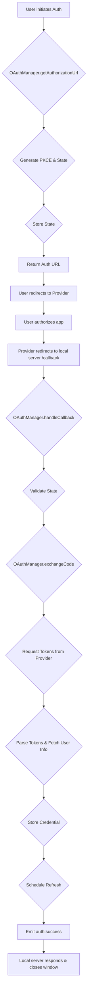

# src — auth

The `src/auth` module provides comprehensive authentication and profile management capabilities, primarily focused on integrating with AI providers. It is divided into two main sub-modules: `oauth` for handling OAuth 2.0 flows and `profile-manager.ts` for a more generic, robust profile management system with advanced failure handling.

## Module Overview

The `src/auth` module serves as the backbone for managing access to various AI services. It addresses several critical concerns:

1.  **OAuth 2.0 Authentication**: Securely handles authorization code grants with PKCE, token exchange, refresh, and user information retrieval for providers supporting OAuth.
2.  **AI Model Profile Management (with Failover)**: Allows defining multiple profiles for AI providers (e.g., OpenAI, Anthropic, Grok), each with its own authentication method (API key or OAuth). It implements a circuit breaker pattern to automatically switch to backup providers upon failures, ensuring resilience.
3.  **Generic Auth Profile Management (with Cooldowns & Persistence)**: A more generalized system for managing authentication profiles, featuring various rotation strategies (round-robin, priority, random), session stickiness, exponential backoff cooldowns for failed profiles (including special handling for billing-related failures), and persistent state storage.

## Core Concepts

Before diving into the components, understanding a few core concepts will be helpful:

*   **OAuth 2.0**: An industry-standard protocol for authorization. This module specifically implements the Authorization Code Grant flow with Proof Key for Code Exchange (PKCE) for enhanced security.
*   **PKCE (Proof Key for Code Exchange)**: A security extension to OAuth 2.0 that prevents authorization code interception attacks. It involves a `code_verifier` and `code_challenge` pair.
*   **Model Profile**: A configuration entry for a specific AI provider, including its authentication details, supported models, base URL, and priority.
*   **Circuit Breaker**: A design pattern used in `ModelProfileManager` to prevent repeated failures against a resource. If a profile experiences too many failures, its "circuit" opens, temporarily taking it out of rotation. After a cooldown, it enters a "half-open" state to test if the resource has recovered.
*   **Exponential Backoff Cooldown**: Used in `AuthProfileManager`, this strategy increases the delay before retrying a failed profile after each consecutive failure, reducing load on failing services. It includes special, longer cooldowns for billing-related errors.
*   **Session Stickiness**: In `AuthProfileManager`, this ensures that once a profile is selected for a given session, subsequent requests from that session will attempt to use the same profile, provided it remains healthy.

## OAuth Module (`src/auth/oauth`)

This sub-module is dedicated to OAuth 2.0 authentication and managing AI provider profiles with failover.

### `types.ts`

Defines all the essential types and interfaces used across the OAuth module:

*   `OAuthProviderId`, `OAuthProviderConfig`: Identifies and configures supported OAuth providers (e.g., `anthropic`, `openai`, `google`, `github`). Includes built-in configurations in `OAUTH_PROVIDERS`.
*   `OAuthToken`, `StoredCredential`, `OAuthUserInfo`: Structures for OAuth tokens, securely stored credentials, and user profile information.
*   `PKCEChallenge`, `AuthorizationState`: Types for PKCE parameters and the state maintained during an OAuth authorization flow.
*   `ModelProfile`, `ProfileSelection`: Defines the structure for AI provider profiles and the result of selecting one.
*   `OAuthConfig`, `DEFAULT_OAUTH_CONFIG`: Configuration for the `OAuthManager`, including local server port, refresh thresholds, and storage paths.
*   `OAuthEvents`: Defines the events emitted by `OAuthManager` for lifecycle tracking.

### `OAuthManager`

The `OAuthManager` class is responsible for orchestrating the entire OAuth 2.0 authentication process. It handles provider configuration, initiating authorization flows, exchanging codes for tokens, and managing token lifecycles.

**Key Features:**

*   **Provider Configuration**: Use `configureProvider` to set up OAuth providers with client IDs, secrets, and redirect URIs. It leverages `OAUTH_PROVIDERS` for base configurations.
*   **PKCE Support**: Automatically generates and manages PKCE challenges (`generatePKCE`) for providers that require it, enhancing security.
*   **Authorization Flow**:
    *   `getAuthorizationUrl(providerId)`: Generates the URL to redirect the user for authorization, including `state` and PKCE parameters.
    *   `startLocalServer()` / `stopLocalServer()`: Manages a local HTTP server to receive the OAuth callback redirect.
    *   `handleCallback(req, res)`: Processes the incoming redirect from the OAuth provider, extracts the authorization `code` and `state`.
    *   `exchangeCode(providerId, code, state)`: Exchanges the authorization code for access and refresh tokens, validates the `state`, and stores the `StoredCredential`.
*   **Token Management**:
    *   `refreshToken(credentialId)`: Uses a refresh token to obtain a new access token when the current one expires.
    *   `scheduleRefresh(credentialId)`: Automatically schedules token refreshes before they expire, based on `refreshThresholdMs`.
    *   `getAccessToken(credentialId)`: Provides a valid access token, refreshing it if necessary and possible.
    *   `isTokenExpired(credential)`: Checks if a token is expired or near expiry.
*   **Credential Storage**: Manages `StoredCredential` objects internally, identified by a unique `credentialId`.
*   **User Info Fetching**: Optionally fetches user profile information from the provider's `userInfoUrl` after successful token exchange (`fetchUserInfo`).
*   **Events**: Emits events like `auth:started`, `auth:success`, `auth:failed`, `token:refreshed`, `token:expired` to allow external components to react to authentication lifecycle changes.

**Execution Flow (Authorization):**



### `ModelProfileManager`

The `ModelProfileManager` class is designed to manage multiple AI provider profiles, enabling automatic failover and intelligent model selection. It integrates with `OAuthManager` for OAuth-based authentication.

**Key Features:**

*   **Profile Management**:
    *   `addProfile(profile)`: Adds or updates a `ModelProfile`.
    *   `getProfile(id)`, `getAllProfiles()`, `getEnabledProfiles()`: Retrieve profiles.
    *   `enableProfile(id)`, `disableProfile(id)`, `removeProfile(id)`: Control profile availability.
*   **Model Selection & Failover**:
    *   `selectProfile(preferredModel?)`: Selects the highest-priority, enabled, and ready profile that supports the `preferredModel` (or its default model). It respects the circuit breaker state.
    *   `getNextAvailableProfile(failedProfileId, preferredModel?)`: Used after a profile failure to find an alternative, marking the failed profile as such.
    *   `profileSupportsModel(profile, model)`: Helper to check if a profile supports a given model, including wildcard matches.
*   **Circuit Breaker Pattern**:
    *   `recordFailure(profileId, error?)`: Increments a profile's failure count. If the count exceeds `circuitBreakerThreshold`, the circuit `openCircuit(profileId)` is opened.
    *   `recordSuccess(profileId)`: Resets the failure count and closes the circuit if it was in a 'half-open' state.
    *   `openCircuit(profileId)`: Sets a profile's `circuitState` to 'open' and schedules a transition to 'half-open' after `circuitBreakerResetMs` (`scheduleHalfOpen`).
    *   `isProfileReady(profile)`: Checks if a profile is configured and its authentication (API key or OAuth token) is valid and not expired.
*   **Authentication Integration**:
    *   `setOAuthManager(manager)`: Establishes a link to an `OAuthManager` instance.
    *   `getAccessToken(profileId)`: Retrieves the API key or delegates to `OAuthManager.getAccessToken` for OAuth profiles.
*   **Default Profiles**: `initializeDefaultProfiles()` sets up common AI providers (Grok, OpenAI, Anthropic, Google, Ollama) with environment variable-based API keys.
*   **Events**: Emits `profile:selected`, `profile:failover`, `profile:failure`, `profile:circuit-opened`, `profile:circuit-half-open`, `profile:circuit-closed`.

**Relationship between `OAuthManager` and `ModelProfileManager`:**

```mermaid
graph TD
    subgraph src/auth/oauth
        OAuthManager -- Manages OAuth Credentials --> StoredCredential[StoredCredential (in memory)]
        ModelProfileManager -- Retrieves Access Tokens --> OAuthManager
        ModelProfileManager -- Checks Token Expiry --> OAuthManager
        ModelProfileManager -- Stores OAuth Credential IDs --> ModelProfile[ModelProfile (in memory)]
    end
```

## Auth Profile Manager (`src/auth/profile-manager.ts`)

The `AuthProfileManager` provides a more generic and robust system for managing authentication profiles, inspired by patterns like Native Engine. It focuses on intelligent profile rotation, advanced failure handling with exponential backoff, and persistent state.

**Key Features:**

*   **Profile Definition**: `AuthProfile` defines a generic authentication profile with `id`, `provider`, `type` (`api-key` or `oauth`), `credentials` (apiKey, accessToken, refreshToken), `priority`, and `metadata`.
*   **Configuration**: `AuthProfileManagerConfig` allows customizing `rotationStrategy` (`round-robin`, `priority`, `random`), `sessionSticky` behavior, and various cooldown durations (`cooldownMs`, `billingCooldownMs`, `maxCooldownMs`).
*   **Profile Management**: `addProfile`, `removeProfile`, `getProfile`, `getAllProfiles`.
*   **Profile Selection**:
    *   `getNextProfile(sessionId?)`: The primary method for selecting an available profile. It first checks for session stickiness.
    *   `getHealthyProfiles()`: Filters out profiles currently in cooldown.
    *   `selectRoundRobin`, `selectByPriority`, `selectRandom`: Internal strategies for choosing a profile from the healthy pool.
    *   `getProfileForSession(sessionId)`: Retrieves the currently bound profile for a session without attempting to select a new one.
*   **Failure Handling & Cooldowns**:
    *   `markFailed(profileId, error, isBilling?)`: Marks a profile as failed. It increments a failure counter and calculates an exponential backoff cooldown. Billing-related failures trigger a longer, separate cooldown escalation.
    *   `markSuccess(profileId)`: Resets a profile's failure count and clears any active cooldown.
    *   `isInCooldown(profileId)`: Checks if a profile is currently in its cooldown period.
    *   `recoverProfile(profileId)`: Transitions a profile out of cooldown, emitting a `profile:recovered` event.
    *   `scheduleRecovery(profileId, cooldownMs)`: Sets a timer for automatic recovery after a cooldown period.
*   **Session Stickiness**: `sessionBindings` maps session IDs to profile IDs, ensuring that a session consistently uses the same healthy profile. `releaseSession(sessionId)` can unbind a session.
*   **Persistence**:
    *   `saveState()`: Persists the cooldown states of profiles to a JSON file (`persistPath`, default `~/.codebuddy/auth-profiles.json`).
    *   `loadState()`: Loads previously saved cooldown states on initialization, ensuring cooldowns persist across application restarts.
*   **Events**: Emits `profile:selected`, `profile:failed`, `profile:cooldown`, `profile:recovered`.

**Distinction from `ModelProfileManager`:**

While both `ModelProfileManager` and `AuthProfileManager` manage "profiles," they serve different purposes and employ distinct mechanisms:

*   **`ModelProfileManager`**: Specifically tailored for *AI model providers*. It focuses on model compatibility, base URLs, and uses a *circuit breaker* pattern for failover. It directly integrates with `OAuthManager` for OAuth credentials.
*   **`AuthProfileManager`**: A more *generic* authentication profile manager. It handles any type of `AuthProfile` and implements *exponential backoff cooldowns* and *session stickiness*. It also provides robust persistence for its state. It does not directly integrate with `OAuthManager` or `ModelProfileManager` in the provided code, suggesting it's a parallel or higher-level system for managing authentication resources.

## Singleton Access

Both `OAuthManager` and `ModelProfileManager` (and `AuthProfileManager`) are designed to be used as singletons within the application.

*   `getOAuthManager(config?)`: Returns the singleton instance of `OAuthManager`, creating it if it doesn't exist.
*   `resetOAuthManager()`: Shuts down the current `OAuthManager` instance and clears the singleton, allowing a new one to be created.
*   `getModelProfileManager(config?)`: Returns the singleton instance of `ModelProfileManager`.
*   `resetModelProfileManager()`: Shuts down and clears the `ModelProfileManager` singleton.
*   `getAuthProfileManager(config?)`: Returns the singleton instance of `AuthProfileManager`.
*   `resetAuthProfileManager()`: Shuts down and clears the `AuthProfileManager` singleton.

These singleton functions ensure that only one instance of each manager exists globally, simplifying state management and coordination across the application.