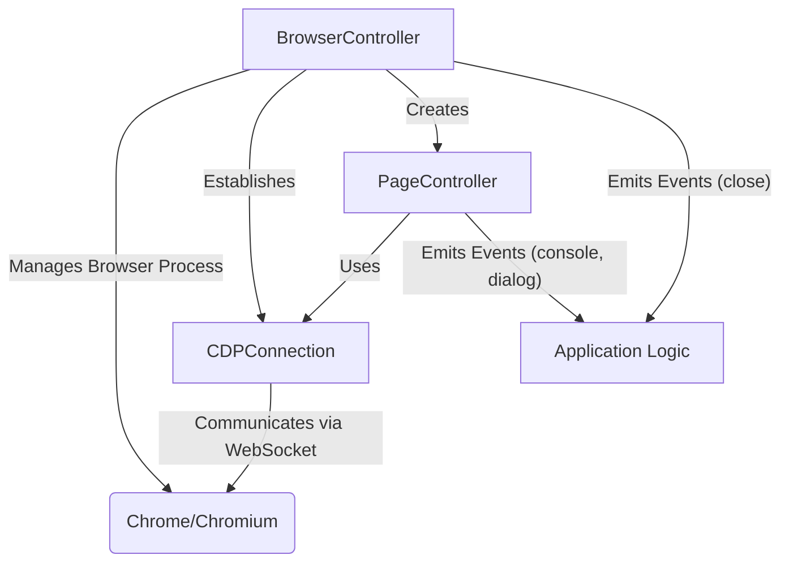
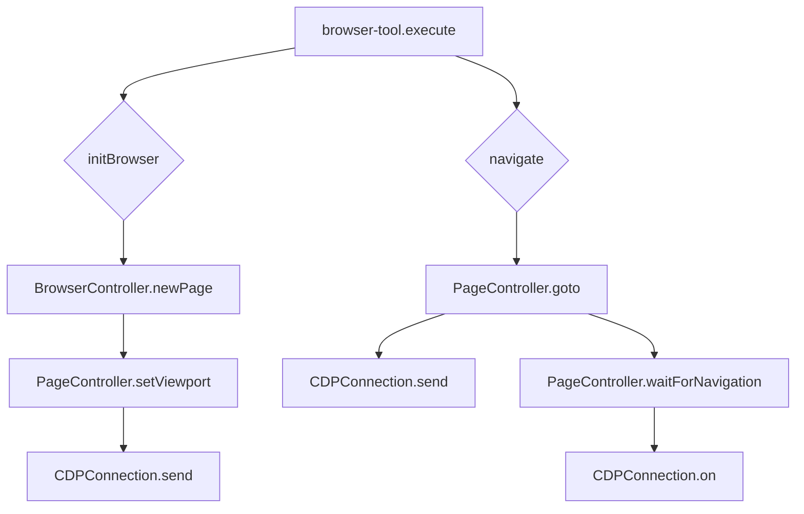

# src — browser

The `src/browser` module provides comprehensive browser automation capabilities, catering to two distinct use cases:

1.  **Full Browser Automation**: Leveraging the Chrome DevTools Protocol (CDP) for headless or headful control of a real Chrome/Chromium instance, offering a Puppeteer/Playwright-like API. This is handled by `controller.ts`.
2.  **Terminal-Embedded Browsing**: A lightweight, text-based browser experience designed for terminal environments, capable of fetching content, extracting information, and generating basic screenshots without a full browser process. This is handled by `embedded-browser.ts`.

This dual approach allows the system to choose the appropriate level of browser interaction based on the context and available resources.

---

## 1. CDP-based Browser Automation (`controller.ts`)

This part of the module provides robust control over a Chrome/Chromium browser instance using the Chrome DevTools Protocol (CDP). It abstracts the low-level WebSocket communication into higher-level, developer-friendly APIs for managing browser processes, pages, and interactions.

### Architecture Overview

The CDP-based browser automation is structured into three main components:

*   **`BrowserController`**: Manages the lifecycle of the browser process itself, including launching, connecting, and creating new pages.
*   **`CDPConnection`**: Handles the raw WebSocket communication with the browser's DevTools endpoint, sending commands and receiving events.
*   **`PageController`**: Represents a single browser tab or page, providing methods for navigation, interaction, and content extraction, all built on top of `CDPConnection`.

### Key Components

#### `CDPConnection`

The `CDPConnection` class is the foundational layer for interacting with the Chrome DevTools Protocol. It manages a WebSocket connection to the browser's DevTools endpoint, facilitating the sending of CDP commands and the reception of CDP events.

*   **`connect(wsUrl: string)`**: Establishes the WebSocket connection to the specified DevTools URL.
*   **`send(method: string, params: Record<string, unknown>)`**: Sends a CDP command to the browser. Each command is assigned a unique `messageId`, and the method returns a Promise that resolves with the command's result or rejects on error/timeout.
*   **`on(event: string, callback: (params: unknown) => void)`**: Registers a listener for a specific CDP event (e.g., `Page.loadEventFired`, `Console.messageAdded`).
*   **`off(event: string, callback: (params: unknown) => void)`**: Removes an event listener.
*   **`disconnect()`**: Closes the WebSocket connection.

**Internal Mechanism**:
The class maintains `pendingMessages` to track outstanding command requests and `eventListeners` to dispatch incoming events to registered callbacks.

#### `PageController`

The `PageController` class encapsulates the functionality related to a single browser tab or page. It provides a high-level, Puppeteer/Playwright-style API for common browser interactions. Each `PageController` instance is associated with a specific browser target (tab) and uses a `CDPConnection` to send commands and listen for events relevant to that page.

*   **Constructor**: Takes a `CDPConnection` instance and a `targetId` (obtained from `BrowserController`) to initialize. It immediately calls `setupEventListeners()` to configure event handling.
*   **`setupEventListeners()`**: Configures listeners for CDP events like `Console.messageAdded` and `Page.javascriptDialogOpening`, re-emitting them as `console` and `dialog` events respectively.
*   **`goto(url: string, options?: NavigationOptions)`**: Navigates the page to a given URL. It enables the `Page` domain, sends `Page.navigate`, and then calls `waitForNavigation` to await page load events.
*   **`waitForNavigation(options?: NavigationOptions)`**: Waits for a specified navigation event (`load` or `domcontentloaded`) or times out. It uses `cdp.on` and `cdp.off` to manage event listeners.
*   **`url()` / `title()` / `content()`**: Retrieves the current URL, page title, or full HTML content by executing JavaScript in the page context via `Runtime.evaluate`.
*   **`setContent(html: string)`**: Sets the page's HTML content using `Page.setDocumentContent`.
*   **`waitForSelector(selector: string, options?: SelectorOptions)`**: Polls the page by repeatedly evaluating JavaScript to check for the presence of an element matching the CSS selector.
*   **`click(selector: string, options?: ClickOptions)`**: Locates an element by selector, calculates its center, and dispatches `Input.dispatchMouseEvent` for `mousePressed` and `mouseReleased` events.
*   **`type(selector: string, text: string, options?: TypeOptions)`**: Clicks the target element and then dispatches individual `Input.dispatchKeyEvent` events for each character in the provided text.
*   **`evaluate<T>(fn: string | ((...args: unknown[]) => T), ...args: unknown[])`**: Executes arbitrary JavaScript code within the page context using `Runtime.evaluate`. It supports both string expressions and function serialization.
*   **`screenshot(options?: ScreenshotOptions)`**: Captures a screenshot of the page using `Page.captureScreenshot`.
*   **`pdf(options?: PDFOptions)`**: Generates a PDF of the page using `Page.printToPDF`.
*   **`setViewport(viewport: ViewportOptions)`**: Configures the page's viewport dimensions and device metrics using `Emulation.setDeviceMetricsOverride`.
*   **`cookies()` / `setCookie()` / `deleteCookie()`**: Manages browser cookies using `Network.getCookies`, `Network.setCookie`, and `Network.deleteCookies`.
*   **`metrics()`**: Retrieves performance metrics using `Performance.getMetrics`.
*   **`reload()` / `goBack()` / `goForward()`**: Navigates the browser history using `Page.reload`, `Page.goBack`, `Page.goForward`, followed by `waitForNavigation`.
*   **`close()`**: Closes the page/tab using `Target.closeTarget`.

#### `BrowserController`

The `BrowserController` class is responsible for launching and managing the Chrome/Chromium browser process itself. It acts as the entry point for creating and managing `PageController` instances.

*   **Constructor**: Initializes with `BrowserLaunchOptions`, merging with `DEFAULT_BROWSER_OPTIONS`.
*   **`launch()`**:
    *   Determines the browser executable path (`findChromePath`).
    *   Spawns a child process for Chrome/Chromium with appropriate arguments (e.g., `--remote-debugging-port`, `--headless`, `--user-data-dir`).
    *   Parses the WebSocket endpoint URL from the browser's stderr output using `getWSEndpoint`.
    *   Initializes a `CDPConnection` and connects to the browser.
*   **`findChromePath()`**: A simplified method to locate the Chrome executable on different OS platforms. In a production environment, this would involve more robust path checking.
*   **`getWSEndpoint()`**: Asynchronously reads the browser's stderr to find the WebSocket URL for the DevTools Protocol, handling timeouts and process exit events.
*   **`connect(wsEndpoint: string)`**: Allows connecting to an already running browser instance via its WebSocket endpoint.
*   **`newPage()`**: Creates a new browser tab/page. It sends `Target.createTarget` via `CDPConnection` to get a `targetId`, then instantiates and returns a new `PageController`. If `defaultViewport` is set in options, it applies it to the new page.
*   **`pages()`**: Returns an array of all currently managed `PageController` instances.
*   **`version()`**: Retrieves browser version information using `Browser.getVersion`.
*   **`wsEndpointUrl()`**: Returns the WebSocket endpoint URL of the connected browser.
*   **`close()`**: Gracefully shuts down the browser. It iterates through all active `PageController` instances and attempts to close them, then disconnects the `CDPConnection`, and finally kills the browser child process. It emits a `close` event.
*   **`isConnected()`**: Checks if a `CDPConnection` is active.

#### Singleton Access

The `controller.ts` module also provides singleton functions for easy access to a single browser instance:

*   **`getBrowser(options?: Partial<BrowserLaunchOptions>)`**: Returns a `BrowserController` instance. If one doesn't exist, it creates and launches a new one.
*   **`closeBrowser()`**: Closes the singleton `BrowserController` instance if it exists.

### Integration with the Codebase

The `BrowserController` and `PageController` are central to browser automation tasks:

*   **`src/tools/browser-tool.ts`**: This tool heavily relies on `BrowserController.newPage()` to create new tabs and `PageController` methods like `goto()`, `url()`, `title()`, `content()`, `click()`, `type()` for interactive browsing and data extraction.
*   **`src/browser-automation/browser-manager.ts`**: Uses `BrowserController` to manage browser instances and `PageController` for tab-specific operations.
*   **`src/desktop-automation/nutjs-provider.ts`**: Can use `PageController.setContent()` to manipulate browser content.
*   **`src/browser-automation/route-interceptor.ts`**: Intercepts network requests, potentially using `PageController.url()` to determine context.

**Execution Flow Example (`browser-tool` navigation):**

---

## 2. Terminal-Embedded Browser (`embedded-browser.ts`)

The `embedded-browser.ts` module offers a simpler, non-interactive browser experience primarily for rendering web content within a terminal. It does not launch a full browser process or use CDP. Instead, it relies on external command-line tools for fetching and rendering.

### Key Components

#### `EmbeddedBrowser`

The `EmbeddedBrowser` class provides basic web page navigation, content extraction, and screenshot capabilities suitable for a terminal environment.

*   **Constructor**: Initializes with `BrowserConfig` (e.g., `headless`, `viewport`, `renderMode`) and ensures the screenshot directory exists.
*   **`navigate(url: string)`**:
    *   Fetches the HTML content of the URL using the `fetchPage` method (which spawns `curl`).
    *   Converts the HTML to plain text using `htmlToText`.
    *   Extracts the page title using `extractTitle`.
    *   Optionally takes a screenshot using `takeScreenshot` (which spawns `wkhtmltoimage` or `cutycapt`).
    *   Emits `navigate:start`, `navigate:complete`, or `navigate:error` events.
*   **`fetchPage(url: string)`**: Spawns a `curl` process to fetch the raw HTML content of a URL. It includes user-agent and timeout options.
*   **`takeScreenshot(url?: string)`**: Attempts to take a screenshot of the given URL (or current URL) by spawning external tools: `wkhtmltoimage` first, then `cutycapt` as a fallback. It saves the screenshot to the configured `screenshotDir`.
*   **`htmlToText(html: string)`**: A utility method to strip HTML tags, decode entities, and clean up whitespace from an HTML string, producing plain text.
*   **`extractTitle(html: string)`**: Extracts the content of the `<title>` tag from an HTML string using a regular expression.
*   **`selectElements(selector: string)`**: A *simplified* DOM element selector. It parses basic CSS selectors (tag, class, id) and uses regular expressions to find matching elements within the stored `pageContent` HTML. It does *not* parse the full DOM tree or support complex selectors.
*   **`getTextContent()`**: Returns the plain text content of the current page.
*   **`getLinks()` / `getForms()`**: Extracts links (`<a>` tags) and forms (`<form>` tags with their inputs) from the current `pageContent` using regular expressions.
*   **`renderInTerminal()`**: Formats the current page's title, URL, and text content into a box-like structure suitable for display in a terminal, wrapping text to the terminal's width.
*   **`formatPageInfo(pageInfo: PageInfo)`**: Provides a structured string representation of `PageInfo` for display.
*   **`createSession()` / `closeSession(sessionId: string)`**: Manages simple browser sessions, primarily for tracking navigation history or state within the `EmbeddedBrowser`.
*   **`dispose()`**: Cleans up any child processes (though `curl`, `wkhtmltoimage`, `cutycapt` are short-lived) and clears sessions.

#### Singleton Access

*   **`getEmbeddedBrowser(config?: Partial<BrowserConfig>)`**: Returns a singleton `EmbeddedBrowser` instance, creating one if it doesn't exist.
*   **`resetEmbeddedBrowser()`**: Disposes of the current singleton instance and sets it to null.

### Integration with the Codebase

The `EmbeddedBrowser` is designed for scenarios where a full browser is overkill or unavailable, particularly for CLI tools or agents needing quick content summaries:

*   **`tests/embedded-browser.test.ts`**: Unit tests directly interact with `EmbeddedBrowser` methods like `navigate()`, `getTextContent()`, `selectElements()`, `getForms()`, `renderInTerminal()`, etc., to verify its functionality.
*   It could be used by other tools or agents that need to quickly fetch and parse web content for analysis or display in a text-based interface.

### Limitations

It's crucial to understand that `EmbeddedBrowser` is **not** a full browser. It:
*   Does not execute JavaScript.
*   Does not render CSS or images (except via external screenshot tools).
*   Has a very basic, regex-based DOM parsing capability, not a full DOM API.
*   Relies on external binaries (`curl`, `wkhtmltoimage`, `cutycapt`) which may not be universally available.

---

## 3. Types (`types.ts`)

The `types.ts` file defines all the TypeScript interfaces and default options used across the CDP-based browser automation components. This includes:

*   `BrowserLaunchOptions`, `ViewportOptions`, `NavigationOptions`, `ScreenshotOptions`, `PDFOptions`, `SelectorOptions`, `ClickOptions`, `TypeOptions` for configuring operations.
*   Data structures like `Cookie`, `PageMetrics`, `ConsoleMessage`, `NetworkRequest`, `NetworkResponse`.
*   Event interfaces for `BrowserEvents`.
*   `DEFAULT_BROWSER_OPTIONS` and `DEFAULT_NAVIGATION_OPTIONS` to provide sensible defaults.

This centralizes type definitions, ensuring consistency and strong typing throughout the module and for consumers of its APIs.