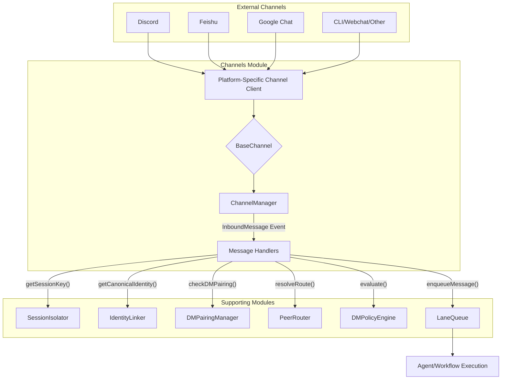

# src — channels

The `src/channels` module provides a robust, unified interface for integrating with various messaging platforms. Advanced enterprise architecture for multi-platform messaging support, it abstracts away the complexities of platform-specific APIs (Telegram, Discord, Slack, Feishu, Google Chat, etc.) into a consistent model for inbound and outbound messages.

This module is central to how the system interacts with external users and services, offering features like:
*   **Unified Message Model:** A common set of types for messages, users, and channels across all integrated platforms.
*   **Channel Abstraction:** A base class for implementing new channel integrations, handling connection, disconnection, and message sending.
*   **Channel Management:** A central manager to register, connect, and orchestrate multiple channels.
*   **Session Isolation:** Mechanisms to ensure conversations within a specific channel/user context are processed serially.
*   **Identity Resolution:** Linking user identities across different channels to a single canonical identity.
*   **DM Access Control:** A pairing system to gate direct messages from unknown users, preventing unauthorized access or resource consumption.
*   **Intelligent Policy Engine:** Rule-based evaluation for incoming messages, including sender reputation, rate limiting, and dynamic actions (allow, deny, challenge, forward).
*   **Peer Routing:** Directing messages to specific agents or handlers based on message context.
*   **Proactive Messaging:** A prioritized queue for sending outbound messages to users.

## Architecture Overview

The `channels` module is designed around a core abstraction (`BaseChannel`) and a central orchestrator (`ChannelManager`). It integrates with several specialized sub-modules to provide advanced features like session management, identity linking, and policy enforcement.

Here's a high-level view of how an inbound message flows through the system:



1.  **Inbound Message Reception:** A platform-specific channel client (e.g., `DiscordChannel`) receives a message from its respective platform.
2.  **Standardization:** The client converts the platform-specific message into a unified `InboundMessage` format.
3.  **BaseChannel Processing:** The `BaseChannel` handles common tasks like command parsing and basic access checks (`isUserAllowed`, `isChannelAllowed`).
4.  **ChannelManager Event:** The `BaseChannel` emits a `message` event, which is caught by the `ChannelManager`. The `ChannelManager` then re-emits this event and passes it to its registered `messageHandlers`.
5.  **Pre-processing & Policy:** Within the message handlers, the `InboundMessage` is enriched and evaluated:
    *   `getSessionKey()`: Determines a session key for concurrency control.
    *   `getCanonicalIdentity()`: Resolves the sender's cross-channel identity.
    *   `checkDMPairing()`: Verifies if the sender is approved for DM interaction.
    *   `resolveRoute()` / `getRouteAgentConfig()`: Determines which agent or handler should process the message.
    *   `DMPolicyEngine.evaluate()`: Applies rules for reputation, rate limiting, and actions.
6.  **Concurrency Control:** `enqueueMessage()` uses a `LaneQueue` to ensure messages from the same session key are processed serially, while different sessions can run in parallel.
7.  **Agent/Workflow Execution:** The message is then passed to the appropriate agent or workflow for processing.

## Core Components

### 1. Unified Messaging Model (`src/channels/core.ts`)

The `core.ts` file defines the fundamental data structures for multi-channel communication. These types ensure consistency across all channel implementations.

*   **`ChannelType`**: A union type listing all supported platforms (e.g., `'telegram'`, `'discord'`, `'slack'`).
*   **`ChannelUser`**: Represents a sender with `id`, `username`, `displayName`, `avatarUrl`, `isBot`, `isAdmin`, and `raw` platform-specific data.
*   **`ChannelInfo`**: Describes a chat or channel with `id`, `type`, `name`, `isDM`, `isGroup`, and `raw` data.
*   **`InboundMessage`**: The standardized format for messages received from any channel. It includes `id`, `channel`, `sender`, `content`, `contentType`, `attachments`, `replyTo`, `timestamp`, `isCommand`, `commandName`, `commandArgs`, `threadId`, `sessionKey`, and `raw` data.
*   **`OutboundMessage`**: The standardized format for messages to be sent to any channel. It includes `channelId`, `content`, `contentType`, `attachments`, `replyTo`, `threadId`, `parseMode`, `disablePreview`, `silent`, `buttons`, and `channelData` for platform-specific passthrough.
*   **`MessageAttachment`**: Describes files, images, audio, etc., attached to a message.
*   **`MessageButton`**: Defines interactive buttons for outbound messages.
*   **`DeliveryResult`**: The outcome of sending an `OutboundMessage`.
*   **`ChannelConfig`**: Base configuration for any channel.
*   **`ChannelStatus`**: Current connection and authentication status of a channel.
*   **`ChannelEvents`**: Defines events emitted by `BaseChannel` instances.

### 2. Channel Abstraction (`BaseChannel`)

The `abstract class BaseChannel extends EventEmitter` provides a common interface and basic functionality for all channel implementations.

*   **`constructor(type: ChannelType, config: ChannelConfig)`**: Initializes the channel with its type and configuration.
*   **`abstract connect(): Promise<void>`**: Establishes a connection to the messaging platform.
*   **`abstract disconnect(): Promise<void>`**: Terminates the connection.
*   **`abstract send(message: OutboundMessage): Promise<DeliveryResult>`**: Sends a message using the platform's API.
*   **`getStatus(): ChannelStatus`**: Returns the current status of the channel.
*   **`isUserAllowed(userId: string): boolean`**: Checks if a user is in the `allowedUsers` list from the channel's configuration.
*   **`isChannelAllowed(channelId: string): boolean`**: Checks if a channel is in the `allowedChannels` list.
*   **`protected parseCommand(message: InboundMessage): InboundMessage`**: A utility to detect and parse slash commands (e.g., `/command arg1 arg2`).
*   **`protected formatMessage(content: string, parseMode?: 'markdown' | 'html' | 'plain'): string`**: Basic message formatting utility.

### 3. Channel Management (`ChannelManager`)

The `ChannelManager` class is responsible for orchestrating multiple `BaseChannel` instances. It acts as a central hub for managing the lifecycle of all integrated channels and routing messages.

*   **`registerChannel(channel: BaseChannel): void`**: Adds a channel instance to the manager and sets up event forwarding (e.g., `message`, `command`, `connected`, `disconnected`, `error`).
*   **`unregisterChannel(type: ChannelType): void`**: Removes a channel and its listeners.
*   **`getChannel(type: ChannelType): BaseChannel | undefined`**: Retrieves a registered channel.
*   **`getAllChannels(): BaseChannel[]`**: Returns all registered channels.
*   **`connectAll(): Promise<void>`**: Connects all registered channels concurrently.
*   **`disconnectAll(): Promise<void>`**: Disconnects all registered channels concurrently.
*   **`getStatus(): Record<ChannelType, ChannelStatus>`**: Returns the status of all channels.
*   **`send(type: ChannelType, message: OutboundMessage): Promise<DeliveryResult>`**: Sends a message to a specific channel.
*   **`broadcast(message: Omit<OutboundMessage, 'channelId'>): Promise<Map<ChannelType, DeliveryResult>>`**: Sends a message to all *connected* channels.
*   **`onMessage(handler: (message: InboundMessage, channel: BaseChannel) => Promise<void>): void`**: Registers a global handler for all incoming messages. This is where the core logic for processing messages (e.g., policy evaluation, agent routing) typically resides.
*   **`sendToUser(channelType: ChannelType, channelId: string, content: string, priority: 'low' | 'normal' | 'high' | 'urgent'): Promise<DeliveryResult>`**: A proactive messaging method that enqueues messages with priority for sending.
*   **`private processQueue(): Promise<DeliveryResult>`**: Internal method to process the `outgoingQueue` based on priority.
*   **`shutdown(): Promise<void>`**: Disconnects all channels and clears resources.

The `ChannelManager` is exposed as a singleton via `getChannelManager()` and `resetChannelManager()`.

### 4. Concurrency & Session Isolation (`LaneQueue` & `SessionIsolator`)

*   **`LaneQueue` (from `../concurrency/lane-queue.js`)**: The `channels` module utilizes a dedicated `LaneQueue` instance (`getChannelLaneQueue()`) for processing incoming messages. This queue allows for concurrent processing of tasks (messages) across different "lanes" (sessions) while ensuring that tasks within the *same* lane are processed serially.
*   **`enqueueMessage(sessionKey: string, handler: () => Promise<T>, options?: TaskOptions): Promise<T>`**: This helper function wraps the `LaneQueue.enqueue` method, using the `sessionKey` (derived from `SessionIsolator`) as the lane ID. This guarantees that messages from the same user/conversation are handled in order, preventing race conditions or out-of-order responses.
*   **`SessionIsolator` (from `session-isolation.ts`)**: Provides the `getSessionKey(message: InboundMessage, accountId?: string)` function, which generates a unique key for a given message's channel and sender. This key is crucial for `LaneQueue` to correctly isolate and serialize message processing per session.

### 5. Identity Resolution (`IdentityLinker`)

*   **`IdentityLinker` (from `identity-links.ts`)**: Manages the linking of user identities across different channels to a single `CanonicalIdentity`.
*   **`getCanonicalIdentity(message: InboundMessage): CanonicalIdentity | null`**: A convenience function that uses the singleton `IdentityLinker` to resolve the canonical identity for an inbound message's sender. This is vital for maintaining a consistent user profile regardless of the channel they use.

### 6. DM Access Control (`DMPairingManager`)

*   **`DMPairingManager` (from `dm-pairing.ts`)**: Implements an access control system for direct messages. When enabled, unknown senders are required to "pair" with the bot using a code, which the bot owner must approve.
*   **`checkDMPairing(message: InboundMessage): Promise<PairingStatus>`**: This function is called for inbound messages to determine if the sender is approved. If not, it generates a pairing code and provides a message to be sent back to the user.
*   **`approve(channelType: ChannelType, code: string, approvedBy?: string): ApprovedSender | null`**: Allows the bot owner to approve a pending pairing request using the provided code.
*   **`persistAllowlist()` / `loadAllowlist()`**: The manager persists approved senders to disk, ensuring approvals are maintained across restarts.

### 7. Intelligent Routing & Policy (`DMPolicyEngine` & `PeerRouter`)

*   **`DMPolicyEngine` (from `dm-policy/engine.ts`)**: Provides a rule-based system for evaluating incoming messages. It includes:
    *   **Rules (`DMPolicyRule`)**: Define conditions and actions.
    *   **Conditions (`DMCondition`)**: Match against sender, channel, content, reputation, time, rate, etc.
    *   **Actions (`DMPolicyAction`)**: `allow`, `deny`, `queue`, `forward`, `challenge`, `rate_limit`.
    *   **Sender Reputation (`SenderReputation`)**: Tracks a sender's score, interactions, and flags (e.g., `trusted`, `suspicious`, `blocked`).
    *   **Rate Limiting**: Configurable limits on message frequency.
    *   **`evaluate(context: MessageContext): PolicyDecision`**: The core method that processes a message context against all enabled rules and returns a decision.
    *   **`updateReputation(result: InteractionResult): void`**: Adjusts a sender's reputation based on interaction outcomes.
*   **`PeerRouter` (from `peer-routing.ts`)**: Determines the appropriate agent or handler for an incoming message based on configured routing rules.
    *   **`resolveRoute(message: InboundMessage, accountId?: string): ResolvedRoute | null`**: Resolves the best route for a message.
    *   **`getRouteAgentConfig(message: InboundMessage, accountId?: string): RouteAgentConfig`**: Retrieves the effective agent configuration for a message.

## Channel Implementations (Examples)

### `DiscordChannel` (`src/channels/discord/client.ts`)

This class extends `BaseChannel` to integrate with Discord.

*   **Connection:** Uses a WebSocket connection to the Discord Gateway for real-time events and REST API for other operations.
*   **Authentication:** Requires a bot token for `IDENTIFY` payload.
*   **Intents:** Configurable Discord Gateway Intents (`DiscordConfig.intents`) to subscribe to specific events (e.g., `GuildMessages`, `DirectMessages`, `MessageContent`).
*   **Event Handling:** Processes `MESSAGE_CREATE`, `INTERACTION_CREATE` (slash commands, buttons), `READY`, `RESUMED` events.
*   **Slash Commands:** Supports registration of slash commands (`DiscordConfig.commands`) via the Discord API.
*   **Message Conversion:** Converts `DiscordMessage` to `InboundMessage` and `OutboundMessage` to Discord's message format, including attachments and interactive buttons.
*   **Reconnection:** Uses `ReconnectionManager` for robust handling of WebSocket disconnections and reconnections with exponential backoff.
*   **DM Pairing Integration:** Calls `checkDMPairing()` for incoming messages and responds with pairing instructions if needed.

### `FeishuChannel` (`src/channels/feishu/index.ts`)

This class extends `BaseChannel` to integrate with Feishu (Lark). It uses an internal `FeishuAdapter` to manage API interactions.

*   **Adapter Pattern:** Encapsulates Feishu API logic within `FeishuAdapter`, allowing `FeishuChannel` to focus on `BaseChannel` contract.
*   **Interactive Cards:** Provides methods like `buildApprovalCard` and `buildActionLauncherCard` for creating rich, interactive messages.
*   **Reasoning Streams:** Supports `onReasoningStream` and `onReasoningEnd` handlers, aligning with Native Engine's concept of streaming LLM reasoning output directly to the channel.
*   **Thread Context:** Includes `getThreadMessages` for fetching full conversation history within a thread.
*   **Authentication:** Uses `appId` and `appSecret` for token management (simulated `tenant_access_token`).

### `GoogleChatChannel` (`src/channels/google-chat/index.ts`)

This class extends `BaseChannel` for Google Chat integration.

*   **Authentication:** Uses Google Service Account JSON key (`GoogleChatConfig.serviceAccountPath`) to generate and refresh OAuth2 access tokens via JWT assertion.
*   **API Requests:** `apiRequest` handles authenticated calls to the Google Chat API.
*   **Event Handling:** Designed to process incoming events from Google Chat (typically via webhooks, though the webhook server implementation is external to this snippet). It converts `GoogleChatEvent` and `GoogleChatMessage` into `InboundMessage`.
*   **DM Pairing Integration:** Similar to Discord, it integrates `checkDMPairing()` for DM access control.

## Integration Points & Developer Guide

### Adding a New Channel

1.  **Create a new file:** `src/channels/<your-channel>/index.ts` (and `client.ts`, `types.ts` if complex).
2.  **Define `ChannelConfig`:** Create an interface extending `ChannelConfig` (e.g., `MyChannelConfig`) for platform-specific settings.
3.  **Implement `BaseChannel`:** Create `class MyChannel extends BaseChannel`.
    *   In the constructor, call `super('<your-channel-type>', config)`.
    *   Implement `connect()`, `disconnect()`, and `send(message: OutboundMessage)`.
    *   Inside `connect()`, establish connection to the platform's API/SDK.
    *   Inside `send()`, translate `OutboundMessage` to the platform's format and send it.
    *   Set `this.status.connected = true` and `this.status.authenticated = true` upon successful connection/auth.
    *   Emit `connected` and `disconnected` events.
4.  **Handle Inbound Messages:**
    *   When your channel receives a message from the platform, convert it to an `InboundMessage`.
    *   Call `const parsed = this.parseCommand(message);` to handle commands.
    *   **Crucially**, call `parsed.sessionKey = getSessionKey(parsed);` to attach a session key.
    *   **For DMs**, call `const pairingStatus = await checkDMPairing(parsed);` and handle unapproved senders.
    *   Emit `this.emit('message', parsed);` (and `this.emit('command', parsed);` if applicable).
5.  **Register with `ChannelManager`:** In your application's bootstrap, get the singleton `ChannelManager` and call `manager.registerChannel(new MyChannel(myConfig))`.

### Handling Incoming Messages

Global message processing happens via `ChannelManager.onMessage()`.

```typescript
import { getChannelManager, InboundMessage, BaseChannel, enqueueMessage, getCanonicalIdentity, resolveRoute, getRouteAgentConfig } from './channels/core.js';
import { getDMPolicyEngine } from './channels/dm-policy/engine.js';
import { logger } from './utils/logger.js';

const manager = getChannelManager();
const policyEngine = getDMPolicyEngine();

manager.onMessage(async (message: InboundMessage, channel: BaseChannel) => {
  // Ensure session isolation for this message's processing
  if (!message.sessionKey) {
    logger.warn('Message received without sessionKey, skipping enqueue.', { messageId: message.id });
    return;
  }

  await enqueueMessage(message.sessionKey, async () => {
    logger.info(`Processing message from ${message.sender.displayName} on ${message.channel.type}: ${message.content}`);

    // Resolve canonical identity
    const canonicalIdentity = getCanonicalIdentity(message);
    if (canonicalIdentity) {
      logger.debug(`Resolved canonical identity for sender: ${canonicalIdentity.id}`);
    }

    // Evaluate DM policy
    const policyDecision = policyEngine.evaluate({
      messageId: message.id,
      senderId: message.sender.id,
      channelType: message.channel.type,
      content: message.content,
      hasAttachments: !!message.attachments?.length,
      isFirstContact: !policyEngine.getReputation(message.sender.id).firstSeen, // Simplified
      timestamp: message.timestamp,
    });

    if (policyDecision.action === 'deny') {
      logger.warn(`Message denied by policy: ${policyDecision.reason}`);
      await channel.send({ channelId: message.channel.id, content: `Sorry, your message was denied: ${policyDecision.reason}` });
      return;
    }
    // Handle other policy actions (challenge, queue, forward, rate_limit)

    // Resolve routing to an agent
    const route = resolveRoute(message);
    if (route) {
      logger.debug(`Message routed to agent: ${route.agentId}`);
      // TODO: Pass message to the resolved agent for processing
      await channel.send({ channelId: message.channel.id, content: `Message received and routed to agent ${route.agentId}.` });
    } else {
      logger.warn('No route found for message.');
      await channel.send({ channelId: message.channel.id, content: 'Sorry, I could not find a handler for your message.' });
    }

    // Update sender reputation based on interaction outcome
    policyEngine.updateReputation({
      senderId: message.sender.id,
      type: 'positive', // Or 'negative'/'neutral' based on agent's response
      scoreAdjustment: 1,
      reason: 'Message processed successfully',
    });

  }).catch(error => {
    logger.error(`Error processing message in lane ${message.sessionKey}:`, error);
    channel.send({ channelId: message.channel.id, content: 'An internal error occurred while processing your message.' }).catch(sendErr => logger.error('Failed to send error message:', sendErr));
  });
});
```

### Sending Outgoing Messages

You can send messages directly to a specific channel or broadcast them:

```typescript
import { getChannelManager } from './channels/core.js';

const manager = getChannelManager();

// Send to a specific channel
await manager.send('discord', {
  channelId: '1234567890',
  content: 'Hello from the system!',
  contentType: 'text',
  buttons: [{ text: 'Click Me', type: 'callback', data: 'clicked' }],
});

// Broadcast to all connected channels
await manager.broadcast({
  content: 'This is a broadcast message to all connected channels.',
  contentType: 'text',
});

// Send a proactive message with priority
await manager.sendToUser('telegram', 'user_id_123', 'Your task is complete!', 'high');
```

### Configuring DM Pairing and Policy

DM Pairing and Policy Engine are configured via their respective singleton instances:

```typescript
import { getDMPairing } from './channels/dm-pairing.js';
import { getDMPolicyEngine } from './channels/dm-policy/engine.js';

// Configure DM Pairing
const dmPairing = getDMPairing({
  enabled: true,
  pairingChannels: ['telegram', 'discord'], // Only these channels require pairing
  codeLength: 8,
  codeExpiryMs: 30 * 60 * 1000, // 30 minutes
  pairingMessage: 'Please pair with me! Your code is: {code}. Owner, approve with: /pairing approve {channel} {code}',
});
await dmPairing.loadAllowlist(); // Load previously approved senders

// Configure DM Policy Engine
const policyEngine = getDMPolicyEngine({
  defaultAction: 'challenge', // Default to challenge if no rule matches
  initialReputationScore: 60,
});

// Add a custom rule (example)
policyEngine.addRule({
  id: 'block-bad-words',
  name: 'Block Bad Words',
  description: 'Blocks messages containing specific offensive terms.',
  priority: 150,
  enabled: true,
  conditions: [
    { type: 'keyword', operator: 'eq', value: ['badword1', 'badword2'] },
  ],
  action: 'deny',
});
```

### Testing with `MockChannel`

The `MockChannel` class is invaluable for testing channel-agnostic logic without needing actual platform connections.

```typescript
import { MockChannel, ChannelManager, InboundMessage } from './channels/core.js';
import { expect } from 'chai';

describe('ChannelManager with MockChannel', () => {
  let manager: ChannelManager;
  let mockChannel: MockChannel;

  beforeEach(() => {
    manager = new ChannelManager();
    mockChannel = new MockChannel({ type: 'cli' }); // Or any type
    manager.registerChannel(mockChannel);
  });

  afterEach(async () => {
    await manager.shutdown();
  });

  it('should receive and process a simulated message', async () => {
    let receivedMessage: InboundMessage | null = null;
    manager.onMessage(async (msg) => {
      receivedMessage = msg;
    });

    const simulated = mockChannel.simulateMessage('Hello, world!');

    expect(receivedMessage).to.not.be.null;
    expect(receivedMessage?.content).to.equal('Hello, world!');
    expect(mockChannel.getMessages()).to.include(simulated);
  });

  it('should send messages via the manager', async () => {
    await manager.send('cli', { channelId: 'mock-channel', content: 'Test outbound' });

    const sentMessages = mockChannel.getSentMessages();
    expect(sentMessages).to.have.lengthOf(1);
    expect(sentMessages[0].content).to.equal('Test outbound');
  });
});
```