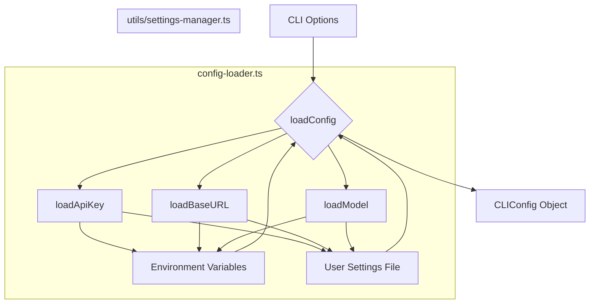

# src — cli

The `src/cli` module serves as the core command-line interface (CLI) component for Code Buddy. It encapsulates all the logic required to parse command-line arguments, load configurations, execute non-interactive commands, list available resources, and manage chat sessions. This module acts as the bridge between user input on the terminal and the underlying Code Buddy agent and utility services.

## Module Structure

The `src/cli` module is organized into several files, each responsible for a distinct set of CLI functionalities:

*   **`config-loader.ts`**: Handles loading, saving, and validating application configuration from various sources.
*   **`headless.ts`**: Implements non-interactive command processing, such as single-prompt execution and automated Git operations.
*   **`list-commands.ts`**: Provides functions for listing available models, system prompts, and custom agents.
*   **`session-commands.ts`**: Manages chat session persistence, including resuming and listing sessions.
*   **`index.ts`**: Re-exports all public functions and interfaces from the other files, providing a unified entry point for the main CLI application.

## Key Components and Functionality

### 1. Configuration Management (`config-loader.ts`)

This component is responsible for establishing the operational parameters for Code Buddy. It aggregates configuration from a hierarchical set of sources, ensuring flexibility and ease of use.

**Configuration Sources (in order of precedence):**

1.  **Command-line options**: Values passed directly via CLI flags (e.g., `--api-key`).
2.  **Environment variables**: System-wide variables (e.g., `GROK_API_KEY`, `GROK_MODEL`).
3.  **User settings file**: A persistent JSON file located at `~/.codebuddy/user-settings.json`.

**Key Functions:**

*   `ensureUserSettingsDirectory()`: Ensures the `~/.codebuddy` directory and default settings file exist, creating them if necessary. It uses `getSettingsManager().loadUserSettings()` for this.
*   `loadApiKey()`, `loadBaseURL()`, `loadModel()`: These functions retrieve individual configuration values, prioritizing environment variables over user settings. They delegate to `getSettingsManager()` for unified loading logic.
*   `loadConfig(options: CLIConfig)`: The primary function for loading the complete CLI configuration. It merges values from command-line options with those loaded from environment variables and user settings.
*   `saveCommandLineSettings(apiKey?: string, baseURL?: string)`: Persists specific command-line provided settings (like `apiKey` or `baseURL`) to the user settings file for future use.
*   `validateConfig(config: CLIConfig)`: Checks if essential configuration, such as the API key, is present. If not, it returns a list of errors.

**Dependencies:**
This module heavily relies on `../utils/settings-manager.js` for abstracting the details of reading and writing user settings and environment variables.

**Configuration Loading Flow:**

### 2. Headless Operations (`headless.ts`)

This component provides functionality for non-interactive execution of Code Buddy, suitable for scripting or automated workflows. It bypasses the interactive chat loop and confirmation prompts.

**Key Functions:**

*   `processPromptHeadless(prompt: string, options: HeadlessOptions)`:
    *   Takes a single prompt and processes it using the `CodeBuddyAgent`.
    *   Configures the `ConfirmationService` to auto-approve all operations (`setSessionFlag('allOperations', true)`), making it truly headless.
    *   Outputs the agent's response as a series of JSON objects, compatible with OpenAI's `ChatCompletionMessageParam` structure, to `stdout`.
    *   Disables self-healing by default unless explicitly enabled via `selfHealEnabled`.
    *   Exits with status `1` on error, outputting an error message in JSON format.
*   `handleCommitAndPushHeadless(options: HeadlessOptions)`:
    *   Automates the Git commit and push workflow.
    *   Performs `git status`, `git add .`, generates a commit message using the `CodeBuddyAgent` based on staged changes, executes `git commit`, and finally `git push`.
    *   Also configures `ConfirmationService` for auto-approval.
    *   Handles cases where no changes are present or push requires upstream setup.
    *   Exits with status `1` on any failure during the Git operations.
*   `readPipedInput()`: A utility function to asynchronously read all data from `stdin` when input is piped to the CLI.

**Dependencies:**
This module lazy-loads `../agent/codebuddy-agent.js` and `../utils/confirmation-service.js` to minimize initial startup overhead. It also uses `../utils/logger.js` for error reporting.

### 3. Listing Commands (`list-commands.ts`)

This component provides utilities for users to discover available resources within their Code Buddy environment.

**Key Functions:**

*   `listModels(baseURL?: string)`:
    *   Fetches and displays a list of available models from the configured API endpoint (e.g., LM Studio, Ollama).
    *   Uses `loadBaseURL()` from `config-loader.ts` if no `baseURL` is provided.
    *   Exits with status `0` on success, `1` on error (e.g., API server unreachable).
*   `listPrompts()`:
    *   Lists all available system prompts, categorizing them into built-in and user-defined prompts.
    *   Lazy-loads `../prompts/prompt-manager.js` to retrieve prompt information.
    *   Provides instructions on how to use and create custom prompts.
*   `listAgents()`:
    *   Lists all available custom agents, including their descriptions and tags.
    *   Lazy-loads `../agent/custom/custom-agent-loader.js` to discover agents.
    *   Provides instructions on how to use and create custom agents.

**Dependencies:**
Relies on `../utils/logger.js` for error logging and `config-loader.ts` for base URL resolution. It also lazy-loads `../prompts/prompt-manager.js` and `../agent/custom/custom-agent-loader.js`.

### 4. Session Management (`session-commands.ts`)

This component handles the persistence and resumption of chat sessions, allowing users to continue conversations across different CLI invocations.

**Key Functions:**

*   `resumeLastSession()`:
    *   Retrieves the most recently accessed session from the `SessionStore`.
    *   If a session is found, it sets it as the active session and prints its details.
    *   Exits with status `1` if no sessions are found.
*   `resumeSessionById(sessionId: string)`:
    *   Attempts to find and resume a session based on a partial or full session ID.
    *   If the session is not found, it lists recent sessions to help the user.
    *   Exits with status `1` if the specified session is not found.
*   `listSessions(count: number = 10)`:
    *   Retrieves and displays a list of the most recent chat sessions.
    *   Shows session ID (truncated), name, message count, and last access time.

**Dependencies:**
Uses `../utils/logger.js` for error reporting and lazy-loads `../persistence/session-store.js` to interact with the session persistence layer.

## Integration and Entry Point (`index.ts`)

The `src/cli/index.ts` file simply re-exports all public functions and interfaces from the other files within the `src/cli` directory. This allows the main Code Buddy CLI application (typically `src/main.ts` or `src/index.ts` at the project root) to import all CLI-related functionalities from a single, convenient module.

## Developer Notes

*   **Error Handling**: Most CLI functions that encounter critical errors (e.g., network issues, missing configuration) will log an error message to `stderr` and then call `process.exit(1)` to indicate a failure to the operating system.
*   **Lazy Loading**: Modules like `CodeBuddyAgent`, `ConfirmationService`, `PromptManager`, `CustomAgentLoader`, and `SessionStore` are often lazy-loaded using dynamic `import()` calls. This strategy improves the CLI's startup performance by only loading heavy dependencies when they are actually needed for a specific command.
*   **Headless Confirmation**: In headless mode, the `ConfirmationService` is explicitly configured to auto-approve all operations. This is crucial for automation but means that any potentially destructive actions (like Git pushes) will proceed without user intervention. Developers extending headless functionality must be aware of this behavior.
*   **Configuration Priority**: The configuration loading mechanism ensures that command-line arguments always override environment variables, which in turn override user settings. This provides a predictable and flexible way to manage Code Buddy's behavior.