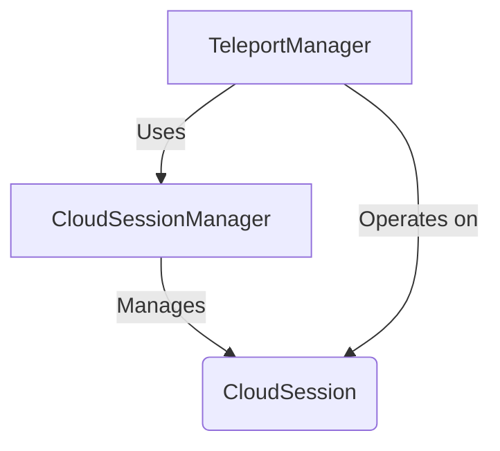

# src — cloud

This document provides a developer-focused overview of the `src/cloud/cloud-sessions.ts` module, which is responsible for managing cloud-based coding sessions and their synchronization with local environments.

## Cloud Sessions and Teleport Module

The `src/cloud/cloud-sessions.ts` module is the core component for interacting with remote, cloud-hosted coding environments. It provides functionality for creating, managing the lifecycle of, sharing, and synchronizing these sessions. This module abstracts away the underlying cloud infrastructure, presenting a consistent API for session management and state transfer.

### 1. Overview

This module defines two primary classes: `CloudSessionManager` and `TeleportManager`.
- The **`CloudSessionManager`** handles the fundamental operations related to cloud coding sessions, such as creation, status changes (pause, resume, terminate), listing, and sharing.
- The **`TeleportManager`** focuses on the synchronization aspects, enabling the transfer of state between local development environments and remote cloud sessions.

Together, these components facilitate a seamless experience for developers working across local and cloud environments.

### 2. Key Concepts

#### `CloudSession` Interface

The `CloudSession` interface defines the structure of a remote coding session. It's the central data model managed by this module.

```typescript
export interface CloudSession {
  id: string;
  status: 'starting' | 'running' | 'paused' | 'completed' | 'failed';
  createdAt: number;
  lastActivity: number;
  task?: string; // Description of the session's purpose
  visibility: 'private' | 'team' | 'public';
  repoAccess?: boolean; // Whether the session has access to a code repository
  networkAccess: 'none' | 'limited' | 'full'; // Network permissions
  vmImage?: string; // The VM image used for the session
}
```

Key properties:
- `id`: A unique identifier for the session.
- `status`: The current state of the session, dictating what operations are possible.
- `task`: A human-readable description of the session's purpose.
- `visibility`: Controls who can access or discover the session.
- `networkAccess`: Defines the session's internet access level.

#### `CloudConfig` Interface

The `CloudConfig` interface specifies configuration options for the cloud integration, including API endpoints and default settings for new sessions.

```typescript
export interface CloudConfig {
  apiEndpoint: string;
  authToken?: string;
  defaultVisibility: 'private' | 'team' | 'public';
  defaultNetworkAccess: 'none' | 'limited' | 'full';
  allowedDomains: string[];
}
```

A `DEFAULT_CONFIG` object is provided, using `URL_CONFIG.CLOUD_API_ENDPOINT` for the default API endpoint.

### 3. Core Components

#### 3.1. `CloudSessionManager`

The `CloudSessionManager` class is responsible for the lifecycle management of cloud coding sessions. It maintains an in-memory collection of `CloudSession` objects.

**Initialization:**
- `constructor(config?: Partial<CloudConfig>)`: Initializes the manager. It merges provided configuration with `DEFAULT_CONFIG`.

**Key Methods:**

-   **`createSession(task: string, options?: Partial<CloudSession>): Promise<CloudSession>`**
    -   Initiates a new cloud coding session.
    -   Requires a `task` description.
    -   Generates a unique `id` and sets `status` to `'starting'` (then immediately to `'running'` in the current simulation).
    -   Applies default `visibility` and `networkAccess` from `CloudConfig` if not overridden by `options`.

-   **`listSessions(): CloudSession[]`**
    -   Returns an array of all currently managed `CloudSession` objects.

-   **`getSession(id: string): CloudSession | null`**
    -   Retrieves a specific `CloudSession` by its ID, or `null` if not found.

-   **`pauseSession(id: string): Promise<boolean>`**
    -   Attempts to change the status of a `running` session to `paused`.
    -   Returns `true` on success, `false` if the session is not found or not in a `running` state.

-   **`resumeSession(id: string): Promise<boolean>`**
    -   Attempts to change the status of a `paused` session to `running`.
    -   Returns `true` on success, `false` if the session is not found or not in a `paused` state.

-   **`terminateSession(id: string): Promise<boolean>`**
    -   Marks a session as `completed`.
    -   Returns `true` on success, `false` if the session is not found or already completed/failed.

-   **`shareSession(id: string, visibility: CloudSession['visibility']): Promise<string>`**
    -   Updates the `visibility` of an existing session.
    -   Returns a simulated share URL for the session.
    -   Throws an error if the session is not found.

-   **`sendToCloud(task: string): Promise<CloudSession>`**
    -   A convenience method that creates a new session with `networkAccess` set to `'full'`. This is used when a task needs to be "sent to the cloud" for execution with full internet capabilities.

-   **`getActiveCount(): number`**
    -   Returns the number of sessions currently in `running` or `starting` status.

-   **`getTotalCount(): number`**
    -   Returns the total number of sessions managed by the instance.

#### 3.2. `TeleportManager`

The `TeleportManager` class is responsible for orchestrating the synchronization and transfer of state between local and cloud environments. It depends on an instance of `CloudSessionManager` to perform its operations.

**Initialization:**
-   `constructor(cloudManager: CloudSessionManager)`: Initializes the manager with a reference to the `CloudSessionManager`.

**Key Methods:**

-   **`teleport(sessionId: string): Promise<{ success: boolean; localSessionId?: string; filesTransferred?: number; diffSummary?: string; }>`**
    -   Simulates pulling the state of a cloud session to a local environment.
    -   Requires the cloud `sessionId`.
    -   Returns a success status and a simulated `localSessionId` along with a summary.
    -   Fails if the cloud session is not found or not in a `running` or `paused` state.

-   **`pushToCloud(localSessionId: string): Promise<CloudSession>`**
    -   Creates a new cloud session, simulating the "pushing" of a local session's state to the cloud.
    -   Internally calls `cloudManager.createSession` with a task derived from the `localSessionId` and `repoAccess: true`.
    -   Throws an error if `localSessionId` is invalid.

-   **`syncState(sessionId: string): Promise<{ conflicts: string[]; merged: number; }>`**
    -   Simulates synchronizing the state of an existing cloud session with a local environment.
    -   Returns a summary of conflicts and merged items (currently empty/zero in the simulation).
    -   Throws an error if the session is not found.

-   **`getDiff(sessionId: string): Promise<string>`**
    -   Simulates retrieving a diff summary between the local and cloud state for a given session.
    -   Returns a descriptive string (currently a placeholder).
    -   Throws an error if the session is not found.

### 4. Module Architecture and Interactions

The `cloud-sessions.ts` module is designed with a clear separation of concerns: `CloudSessionManager` handles the core session lifecycle, while `TeleportManager` focuses on state synchronization, leveraging the `CloudSessionManager` for session access and creation.



-   `CloudSessionManager` maintains its internal state using a `Map<string, CloudSession>`.
-   `TeleportManager` interacts with `CloudSessionManager` via its public methods like `getSession` and `createSession`.
-   The module utilizes `randomUUID` for generating unique identifiers and `logger` for internal debugging and informational messages.
-   Configuration is flexible, allowing partial overrides of `DEFAULT_CONFIG` during `CloudSessionManager` instantiation.

### 5. Integration Points

This module serves as a foundational layer for any features requiring remote coding environments or state synchronization.

-   **Internal Dependencies**:
    -   `src/utils/logger.js`: Used for logging operational events and debugging information.
    -   `src/config/constants.js`: Provides the default cloud API endpoint.
    -   `crypto`: Used for generating UUIDs for session IDs.

-   **External Consumers**:
    -   `tests/features/cloud-lsp-ide.test.ts`: This module is heavily tested by the `cloud-lsp-ide.test.ts` suite. This indicates its central role in the cloud-based IDE functionality, where session lifecycle, sharing, and teleport operations are critical features. Tests directly instantiate `CloudSessionManager` and `TeleportManager` and invoke their various methods to ensure correct behavior.

### 6. Contributing to this Module

When extending or modifying this module:

-   **Session State Transitions**: Ensure that any changes to a `CloudSession`'s `status` are handled correctly, and the `lastActivity` timestamp is updated.
-   **Error Handling**: Maintain consistent error handling. For non-critical failures (e.g., pausing a non-running session), methods typically return `false`. For critical failures (e.g., sharing a non-existent session), errors are thrown.
-   **Separation of Concerns**: Consider whether new functionality belongs in `CloudSessionManager` (core session lifecycle) or `TeleportManager` (state transfer/sync).
-   **Simulation vs. Real Implementation**: Note that many operations (e.g., actual VM startup, file transfer, diffing) are currently simulated. When integrating with a real cloud backend, these methods will require actual API calls and state management.