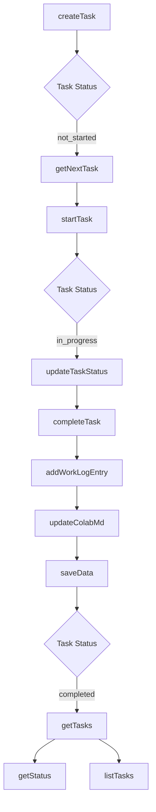

# src — collaboration

The `src/collaboration` module provides the foundational components for enabling both AI-driven and human-driven collaborative workflows within Code Buddy. It encompasses two distinct, yet conceptually related, collaboration paradigms:

1.  **AI-centric Task Management**: Facilitates structured multi-AI agent collaboration on development tasks, tracking progress, and generating work logs.
2.  **Real-time Human Collaboration**: Enables shared sessions between human users (and potentially AI agents), offering features like real-time synchronization, messaging, and moderated changes.

This module is crucial for orchestrating complex development efforts, whether by a team of AI agents following a defined methodology or by a mixed team of human developers and AI assistants working together in real-time.

---

## AI Collaboration Manager (`AIColabManager`)

The `AIColabManager` class is designed to manage a structured, multi-AI collaboration workflow, adhering to a defined methodology (e.g., `COLAB.md`). Its primary role is to break down a project into manageable tasks, track their status, log AI agent activities, and provide context for ongoing work.

### Purpose

`AIColabManager` acts as a central coordinator for AI agents, ensuring they work on well-defined tasks, record their progress, and can hand off work effectively. It maintains a persistent state of tasks and work logs, allowing for continuity across sessions and agents.

### Key Concepts

*   **`ColabTask`**: Represents a single unit of work for an AI agent. It includes details like title, description, status, priority, files to modify, acceptance criteria, and proof of functionality.
*   **`WorkLogEntry`**: A record of an AI agent's completed work on a task. It captures the agent, summary of changes, files modified, tests added, proof of functionality, issues encountered, and next steps.
*   **`ColabConfig`**: Project-level configuration, including project name, version, maximum files per iteration, and test coverage targets.
*   **`HandoffInfo`**: Structured information used when one AI agent needs to transfer a task or context to another.

### Core Functionality

The `AIColabManager` provides a comprehensive set of methods for managing the AI collaboration lifecycle:

#### 1. Data Persistence

The manager persists its state to JSON files within a `.codebuddy` directory in the working directory:
*   `colab-tasks.json`: Stores `ColabConfig` and all `ColabTask` objects.
*   `colab-worklog.json`: Stores all `WorkLogEntry` objects.

*   `private loadData()`: Called during instantiation to load existing tasks and work logs from disk.
*   `private saveData()`: Writes the current state of tasks and work logs back to their respective JSON files. This is called automatically after any modification to tasks or work logs.

#### 2. Task Management

*   **`getTasks()` / `getTasksByStatus(status)`**: Retrieve all tasks or filter them by their current status.
*   **`getNextTask()`**: Identifies the highest-priority task that has not yet been started, guiding agents on what to work on next.
*   **`createTask(task)`**: Adds a new `ColabTask` to the system.
*   **`updateTaskStatus(taskId, status, agent?)`**: Changes the status of a task (e.g., `not_started`, `in_progress`, `completed`, `blocked`). Automatically sets `assignedAgent`, `startedAt`, and `completedAt` timestamps.
*   **`startTask(taskId, agent)`**: Marks a task as `in_progress` and assigns it to a specific agent, with checks to prevent starting already active or completed tasks.
*   **`completeTask(taskId, workLogEntry)`**: Marks a task as `completed`. It validates against `maxFilesPerIteration` from `ColabConfig` and automatically creates a `WorkLogEntry`.

#### 3. Work Log Management

*   **`addWorkLogEntry(entry)`**: Records an agent's work, saving it to `colab-worklog.json` and triggering an update to the `COLAB.md` file.
*   **`getRecentWorkLog(limit)`**: Retrieves a specified number of the most recent work log entries.

#### 4. Handoff Management

*   **`createHandoff(info)`**: Generates a markdown-formatted summary of a handoff between agents, including context, files in progress, blockers, and recommended next steps. This information is also added as a `WorkLogEntry`.
*   **`private formatHandoff(info)`**: A helper method to format `HandoffInfo` into a readable markdown string.

#### 5. `COLAB.md` Management

*   **`private updateColabMd(entry)`**: Appends new `WorkLogEntry` details to the `COLAB.md` file, ensuring the project's main collaboration document is always up-to-date with recent activity. It intelligently inserts new entries into the "Work Log" section.
*   **`private formatWorkLogEntry(entry)`**: Formats a `WorkLogEntry` into a markdown string suitable for `COLAB.md`.

#### 6. AI Instructions and Reporting

*   **`generateAgentInstructions(agentName)`**: Creates a comprehensive markdown document tailored for a new AI agent. This includes project context, important files, collaboration rules, available commands, a suggested next task, and recent activity.
*   **`getStatus()`**: Provides a high-level markdown summary of the project's current state, including task progression, coverage, and active rules.
*   **`listTasks()`**: Generates a detailed markdown list of all tasks, categorized by status and including key details.
*   **`initializeDefaultTasks()`**: Populates the manager with a set of predefined, common development tasks if they don't already exist, providing a quick start for new projects.

### Task Lifecycle

The following Mermaid diagram illustrates the typical lifecycle of a `ColabTask` within the `AIColabManager`:



### Integration

`AIColabManager` is primarily integrated with the command handling system, specifically `commands/handlers/colab-handler.ts`. This handler translates user commands (e.g., `/colab start`, `/colab log`, `/colab status`) into calls to the `AIColabManager` methods.

It uses a singleton pattern (`getAIColabManager`) to ensure that only one instance of the manager exists per application context, maintaining a consistent state across different parts of the codebase.

---

## Real-time Collaboration Managers

The `collaboration` module offers two classes for real-time, human-centric collaboration: `CollaborativeSessionManager` and `TeamSessionManager`. While they share conceptual similarities, `TeamSessionManager` is the more robust, feature-rich, and persistent solution, designed for comprehensive team collaboration. `CollaborativeSessionManager` appears to be a simpler, in-memory alternative or precursor.

### `CollaborativeSessionManager` (Brief Overview)

This class provides a basic framework for real-time collaborative sessions. It manages:
*   **Users**: Tracks users, their roles (`owner`, `editor`, `viewer`), and cursor positions.
*   **Shared Context**: Stores messages, file states, and variables in memory.
*   **File Locks**: Allows users to acquire locks on files or regions to prevent conflicts.
*   **Permissions**: Basic session-level permissions (`allowEditing`, `allowExecution`).
*   **Event-driven**: Extends `EventEmitter` to broadcast collaboration events (`user-joined`, `file-changed`, etc.) locally.

It's suitable for simpler, ephemeral collaboration needs where persistence and advanced features like audit logs or external server synchronization are not required.

### `TeamSessionManager` (Detailed Explanation)

The `TeamSessionManager` is a comprehensive system for managing persistent, real-time collaborative sessions for teams. It goes beyond basic synchronization to include robust member management, role-based permissions, audit logging, and secure data persistence.

### Purpose

`TeamSessionManager` enables multiple users to work together on a shared Code Buddy workspace in real-time. It provides mechanisms for communication, shared context, moderated changes, and a complete history of session activities, making it ideal for complex team projects.

### Key Concepts

*   **`TeamMember`**: Represents a participant in a session, including their ID, name, email, role (`owner`, `admin`, `editor`, `viewer`), status, and permissions.
*   **`SharedSession`**: The central entity for collaboration. It encapsulates session metadata (name, owner, members), settings, current state, and an audit log.
*   **`SessionSettings`**: Configurable options for a session, such as `requireApproval` for changes, `maxMembers`, `allowFileEdits`, and `recordSession`.
*   **`SessionState`**: The dynamic, real-time state of the session, including cursor positions, conversation history, shared files, annotations, and pending changes.
*   **`ConversationMessage`**: A message exchanged within the session's chat history.
*   **`Annotation`**: A comment or note attached to a specific line in a shared file.
*   **`PendingChange`**: A proposed modification (e.g., file edit, terminal command) that might require approval from an `owner` or `admin` before being applied.
*   **`AuditEntry`**: A timestamped record of significant events within the session, providing a complete history for accountability and review.
*   **`TeamSessionConfig`**: Client-side configuration for WebSocket connectivity, encryption, and reconnection logic.

### Core Functionality

#### 1. Member and Session Lifecycle

*   **`loadMemberProfile()` / `createDefaultProfile()`**: Manages the local user's identity, persisting it to `.codebuddy/profile.json`.
*   **`createSession(name, settings)`**: Initiates a new `SharedSession`, assigning the creator as the `owner`.
*   **`joinSession(sessionId, shareCode?)`**: Allows a member to join an existing session. It handles checks for session activity, member limits, and optional approval requirements.
*   **`leaveSession()`**: A member exits the current session. If the owner leaves, ownership is transferred to another member, or the session is closed if no members remain.
*   **`inviteMember(email, role)`**: Generates an invite code for a new member, storing it for later use.
*   **`updateMemberRole(memberId, newRole)`**: Modifies a member's role within the session (requires `owner` or `admin` permissions).
*   **`removeMember(memberId)`**: Forcibly removes a member from the session (requires `owner` or `admin` permissions).

#### 2. Collaboration Features

*   **`shareMessage(content, type)`**: Adds a message to the session's shared conversation history.
*   **`shareFile(filePath)`**: Marks a file as shared within the session, making its content available to other members.
*   **`addAnnotation(file, line, content)`**: Creates a new annotation on a specific line of a shared file.
*   **`updateCursorPosition(file, line, column)`**: Broadcasts the current member's cursor location to other participants for real-time presence.
*   **`submitChange(type, target, content?)`**: Proposes a change to the shared workspace. If `requireApproval` is enabled in `SessionSettings`, the change enters a `pending` state.
*   **`approveChange(changeId)` / `rejectChange(changeId, reason?)`**: Allows authorized members to approve or reject `PendingChange` requests.

#### 3. Permissions and Audit

*   **`hasPermission(action)`**: Checks if the current member has the necessary permissions for a given action (e.g., `read`, `write`, `execute`, `share`), based on their role and session settings.
*   **`private addAuditEntry(session, action, details)`**: Records every significant action (e.g., session created, member joined, change approved) into the session's `auditLog`, providing a complete historical record.

#### 4. Data Persistence and Encryption

*   **`private saveSession(session)` / `private loadSession(sessionId)`**: Persists `SharedSession` objects to JSON files in `~/.codebuddy/sessions/`.
*   **`private encrypt(data)` / `private decrypt(encryptedData)`**: Provides AES-256-GCM encryption for session data stored on disk, enhancing security if `enableEncryption` and `encryptionKey` are configured.

#### 5. Real-time Communication (WebSocket)

`TeamSessionManager` integrates with a WebSocket server to enable real-time updates across all connected clients.

*   **`private connectWebSocket(sessionId)`**: Establishes a WebSocket connection to the configured `serverUrl`. It handles reconnection logic and heartbeat pings.
*   **`private disconnectWebSocket()`**: Closes the WebSocket connection.
*   **`private startHeartbeat()` / `private stopHeartbeat()`**: Manages periodic `ping` messages to keep the WebSocket connection alive.
*   **`private handleWebSocketMessage(message)`**: Processes incoming messages from the WebSocket server, updating the local session state (e.g., `member_joined`, `cursor`, `message`).
*   **`private broadcastUpdate(type, payload)`**: Sends local updates to the WebSocket server for distribution to other session members.

#### 6. Reporting and Utilities

*   **`getCurrentSession()` / `getCurrentMember()`**: Accessors for the current session and member.
*   **`listSessions()`**: Retrieves a list of all locally saved sessions.
*   **`getAuditLog()`**: Returns the audit log for the current session.
*   **`exportSession(format)`**: Exports the current session data in JSON or Markdown format.
*   **`formatStatus()`**: Generates a formatted string displaying the current session's status, members, and key metrics.
*   **`dispose()`**: Cleans up WebSocket connections and event listeners.

### WebSocket Communication Flow

```mermaid
graph TD
    A[TeamSessionManager] --> B{connectWebSocket};
    B --> C[WebSocket Server];
    C -- "open" --> D[ws.on('open')];
    D --> E[startHeartbeat];
    C -- "message" --> F[ws.on('message')];
    F --> G[handleWebSocketMessage];
    G -- "update local state" --> H[emit events];
    H --> I[Other components];
    J[shareMessage/updateCursorPosition/etc.] --> K[broadcastUpdate];
    K --> C;
    C -- "updates" --> F;
```

### Integration

`TeamSessionManager` is designed to be the backbone for multi-user Code Buddy experiences. While the provided call graph shows extensive unit testing (`team-session.test.ts`), its integration with higher-level UI components or daemon processes would involve:
*   Calling `createSession` or `joinSession` to initiate collaboration.
*   Listening to emitted events (e.g., `member:joined`, `message:received`, `cursor:updated`) to update the user interface in real-time.
*   Invoking methods like `shareMessage`, `updateCursorPosition`, or `submitChange` in response to user actions.

Similar to `AIColabManager`, `TeamSessionManager` also uses a singleton pattern (`getTeamSessionManager`) to ensure a single, consistent instance.

---

## Module Exports (`src/collaboration/index.ts`)

The `index.ts` file serves as the public API for the `collaboration` module, re-exporting the main classes and their associated singleton functions:

*   `export * from "./collaborative-mode.js";`
*   `export * from "./ai-colab-manager.js";`

This allows other parts of the codebase to import `AIColabManager`, `CollaborativeSessionManager`, `getAIColabManager`, `getCollaborationManager`, and their related types directly from `src/collaboration`.

**Note on Overlapping Types**: The comment in `index.ts` highlights that `team-session.js` has overlapping types with `collaborative-mode.js`. This suggests that `TeamSessionManager` is the more evolved and feature-complete solution for "team collaboration," and developers should generally prefer importing `TeamSessionManager` directly if its advanced features (persistence, encryption, audit logs, full WebSocket integration) are required, rather than relying solely on the simpler `CollaborativeSessionManager` exported via `index.ts`.

---

## Integration Points & Execution Flows

The `collaboration` module is a critical piece for enabling Code Buddy's advanced capabilities.

*   **AI Collaboration**: The `AIColabManager` is directly consumed by command handlers (e.g., `commands/handlers/colab-handler.ts`). This allows AI agents (or human users interacting with the AI) to manage tasks, log work, and get instructions via `/colab` commands. The execution flow `HandleColabCommand → SaveData` demonstrates how user/AI actions trigger state changes that are then persisted.
*   **Human/Team Collaboration**: The `TeamSessionManager` (and `CollaborativeSessionManager`) are designed for real-time interaction. While the provided call graph shows extensive unit testing, their primary integration would be with a WebSocket server (external to this module) and client-side UI components that manage shared workspaces, chat, and presence. The `connectWebSocket` and `broadcastUpdate` methods are key to this real-time interaction.
*   **File System Interaction**: Both `AIColabManager` and `TeamSessionManager` heavily rely on `fs` (and `fs-extra` for `TeamSessionManager`) for persisting their state to disk, ensuring data continuity across sessions.
*   **Security**: `TeamSessionManager` utilizes Node.js's `crypto` module for generating unique IDs and for encrypting sensitive session data stored on disk, providing a layer of security for collaborative workspaces.

In summary, the `collaboration` module provides a robust and flexible framework for managing complex development workflows, catering to both autonomous AI agents and interactive human teams, with a strong emphasis on persistence, real-time synchronization, and accountability.