# src — commands

The `src/commands` module serves as the central hub for defining and dispatching both command-line interface (CLI) commands and interactive commands within the Code Buddy application. It provides a structured way to extend the application's functionality, allowing users to interact with various subsystems like the daemon, device nodes, skills hub, and more, directly from the terminal or an interactive client.

This module is critical for user interaction, system configuration, and developer workflows.

## Architecture and Structure

The `src/commands` module is broadly divided into two main categories:

1.  **CLI Commands (`src/commands/cli/`)**: These are standard `commander.js` commands registered directly with the main `buddy` program. Each file typically registers a top-level command (e.g., `buddy approvals`, `buddy daemon`) and its subcommands.
2.  **Interactive Client Commands (`src/commands/client-dispatcher.ts`, `src/commands/custom-commands.ts`, etc.)**: These commands are designed for the interactive chat interface (e.g., a TUI or GUI client). They include slash commands (e.g., `/commit`), shell bypass commands (e.g., `!ls`), and direct bash execution.

### CLI Command Registration Flow

The main `buddy` executable (likely `src/index.ts`) imports and calls registration functions from `src/commands/cli/` files. Each registration function takes a `commander.Command` instance and adds its specific commands and options.

```mermaid
graph TD
    A[src/index.ts] --> B(registerApprovalsCommands)
    A --> C(registerDaemonCommands)
    A --> D(registerConfigCommand)
    A --> E(registerDeployCommands)
    A --> F(registerDeviceCommands)
    A --> G(registerNodeCommands)
    A --> H(registerHeartbeatCommands)
    A --> I(registerHubCommands)
    A --> J(registerIdentityCommands)
    A --> K(registerGroupCommands)
    A --> L(registerAuthProfileCommands)
    A --> M(registerSecretsCommands)
    A --> N(registerSpeakCommand)
    A --> O(registerUtilityCommands)
    A --> P(registerDevCommands)
    B,C,D,E,F,G,H,I,J,K,L,M,N,O,P --> Q(Commander.js Program)
```



### Interactive Client Command Dispatching

The `ClientCommandDispatcher` is the core component for handling user input in an interactive client. It determines if an input is a special command (slash command, shell bypass, or direct bash) or a message to be processed by the AI agent.

```mermaid
graph TD
    A[User Input] --> B{ClientCommandDispatcher.dispatch}
    B --> |Starts with /| C{handleSlashCommand}
    B --> |Starts with !| D{handleShellBypass}
    B --> |Is direct bash| E{handleDirectBashCommand}
    B --> |Else| F[Pass to AI Agent]

    C --> |Internal Command (__TOKEN__)| G{handleInternalCommand}
    C --> |Legacy /commit-and-push| H[GitWorkflowHandler]
    C --> |Legacy /models| I[Show Model Selection UI]
    C --> |Legacy /models <name>| J[handleModelSwitch]
    C --> |Slash Command returns prompt| F
    C --> |Unknown Slash Command| K[Display Error]

    G --> |__CLEAR_CHAT__| L[Clear UI State + Delegate to Enhanced]
    G --> |__CHANGE_MODEL__ (no args)| I
    G --> |Other __TOKEN__| M[Delegate to EnhancedCommandHandler]

    D --> N[Execute Bash Command via Agent]
    E --> N

    L --> O[EnhancedCommandHandler]
    M --> O
```

## Key Components and Their Roles

### `src/commands/cli/*` (CLI Commands)

These files define the various command-line utilities available through the `buddy` executable. Each file typically exports a `register<CommandName>Commands` function that takes a `commander.Command` instance and adds subcommands, options, and actions.

*   **`approvals-command.ts`**: Manages `ApprovalRequest` objects, allowing users to list, approve, or deny actions proposed by the AI. It uses an in-memory `ApprovalsStore` for demonstration, but notes that a production system would persist these.
*   **`completions-command.ts`**: Provides shell completion scripts for various shells (bash, zsh, fish, powershell). It can generate scripts or attempt to install them into the user's shell configuration.
*   **`config-command.ts`**: Allows users to inspect and validate the application's environment variable configuration. It integrates with `src/config/env-schema.js` to display variable definitions, values (masked for sensitive ones), and validation status.
*   **`daemon-commands.ts`**: Manages the Code Buddy background daemon process. It includes commands to `start`, `stop`, `restart`, `status`, and view `logs`. It also contains a hidden `__run__` command used internally by the daemon manager to fork the actual daemon process. This file also registers `trigger` commands for managing event-based automation.
*   **`deploy-command.ts`**: Facilitates generating deployment configurations for various cloud platforms (e.g., Fly.io, Railway, Render) and Nix flakes. It leverages `src/deploy/cloud-configs.js` and `src/deploy/nix-config.js`.
*   **`device-commands.ts`**: Manages interactions with paired physical devices (e.g., via SSH or ADB). Commands include `list`, `pair`, `remove`, and capabilities like `snap` (camera), `screenshot`, `record` (screen), and `run` (shell command). It uses `src/nodes/device-node.js`.
*   **`node-commands.ts`**: Manages companion application nodes (e.g., macOS, iOS, Android apps). It allows listing, pairing, approving, describing, removing, and invoking capabilities on these nodes. It interacts with `src/nodes/index.js`.
*   **`Native Engine-commands.ts`**: A collection of commands inspired by the Native Engine project, covering various aspects of the agent's ecosystem:
    *   `heartbeat`: Controls the agent's periodic wake-up mechanism.
    *   `hub`: Manages the skills marketplace (search, install, publish, update, list skills).
    *   `identity`: Manages agent identity files (e.g., `SOUL.md`, `USER.md`) for prompt injection.
    *   `groups`: Configures security settings for group chat interactions.
    *   `auth-profile`: Manages authentication profiles for API key rotation and health checks.
*   **`secrets-command.ts`**: Provides a secure, encrypted vault for managing sensitive credentials like API keys. It uses Node.js `crypto` for encryption and stores secrets in `~/.codebuddy/secrets/vault.enc`. Requires `CODEBUDDY_VAULT_KEY` environment variable for encryption/decryption.
*   **`speak-command.ts`**: Integrates with an AudioReader TTS provider to synthesize speech from text. It can list available voices and play generated audio.
*   **`utility-commands.ts`**: Contains general utility commands:
    *   `doctor`: Diagnoses the Code Buddy environment for common issues.
    *   `security-audit`: Performs security checks on the environment and configuration.
    *   `onboard`: Launches an interactive setup wizard.
    *   `webhook`: Manages webhook triggers for external integrations.
*   **`dev/index.ts`**: Defines "golden-path" developer workflows under the `buddy dev` command. This includes `plan` (repo profiling + task planning), `run` (plan, implement, test, save artifacts), `pr` (run + generate PR summary), and `fix-ci` (analyze CI logs, propose fixes). It directly creates and interacts with `CodeBuddyAgent` instances.

### `client-dispatcher.ts`

The `ClientCommandDispatcher` class is responsible for parsing user input in an interactive client and routing it to the appropriate handler.

*   **`dispatch(input, context)`**: The main entry point. It checks for:
    *   **Slash Commands (`/`)**: Delegated to `handleSlashCommand`.
    *   **Shell Bypass (`!`)**: Executes the command directly in the shell via `handleShellBypass`.
    *   **Direct Bash Commands**: Recognizes common shell commands (e.g., `ls`, `cd`) and executes them via `handleDirectBashCommand`.
    *   **AI Agent**: If none of the above, the input is passed to the `CodeBuddyAgent` for AI processing.
*   **`handleSlashCommand`**: Uses `getSlashCommandManager()` to execute registered slash commands. It also contains legacy handling for specific commands like `/commit-and-push` and `/models`.
*   **`handleInternalCommand`**: A specialized handler for internal command tokens (e.g., `__CLEAR_CHAT__`, `__CHANGE_MODEL__`) that often require UI-specific side effects (like clearing chat history or opening a model picker) in addition to delegating to the `EnhancedCommandHandler`.
*   **`delegateToEnhanced`**: A helper that sets up the `EnhancedCommandHandler` with the current conversation context and agent proxy, then calls `handleCommand`.
*   **`handleShellBypass` / `handleDirectBashCommand`**: Execute shell commands using `context.agent.executeBashCommand` and add the output to the chat history.

### `compress.ts`

This file contains the core logic for the `/compress` command, which aims to reduce the token count of the conversation history by summarizing it.

*   **`CompressResult`**: Interface defining the output of a compression operation.
*   **`buildSummaryPrompt(messages)`**: Generates a prompt for the LLM to summarize the conversation, focusing on key decisions, file changes, problems solved, and current task state.
*   **`compressContext(messages, llmCall, estimateTokens)`**: The main function that orchestrates the compression. It calculates original tokens, calls the LLM with the summary prompt, and then calculates the token savings.
*   **`createCompressedMessages(systemMessage, summary)`**: Constructs a new message array, preserving the system message and adding the generated summary as an assistant message.
*   **`formatCompressResult(result)`**: Provides a human-readable summary of the compression outcome.

### `custom-commands.ts`

The `CustomCommandLoader` class enables users to define their own slash commands using markdown files.

*   **`CustomCommand`**: Interface representing a user-defined command.
*   **`CustomCommandLoader`**:
    *   Scans `.codebuddy/commands` directories (both project-local and global `~/.codebuddy/commands`) for `.md` files.
    *   Supports YAML frontmatter for `description`.
    *   **`expandCommand(name, args)`**: Replaces placeholders like `$ARGUMENTS`, `$1`, `$CWD`, `$USER` with actual values, providing a powerful templating mechanism. **Crucially, it whitelists safe environment variables to prevent accidental exposure of secrets.**
    *   Provides methods to `createCommand`, `deleteCommand`, `getCommand`, and `getAllCommands`.
*   **`getCustomCommandLoader()`**: Returns a singleton instance of `CustomCommandLoader`.

### `delegate.ts`

This file implements the `/delegate` command, which automates the process of creating a GitHub Pull Request for a given task.

*   **`DelegateConfig` / `DelegateResult`**: Interfaces for configuring and reporting on delegation tasks.
*   **`generateBranchName(task)`**: Creates a unique, slugified branch name.
*   **`isGitRepo()` / `getCurrentBranch()` / `hasUncommittedChanges()` / `createBranch()` / `commitChanges()` / `pushBranch()`**: Utility functions for interacting with Git.
*   **`hasGhCli()` / `createPullRequest()` / `addPRComment()` / `requestReview()` / `markReady()`**: Utility functions for interacting with the GitHub CLI (`gh`).
*   **`delegate(config)`**: The main orchestration function. It performs Git operations (commit, branch, push) and then uses the `gh` CLI to create a draft PR with a structured body.
*   **`completeDelegate(prNumber, summary, reviewers)` / `abortDelegate(prNumber, reason)`**: Functions to update and manage the delegated PR's lifecycle.

## Integration with the Codebase

The commands module integrates deeply with almost every other major part of the Code Buddy codebase:

*   **`src/agent/codebuddy-agent.ts`**: The `ClientCommandDispatcher` directly interacts with the `CodeBuddyAgent` for processing AI messages and executing bash commands. The `dev` commands also instantiate and use the agent.
*   **`src/utils/logger.js`**: Used across many command actions for logging debug information or errors.
*   **`src/config/env-schema.js`**: Integrated by `config-command` for environment variable management.
*   **`src/daemon/*`**: The `daemon-commands` directly manage the daemon process and its components like `heartbeat.js` and `cron-agent-bridge.js`.
*   **`src/nodes/*`**: `device-commands` and `node-commands` interact with the `DeviceNodeManager` and `NodeManager` respectively.
*   **`src/skills/hub.js`**: The `hub` commands in `Native Engine-commands` manage skills via the `SkillsHub`.
*   **`src/identity/identity-manager.js`**: The `identity` commands in `Native Engine-commands` manage agent identity.
*   **`src/auth/profile-manager.js`**: The `auth-profile` commands in `Native Engine-commands` manage API key rotation.
*   **`src/security/*`**: `secrets-command` and `utility-commands` (`security-audit`) interact with security-related modules.
*   **`src/utils/shell-completions.js`**: Used by `completions-command` to generate shell scripts.
*   **`src/integrations/github-integration.js`**: Used by `dev pr` to generate PR descriptions.
*   **`src/integrations/ci-autofix-pipeline.js`**: Used by `dev fix-ci` for automated CI issue resolution.
*   **`src/webhooks/webhook-manager.js`**: Used by `utility-commands` (`webhook`) to manage webhooks.

This extensive integration highlights the commands module as the primary interface layer between the user and the underlying Code Buddy systems.