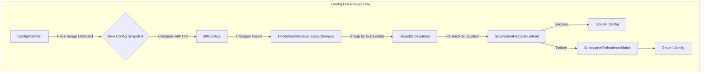

# src — config

The `src/config` module is the central nervous system for managing all configuration within Code Buddy. It provides a robust, layered, and extensible system for defining, loading, resolving, and dynamically updating application settings from various sources. This includes user preferences, project-specific rules, enterprise policies, environment variables, and CLI arguments.

The module is designed to ensure:
*   **Clear Precedence**: A well-defined order for how different configuration sources override each other.
*   **Modularity**: Separation of concerns, with distinct components handling different types of configuration (e.g., admin, user, project, feature flags).
*   **Extensibility**: Easy to add new configuration sources or advanced features.
*   **Developer Experience**: Tools for validation, introspection, and programmatic manipulation of settings.
*   **Dynamic Updates**: Support for hot-reloading configuration changes without restarting the application.

## Module Structure

The `src/config` module is composed of several specialized files, each addressing a specific aspect of configuration:

*   `admin-config.ts`: Enterprise-level enforced and managed defaults.
*   `advanced-config.ts`: A collection of advanced, often behavioral, configuration features.
*   `agent-defaults.ts`: Agent-specific default parameter overrides.
*   `codebuddyrules.ts`: Manages project-specific `.codebuddyrules` files.
*   `config-mutator.ts`: Programmatic setting of configuration values via dot-notation.
*   `config-resolver.ts`: The core logic for resolving connection profiles and API settings based on precedence.
*   `constants.ts`: Centralized, immutable application constants.
*   `env-schema.ts`: Defines and validates environment variables.
*   `feature-flags.ts`: Manages runtime feature toggles.
*   `hot-reload/`: Sub-module for dynamic configuration reloading.
*   `model-defaults.ts`: Default models for various LLM providers.
*   `model-pricing.ts`: Pricing information for different LLM models.
*   `model-registry.ts`: A central registry for LLM model capabilities and metadata.
*   `model-tools.ts`: Utilities for model-tool compatibility and selection.
*   `migration.ts`: Handles migration of older configuration formats.
*   `secret-ref.ts`: Resolves `$\{env:...\}` and `$\{file:...\}` references for sensitive data.
*   `settings-hierarchy.ts`: Defines the search paths for configuration files.
*   `toml-config.ts`: Manages TOML-based user and project configuration files.
*   `types.ts`: Shared TypeScript interfaces and types for configuration.
*   `user-settings.ts`: Manages JSON-based user settings.

## Configuration Resolution & Precedence

Code Buddy employs a layered approach to configuration, where settings from different sources are applied in a specific order of precedence. The `ConfigResolver` and `AdminConfig` are key to this process.

### `config-resolver.ts` - Connection Profile Resolution

The `ConfigResolver` class is responsible for determining the active LLM connection configuration (e.g., `baseURL`, `apiKey`, `model`, `provider`). It prioritizes settings from the following sources, from highest to lowest:

1.  **CLI Overrides**: Explicit `--profile`, `--baseURL`, `--apiKey`, or `--model` flags provided at runtime.
2.  **Active Profile**: The currently selected connection profile (e.g., `grok`, `openai`, `lmstudio`).
3.  **Environment Variables**: If `envVarsFallback` is enabled, environment variables like `GROK_API_KEY`, `OPENAI_API_KEY`, etc., are used as a fallback.
4.  **Default Profile**: A designated default profile if no active profile is set or enabled.
5.  **Built-in Defaults**: Hardcoded fallback values if no other configuration is found.

The `ConfigResolver` also manages a collection of `ConnectionProfile` objects, allowing users to define and switch between different API endpoints and credentials. It includes functionality for auto-detecting local LLM servers (like LM Studio or Ollama) and testing connections.

```mermaid
graph TD
    subgraph "Config Resolution Precedence (ConfigResolver.resolve)"
        CLI_PROFILE[1. CLI Profile (--profile)] --> A{Profile Exists?}
        A -- Yes --> PROFILE_CFG(Profile Config)
        A -- No --> CLI_DIRECT[2. CLI Direct (--baseURL, --apiKey)]
        CLI_DIRECT --> B{CLI Direct Set?}
        B -- Yes --> CLI_CFG(CLI Direct Config)
        B -- No --> ACTIVE_PROFILE[3. Active Profile]
        ACTIVE_PROFILE --> C{Profile Enabled?}
        C -- Yes --> ACTIVE_CFG(Active Profile Config)
        C -- No --> ENV_VARS[4. Environment Variables]
        ENV_VARS --> D{Env Vars Set?}
        D -- Yes --> ENV_CFG(Env Config)
        D -- No --> DEFAULT_PROFILE[5. Default Profile]
        DEFAULT_PROFILE --> E{Default Profile Exists?}
        E -- Yes --> DEFAULT_CFG(Default Profile Config)
        E -- No --> BUILTIN_FALLBACK[6. Built-in Fallback]

        PROFILE_CFG --> RESOLVED(ResolvedConfig)
        CLI_CFG --> RESOLVED
        ACTIVE_CFG --> RESOLVED
        ENV_CFG --> RESOLVED
        DEFAULT_CFG --> RESOLVED
        BUILTIN_FALLBACK --> RESOLVED
    end
```

**Key Functions/Classes:**
*   `ConfigResolver`: Manages profiles and resolves the final connection configuration.
*   `resolve(cliOverrides?: CLIOverrides)`: The primary method for resolving configuration.
*   `setActiveProfile(profileId: string)`: Changes the active connection profile.
*   `autoDetectLocalServers()`: Scans for local LLM servers.
*   `testConnection()`: Verifies the active connection.

### `admin-config.ts` - Enterprise Admin Configuration

This module handles configuration enforced by system administrators, typically in enterprise deployments. It loads settings from `/etc/codebuddy/requirements.toml` and `/etc/codebuddy/managed_config.toml`.

*   **`requirements.toml`**: Defines *enforced* settings (e.g., `maxCostLimit`, `allowedModels`, `disabledTools`) that cannot be overridden by users.
*   **`managed_config.toml`**: Provides *managed defaults* (e.g., `model`, `securityMode`) that users *can* override.

The `applyAdminRequirements` function is crucial here, as it merges these admin policies with a user's configuration, ensuring that enforced requirements always take precedence.

**Key Functions/Classes:**
*   `loadAdminConfig(configDir?: string)`: Reads and parses the admin TOML files.
*   `applyAdminRequirements(userConfig: Record<string, unknown>, adminConfig?: AdminConfig)`: Applies admin policies to a user's configuration.
*   `AdminRequirements`, `AdminManagedDefaults`, `AdminConfig`: Interfaces defining the structure of admin settings.

## Configuration Sources & Management

### `toml-config.ts` - TOML Configuration Manager

This module provides a singleton `TomlConfigManager` for loading and saving configuration from TOML files. It supports a hierarchy of configuration:
*   **User-level**: `~/.codebuddy/config.toml`
*   **Project-level**: `.codebuddy/config.toml` or `config.toml` in the current working directory.

It merges these files, with project-level settings overriding user-level settings. This manager is the primary source for many application-wide settings that are not connection-related.

**Key Functions/Classes:**
*   `TomlConfigManager`: Manages loading, merging, and saving TOML configuration.
*   `getConfig()`: Returns the merged configuration object.
*   `saveUserConfig()`: Persists the current configuration to the user-level TOML file.
*   `getConfigManager()`: Singleton accessor for `TomlConfigManager`.

### `user-settings.ts` - User Settings Manager

Similar to `toml-config.ts`, but specifically for JSON-based user settings, typically stored in `~/.codebuddy/user-settings.json`. It provides a simple key-value store for user preferences.

**Key Functions/Classes:**
*   `UserSettingsManager`: Manages loading and saving user settings.
*   `get(key: string)`: Retrieves a setting.
*   `set(key: string, value: unknown)`: Sets a setting.
*   `getInstance()`: Singleton accessor for `UserSettingsManager`.

### `codebuddyrules.ts` - Project-Specific Rules (`.codebuddyrules`)

This module introduces project-specific AI behavior configuration via `.codebuddyrules` files (YAML, JSON, or Markdown). These files can define custom instructions, code style preferences, ignore patterns, security policies, and more.

The `CodeBuddyRulesManager` supports:
*   **Inheritance**: Rules can be inherited from parent directories up to the root.
*   **Global Rules**: A global `.codebuddyrules` file in the user's home directory.
*   **Multiple Formats**: YAML, JSON, and even Markdown with frontmatter or code blocks.
*   **Dynamic Prompt Generation**: Extracts relevant rules to augment the AI's system prompt.

**Key Functions/Classes:**
*   `CodeBuddyRulesManager`: Loads, merges, and provides access to project rules.
*   `initialize(workingDir: string)`: Loads rules from the directory hierarchy.
*   `getSystemPromptAdditions()`: Generates a string of instructions for the AI based on loaded rules.
*   `getIgnorePatterns()`, `isCommandAllowed()`, `isPathAllowed()`: Accessors for specific rule types.
*   `getCodeBuddyRulesManager()`, `initializeCodeBuddyRules()`: Singleton accessors.

### `env-schema.ts` - Environment Variable Schema

This module defines a comprehensive schema (`ENV_SCHEMA`) for all environment variables used by Code Buddy. It includes metadata like type, default value, description, and sensitivity.

**Key Functions/Classes:**
*   `ENV_SCHEMA`: An array of `EnvVarDef` objects defining each environment variable.
*   `validateEnv(env: Record<string, string | undefined>)`: Validates `process.env` against the schema, reporting errors and warnings.
*   `getEnvSummary(env: Record<string, string | undefined>)`: Generates a human-readable summary of environment variables for CLI output.
*   `maskValue(value: string)`: Utility for masking sensitive values in output.

## Advanced Configuration Features

### `advanced-config.ts` - Advanced Configuration Classes

This file groups several advanced configuration features, each encapsulated in its own class:

*   **`FileSuggestionProvider`**: Manages custom, script-based file suggestions.
*   **`EffortLevelManager`**: Controls LLM parameters (temperature, maxTokens, topP) based on 'low', 'medium', or 'high' effort levels.
*   **`AutoCompactConfig`**: Defines thresholds for context window auto-compaction.
*   **`FallbackModelManager`**: Manages automatic model fallback on API errors (e.g., rate limits, timeouts).
*   **`ConfigBackupRotation`**: Handles backup and restoration of configuration files with rotation.
*   **`DevcontainerManager`**: Detects, loads, and generates `.devcontainer.json` configurations.
*   **`SettingSourceManager`**: Controls which configuration sources (`user`, `project`, `enterprise`, `env`, `local`) are enabled.

**Key Functions/Classes:**
*   `FileSuggestionProvider.getSuggestions(query: string)`: Executes a custom script for file suggestions.
*   `EffortLevelManager.getModelParams()`: Returns LLM parameters for the current effort level.
*   `AutoCompactConfig.shouldCompact(currentUsage: number, maxCapacity: number)`: Determines if context should be compacted.
*   `FallbackModelManager.shouldFallback(error: { ... })`: Checks if a fallback model should be used based on an error.
*   `ConfigBackupRotation.createBackup(configPath: string)`: Creates a timestamped backup of a config file.
*   `DevcontainerManager.loadConfig(configPath?: string)`: Loads devcontainer configuration.
*   `SettingSourceManager.isSourceEnabled(source: SettingSource)`: Checks if a specific config source is active.

### `feature-flags.ts` - Feature Flags System

A centralized system for enabling or disabling features at runtime. Feature flags can be overridden by environment variables and persisted in user-level or project-level JSON files (`.codebuddy/feature-flags.json`).

**Key Functions/Classes:**
*   `FeatureFlagsManager`: Manages the state of all feature flags.
*   `isEnabled(flagName: string)`: Checks if a specific feature is enabled.
*   `enableFlag(flagName: string)`, `disableFlag(flagName: string)`, `toggleFlag(flagName: string)`: Methods to change flag states.
*   `getFeatureFlags()`, `isFeatureEnabled()`: Singleton accessors and quick check utility.

### `secret-ref.ts` - Secret Reference Resolution

This module provides utilities for resolving secret references embedded in configuration values. It supports two patterns:
*   `$\{env:ENV_VAR_NAME\}`: Resolves to the value of the specified environment variable.
*   `$\{file:PATH_TO_FILE\}`: Resolves to the content of the specified file.

This allows sensitive information (like API keys) to be stored securely outside of configuration files.

**Key Functions/Classes:**
*   `resolveSecretRef(value: string)`: Resolves all secret references within a string.
*   `resolveValue(ref: string)`: Resolves a single `$\{type:value\}` reference.

## Model & Agent Configuration

### `model-registry.ts` - LLM Model Registry

A central registry for all supported LLM models, their providers, and their token limits. This is critical for consistent model handling across the application.

**Key Functions/Classes:**
*   `ModelRegistry`: Stores and provides access to model metadata.
*   `getModelInfo(modelId: string)`: Retrieves details for a given model.
*   `getProviderModels(provider: ProviderType)`: Lists models for a specific provider.
*   `getRegistry()`: Singleton accessor.

### `model-defaults.ts` - Model Defaults

Provides default model identifiers for different LLM providers. This ensures that if a specific model isn't configured, a sensible default is used.

**Key Functions/Classes:**
*   `getProviderDefaultModel(provider: ProviderType)`: Returns the default model for a provider.
*   `FALLBACK_MODEL`: A constant for the ultimate fallback model.

### `model-pricing.ts` - Model Pricing

Contains pricing information for various LLM models, used by the cost tracker and analytics modules.

**Key Functions/Classes:**
*   `getModelPricingEntry(modelId: string)`: Retrieves pricing details for a model.
*   `getPricingPer1k(modelId: string, type: 'input' | 'output')`: Gets cost per 1000 tokens.

### `model-tools.ts` - Model Tooling Utilities

Provides utilities related to model capabilities and tool usage, such as checking if a model supports specific tools or function calling.

**Key Functions/Classes:**
*   `getModelToolConfig(modelId: string)`: Retrieves tool-related configuration for a model.
*   `matchModel(modelId: string, pattern: RegExp)`: Checks if a model ID matches a pattern.

### `agent-defaults.ts` - Agent Defaults

Provides access to agent-specific default settings, such as the image generation model or per-agent parameter overrides. These are typically loaded from the `toml-config.ts` manager.

**Key Functions/Classes:**
*   `getImageGenerationModel()`: Gets the configured image generation model.
*   `getAgentParams(agentId: string)`: Retrieves parameter overrides for a specific agent.

## Dynamic Configuration & Hot Reload

The `src/config/hot-reload` sub-module provides a sophisticated system for detecting configuration file changes and dynamically reloading affected parts of the application without a full restart.

### `hot-reload/index.ts` - Hot Reload Manager

The `HotReloadManager` orchestrates the entire hot-reload process. It uses a `ConfigWatcher` to monitor files, `diff.ts` to identify changes, and `reloader.ts` to apply those changes to specific subsystems.



**Key Functions/Classes:**
*   `HotReloadManager`: The main class for managing hot-reloads.
*   `start()`: Initializes the watcher and begins monitoring.
*   `forceReload(subsystemId?: SubsystemId)`: Triggers a reload for specific or all subsystems.
*   `registerReloader(subsystemId: SubsystemId, reloader: SubsystemReloader)`: Registers a function to handle reloads for a given subsystem.

### `hot-reload/watcher.ts` - Config File Watcher

The `ConfigWatcher` monitors specified configuration files and directories for changes. It debounces events to prevent excessive reloads and notifies the `HotReloadManager` when a stable change is detected.

**Key Functions/Classes:**
*   `ConfigWatcher`: Manages file system watchers.
*   `start()`: Begins watching configured paths.
*   `watchPath(filePath: string)`: Adds a specific file or directory to be watched.
*   `getConfigWatcher()`: Singleton accessor.

### `hot-reload/diff.ts` - Config Diffing

This module provides utilities for comparing configuration snapshots. It generates a list of `ConfigChange` objects, indicating what values have been added, removed, or modified. It also maps changes to affected `SubsystemId`s.

**Key Functions/Classes:**
*   `hashConfig(data: Record<string, unknown>)`: Creates a hash of config data for quick comparison.
*   `createSnapshot(data: Record<string, unknown>)`: Captures the current state of configuration.
*   `diffConfigs(oldSnapshot: ConfigSnapshot, newSnapshot: ConfigSnapshot)`: Compares two snapshots and returns a list of changes.
*   `getSubsystemForPath(path: string)`: Determines which subsystem a config path belongs to.

### `hot-reload/reloader.ts` - Subsystem Reloaders

This module manages `SubsystemReloader` functions, which are responsible for applying configuration changes to specific parts of the application. It handles the order of reloads based on dependencies and provides rollback mechanisms in case of failure.

**Key Functions/Classes:**
*   `registerReloader(subsystemId: SubsystemId, reloader: SubsystemReloader)`: Registers a function to handle reloads for a given subsystem.
*   `reloadSubsystems(changes: ConfigChange[])`: Executes the registered reloaders in the correct order.
*   `sortByPriority(subsystems: SubsystemId[])`: Sorts subsystems based on their defined dependencies.
*   `createSimpleReloader(reloadFn: (patch: Record<string, unknown>) => Promise<void>)`: Helper to create basic reloaders.

### `config-mutator.ts` - Config Mutator

The `ConfigMutator` provides a programmatic way to set configuration values using dot-notation key paths (e.g., `middleware.max_turns`). It handles type validation, value coercion, and `SecretRef` resolution. It also supports dry-run mode and batch updates.

**Key Functions/Classes:**
*   `setConfigValue(keyPath: string, value: unknown, opts?: ConfigSetOptions)`: Sets a single configuration value.
*   `setConfigBatch(batch: Record<string, unknown>, opts?: ConfigSetOptions)`: Sets multiple configuration values from a batch object.
*   `validateValueType(currentValue: unknown, newValue: unknown)`: Ensures type compatibility.
*   `coerceValue(currentValue: unknown, rawValue: unknown)`: Converts string values to expected types (e.g., "true" to `true`).

## Constants & Utilities

### `constants.ts` - Centralized Constants

This file consolidates various application-wide constants, grouped by domain (e.g., `AGENT_CONFIG`, `SEARCH_CONFIG`, `API_CONFIG`, `PATHS`). This provides a single source of truth for common values and avoids magic numbers/strings throughout the codebase.

**Key Constants:**
*   `AGENT_CONFIG`: Max tool rounds, default temperature, agent timeout.
*   `API_CONFIG`: Default base URLs, models, timeouts.
*   `SUPPORTED_MODELS`: Detailed information about supported LLM models.
*   `ERROR_MESSAGES`, `SUCCESS_MESSAGES`: Standardized messages.

### `settings-hierarchy.ts` - Settings Hierarchy

Defines the search order and locations for various configuration files, ensuring that Code Buddy can locate settings in common user and project directories.

**Key Functions/Classes:**
*   `getSettingsHierarchy(workingDir: string)`: Returns an ordered list of directories to search for config files.

### `migration.ts` - Configuration Migration

Contains logic for migrating older configuration formats or settings to newer versions, ensuring backward compatibility.

**Key Functions/Classes:**
*   `migrateSettings(oldSettings: Record<string, unknown>)`: Applies migration logic to old settings.
*   `createProfileFromLegacy(legacySettings: Record<string, unknown>)`: Converts legacy settings into a connection profile.

### `types.ts` - Shared Types

This file defines common TypeScript interfaces and types used across the configuration module and other parts of the application, ensuring type safety and consistency.

**Key Types:**
*   `ConnectionConfig`, `ConnectionProfile`, `ResolvedConfig`: For API connection management.
*   `ProviderType`: Enum for supported LLM providers.
*   `CodeBuddyConfig`: The overall structure of the TOML configuration.
*   `SubsystemId`, `ConfigChange`, `ConfigSnapshot`: For hot-reloading.

## How to Contribute or Extend

*   **Adding a new configuration setting**:
    *   For general user/project settings, add it to `src/config/toml-config.ts` (or `user-settings.ts` for simple JSON).
    *   For admin-enforced settings, modify `src/config/admin-config.ts`.
    *   For environment variables, add a definition to `src/config/env-schema.ts`.
    *   For constants, add to `src/config/constants.ts`.
*   **Implementing a new advanced feature**: Create a new class in `src/config/advanced-config.ts` following existing patterns.
*   **Adding a new feature flag**: Define it in `src/config/feature-flags.ts`.
*   **Making a subsystem hot-reloadable**:
    1.  Ensure its configuration is part of a watched file (e.g., `config.toml`).
    2.  Define a `SubsystemId` in `src/config/hot-reload/types.ts`.
    3.  Implement a `SubsystemReloader` function that takes a `patch` (the changed config values) and applies them.
    4.  Register this reloader using `registerReloader(subsystemId, yourReloaderFunction)`.
    5.  If there are dependencies between subsystems, update `SUBSYSTEM_DEPENDENCIES` in `types.ts`.
*   **Adding a new LLM model**: Update `src/config/model-registry.ts` with its details and `src/config/model-pricing.ts` if pricing is available.
*   **Resolving secrets**: Use `resolveSecretRef` when consuming configuration values that might contain `$\{env:...\}` or `$\{file:...\}` patterns.
*   **Accessing configuration**: Prefer using the singleton managers (e.g., `getConfigManager()`, `getConfigResolver()`, `getFeatureFlags()`, `getCodeBuddyRulesManager()`) to ensure a consistent view of the application's configuration.