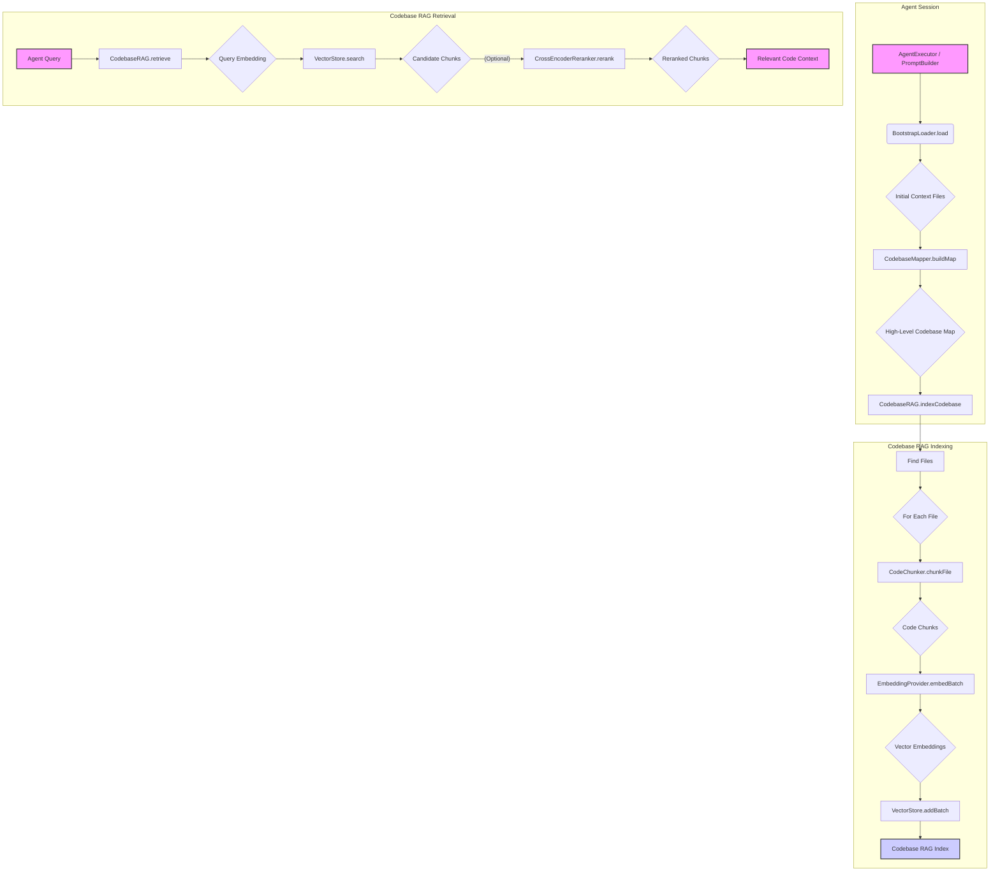

# src — context

The `src/context` module is a foundational component responsible for providing the AI agent with a rich, structured, and up-to-date understanding of its operational environment, particularly the codebase it's working within. It encompasses mechanisms for loading initial configuration, mapping project structure, and performing advanced semantic search (Retrieval-Augmented Generation, RAG) over code.

This module aims to ensure the agent has access to relevant information at the right time, minimizing token usage while maximizing contextual accuracy.

## Core Concepts

The `src/context` module is built around several key concepts:

1.  **Bootstrap Context**: Initial, static instructions and configurations loaded at session start.
2.  **Codebase Mapping**: A high-level, structural overview of the project's files, languages, and key symbols.
3.  **Retrieval-Augmented Generation (RAG) for Code**: A system for semantically searching and retrieving granular code snippets based on natural language queries. This involves:
    *   **Semantic Chunking**: Breaking down code files into meaningful, self-contained units (e.g., functions, classes).
    *   **Embeddings**: Converting text (code chunks, queries) into numerical vector representations that capture semantic meaning.
    *   **Vector Stores**: Efficiently storing and querying these embeddings for similarity search.
    *   **Retrieval Strategies**: Different approaches to finding relevant information, from simple keyword matching to advanced reranking and corrective feedback loops.

## Key Components

### 1. BootstrapLoader (`src/context/bootstrap-loader.ts`)

The `BootstrapLoader` is responsible for injecting initial context files into the agent's session. These files typically contain high-level instructions, agent identity, tool definitions, or project-specific guidelines.

*   **Purpose**: To load predefined Markdown files (e.g., `BOOTSTRAP.md`, `AGENTS.md`, `SOUL.md`) from project-specific (`.codebuddy/`) or global (`~/.codebuddy/`) directories. Project files take precedence over global ones. It also supports hierarchical loading of instruction files (e.g., `AGENTS.md`, `CONTEXT.md`) from the project root up to the current working directory.
*   **`BootstrapLoader` Class**:
    *   `constructor(config: Partial<BootstrapLoaderConfig>)`: Initializes with configurable `maxChars`, `fileNames`, `projectDir`, and `globalDir`.
    *   `async load(cwd: string): Promise<BootstrapResult>`: The primary method to load all configured bootstrap and hierarchical files. It concatenates their content, adds headers, and tracks character count, truncating if `maxChars` is exceeded. It also includes a basic security check (`containsDangerousPatterns`) to prevent injection of malicious code.
    *   `async loadHierarchical(cwd: string, rootMarkers: string[]): Promise<Array<{ text: string; source: string; fileName: string }>>`: Walks up the directory tree from `cwd` to a detected project root (identified by `ROOT_MARKERS` like `.git`, `package.json`) and loads specified `HIERARCHICAL_FILES` from each level.
    *   `private findProjectRoot(cwd: string, markers: string[]): string | null`: Helper to locate the project root.
    *   `private loadFile(fileName: string, cwd: string): Promise<{ text: string; source: string } | null>`: Loads a single file, prioritizing the project-specific path over the global path.

### 2. CodebaseMapper (`src/context/codebase-map.ts`)

The `CodebaseMapper` provides a high-level, structural overview of the entire codebase. It's useful for understanding the project's layout, languages, and key components without needing deep semantic analysis of every line of code.

*   **Purpose**: To scan a project directory, identify files, extract basic metadata (size, lines, language, imports/exports), and optionally parse top-level symbols (functions, classes). It then compiles this into a `CodebaseMap` summary.
*   **`CodebaseMapper` Class**:
    *   `constructor(rootDir?: string)`: Initializes the mapper for a given root directory.
    *   `async buildMap(options: { deep?: boolean }): Promise<CodebaseMap>`: The main method to construct the codebase map.
        *   It uses `rg --files` (ripgrep) or `find` to get a list of all files, respecting `IGNORED_DIRS`.
        *   For each file, `processFile` extracts basic info.
        *   If `options.deep` is true, `extractSymbols` and `extractDependencies` are called for more detailed analysis.
        *   `buildSummary` aggregates statistics like total files, lines, languages, and top-level directories.
    *   `async getRelevantContext(query: string, _maxTokens: number): Promise<string>`: Provides a textual summary of files most relevant to a given query, based on path and export name matching.
    *   `formatSummary(): string`: Generates a human-readable summary of the codebase map.
*   **Interfaces**:
    *   `FileInfo`: Details about a single file (path, size, lines, language, imports, exports).
    *   `SymbolInfo`: Details about a code symbol (name, type, file, line, exported status).
    *   `CodebaseMap`: The aggregated map containing `files`, `symbols`, `dependencies`, and `summary`.

### 3. Codebase RAG System (`src/context/codebase-rag/`)

This sub-module is the heart of the agent's deep code understanding capabilities, enabling semantic search and retrieval-augmented generation.

#### 3.1. Code Chunker (`src/context/codebase-rag/chunker.ts`)

The `CodeChunker` intelligently splits source code files into smaller, semantically meaningful units. This is crucial for RAG, as embeddings work best on focused pieces of information.

*   **Purpose**: To transform raw code into `CodeChunk` objects, respecting code structure (functions, classes) where possible, or falling back to size-based chunking.
*   **`CodeChunker` Class**:
    *   `constructor(config: Partial<RAGConfig>)`: Configures chunk size, overlap, and boundary respect.
    *   `chunkFile(content: string, filePath: string): CodeChunk[]`: The main entry point. It detects the language (`detectLanguage`) and then dispatches to either `chunkWithBoundaries` or `chunkBySize`.
    *   `private chunkWithBoundaries(...)`: Attempts to identify and chunk based on language-specific patterns for functions, classes, interfaces, types, and constants. It uses `findSymbols` and `findSymbolEnd` to delineate these structures.
    *   `private findSymbols(...)`: Uses regular expressions (`TS_PATTERNS`, `PY_PATTERNS`, `GO_PATTERNS`) to locate symbol definitions.
    *   `private findDocstring(...)`: Extracts docstrings or comments preceding a symbol.
    *   `private chunkBySize(...)`: A fallback method that splits content into fixed-size chunks with overlap, useful for languages without strong structural patterns or when boundary detection fails.
    *   `private createChunk(...)`: Factory method for `CodeChunk` objects, including basic metadata like `isPublic` and `isAsync`.
*   **`detectLanguage(filePath: string): string`**: Utility function to infer language from file extension.

#### 3.2. Embedding Providers (`src/context/codebase-rag/embeddings.ts`, `src/context/codebase-rag/ollama-embeddings.ts`)

Embedding providers convert text into numerical vectors (embeddings) that capture semantic meaning. These vectors are then used for similarity search.

*   **`EmbeddingProvider` Interface (`src/context/codebase-rag/types.ts`)**: Defines the contract for any embedding provider, including `embed(text: string): Promise<number[]>` and `getDimension(): number`.

*   **Local Embedding Providers (`src/context/codebase-rag/embeddings.ts`)**:
    *   `LocalEmbeddingProvider`: A basic TF-IDF based implementation. It's a fallback for environments without external services, offering limited semantic understanding.
    *   `SemanticHashEmbeddingProvider`: Uses random projections and n-grams for faster, more consistent embeddings than TF-IDF, with some semantic awareness.
    *   `CodeEmbeddingProvider`: Extends `SemanticHashEmbeddingProvider` by incorporating code-specific features (e.g., line count, indentation, keyword presence, bracket density) into the embedding vector, making it more suitable for code similarity.

*   **`OllamaEmbeddingProvider` (`src/context/codebase-rag/ollama-embeddings.ts`)**:
    *   **Purpose**: Integrates with a local Ollama server to leverage high-quality neural embedding models (e.g., `nomic-embed-text`, `mxbai-embed-large`). This provides superior semantic understanding compared to local, heuristic-based methods.
    *   **`OllamaEmbeddingProvider` Class**:
        *   `constructor(config: Partial<OllamaEmbeddingConfig>)`: Configures Ollama URL, model, timeout, batch size, etc.
        *   `async initialize(): Promise<boolean>`: Checks Ollama server availability and if the specified model is downloaded, pulling it if necessary.
        *   `async embed(text: string): Promise<number[]>`: Sends a request to the Ollama `/api/embeddings` endpoint. Includes retry logic.
        *   `async embedBatch(texts: string[]): Promise<number[][]>`: Processes multiple texts in batches for efficiency.
        *   `async embedChunk(chunk: CodeChunk): Promise<number[]>`: Enhances chunk text with metadata (file path, language, type, name) before embedding to provide richer context to the model.
        *   `similarity(a: number[], b: number[]): number`: Calculates cosine similarity between two embeddings.
        *   `isReady(): boolean`: Reports if Ollama is available and the model is loaded.
        *   `pullModel()`: Handles downloading the embedding model from Ollama.

*   **`CachedEmbeddingProvider` (`src/context/codebase-rag/embeddings.ts`)**:
    *   **Purpose**: A wrapper that adds caching functionality to any `EmbeddingProvider`. It stores computed embeddings to avoid redundant API calls or computations, improving performance and reducing costs.
    *   `constructor(baseProvider: EmbeddingProvider)`: Takes an existing embedding provider to wrap.
    *   `embed(text: string)` and `embedBatch(texts: string[])`: These methods first check the cache (`getEmbeddingCache` from `src/cache/embedding-cache.ts`) before delegating to the base provider and then storing the result.

#### 3.3. Vector Store (`src/context/codebase-rag/hnsw-store.ts`)

The vector store is responsible for efficiently storing and querying the numerical embeddings.

*   **`VectorStore` Interface (`src/context/codebase-rag/types.ts`)**: Defines methods like `add`, `search`, `delete`, `clear`, `saveToDisk`, `loadFromDisk`.

*   **`HNSWVectorStore` (`src/context/codebase-rag/hnsw-store.ts`)**:
    *   **Purpose**: Implements a Hierarchical Navigable Small World (HNSW) graph, an approximate nearest neighbor (ANN) algorithm. HNSW provides significantly faster similarity search (O(log n)) compared to brute-force methods (O(n)), which is critical for large codebases.
    *   **`HNSWVectorStore` Class**:
        *   `constructor(config: Partial<HNSWConfig>)`: Configures HNSW parameters like `maxConnections`, `efConstruction`, `efSearch`.
        *   `add(entry: VectorEntry)`: Inserts a new vector into the HNSW graph. It determines a random level for the node, finds neighbors at each level, and connects the new node.
        *   `search(query: number[], k: number): SearchResult[]`: Finds the `k` nearest neighbors to a query vector. It traverses the graph from higher levels to lower levels to quickly narrow down the search space, then performs a more refined search at level 0.
        *   `private searchLayer(...)`: Performs a search within a specific layer of the HNSW graph.
        *   `private randomLevel(): number`: Determines the level of a new node based on a probabilistic function.
        *   `private distance(a: number[], b: number[]): number`: Calculates Euclidean distance between vectors.
        *   `delete(id: string)`: Removes a vector and its connections from the graph.
        *   `save(filePath: string)` / `load(filePath: string)`: Persists and restores the HNSW graph to/from disk.
        *   `getStats()`: Provides statistics about the index (size, max level, avg connections).
    *   **Internal Data Structures**: Uses `MinHeap` and `MaxHeap` for efficient candidate management during graph traversal.

#### 3.4. CodebaseRAG (`src/context/codebase-rag/codebase-rag.ts`)

The `CodebaseRAG` class orchestrates the entire RAG process, from indexing a codebase to retrieving relevant information for a query.

*   **Purpose**: To provide a unified interface for building a semantic index of a codebase and performing intelligent retrieval. It combines chunking, embedding, vector storage, and various retrieval strategies.
*   **`CodebaseRAG` Class**:
    *   `constructor(config: Partial<RAGConfig>)`: Initializes the chunker, embedder (using `createEmbeddingProvider`), and vector store (using `createVectorStore`, which defaults to `InMemoryVectorStore` but can use `HNSWVectorStore` if configured).
    *   `async indexCodebase(rootPath: string, options: {...}): Promise<IndexStats>`: The main indexing method.
        *   It finds all relevant files (`findFiles`).
        *   For each file, it calls `indexFile`.
        *   Emits `index:start`, `index:files_found`, `index:file_processed`, `index:complete` events for progress tracking.
        *   Persists the index to disk if `indexPath` is configured.
    *   `async indexFile(filePath: string): Promise<FileIndexResult>`: Processes a single file:
        *   Reads content and skips binary files.
        *   Chunks the file using `this.chunker.chunkFile`.
        *   Embeds each chunk using `this.embedder.embed`.
        *   Stores the chunk and its embedding in `this.chunkStore` (a Map) and `this.vectorStore`.
        *   Updates `indexStats`.
    *   `async retrieve(query: string, options: {...}): Promise<RetrievalResult>`: The core retrieval method.
        *   Supports various `strategy` options:
            *   `semanticSearch`: Pure vector similarity search using `this.vectorStore.search`.
            *   `keywordSearch`: Basic keyword matching within chunk content.
            *   `hybridSearch`: Combines semantic and keyword search results with weighted scores.
            *   `rerankedSearch`: (If `useReranking` is true) Performs a `hybridSearch` to get candidates, then uses a `CrossEncoderReranker` (from `src/context/cross-encoder-reranker.ts`) to re-score and reorder the candidates for higher relevance. This is a two-stage retrieval process.
            *   `correctiveSearch`: Implements a basic CRAG (Corrective RAG) loop. It evaluates initial results (`evaluateRelevance`) and, if deemed irrelevant, attempts to refine the query (`expandQuery`) and retry retrieval.
        *   Applies `QueryFilters` (e.g., by language, chunk type).
        *   Returns `ScoredChunk` objects with relevance scores and match types.
    *   `private prepareTextForEmbedding(chunk: CodeChunk): string`: Formats chunk content with metadata for optimal embedding.
    *   `async saveIndex()` / `async loadIndex()`: Persists and loads the entire RAG index (chunks, file index, stats, and vector store) to/from disk.
    *   `getStats()`: Returns current `IndexStats`.
    *   `clear()` / `dispose()`: Manages cleanup of the index and resources.
*   **Interfaces**: `CodeChunk`, `ScoredChunk`, `RetrievalResult`, `RAGConfig`, `IndexStats`, `FileIndexResult`, `QueryIntent`, `QueryFilters`, `CRAGEvaluation`.

## How it Works: Execution Flow

The `src/context` module provides a layered approach to context management:

1.  **Initial Context Loading**: When an agent session starts, components like `PromptBuilder` or `AgentExecutor` call `BootstrapLoader.load(cwd)`. This gathers static instruction files (e.g., `BOOTSTRAP.md`, `AGENTS.md`) and hierarchical context files, concatenating them into an initial system prompt or context block.

2.  **Codebase Overview**: The `CodebaseMapper.buildMap()` is invoked to create a high-level `CodebaseMap`. This provides a quick summary of the project's structure, languages, and file types, which can be used for general awareness or to inform other context strategies.

3.  **Deep Code Understanding (RAG Indexing)**:
    *   `CodebaseRAG.indexCodebase(rootPath)` is called to build the semantic index.
    *   It first identifies all relevant source files.
    *   For each file, `CodeChunker.chunkFile()` is used to break the code into `CodeChunk` objects (e.g., individual functions, classes, or logical blocks).
    *   Each `CodeChunk`'s content (potentially enhanced with metadata by `OllamaEmbeddingProvider.enhanceChunkText`) is then sent to an `EmbeddingProvider` (e.g., `OllamaEmbeddingProvider` or `CodeEmbeddingProvider`) to generate a numerical vector embedding.
    *   These embeddings, along with the chunk's ID and metadata, are stored in the `VectorStore` (e.g., `HNSWVectorStore`). The `HNSWVectorStore` builds a graph structure for efficient similarity search.
    *   The entire index can be saved to and loaded from disk for persistence.

4.  **Deep Code Understanding (RAG Retrieval)**:
    *   When the agent needs specific code context (e.g., to answer a question about a function, or understand an error), it calls `CodebaseRAG.retrieve(query)`.
    *   The query itself is first embedded using the same `EmbeddingProvider`.
    *   The `VectorStore` performs a similarity search to find `k` candidate `CodeChunk` embeddings closest to the query embedding.
    *   Depending on the chosen `strategy`:
        *   `semantic` and `keyword` searches are performed.
        *   `hybrid` combines these results.
        *   `reranked` strategy takes the top candidates from `hybridSearch` and passes them to a `CrossEncoderReranker` (from `src/context/cross-encoder-reranker.ts`) for a more nuanced, LLM-based relevance re-scoring.
        *   `corrective` strategy evaluates the initial retrieval results and, if they're not relevant, attempts to refine the query and retry.
    *   The most relevant `ScoredChunk` objects are returned to the agent.

## Integration Points

The `src/context` module is deeply integrated throughout the agent's architecture:

*   **`src/services/prompt-builder.ts`**: Uses `BootstrapLoader` to load initial system prompts and context files.
*   **`src/agent/execution/agent-executor.ts`**: Leverages `CodebaseRAG` for just-in-time context retrieval (`discoverJitContext`), `CodebaseMapper` for high-level project understanding, and other context components for managing the agent's working memory.
*   **`src/context/context-manager-v2.ts` / `src/context/context-manager-v3.ts`**: These higher-level context managers orchestrate the use of various context providers, including `BootstrapLoader` and `CodebaseRAG`, to assemble the final prompt for the LLM.
*   **`src/metrics/metrics-collector.ts`**: `CodebaseRAG` integrates with the metrics system to record performance data, such as reranking latency.
*   **`src/cache/embedding-cache.ts`**: Used by `CachedEmbeddingProvider` to persist and retrieve embeddings, reducing redundant computations.
*   **`src/utils/logger.ts`**: Used extensively for debugging and warning messages across all components.