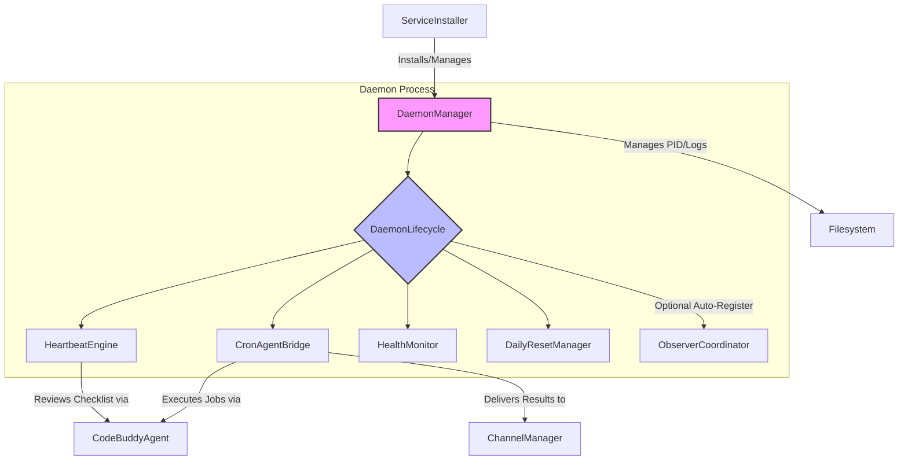

# src — daemon

The `src/daemon` module is the core infrastructure for running the Code Buddy AI assistant as a persistent background process. It provides the necessary components for managing the daemon's lifecycle, scheduling autonomous tasks, monitoring its health, and ensuring session continuity. This module transforms Code Buddy from a command-line utility into a continuously operating AI agent.

## Overall Architecture

The daemon module is built around a set of interconnected managers, each responsible for a specific aspect of the daemon's operation. The `DaemonManager` is the entry point for controlling the daemon process itself (start, stop, restart). Once the daemon process is running, the `DaemonLifecycle` takes over, orchestrating the startup and shutdown of various internal services like the `CronAgentBridge`, `HeartbeatEngine`, `HealthMonitor`, and `DailyResetManager`.

The `ServiceInstaller` provides platform-specific utilities to integrate the daemon as a system service (e.g., `launchd` on macOS, `systemd` on Linux), ensuring it starts automatically and persists across reboots.

## Key Components

### `DaemonManager` (`daemon-manager.ts`)

The `DaemonManager` is the primary interface for controlling the Code Buddy daemon process. It handles the low-level details of starting, stopping, and restarting the daemon, including managing PID files and logging.

**Purpose:**
*   Start the daemon as a detached background process or in the foreground.
*   Stop a running daemon process.
*   Manage the daemon's PID file (`~/.codebuddy/daemon/codebuddy.pid`) to track its status.
*   Direct daemon logs to a dedicated file (`~/.codebuddy/daemon/codebuddy.log`).
*   Implement auto-restart logic for resilience against crashes.

**Key Methods:**
*   `start(detach: boolean)`: Initiates the daemon process. If `detach` is true, it forks a child process and detaches it; otherwise, it runs in the foreground.
*   `stop()`: Sends a `SIGTERM` to the daemon process identified by the PID file, gracefully shutting it down.
*   `restart()`: Stops and then restarts the daemon.
*   `status()`: Returns the current `DaemonStatus`, including PID, uptime, and restart count.
*   `logs(lines: number)`: Retrieves the last `n` lines from the daemon's log file.
*   `attemptAutoRestart()`: Called internally (e.g., by `HealthMonitor` or the main CLI entry point) to restart the daemon if it crashes, up to `maxRestarts`.

**Integration:**
*   Used by the Code Buddy CLI (`commands/cli/daemon-commands.ts`) to control the daemon.
*   Relies on Node.js `child_process` for process management and `fs/promises` for file operations.

### `DaemonLifecycle` (`daemon-lifecycle.ts`)

The `DaemonLifecycle` orchestrates the startup and shutdown of the various *internal services* that comprise the Code Buddy daemon. It ensures services are started and stopped in a defined order and performs periodic health checks.

**Purpose:**
*   Register daemon services that adhere to the `DaemonService` interface.
*   Start all registered services in a specified order.
*   Stop all registered services in reverse order, with a configurable timeout.
*   Periodically run health checks on all services and emit events if a service becomes unhealthy.
*   Conditionally auto-register the `ObserverCoordinator` service if event triggers are configured.

**Key Methods:**
*   `registerService(service: DaemonService)`: Adds a service to the lifecycle manager.
*   `startAll()`: Iterates through registered services and calls their `start()` method.
*   `stopAll()`: Iterates through registered services in reverse order and calls their `stop()` method.
*   `autoRegisterObserver()`: Checks for existing event triggers and, if found, registers the `ObserverCoordinator` as a daemon service.
*   `getAllStatus()`: Returns the status of all registered services.

**Integration:**
*   The main daemon entry point (e.g., `src/index.ts` when run in daemon mode) instantiates and uses `DaemonLifecycle` to manage its components.
*   Depends on the `DaemonService` interface, which services like `CronAgentBridge`, `HeartbeatEngine`, and `HealthMonitor` implement.
*   Lazy-loads `EventTriggerManager`, `TriggerRegistry`, `ScreenObserver`, and `ObserverCoordinator` from `src/agent/observer` if the observer is auto-registered.

### `CronAgentBridge` (`cron-agent-bridge.ts`)

The `CronAgentBridge` acts as the execution engine for scheduled tasks defined in the `CronScheduler`. It bridges the gap between a scheduled `CronJob` and the `CodeBuddyAgent` responsible for executing AI-driven tasks.

**Purpose:**
*   Provide a task executor function to the `CronScheduler`.
*   Execute different types of cron jobs: `message`, `tool`, and `agent` tasks.
*   Instantiate a `CodeBuddyAgent` for each job execution, configured with appropriate API keys, models, and tool round limits.
*   Handle session binding for cron jobs, allowing them to resume existing agent sessions.
*   Deliver job results to configured webhooks or communication channels.
*   Manage active jobs and allow for their cancellation.

**Key Methods:**
*   `createTaskExecutor()`: Returns an `async (job: CronJob) => Promise<unknown>` function that the `CronScheduler` can use.
*   `executeJob(job: CronJob)`: The core method that dispatches to `executeMessageTask`, `executeToolTask`, or `executeAgentTask` based on `job.task.type`.
*   `executeMessageTask(job: CronJob)`: Creates a `CodeBuddyAgent`, optionally loads a session, and processes the job's message.
*   `deliverResult(job: CronJob, output: string)`: Sends the job's output to a `webhookUrl` or a specified `channel` using the `ChannelManager`.

**Integration:**
*   Consumes `CronJob` and `JobRun` types from `../scheduler/cron-scheduler.js`.
*   Lazy-loads and instantiates `CodeBuddyAgent` from `../agent/codebuddy-agent.js`.
*   Lazy-loads `getChannelManager` from `../channels/index.js` for result delivery.
*   Emits `job:start`, `job:complete`, and `job:error` events for monitoring.

### `DailyResetManager` (`daily-reset.ts`)

Advanced enterprise architecture for context boundary management, the `DailyResetManager` automatically resets the conversation context of agent sessions at a configurable time each day.

**Purpose:**
*   Prevent unbounded context growth in long-running agent sessions.
*   Clear in-memory conversation history (messages array) and cached tool selection results.
*   Preserve durable facts (`MEMORY.md`), task checklists (`HEARTBEAT.md`), and other persistent files.
*   Post a summary message to the conversation log after a reset for intelligibility.

**Key Methods:**
*   `start()`: Schedules the first daily reset.
*   `stop()`: Clears the scheduled timer.
*   `msUntilNextReset()`: Calculates the time until the next scheduled reset.
*   `runReset(messages: Array<{ role: string; content: string | null }>, systemMessage?: { role: string; content: string })`: Performs the actual reset by clearing the `messages` array in-place and optionally re-injecting a system message and a summary.

**Integration:**
*   Intended to be integrated with `CodeBuddyAgent` instances to manage their internal message history.
*   Emits a `reset` event when a daily reset occurs.

### `HeartbeatEngine` (`heartbeat.ts`)

The `HeartbeatEngine` provides a periodic "wake-up" mechanism for the daemon, similar to Native Engine's heartbeat system. It reads a `HEARTBEAT.md` checklist and uses a `CodeBuddyAgent` to review it, prompting the agent to take action if necessary.

**Purpose:**
*   Periodically review a `HEARTBEAT.md` file to ensure ongoing tasks or checks are addressed.
*   Operate only within configurable "active hours."
*   Implement a "smart suppression" mechanism: if the agent's response contains a `suppressionKeyword` (e.g., `HEARTBEAT_OK`), the heartbeat is suppressed for a few cycles, preventing repetitive checks when nothing needs attention.
*   Force a full review after a maximum number of consecutive suppressions.

**Key Methods:**
*   `start()`: Initiates the heartbeat timer.
*   `stop()`: Halts the heartbeat timer.
*   `tick()`: The core logic for a single heartbeat cycle: reads `HEARTBEAT.md`, calls `executeAgentReview`, and processes the agent's response.
*   `isWithinActiveHours()`: Checks if the current time falls within the configured active hours, considering the specified timezone.
*   `executeAgentReview(checklistContent: string)`: Lazy-loads and instantiates a `CodeBuddyAgent` to process the heartbeat checklist.

**Integration:**
*   Reads `HEARTBEAT.md` from the filesystem.
*   Lazy-loads and instantiates `CodeBuddyAgent` from `../agent/codebuddy-agent.js` for AI review.
*   Emits `heartbeat:wake`, `heartbeat:result`, `heartbeat:suppressed`, `heartbeat:error`, and `heartbeat:suppression-limit` events.

### `HealthMonitor` (`health-monitor.ts`)

The `HealthMonitor` continuously tracks the daemon's operational health, including system resources (CPU, memory) and the health status of registered services. It can trigger auto-recovery actions if critical thresholds are breached.

**Purpose:**
*   Periodically collect system metrics (CPU load, memory usage).
*   Allow other daemon services to register their own health checks.
*   Emit `warning` or `critical` events if resource usage exceeds configured thresholds.
*   Detect "stale" periods where no events have been recorded, indicating potential unresponsiveness.
*   Trigger `recovery-needed` events if unhealthy conditions persist, potentially leading to daemon restarts.
*   Provide a health summary for API endpoints.

**Key Methods:**
*   `start()`: Begins the periodic health checks.
*   `stop()`: Halts the health checks.
*   `check()`: Collects current metrics, runs registered service checks, and evaluates thresholds.
*   `registerServiceCheck(name: string, check: () => boolean)`: Allows a service to provide a simple boolean health check function.
*   `recordEvent()`: Resets the internal timer used for stale event detection.
*   `getHealthSummary()`: Returns a concise health status for external queries (e.g., a `/health` API endpoint).

**Integration:**
*   Uses Node.js `os` module for system-level metrics.
*   Emits various events (`warning`, `critical`, `service:unhealthy`, `recovery-needed`, `max-restarts-exceeded`, `stale`, `check`) that can be listened to by the `DaemonManager` for auto-recovery.
*   The `DaemonLifecycle` can register its own services' health checks with the `HealthMonitor`.

### `ServiceInstaller` (`service-installer.ts`)

The `ServiceInstaller` provides platform-specific logic to install and uninstall the Code Buddy daemon as a persistent system service. This ensures the daemon starts automatically on system boot and runs continuously in the background.

**Purpose:**
*   Abstract away the complexities of system service management across different operating systems.
*   Support macOS (`launchd`), Linux (`systemd`), and Windows (Task Scheduler).
*   Generate and manage configuration files (e.g., `.plist` for `launchd`, `.service` for `systemd`).
*   Provide methods to check the installation and running status of the service.

**Key Methods:**
*   `install()`: Detects the current OS and calls the appropriate platform-specific installation method (`installLaunchd`, `installSystemd`, `installWindows`).
*   `uninstall()`: Removes the installed system service.
*   `status()`: Checks if the service is installed and currently running.
*   `installLaunchd()`, `uninstallLaunchd()`: macOS-specific logic for `launchd` agents.
*   `installSystemd()`, `uninstallSystemd()`: Linux-specific logic for `systemd` user services.
*   `installWindows()`, `uninstallWindows()`: Windows-specific logic for Task Scheduler.

**Integration:**
*   Used by the Code Buddy CLI (`commands/cli/daemon-commands.ts`) when the `--install-daemon` flag is provided.
*   Relies on Node.js `child_process.execSync` to run system commands (e.g., `launchctl`, `systemctl`, `schtasks`).
*   Uses `fs/promises` for writing service configuration files.

## Singleton Pattern

All major manager classes within the `src/daemon` module (`DaemonManager`, `DaemonLifecycle`, `CronAgentBridge`, `DailyResetManager`, `HeartbeatEngine`, `HealthMonitor`, `ServiceInstaller`) implement a singleton pattern. This means that only one instance of each manager can exist at any given time within the application's runtime.

*   **`get[ManagerName](config?: Partial<Config>)`**: This function is the primary way to access an instance of a manager. If an instance doesn't exist, it creates one with the provided configuration. Subsequent calls return the same instance.
*   **`reset[ManagerName]()`**: This function is primarily used in testing to clear the singleton instance, allowing tests to create fresh instances with different configurations. In production, it's generally not called.

This pattern simplifies global access to these core daemon services and ensures consistent state management.

## Integration Points

The `src/daemon` module is central to Code Buddy's autonomous operation and integrates with several other parts of the codebase:

*   **`src/utils/logger.js`**: All daemon components extensively use the shared logger for consistent output and debugging.
*   **`src/scheduler/cron-scheduler.js`**: The `CronAgentBridge` provides the task execution logic for jobs defined in the `CronScheduler`.
*   **`src/agent/codebuddy-agent.js`**: Both `CronAgentBridge` and `HeartbeatEngine` lazy-load and instantiate `CodeBuddyAgent` to perform AI-driven tasks, such as processing messages, executing tools, or reviewing checklists.
*   **`src/channels/index.js`**: The `CronAgentBridge` uses the `ChannelManager` to deliver job results to various communication channels (e.g., Telegram, Slack).
*   **`src/agent/observer/`**: The `DaemonLifecycle` can dynamically register the `ObserverCoordinator` if event triggers are configured, linking the daemon to screen observation capabilities.
*   **`src/server/index.ts`**: The HTTP API server (`createApp`) integrates with `DaemonManager`, `HealthMonitor`, and `HeartbeatEngine` to provide status endpoints and control mechanisms.
*   **`commands/cli/`**: The command-line interface uses `DaemonManager` and `ServiceInstaller` to allow users to start, stop, restart, and install the daemon.

## Usage and Contribution Notes

*   **Configuration:** Most daemon components are configurable via their constructor, often accepting partial configuration objects that merge with sensible defaults. When using the singleton `getManager()` functions, ensure the initial call provides the necessary configuration.
*   **Event-Driven:** Many components emit events (e.g., `job:complete`, `heartbeat:result`, `service:unhealthy`). Developers contributing to or extending the daemon should leverage these events for monitoring, logging, or triggering further actions.
*   **Lazy Loading:** `CronAgentBridge` and `HeartbeatEngine` lazy-load `CodeBuddyAgent` and `ChannelManager` to avoid circular dependencies and reduce initial startup overhead. Follow this pattern for new dependencies where appropriate.
*   **Platform Specifics:** When contributing to `ServiceInstaller`, be mindful of platform-specific commands and file paths. Thorough testing on each supported OS is crucial.
*   **Error Handling:** The daemon components are designed for resilience. Pay attention to error handling, especially in long-running processes and external interactions (e.g., network requests, file system operations).
*   **Testing:** The singleton pattern requires `resetManager()` calls in tests to ensure isolation between test cases. Refer to existing test files (e.g., `tests/daemon/daemon-manager.test.ts`) for examples.