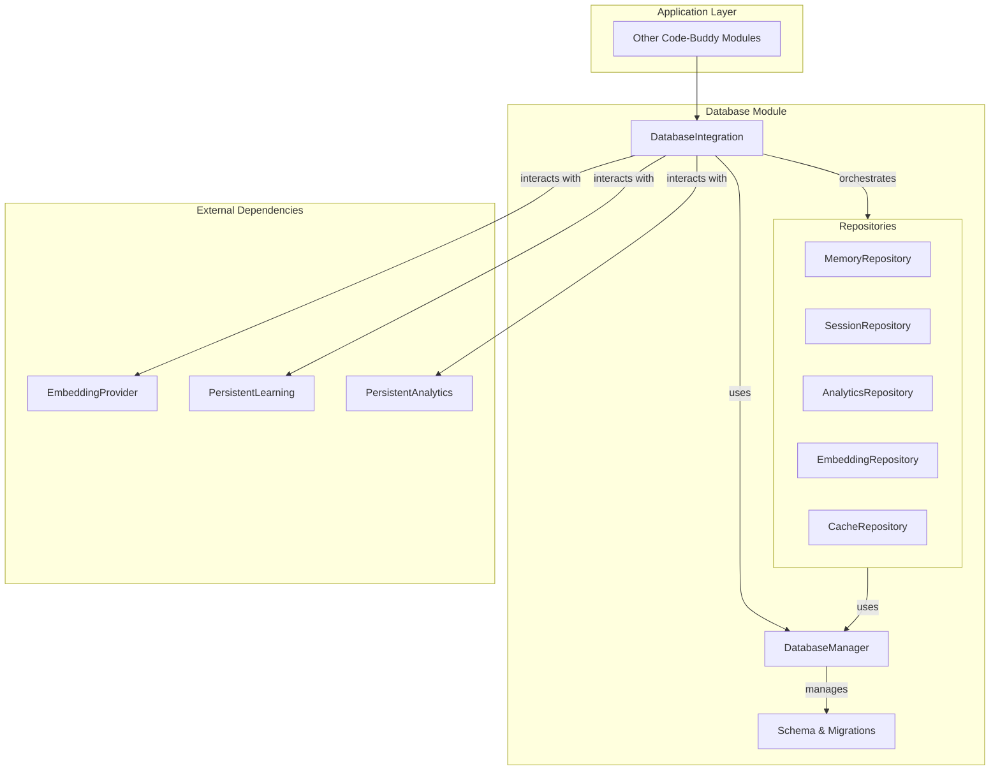

# src — database

The `src/database` module is the core persistence layer for Code-Buddy, providing robust and efficient data storage using SQLite. It manages the database connection, schema, migrations, and offers a structured way to interact with various data entities like memories, sessions, code embeddings, analytics, and a general-purpose cache.

This documentation aims to provide developers with a comprehensive understanding of the module's architecture, key components, and how to effectively use and contribute to it.

---

## 1. Module Overview

The `src/database` module centralizes all data storage for Code-Buddy. It replaces previous file-based JSON storage with a single, transactional SQLite database, offering improved performance, data integrity, and query capabilities.

**Key Features:**

*   **Centralized Database Management:** Handles SQLite connection, configuration, and lifecycle.
*   **Schema Management & Migrations:** Defines the database schema and provides a mechanism to migrate existing data from older versions or file-based storage.
*   **Structured Data Access (Repositories):** Provides dedicated repository classes for different data domains (Memories, Sessions, Embeddings, Analytics, Cache), abstracting raw SQL operations.
*   **Semantic Search Capabilities:** Stores and queries vector embeddings for memories and code chunks.
*   **Usage Analytics & Learning:** Tracks tool usage, repair attempts, and overall system analytics.
*   **High-Level Integration Layer:** Offers a simplified facade (`DatabaseIntegration`) for common database operations, often combining logic from multiple repositories and external services.
*   **Singleton Pattern:** Ensures a single instance of the `DatabaseManager` and each repository throughout the application lifecycle.

---

## 2. Architecture

The database module is structured in layers, promoting separation of concerns and maintainability.



**Explanation of Layers:**

*   **`DatabaseManager`:** The foundational layer. It's responsible for establishing and managing the SQLite connection, running schema migrations, and providing the raw `better-sqlite3` database instance to repositories. It also handles global database operations like `vacuum` and `backup`.
*   **`schema.ts`:** Defines the database tables, indices, and TypeScript interfaces for all data entities. It also contains the SQL scripts for schema creation and migrations.
*   **Repositories:** These classes (`MemoryRepository`, `SessionRepository`, etc.) encapsulate the business logic for interacting with specific tables. They perform CRUD operations, complex queries, and data transformations (e.g., serializing/deserializing embeddings and JSON metadata). Each repository obtains its database instance from the `DatabaseManager`.
*   **`DatabaseIntegration`:** This is a high-level facade designed to simplify common database interactions for other parts of the application. It often combines operations from multiple repositories and integrates with external services like the `EmbeddingProvider`, `PersistentLearning`, and `PersistentAnalytics` to provide a unified API for complex workflows (e.g., adding a memory with an embedding, or searching code).
*   **`migration.ts`:** A utility module specifically for migrating data from older Code-Buddy storage formats (JSON files) into the new SQLite database. It uses the `DatabaseManager` and repositories to perform these operations.
*   **`index.ts`:** The public entry point for the module, re-exporting all public classes, types, and singleton accessors. It also provides convenience functions like `initializeDatabaseSystem` and `resetDatabaseSystem`.

---

## 3. Key Components

### 3.1. `DatabaseManager` (`src/database/database-manager.ts`)

The `DatabaseManager` is the central hub for all database operations. It's a singleton class that ensures only one connection to the SQLite database is active at any time.

**Responsibilities:**

*   **Connection Management:** Opens and closes the `better-sqlite3` database connection.
*   **Configuration:** Accepts `DatabaseConfig` (e.g., `dbPath`, `inMemory`, `walMode`, `verbose`) to customize database behavior. Defaults to `~/.codebuddy/codebuddy.db`.
*   **Schema & Migrations:** Automatically runs `runMigrations()` during `initialize()` to ensure the database schema is up-to-date.
*   **Performance Optimizations:** Applies `PRAGMA` settings like `journal_mode = WAL`, `synchronous = NORMAL`, `cache_size`, and `temp_store` for better performance.
*   **Raw Access:** Provides direct access to the `better-sqlite3` instance via `getDatabase()` for advanced use cases or repository implementations.
*   **Utility Operations:** Offers methods for `exec`, `prepare`, `transaction`, `vacuum`, `backup`, and `clearAll` (dangerous!).
*   **Statistics:** `getDatabaseStats()` provides insights into database size, table counts, and data volumes.
*   **Event Emitter:** Extends `TypedEventEmitter<DatabaseEvents>` to emit lifecycle events like `db:initialized`, `db:error`, `db:migration`, `db:closed`, etc.

**Usage:**

```typescript
import { getDatabaseManager, initializeDatabase } from './database-manager.js';

async function setupDatabase() {
  const dbManager = await initializeDatabase({ inMemory: true }); // Or specify dbPath
  console.log('Database initialized:', dbManager.isInitialized());

  const stats = dbManager.getDatabaseStats();
  console.log(dbManager.formatStats());

  // Get the raw database instance for direct queries (use with caution)
  const db = dbManager.getDatabase();
  db.exec('CREATE TABLE IF NOT EXISTS test (id INTEGER PRIMARY KEY)');

  dbManager.close();
}
```

### 3.2. `schema.ts`

This file defines the entire database schema using SQL `CREATE TABLE` statements and corresponding TypeScript interfaces. It's the single source of truth for the database structure.

**Key Contents:**

*   **`SCHEMA_VERSION`:** A constant indicating the current version of the database schema.
*   **`SCHEMA_SQL`:** A multi-line string containing all `CREATE TABLE` and `CREATE INDEX` statements for the initial schema.
*   **`MIGRATIONS`:** An object mapping schema versions to their respective SQL migration scripts. This allows for incremental schema updates.
*   **TypeScript Interfaces:**
    *   `Memory`, `MemoryType`
    *   `Session`, `Message`
    *   `CodeEmbedding`
    *   `ToolStats`
    *   `RepairLearning`
    *   `Analytics`
    *   `Convention`
    *   `Checkpoint`, `CheckpointFile`
    *   These interfaces ensure type safety when interacting with database entities.

**Contribution Note:** When adding new tables or modifying existing ones, update `SCHEMA_VERSION`, add a new entry to `MIGRATIONS` with the necessary `ALTER TABLE` or `CREATE TABLE` statements, and update/add corresponding TypeScript interfaces.

### 3.3. `DatabaseMigration` (`src/database/migration.ts`)

The `DatabaseMigration` class is responsible for migrating data from Code-Buddy's legacy JSON file-based storage to the new SQLite database. This is a critical step for users upgrading from older versions.

**Responsibilities:**

*   **Detecting Legacy Data:** `needsMigration()` and `getMigrationStatus()` check for the existence of old JSON files (memories.json, sessions/, semantic-cache.json, cost-history.json).
*   **Data Transformation:** Reads old JSON data, transforms it into the new database schema format, and inserts it into the respective repositories.
*   **Progress & Error Reporting:** Emits `progress` and `complete` events, and collects errors during the migration process.
*   **Cleanup:** Optionally renames old JSON files to `.migrated` after successful migration.

**Migration Flow:**

1.  `initializeDatabaseIntegration()` (or `initializeDatabaseSystem()`) calls `needsMigration()`.
2.  If migration is needed, `runMigration()` is invoked.
3.  `DatabaseMigration.migrate()` orchestrates the migration of:
    *   `memories.json` (user scope)
    *   `sessions/` directory (individual session files)
    *   `cache/semantic-cache.json`
    *   `cost-history.json` (analytics)
4.  Each migration step uses the appropriate repository (`MemoryRepository`, `SessionRepository`, etc.) to insert the data.

**Usage:**

```typescript
import { needsMigration, runMigration, getMigrationStatus } from './migration.js';

async function performMigrationIfNeeded() {
  if (needsMigration()) {
    console.log('Legacy data detected. Starting migration...');
    const status = getMigrationStatus();
    console.log('Files to migrate:', status.files.filter(f => f.exists).map(f => f.path));

    const migrationResult = await runMigration({ verbose: true, deleteAfterMigration: true });
    if (migrationResult.success) {
      console.log('Migration complete:', migrationResult.migratedItems);
    } else {
      console.error('Migration failed:', migrationResult.errors);
    }
  } else {
    console.log('No migration needed.');
  }
}
```

### 3.4. Repositories (`src/database/repositories/`)

The `repositories` directory contains specialized classes for interacting with specific data entities. Each repository provides a clear API for CRUD operations and domain-specific queries. They all depend on `DatabaseManager` to get the underlying `better-sqlite3` instance.

**Common Patterns:**

*   **Constructor:** Takes an optional `Database.Database` instance, defaulting to `getDatabaseManager().getDatabase()`.
*   **Singleton:** Each repository has a `get...Repository()` function and `reset...Repository()` for testing.
*   **Serialization/Deserialization:** Handles conversion of complex types (e.g., `Float32Array` for embeddings, `Record<string, unknown>` for metadata) to/from SQLite's `BLOB` or `TEXT` (JSON) types.

#### 3.4.1. `MemoryRepository` (`memory-repository.ts`)

Manages `Memory` entities, which represent persistent knowledge.

*   **`create(memory)`:** Adds a new memory. Handles `ON CONFLICT` to update importance and access count if content already exists.
*   **`getById(id)`:** Retrieves a memory by its ID, updating access stats.
*   **`find(filter)`:** Searches memories based on `type`, `scope`, `projectId`, `minImportance`, `limit`, and `offset`.
*   **`searchSimilar(embedding, filter, topK)`:** Performs semantic search using cosine similarity against stored embeddings.
*   **`update(id, updates)`:** Modifies an existing memory.
*   **`delete(id)`:** Removes a memory.
*   **`deleteExpired()`:** Cleans up memories past their `expires_at` date.
*   **`getStats()`:** Provides statistics on memory count, types, and importance.

#### 3.4.2. `SessionRepository` (`session-repository.ts`)

Manages `Session` and `Message` entities, representing conversation history.

*   **`createSession(session)`:** Creates a new conversation session.
*   **`getSessionById(id)`:** Retrieves a session.
*   **`getSessionWithMessages(id)`:** Retrieves a session along with all its messages.
*   **`findSessions(filter)`:** Searches sessions based on `projectId`, `isArchived`, `model`, and pagination options.
*   **`updateSessionStats(id, stats)`:** Increments token counts, cost, and tool call counts for a session.
*   **`setArchived(id, archived)`:** Archives or unarchives a session.
*   **`deleteSession(id)`:** Deletes a session and its associated messages (due to `ON DELETE CASCADE`).
*   **`addMessage(message)`:** Adds a message to a session, updating the session's `message_count`.
*   **`getMessages(sessionId, limit)`:** Retrieves messages for a given session.
*   **`getRecentMessages(sessionId, limit)`:** Retrieves the most recent messages for context.
*   **`deleteMessages(sessionId, fromId)`:** Deletes messages from a session, optionally from a specific message ID onwards.
*   **`getStats()`:** Provides statistics on total sessions, messages, costs, and tokens.
*   **`getCostByModel()`:** Summarizes costs per model used.

#### 3.4.3. `AnalyticsRepository` (`analytics-repository.ts`)

Manages `Analytics`, `ToolStats`, and `RepairLearning` entities, tracking usage and learning.

*   **`recordAnalytics(data)`:** Records daily aggregated analytics (tokens, cost, requests, errors, etc.). Uses `ON CONFLICT` to update existing daily records.
*   **`getAnalytics(filter)`:** Retrieves analytics records.
*   **`getDailySummary(days)`:** Provides a summary of daily usage over a period.
*   **`getTotalCost(filter)`:** Calculates total cost for a given period/project.
*   **`recordToolUsage(toolName, success, timeMs, cacheHit, projectId)`:** Records statistics for tool invocations. Uses `ON CONFLICT` to update existing tool stats.
*   **`getToolStats(projectId)`:** Retrieves tool usage statistics.
*   **`getTopTools(limit)`:** Identifies most used tools.
*   **`recordRepairAttempt(errorPattern, errorType, strategy, success, attempts, options)`:** Records outcomes of repair attempts, learning which strategies work for specific error patterns.
*   **`getBestStrategies(errorPattern, filter, limit)`:** Recommends repair strategies based on past success rates.
*   **`getRepairStats()`:** Provides overall statistics on repair learning.
*   **`deleteOldAnalytics(daysToKeep)`:** Cleans up old analytics data.
*   **`resetStats()`:** Clears all analytics and tool stats (for testing/reset).

#### 3.4.4. `EmbeddingRepository` (`embedding-repository.ts`)

Manages `CodeEmbedding` entities, specifically for indexing and searching code.

*   **`upsert(embedding)`:** Creates or updates a code embedding based on `project_id`, `file_path`, and `chunk_index`.
*   **`bulkUpsert(embeddings)`:** Efficiently inserts/updates multiple embeddings within a transaction.
*   **`getById(id)`:** Retrieves an embedding by its ID.
*   **`find(filter)`:** Searches embeddings based on `projectId`, `filePath`, `symbolType`, `symbolName`, and `language`.
*   **`searchSimilar(queryEmbedding, filter, topK)`:** Performs semantic search for code chunks using cosine similarity.
*   **`searchBySymbol(symbolName, filter, limit)`:** Searches for code chunks by symbol name.
*   **`deleteForFile(projectId, filePath)`:** Removes all embeddings associated with a specific file.
*   **`deleteForProject(projectId)`:** Removes all embeddings for an entire project.
*   **`deleteStale(projectId, existingFiles)`:** Deletes embeddings for files that no longer exist in a project.
*   **`needsReindex(projectId, filePath, contentHash)`:** Checks if a file's content has changed, indicating a need for re-embedding.
*   **`getStats(projectId)`:** Provides statistics on total embeddings, files, and distribution by language/symbol type.

#### 3.4.5. `CacheRepository` (`cache-repository.ts`)

Provides a general-purpose key-value cache with optional Time-To-Live (TTL) and semantic search capabilities.

*   **`get<T>(key)`:** Retrieves a cached value, updating its hit count. Returns `null` if expired or not found.
*   **`set<T>(key, value, options)`:** Stores a value with an optional `ttlMs`, `category`, and `embedding`.
*   **`getOrCompute<T>(key, computeFn, options)`:** Retrieves from cache or computes and stores if not found/expired.
*   **`delete(key)`:** Removes a specific cache entry.
*   **`deleteByPattern(pattern)`:** Deletes entries whose keys match a string pattern or RegExp.
*   **`deleteByCategory(category)`:** Deletes all entries belonging to a specific category.
*   **`deleteExpired()`:** Cleans up all expired cache entries.
*   **`clear()`:** Empties the entire cache.
*   **`has(key)`:** Checks if a non-expired key exists.
*   **`keys(filter)`:** Returns all active cache keys, optionally filtered by category.
*   **`searchSimilar(queryEmbedding, category, topK)`:** Performs semantic search within the cache for entries with embeddings.
*   **`getStats()`:** Provides statistics on cache size, hits, and category distribution.
*   **`getSizeEstimate()`:** Estimates the total size of cached data in bytes.

### 3.5. `DatabaseIntegration` (`src/database/integration.ts`)

The `DatabaseIntegration` class acts as a high-level facade, simplifying interactions with the database system for other parts of Code-Buddy. It orchestrates calls to multiple repositories and integrates with external modules.

**Responsibilities:**

*   **Orchestrated Initialization:** Its `initialize()` method handles:
    *   Initializing the `DatabaseManager`.
    *   Running migrations if `autoMigrate` is enabled.
    *   Initializing the `EmbeddingProvider`.
*   **Unified API:** Provides methods that often combine logic from several underlying repositories. For example:
    *   `addMemory()`: Creates a memory and optionally generates its embedding using `EmbeddingProvider`.
    *   `searchMemories()`: Can perform both keyword and semantic search (using `EmbeddingProvider` and `MemoryRepository`).
    *   `createSession()`: Creates a session and records it in `PersistentAnalytics`.
    *   `updateSessionStats()`: Updates session stats and records analytics.
    *   `indexCodeChunk()`: Generates an embedding for a code chunk and stores it in `EmbeddingRepository`.
    *   `getOrComputeCached()`: Uses `CacheRepository` to retrieve or compute a value.
*   **External Module Integration:** Directly interacts with `EmbeddingProvider`, `PersistentLearning`, and `PersistentAnalytics` to provide a seamless experience.
*   **Event Emitter:** Emits `initialized`, `migration:starting`, `migration:complete`, and `warning` events.

**Usage:**

```typescript
import { getDatabaseIntegration, initializeDatabaseIntegration } from './integration.js';

async function useDatabaseIntegration() {
  const dbIntegration = await initializeDatabaseIntegration({
    dbPath: './my-codebuddy.db',
    autoMigrate: true,
    embeddingProvider: 'local',
  });

  // Memory operations
  const memory = await dbIntegration.addMemory('How to write a good commit message', {
    type: 'instruction',
    generateEmbedding: true,
  });
  const searchResults = await dbIntegration.searchMemories('commit best practices', { semantic: true, limit: 3 });

  // Session operations
  const session = dbIntegration.createSession({ name: 'Refactoring session' });
  dbIntegration.addMessage(session.id, 'user', 'Refactor this code...');

  // Cache operations
  const cachedValue = await dbIntegration.getOrComputeCached('my_expensive_computation', async () => {
    // Simulate expensive computation
    await new Promise(resolve => setTimeout(resolve, 100));
    return { data: 'computed result' };
  }, 60000); // Cache for 1 minute

  // Code embedding operations
  await dbIntegration.indexCodeChunk('my-project-id', 'src/main.ts', 0, 'function foo() { ... }', {
    symbolType: 'function',
    symbolName: 'foo',
  });

  console.log(dbIntegration.formatStats());
}
```

---

## 4. Usage Patterns

### 4.1. Initializing the Database System

The recommended way to initialize the entire database system is through the `initializeDatabaseSystem` function from `src/database/index.ts`. This ensures the `DatabaseManager` is set up, and all repositories are ready.

```typescript
import { initializeDatabaseSystem } from '../database/index.js';

async function startApp() {
  await initializeDatabaseSystem({
    dbPath: process.env.CODEBUDDY_DB_PATH || undefined,
    inMemory: process.env.NODE_ENV === 'test',
    verbose: process.env.DEBUG_DB === 'true',
  });
  console.log('Database system ready.');
  // Now you can safely access repositories or DatabaseIntegration
}
```

### 4.2. Accessing Repositories

Once initialized, you can get singleton instances of any repository:

```typescript
import { getMemoryRepository, getSessionRepository } from '../database/index.js';

const memoryRepo = getMemoryRepository();
const sessionRepo = getSessionRepository();

const memories = memoryRepo.find({ type: 'fact' });
const sessions = sessionRepo.getRecentSessions(5);
```

### 4.3. Using `DatabaseIntegration`

For higher-level operations that might span multiple data types or involve external services (like embedding generation), use `DatabaseIntegration`:

```typescript
import { getDatabaseIntegration } from '../database/index.js';

const dbIntegration = getDatabaseIntegration(); // Assumes initializeDatabaseSystem was called

async function performComplexOperation() {
  const query = 'how to handle errors in async functions';
  const searchResults = await dbIntegration.searchMemories(query, { semantic: true, limit: 5 });
  console.log('Semantic memory search results:', searchResults);

  await dbIntegration.recordToolUsage('code_fixer', true, 1500, false, 'my-project-id');
}
```

### 4.4. Resetting for Testing

For unit and integration tests, it's crucial to reset the database state between tests. The module provides `resetDatabaseSystem()` for this purpose.

```typescript
import { initializeDatabaseSystem, resetDatabaseSystem } from '../database/index.js';

describe('Database tests', () => {
  beforeEach(async () => {
    // Ensure a clean in-memory database for each test
    await initializeDatabaseSystem({ inMemory: true });
  });

  afterEach(() => {
    resetDatabaseSystem(); // Clears all singletons and closes DB
  });

  test('should add and retrieve a memory', async () => {
    const dbIntegration = getDatabaseIntegration();
    const memory = await dbIntegration.addMemory('Test content', { type: 'fact' });
    expect(memory.content).toBe('Test content');
  });
});
```

---

## 5. Data Model (Schema)

The `src/database/schema.ts` file defines the following key tables:

*   **`schema_version`**: Tracks the current database schema version.
*   **`memories`**: Stores persistent memories (facts, preferences, patterns, etc.) with optional vector embeddings, importance, and access statistics.
*   **`sessions`**: Stores conversation sessions, including project context, model used, and aggregated cost/token statistics.
*   **`messages`**: Stores individual messages within a session, linked by `session_id`.
*   **`code_embeddings`**: Stores vector embeddings for code chunks, along with file path, symbol information, and content hash for change detection.
*   **`tool_stats`**: Tracks usage, success/failure rates, and performance of various tools.
*   **`repair_learning`**: Stores learned strategies for fixing specific error patterns, including success rates and examples.
*   **`analytics`**: Aggregates daily usage statistics (cost, tokens, requests) per project and model.
*   **`conventions`**: (Future/Planned) Stores learned coding conventions.
*   **`checkpoints`**: (Future/Planned) Stores metadata for project checkpoints.
*   **`checkpoint_files`**: (Future/Planned) Stores individual file contents for checkpoints.
*   **`cache`**: A general-purpose key-value cache with TTL and optional embeddings for semantic caching.

All tables include `created_at` and `updated_at` timestamps where appropriate, and many use `TEXT` fields for JSON storage of `metadata`. Embeddings are stored as `BLOB` (binary data) and deserialized into `Float32Array` by the repositories.

---

## 6. Integration Points

The `src/database` module is a foundational component, integrated across various parts of the Code-Buddy application:

*   **`src/embeddings/`**: The `DatabaseIntegration` and `EmbeddingRepository` directly interact with the `EmbeddingProvider` to generate and store vector embeddings.
*   **`src/learning/`**: `DatabaseIntegration` and `AnalyticsRepository` are used by `PersistentLearning` to record repair attempts and tool usage.
*   **`src/analytics/`**: `DatabaseIntegration` and `AnalyticsRepository` are used by `PersistentAnalytics` to record session costs, tokens, and other usage metrics.
*   **`src/memory/prospective-memory.ts`**: Uses `DatabaseManager` and potentially `MemoryRepository` for managing tasks, goals, and reminders.
*   **`src/utils/graceful-shutdown.ts`**: Registers a shutdown handler to ensure `DatabaseManager.close()` is called cleanly.
*   **`server/routes/health.ts`**: Uses `DatabaseManager` to check the database connection status for health checks.
*   **`agent/specialized/sql-agent.ts`**: May use `DatabaseManager.transaction()` or `exec()` for direct SQL operations.
*   **`commands/handlers/export-handlers.ts`**: Uses `SessionRepository` to export session data.

---

## 7. Contributing

When contributing to the `src/database` module, keep the following guidelines in mind:

1.  **Schema Changes:**
    *   If you need to modify the database schema (add a table, add a column, change a column type), **do not directly modify `SCHEMA_SQL`**.
    *   Increment `SCHEMA_VERSION` in `src/database/schema.ts`.
    *   Add a new entry to the `MIGRATIONS` object with the SQL statements for your changes.
    *   Update or create new TypeScript interfaces in `schema.ts` to reflect the new structure.
    *   Ensure your migration script is idempotent (can be run multiple times without error) if possible, though `better-sqlite3` handles `IF NOT EXISTS` well.
    *   Consider the impact on existing data and write appropriate `ALTER TABLE` statements.

2.  **Repository Logic:**
    *   All database interactions for a specific entity should be encapsulated within its dedicated repository.
    *   Avoid direct `db.prepare().run()` calls outside of repository methods.
    *   Handle serialization/deserialization of complex types (embeddings, JSON) within the repository.
    *   Write comprehensive unit tests for all new or modified repository methods.

3.  **`DatabaseIntegration`:**
    *   Use `DatabaseIntegration` for high-level workflows that combine operations from multiple repositories or external services.
    *   Avoid adding simple CRUD methods to `DatabaseIntegration` if they can be directly accessed via a single repository.
    *   Ensure `DatabaseIntegration` methods are robust and handle potential errors from underlying services (e.g., embedding provider failures).

4.  **Singleton Access:**
    *   Always use the `get...Manager()` or `get...Repository()` functions to obtain instances. Do not directly `new` up these classes in application code (except within the `get` functions themselves).
    *   For testing, use `reset...Manager()` or `reset...Repository()` in `afterEach` hooks to ensure a clean state.

5.  **Error Handling:**
    *   Database operations can fail. Ensure proper `try...catch` blocks, especially in `initialize()` and migration logic.
    *   Emit relevant events (e.g., `db:error`) for critical failures.

By adhering to these guidelines, we can maintain a robust, scalable, and easy-to-understand database layer for Code-Buddy.