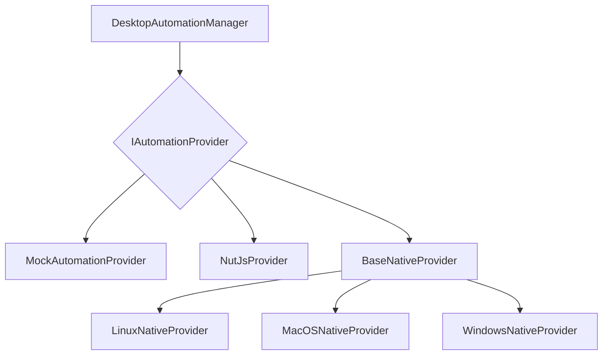

# src — desktop-automation

The `src/desktop-automation` module provides a robust, cross-platform interface for interacting with the desktop environment. It abstracts away the complexities of different operating systems and underlying automation tools, offering a unified API for controlling the mouse, keyboard, windows, applications, screen, and clipboard.

Inspired by projects like Native Engine, this module also integrates higher-level desktop capabilities such as permission management, system control, smart UI element snapshots, and screen recording.

## 1. Module Overview

The primary goal of this module is to enable programmatic control over a desktop environment, making it suitable for building automation scripts, testing tools, or intelligent agents that interact with graphical user interfaces. It achieves this through a flexible provider-based architecture, allowing different backends (native OS tools, third-party libraries, or mocks) to be swapped out seamlessly.

**Key Features:**

*   **Unified API:** A single interface for common desktop actions across macOS, Windows, and Linux.
*   **Pluggable Providers:** Supports multiple automation backends, including platform-native tools (e.g., `xdotool` on Linux, `osascript` on macOS), the `nut.js` library, and a `MockAutomationProvider` for testing.
*   **Safety Mechanisms:** Includes configurable fail-safe triggers and action delays to prevent runaway automation.
*   **Eventing:** Emits events for key automation actions (e.g., mouse moves, key presses).
*   **Extended Capabilities:** Integrates modules for permission management, system control, smart UI element detection, and screen recording.

## 2. Architecture

The module employs a **Provider Pattern** to achieve platform independence and extensibility. The central `DesktopAutomationManager` class acts as a facade, delegating all actual desktop interaction logic to an underlying `IAutomationProvider` implementation.



1.  **`IAutomationProvider`**: An interface defining all the core desktop automation methods (mouse, keyboard, windows, apps, screen, clipboard).
2.  **`DesktopAutomationManager`**: The main entry point for consumers. It selects and manages the active `IAutomationProvider`, applies global configuration (like safety settings), and emits events.
3.  **Concrete Providers**: Implement `IAutomationProvider` using different technologies:
    *   **`MockAutomationProvider`**: An in-memory implementation for testing and development without actual desktop interaction.
    *   **`NutJsProvider`**: Leverages the `@nut-tree-fork/nut-js` library for cross-platform automation.
    *   **`BaseNativeProvider`**: An abstract class providing common utilities for platform-specific native implementations.
    *   **`LinuxNativeProvider`**: Uses Linux CLI tools like `xdotool`, `xclip`, `wmctrl`, `xrandr`.
    *   **`MacOSNativeProvider`**: Uses AppleScript (`osascript`), `cliclick`, `pbpaste`/`pbcopy`, and `system_profiler`.
    *   **`WindowsNativeProvider`**: (Referenced in `automation-manager.ts`) Would typically use PowerShell or Win32 APIs.

## 3. Key Components

### 3.1. `DesktopAutomationManager`

This is the primary class for interacting with the desktop automation features. It's an `EventEmitter` and manages the lifecycle and configuration of the underlying automation provider.

**Core Responsibilities:**

*   **Provider Selection:** During `initialize()`, it attempts to load and use the preferred provider from its configuration (`config.provider`), falling back to others (e.g., `mock`) if the preferred one is unavailable. It can dynamically create native providers based on `process.platform`.
*   **Safety Features:** Implements `checkSafety()` (fail-safe corner detection) and `enforceDelay()` (minimum action delay) before executing most automation actions.
*   **Event Emission:** Emits events like `mouse-move`, `mouse-click`, `key-press`, `key-type`, `window-focus`, `window-change`, `app-launch`, `app-close`, and `fail-safe`.
*   **Unified API:** Exposes all methods defined in `IAutomationProvider`, adding safety checks and eventing.
*   **Window Utilities:** Provides convenience methods like `findWindow` and `waitForWindow`.

**Key Methods:**

*   `initialize()`: Initializes the manager and selects an active provider.
*   `shutdown()`: Shuts down the active provider.
*   `registerProvider(provider: IAutomationProvider)`: Adds a new provider implementation.
*   `getMousePosition()`, `moveMouse()`, `click()`, `type()`, `hotkey()`, `getActiveWindow()`, `launchApp()`, `getClipboard()`: Core automation actions.
*   `findWindow(titleOrProcess: string | RegExp)`: Searches for a window by title or process name.
*   `waitForWindow(titleOrProcess: string | RegExp, timeoutMs?: number, pollIntervalMs?: number)`: Waits for a window to appear.
*   `getConfig()`, `updateConfig()`: Manages the module's configuration.

### 3.2. `IAutomationProvider` and Concrete Implementations

The `IAutomationProvider` interface defines the contract for all automation backends. Each concrete provider implements these methods using platform-specific APIs or libraries.

**`MockAutomationProvider`**
*   **Purpose:** Provides a simulated desktop environment for testing and development. It doesn't interact with the actual OS.
*   **Capabilities:** Supports all core automation features in a mocked fashion.
*   **Usage:** Automatically registered and used as a fallback if no other provider is available.

**`BaseNativeProvider`**
*   **Purpose:** An abstract class that provides common utilities for platform-native providers.
*   **Utilities:**
    *   `exec(cmd: string, timeout?: number)`: Executes a shell command asynchronously.
    *   `execSync(cmd: string, timeout?: number)`: Executes a shell command synchronously.
    *   `checkTool(name: string)`: Checks if a CLI tool is available on the system (e.g., `xdotool`, `osascript`).
    *   `delay(ms: number)`: A simple promise-based delay.

**`LinuxNativeProvider`**
*   **Purpose:** Provides desktop automation on Linux (primarily X11) using standard CLI tools.
*   **Dependencies:** Relies on `xdotool`, `xclip`/`xsel`, `wmctrl`, `xrandr`. These must be installed on the system.
*   **Limitations:** Color picking is not supported. Wayland support is limited and relies on portal permissions.

**`MacOSNativeProvider`**
*   **Purpose:** Provides desktop automation on macOS using AppleScript (`osascript`) and other utilities.
*   **Dependencies:** Uses `osascript` (built-in), `cliclick` (recommended for mouse control, can be installed via Homebrew), `pbpaste`/`pbcopy` (built-in).
*   **Limitations:** Color picking requires screenshot analysis (not directly implemented here). Drag operations require `cliclick`.

**`NutJsProvider`**
*   **Purpose:** Provides desktop automation using the `@nut-tree-fork/nut-js` library, which offers a cross-platform abstraction.
*   **Dependencies:** Requires `@nut-tree-fork/nut-js` to be installed.
*   **Limitations:** Has limited support for application management and advanced window operations compared to native providers. Horizontal scrolling is not directly supported. Includes a headless mock for testing environments.

### 3.3. Enterprise-grade Modules

These modules extend the desktop automation capabilities beyond basic input/output, providing higher-level services. They are exported alongside the core `DesktopAutomationManager` but operate independently.

**`PermissionManager`**
*   **Purpose:** Manages platform-specific permissions required for sensitive desktop operations (e.g., screen recording, accessibility, camera, microphone).
*   **Features:**
    *   `check(permission: PermissionType)`: Determines the status of a given permission.
    *   `request(permission: PermissionType)`: Attempts to open system settings to prompt the user for permission.
    *   `ensurePermission(permission: PermissionType, action: () => Promise<void>)`: Ensures a permission is granted before executing an action, throwing a `PermissionError` if not.
    *   Provides platform-specific instructions for granting permissions.
*   **Platforms:** Supports macOS (TCC framework), Linux (checking for tools/groups), and Windows (checking registry/PowerShell).

**`SystemControl`**
*   **Purpose:** Provides methods for controlling system-level features like volume, brightness, power, and retrieving system information.
*   **Features:**
    *   `getVolume()`, `setVolume()`, `mute()`: Audio control.
    *   `getBrightness()`, `setBrightness()`: Display brightness control.
    *   `sendNotification()`: Displays system notifications.
    *   `power(action: PowerAction)`: System power actions (shutdown, restart, sleep).
    *   `getSystemInfo()`, `getBattery()`, `getNetworkStatus()`, `getDisplays()`: Retrieves various system details.
*   **Platforms:** Implements logic for macOS, Linux, and Windows using platform-specific commands.

**`SmartSnapshotManager`**
*   **Purpose:** Designed for intelligent UI element detection and interaction, often used in conjunction with visual automation.
*   **Features:**
    *   `getCurrentSnapshot()`: Captures the current screen state and identifies UI elements.
    *   `detectOCRElements()`: Uses OCR to find text-based elements.
    *   `detectMacOSElements()`: (Mocked in source) Would use macOS accessibility APIs.
    *   `injectBrowserElements()`: (Mocked in source) Would integrate with browser automation to get DOM elements.
    *   `findElement(query: string, options?: FindElementOptions)`: Locates a specific UI element.
*   **Dependencies:** Relies on `src/tools/screenshot-tool.ts` for screen capture and `src/tools/ocr-tool.ts` for text extraction.

**`ScreenRecorder`**
*   **Purpose:** Provides functionality to record the desktop screen.
*   **Features:**
    *   `startRecording()`, `stopRecording()`, `pauseRecording()`, `resumeRecording()`: Controls the recording process.
    *   Supports various output formats (`mp4`, `webm`, `gif`) and video codecs.
    *   Can capture audio.
*   **Dependencies:** Relies on `ffmpeg` (must be installed on the system) for actual recording. Uses `PermissionManager` to ensure screen recording permissions are granted.
*   **Platforms:** Implements logic for macOS, Linux, and Windows, adapting `ffmpeg` commands for each.

## 4. Usage

To use the desktop automation features, obtain an instance of `DesktopAutomationManager` via the singleton helper:

```typescript
import { getDesktopAutomation, KeyCode, MouseButton } from './desktop-automation/index.js';

async function runAutomation() {
  const automation = getDesktopAutomation();

  try {
    await automation.initialize();
    console.log('Automation manager initialized with provider:', automation.getProvider()?.name);

    // Mouse actions
    await automation.moveMouse(100, 100);
    await automation.click();
    await automation.rightClick(150, 150);

    // Keyboard actions
    await automation.type('Hello, world!');
    await automation.keyPress(KeyCode.Enter);
    await automation.hotkey(KeyCode.Control, KeyCode.C); // Ctrl+C

    // Window actions
    const activeWindow = await automation.getActiveWindow();
    if (activeWindow) {
      console.log('Active window:', activeWindow.title);
      await automation.minimizeWindow(activeWindow.handle);
      await automation.delay(1000);
      await automation.restoreWindow(activeWindow.handle);
    }

    // Application actions
    const app = await automation.launchApp('/Applications/Calculator.app'); // macOS example
    console.log('Launched app:', app.name, 'PID:', app.pid);
    await automation.delay(2000);
    if (app.pid) {
      await automation.closeApp(app.pid);
    }

    // Clipboard
    await automation.copyText('This is copied text.');
    const clipboardText = await automation.getClipboardText();
    console.log('Clipboard content:', clipboardText);

  } catch (error) {
    console.error('Automation failed:', error);
  } finally {
    await automation.shutdown();
  }
}

runAutomation();
```

## 5. Extensibility

### 5.1. Adding a New Automation Provider

To add support for a new automation backend (e.g., a different library or a new native toolset):

1.  **Create a new class** that implements the `IAutomationProvider` interface.
2.  **Implement all methods** defined in `IAutomationProvider`, translating them to the new backend's API.
3.  **Register the provider** with the `DesktopAutomationManager` using `registerProvider()`.

```typescript
import { IAutomationProvider, DesktopAutomationManager } from './desktop-automation/automation-manager.js';
import { AutomationProvider, ProviderCapabilities, MousePosition } from './desktop-automation/types.js';

class MyCustomProvider implements IAutomationProvider {
  readonly name: AutomationProvider = 'my-custom-provider';
  readonly capabilities: ProviderCapabilities = { /* ... */ };

  async initialize(): Promise<void> { /* ... */ }
  async shutdown(): Promise<void> { /* ... */ }
  async isAvailable(): Promise<boolean> { return true; }
  async getMousePosition(): Promise<MousePosition> { return { x: 0, y: 0 }; }
  // ... implement all other IAutomationProvider methods
}

const automation = getDesktopAutomation();
automation.registerProvider(new MyCustomProvider());
// Configure the manager to prefer this provider
automation.updateConfig({ provider: 'my-custom-provider' });
```

### 5.2. Extending Native Providers

For platform-native providers, extend `BaseNativeProvider` to leverage its `exec`, `execSync`, and `checkTool` utilities.

## 6. Safety Features

The `DesktopAutomationManager` includes built-in safety mechanisms to prevent unintended or runaway automation:

*   **Fail-Safe:** If `config.safety.failSafe` is enabled, moving the mouse cursor to a predefined screen corner (`config.safety.failSafeCorner`) will immediately stop all automation and throw a `FailSafeTriggered` error. This provides an emergency stop mechanism.
*   **Minimum Action Delay:** `config.safety.minActionDelay` enforces a minimum delay between automation actions. If an action is requested too quickly, the manager will pause until the minimum delay has passed. This helps prevent overwhelming the system and makes automation more human-like.

These features are applied automatically by the `DesktopAutomationManager` before delegating actions to the underlying provider.

## 7. Eventing

`DesktopAutomationManager` extends `EventEmitter` and emits events for significant automation actions. Developers can subscribe to these events to monitor or react to automation progress.

**Example Events:**

*   `'mouse-move', (position: MousePosition)`
*   `'mouse-click', (position: MousePosition, button: MouseButton)`
*   `'key-press', (key: KeyCode, modifiers: ModifierKey[])`
*   `'key-type', (text: string)`
*   `'window-focus', (window: WindowInfo)`
*   `'app-launch', (app: AppInfo)`
*   `'fail-safe'`

```typescript
automation.on('mouse-move', (pos) => console.log('Mouse moved to', pos));
automation.on('fail-safe', () => console.warn('Fail-safe activated!'));
```

## 8. Integration Points

The `desktop-automation` module is a foundational component, integrated across various parts of the codebase:

*   **Testing:** Heavily used in unit and integration tests (`tests/desktop-automation/*.test.ts`) to verify automation logic and provider implementations.
*   **Tools:**
    *   `src/tools/screenshot-tool.ts`: May use `DesktopAutomationManager` for screen interaction.
    *   `src/tools/ocr-tool.ts`: Used by `SmartSnapshotManager` for text recognition.
    *   `src/tools/clipboard-tool.ts`: Interacts with the clipboard via `BaseNativeProvider`'s `execSync`.
    *   `src/tools/computer-control-tool.ts`: Leverages `SystemControl` for system-level actions.
    *   `src/tools/process-tool.ts`: `closeApp` in native providers uses `process.kill`.
*   **Intelligence & Suggestions:** `src/intelligence/proactive-suggestions.ts` uses `BaseNativeProvider.execSync` for `git status` checks.
*   **Daemon & Services:** `src/daemon/service-installer.ts` uses `BaseNativeProvider.execSync` for system service installation.
*   **Configuration & Validation:** `config-validator.test.ts` uses `PermissionManager.formatResult`.
*   **Browser Automation:** `src/browser/controller.ts` might interact with the clipboard via `NutJsProvider`.

## 9. Contributing

When contributing to the `desktop-automation` module:

*   **Adhere to `IAutomationProvider`:** If adding a new provider, ensure it fully implements the interface.
*   **Platform-Specific Logic:** Encapsulate platform-specific code within the respective native provider classes. Use `BaseNativeProvider` utilities where possible.
*   **Error Handling:** Implement robust error handling, especially when interacting with external CLI tools or native APIs.
*   **Testing:** Write comprehensive tests for new features and ensure existing tests pass. The `MockAutomationProvider` is invaluable for rapid testing without actual desktop interaction.
*   **Permissions:** If your feature requires new system permissions, integrate with the `PermissionManager` to check and request them.
*   **Safety:** Be mindful of the safety implications of desktop automation. Consider how your changes interact with the fail-safe and delay mechanisms.
*   **CLI Tool Availability:** For native providers, gracefully handle cases where required CLI tools are not installed, providing clear error messages or fallback behavior.