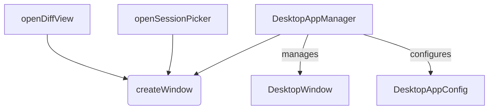

# src — desktop

The `src/desktop/desktop-app.ts` module provides the foundational scaffold for Code Buddy's desktop application experience. It abstracts away the underlying desktop framework (supporting both Electron and Tauri) to offer a consistent API for managing application windows, configuration, and lifecycle events.

This module is crucial for enabling Code Buddy to run as a native desktop application, handling aspects like multi-window support, platform-specific installer configurations, and integration with core features like diff viewing and session management.

## Core Concepts

The module revolves around two key interfaces and one central class:

### `DesktopAppConfig`

This interface defines the global configuration for the desktop application. It dictates fundamental behaviors and platform specifics.

```typescript
interface DesktopAppConfig {
  platform: 'darwin' | 'win32' | 'linux'; // The operating system platform
  framework: 'electron' | 'tauri';       // The desktop framework in use
  autoUpdate: boolean;                   // Whether auto-updates are enabled
  multiWindow: boolean;                  // Allows multiple application windows
  cloudIntegration: boolean;             // Indicates integration with cloud services
}
```

### `DesktopWindow`

This interface represents a single desktop window managed by the application. It captures essential properties for identifying and managing individual windows.

```typescript
interface DesktopWindow {
  id: string;                            // Unique identifier for the window
  title: string;                         // Title displayed in the window's title bar
  sessionId?: string;                   // Optional session ID if linked to a Code Buddy session
  type: 'main' | 'diff' | 'settings' | 'session-picker'; // The purpose of the window
  bounds: { x: number; y: number; width: number; height: number }; // Position and size
  focused: boolean;                      // True if this window is currently focused
}
```

## `DesktopAppManager` Class

The `DesktopAppManager` is the central class responsible for initializing the desktop application, creating and managing windows, and providing framework-agnostic configuration.

### Initialization

The `DesktopAppManager` is instantiated with an optional `DesktopAppConfig`. If not provided, it defaults to `electron` framework, `multiWindow` enabled, and `autoUpdate` enabled, inferring the platform from `process.platform`.

```typescript
import { DesktopAppManager } from './desktop-app.ts';

const appManager = new DesktopAppManager({
  framework: 'electron',
  multiWindow: true,
  autoUpdate: true,
});
```

### Window Lifecycle Management

The manager provides a comprehensive set of methods for creating, retrieving, and closing windows.

#### `createWindow(type: DesktopWindow['type'], options?: Partial<DesktopWindow>): DesktopWindow`

This is the primary method for creating new desktop windows.
-   It assigns a unique ID and a default title based on the `type`.
-   If `multiWindow` is disabled in the `DesktopAppConfig`, it will throw an error if an attempt is made to create a non-'main' window when one already exists.
-   Crucially, calling `createWindow` automatically unfocuses all existing windows and sets the newly created window as focused.

#### `getWindow(id: string): DesktopWindow | null`

Retrieves a `DesktopWindow` object by its unique ID. Returns `null` if no window with the given ID exists.

#### `listWindows(): DesktopWindow[]`

Returns an array of all currently managed `DesktopWindow` objects.

#### `closeWindow(id: string): boolean`

Removes a window from the manager's tracking. Returns `true` if the window was found and closed, `false` otherwise.

#### `focusWindow(id: string): boolean`

Sets the specified window as focused, unfocusing all other windows. Returns `true` if the window was found and focused, `false` otherwise.

### Specialized Window Creation

For common application flows, the manager provides convenience methods that internally leverage `createWindow`.

#### `openDiffView(sessionId: string, files: string[]): DesktopWindow`

Creates a new window specifically for displaying a diff viewer. It sets the window type to `'diff'` and includes the associated `sessionId` and a descriptive title.

#### `openSessionPicker(): DesktopWindow`

Creates a new window for the session picker interface, setting its type to `'session-picker'`.

### Application Configuration & Status

Methods to query the application's configuration and status.

#### `getInstallerConfig(): Record<string, unknown>`

Returns a configuration object tailored for desktop application installers (e.g., Electron Builder or Tauri Bundler). This method dynamically adjusts the configuration based on the `framework` specified in `DesktopAppConfig`.

#### `getPlatform(): string`

Returns the configured platform (e.g., `'darwin'`, `'win32'`, `'linux'`).

#### `isDesktopAvailable(): boolean`

Checks if a desktop framework (Electron or Tauri) is configured, indicating that the application is intended to run in a desktop environment.

#### `getWindowCount(): number`

Returns the total number of windows currently managed by the `DesktopAppManager`.

## Architecture & Relationships

The `DesktopAppManager` acts as the central orchestrator for desktop windows. Specialized window creation methods (`openDiffView`, `openSessionPicker`) delegate to the generic `createWindow` method, ensuring consistent window management logic.



## Integration Points

This module is primarily consumed by the desktop application's main process to manage its UI. Its public API is also extensively used in tests (e.g., `cloud-lsp-ide.test.ts`) to simulate and verify desktop application behavior, such as window creation, listing, and configuration retrieval.

Developers contributing to the desktop experience will interact with `DesktopAppManager` to:
-   Launch new windows for specific features.
-   Query the state of existing windows.
-   Configure desktop-specific settings like auto-updates or multi-window behavior.
-   Retrieve framework-specific build configurations.

This module provides a clean separation between the core application logic and the specifics of the chosen desktop framework, making it easier to maintain and potentially switch frameworks in the future.