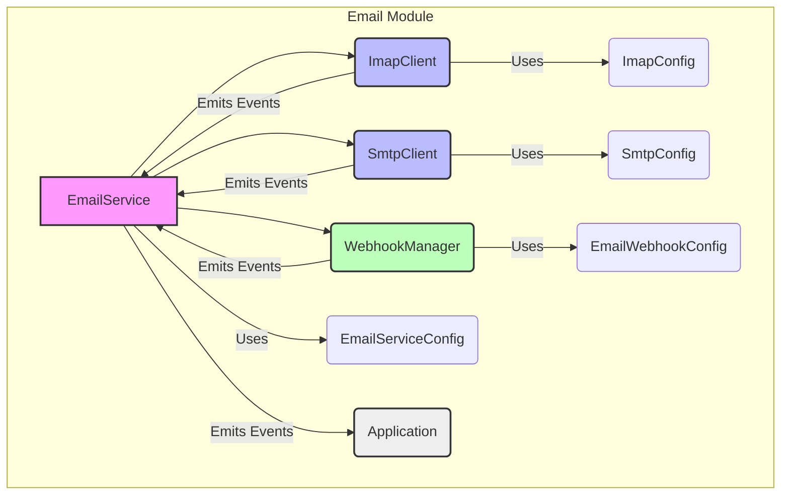

# src — email

The `src/email` module provides a comprehensive, unified interface for email integration, encompassing IMAP (Internet Message Access Protocol) for receiving, SMTP (Simple Mail Transfer Protocol) for sending, and webhook functionality for event notifications. It is designed to abstract away the complexities of interacting with different email protocols and services, offering a consistent API for developers.

**Important Note on Implementation:** The `ImapClient` and `SmtpClient` within this module are **mock implementations**. They simulate email server behavior for development and testing purposes without requiring actual external email services or libraries. In a production environment, these clients would be replaced or integrated with robust third-party libraries like `nodemailer` for SMTP and `node-imap` for IMAP.

## Module Architecture

The module is structured into three main parts:

1.  **Types (`src/email/types.ts`)**: Defines all data structures and configurations used across the email system.
2.  **Clients (`src/email/client.ts`)**: Provides low-level, protocol-specific (IMAP/SMTP) client functionalities. These are the mock implementations.
3.  **Service (`src/email/service.ts`)**: Offers a high-level, unified API that orchestrates the IMAP and SMTP clients, manages webhooks, and handles polling/syncing. It follows a singleton pattern for easy access throughout the application.



## Core Concepts and Types (`src/email/types.ts`)

This file defines the foundational interfaces and types that govern data exchange and configuration within the email module.

### Key Types

*   **`EmailAddress`**: Represents an email recipient or sender, e.g., `{ name?: string; address: string; }`.
*   **`EmailMessage`**: A comprehensive interface for an email, including `from`, `to`, `subject`, `date`, `text`, `html`, `attachments`, `flags`, `messageId`, etc.
*   **`EmailFlag`**: A union type for standard IMAP message flags like `'seen'`, `'answered'`, `'flagged'`, `'deleted'`, `'draft'`, `'recent'`.
*   **`EmailFolder`**: Describes an email folder with properties like `name`, `path`, `delimiter`, `specialUse`, `totalMessages`, `unseenMessages`.
*   **`ImapConfig`**: Configuration for the IMAP client, including `host`, `port`, `secure`, `user`, `password`, `oauth2`.
*   **`SmtpConfig`**: Configuration for the SMTP client, similar to `ImapConfig` but with SMTP-specific options like `pool`.
*   **`ImapSearchCriteria`**: Defines the criteria for searching IMAP messages (e.g., `seen`, `unseen`, `from`, `subject`, `before`, `uid`).
*   **`SendMailOptions`**: Options for sending an email via SMTP, including `from`, `to`, `subject`, `text`, `html`, `attachments`.
*   **`SendMailResult`**: The result object returned after sending an email, containing `messageId`, `accepted`, `rejected` recipients.
*   **`EmailWebhookConfig`**: Configuration for a webhook, specifying `url`, `secret`, `events` to subscribe to, `retries`, and `timeout`.
*   **`EmailWebhookEvent`**: A union type for events that can trigger webhooks, such as `'message.received'`, `'message.sent'`, `'folder.created'`.
*   **`EmailWebhookPayload`**: The structure of the data sent in a webhook request.
*   **`EmailServiceConfig`**: The top-level configuration for the `EmailService`, allowing setup of IMAP, SMTP, Gmail (future), and webhooks.
*   **`EmailServiceStats`**: Provides runtime statistics for the `EmailService`.

### Default Configurations

The module exports `DEFAULT_IMAP_CONFIG` and `DEFAULT_SMTP_CONFIG` to provide sensible defaults for common settings like ports and security.

## Client Implementations (`src/email/client.ts`)

This file contains the mock implementations of the IMAP and SMTP clients, along with general email utility functions.

### Utility Functions

*   **`parseEmailAddress(input: string | EmailAddress): EmailAddress`**: Parses a string (e.g., "Name <email@example.com>") or an `EmailAddress` object into a standardized `EmailAddress` object.
*   **`formatEmailAddress(addr: EmailAddress): string`**: Formats an `EmailAddress` object back into a string (e.g., "Name <email@example.com>").
*   **`generateMessageId(domain = 'codebuddy.local'): string`**: Generates a unique `Message-ID` header value, useful for tracking emails.

### `ImapClient` (Mock Implementation)

The `ImapClient` class simulates an IMAP client, allowing operations like connecting, listing folders, selecting folders, searching, fetching messages, managing flags, moving/copying/deleting messages, and entering IDLE mode.

*   **Extends `EventEmitter`**: Emits events for `connected`, `disconnected`, `error`, `mail` (new mail), `expunge` (message deleted), and `flags` (flags changed).
*   **Constructor**: `new ImapClient(config: ImapConfig)` initializes the client with IMAP configuration.
*   **Mock Data**: Internally uses `Map` objects (`mockFolders`, `mockMessages`) to store simulated email folders and messages.
*   **Key Methods**:
    *   `connect()`: Simulates connecting to an IMAP server.
    *   `disconnect()`: Simulates disconnecting.
    *   `listFolders()`: Returns a list of mock `EmailFolder` objects.
    *   `selectFolder(path: string)`: Sets the currently selected folder.
    *   `search(criteria: ImapSearchCriteria)`: Filters mock messages based on criteria and returns UIDs.
    *   `fetch(uids: number | number[])`: Retrieves mock `EmailMessage` objects by UID.
    *   `addFlags(uids: number | number[], flags: EmailFlag | EmailFlag[])`: Adds flags to mock messages.
    *   `move(uids: number | number[], destFolder: string)`: Moves mock messages between folders.
    *   `delete(uids: number | number[], permanent = false)`: Marks messages as deleted or moves them to 'Trash'.
    *   `expunge()`: Permanently removes messages marked as 'deleted' from the current folder.
    *   `idle()`: Simulates IMAP IDLE mode, resolving after a timeout.
    *   `append(folder: string, message: Partial<EmailMessage>)`: Adds a new mock message to a specified folder.
    *   `addMockMessage(folder: string, message: Partial<EmailMessage>)`: A helper for testing to easily inject messages.
*   **Internal Logic**: `matchesCriteria` handles the search logic, and `updateFolderCounts` keeps folder statistics current. `ensureConnected` and `ensureFolderSelected` enforce state.

### `SmtpClient` (Mock Implementation)

The `SmtpClient` class simulates an SMTP client for sending emails.

*   **Extends `EventEmitter`**: Emits events for `connected`, `disconnected`, `error`, and `sent`.
*   **Constructor**: `new SmtpClient(config: SmtpConfig)` initializes the client with SMTP configuration.
*   **Key Methods**:
    *   `connect()`: Simulates connecting to an SMTP server.
    *   `disconnect()`: Simulates disconnecting.
    *   `send(options: SendMailOptions)`: Simulates sending an email, returning a `SendMailResult`. Stores sent messages in `sentMessages` for testing.
    *   `verify()`: Simulates verifying the connection.
    *   `getSentMessages()`: Returns a list of `SendMailResult` for testing.
    *   `clearSentMessages()`: Clears the list of sent messages for testing.

## Service Layer (`src/email/service.ts`)

This file provides the high-level `EmailService` which acts as the primary interface for interacting with email functionalities. It integrates the IMAP and SMTP clients and adds webhook management and polling capabilities.

### `WebhookManager`

Manages the registration, removal, and triggering of webhooks.

*   **Extends `EventEmitter`**: Emits `webhook-sent` and `webhook-failed` events.
*   **Constructor**: `new WebhookManager(webhooks: EmailWebhookConfig[] = [])` initializes with an optional list of webhooks.
*   **Key Methods**:
    *   `addWebhook(webhook: EmailWebhookConfig)`: Adds a new webhook configuration.
    *   `removeWebhook(url: string)`: Removes a webhook by its URL.
    *   `getWebhooks()`: Returns the list of configured webhooks.
    *   `trigger(event: EmailWebhookEvent, data: EmailWebhookPayload['data'])`: Sends webhook requests to all registered webhooks that subscribe to the given `event`. Includes retry logic and signature generation using `crypto`.
    *   `sendWebhook` (private): Handles the actual (simulated) HTTP request for a webhook.

### `EmailService`

The central component of the email module, orchestrating all functionalities.

*   **Extends `EventEmitter`**: Emits `connected`, `disconnected`, `error`, `message` (new message received), `sync` (folder synced), `idle` (IMAP IDLE cycle completed), and forwards `webhook-sent`/`webhook-failed` events from `WebhookManager`.
*   **Constructor**: `new EmailService(config: EmailServiceConfig)` initializes the service with the overall configuration. It creates instances of `ImapClient`, `SmtpClient`, and `WebhookManager` based on the provided config.
*   **State Management**: Tracks connection status, polling intervals, and service statistics.
*   **Key Methods**:
    *   **Lifecycle**:
        *   `connect()`: Initializes and connects to IMAP and SMTP clients. Starts polling if `pollInterval` is configured.
        *   `disconnect()`: Disconnects clients and stops polling.
        *   `isConnected()`: Checks the connection status of configured clients.
    *   **IMAP Operations**: Delegates to `ImapClient`. Many methods accept an optional `folder` argument, calling `imapClient.selectFolder()` internally before performing the operation.
        *   `listFolders()`, `selectFolder(path)`, `search(criteria, folder?)`, `fetchMessages(uids, folder?)`, `fetchMessage(uid, folder?)`.
        *   `markAsRead(uids, folder?)`, `markAsUnread(uids, folder?)`, `flagMessages(uids, flags, folder?)`: Modify message flags. Triggers webhooks for `message.read` and `message.flagged`.
        *   `moveMessages(uids, destFolder, srcFolder?)`, `deleteMessages(uids, folder?, permanent?)`: Manipulate messages. Triggers `message.deleted` webhook.
        *   `createFolder(path)`, `deleteFolder(path)`: Manage folders. Triggers `folder.created` and `folder.deleted` webhooks.
    *   **SMTP Operations**: Delegates to `SmtpClient`.
        *   `sendEmail(options)`: Sends an email. Triggers `message.sent` webhook.
        *   `replyToEmail(originalMessage, options)`: Constructs and sends a reply.
        *   `forwardEmail(originalMessage, options)`: Constructs and sends a forwarded email.
    *   **Webhook Management**: Delegates to `WebhookManager`.
        *   `addWebhook(webhook)`, `removeWebhook(url)`, `getWebhooks()`.
    *   **Sync & Polling**:
        *   `syncFolder(folder = 'INBOX')`: Fetches unseen messages from a folder, emits `message` events, and triggers `message.received` webhooks. Updates `lastSync` stat.
        *   `startPolling(interval?)`, `stopPolling()`: Manages periodic calls to `syncFolder`.
        *   `startIdle()`: Enters IMAP IDLE mode, continuously listening for new mail and syncing.
    *   **Statistics**:
        *   `getStats()`: Returns `EmailServiceStats`.
        *   `resetStats()`: Resets internal statistics.
    *   **Testing Helpers**:
        *   `addMockMessage(folder, message)`: Delegates to `ImapClient` for injecting mock messages.
        *   `getImapClient()`, `getSmtpClient()`: Provides access to the underlying client instances for advanced testing.
*   **Private Methods**: `ensureImapConnected`, `ensureSmtpConnected` enforce connection state. `setupImapListeners` and `setupSmtpListeners` forward client events to the service.

### Singleton Access

The `EmailService` is designed to be accessed as a singleton:

*   **`getEmailService(config?: EmailServiceConfig): EmailService`**:
    *   Returns the single instance of `EmailService`.
    *   If no instance exists and `config` is provided, it initializes the service.
    *   Throws an error if called without `config` when no instance is present.
*   **`resetEmailService(): void`**:
    *   Disconnects the current service instance (if any) and clears the singleton, allowing for re-initialization, particularly useful in testing environments.

## Usage Patterns

### Initialization and Connection

```typescript
import { getEmailService, EmailServiceConfig } from './email/index.js';

const config: EmailServiceConfig = {
  imap: {
    host: 'mock.imap.com',
    port: 993,
    secure: true,
    user: 'test@example.com',
    password: 'password',
  },
  smtp: {
    host: 'mock.smtp.com',
    port: 587,
    secure: false,
    user: 'test@example.com',
    password: 'password',
  },
  webhooks: [
    {
      url: 'https://my-app.com/email-events',
      events: ['message.received', 'message.sent'],
      secret: 'super-secret-key',
    },
  ],
  pollInterval: 30000, // Poll every 30 seconds
};

const emailService = getEmailService(config);

async function startEmailService() {
  try {
    await emailService.connect();
    console.log('Email service connected.');

    emailService.on('message', (message) => {
      console.log(`New message received: ${message.subject} from ${message.from[0].address}`);
    });

    emailService.on('error', (error) => {
      console.error('Email service error:', error);
    });

    emailService.on('webhook-sent', (url, payload) => {
      console.log(`Webhook sent to ${url} for event ${payload.event}`);
    });

  } catch (error) {
    console.error('Failed to connect email service:', error);
  }
}

startEmailService();
```

### Sending an Email

```typescript
import { getEmailService } from './email/index.js';

const emailService = getEmailService(); // Get the existing instance

async function sendTestEmail() {
  try {
    const result = await emailService.sendEmail({
      from: { name: 'My App', address: 'test@example.com' },
      to: 'recipient@example.com',
      subject: 'Hello from Email Service!',
      text: 'This is a test email sent via the Email Service.',
      html: '<b>This is a test email</b> sent via the <i>Email Service</i>.',
    });
    console.log('Email sent successfully:', result.messageId);
  } catch (error) {
    console.error('Failed to send email:', error);
  }
}

sendTestEmail();
```

### Fetching Messages

```typescript
import { getEmailService } from './email/index.js';

const emailService = getEmailService();

async function fetchInboxMessages() {
  try {
    await emailService.selectFolder('INBOX');
    const uids = await emailService.search({ unseen: true });
    console.log(`Found ${uids.length} unseen messages.`);

    if (uids.length > 0) {
      const messages = await emailService.fetchMessages(uids);
      for (const message of messages) {
        console.log(`- Subject: ${message.subject}, From: ${message.from[0].address}`);
        await emailService.markAsRead(message.uid!, 'INBOX');
      }
    }
  } catch (error) {
    console.error('Failed to fetch messages:', error);
  }
}

fetchInboxMessages();
```

## Event Handling

The `EmailService` (and its underlying clients) are `EventEmitter` instances, allowing you to subscribe to various events:

*   **`EmailService` Events**:
    *   `connected`: Fired when all configured clients are successfully connected.
    *   `disconnected`: Fired when all clients are disconnected.
    *   `error(error: Error)`: Fired when an error occurs in any client or service operation.
    *   `message(message: EmailMessage)`: Fired when a new message is received (e.g., during `syncFolder` or `idle`).
    *   `sync(folder: string, count: number)`: Fired after a folder synchronization completes, indicating the number of new messages found.
    *   `idle`: Fired when an IMAP IDLE cycle completes.
    *   `webhook-sent(url: string, payload: EmailWebhookPayload)`: Fired when a webhook request is successfully sent.
    *   `webhook-failed(url: string, payload: EmailWebhookPayload, error: Error)`: Fired when a webhook request fails after retries.

*   **`ImapClient` Events**:
    *   `connected`, `disconnected`, `error(error: Error)`
    *   `mail(numNew: number)`: Indicates new mail in the selected folder.
    *   `expunge(uid: number)`: A message with `uid` has been permanently removed.
    *   `flags(uid: number, flags: EmailFlag[])`: Flags for a message have changed.

*   **`SmtpClient` Events**:
    *   `connected`, `disconnected`, `error(error: Error)`
    *   `sent(result: SendMailResult)`: An email has been sent.

## Extensibility and Real-World Integration

As noted, the `ImapClient` and `SmtpClient` are mock implementations. To transition to a production environment:

1.  **Replace Client Logic**: The `ImapClient` and `SmtpClient` classes would need to be re-implemented to use actual email client libraries (e.g., `node-imap` for IMAP, `nodemailer` for SMTP).
2.  **Maintain Interface**: Crucially, the public API (`connect`, `send`, `fetch`, `search`, etc.) and the emitted events of these client classes should remain consistent to avoid breaking the `EmailService` layer.
3.  **Configuration**: The `ImapConfig` and `SmtpConfig` types are designed to be compatible with common configurations for these libraries, making the transition smoother.
4.  **Gmail Integration**: The `GmailConfig` and related types are placeholders for potential future integration with the Gmail API, which offers a different set of capabilities beyond standard IMAP/SMTP.

This modular design allows the core `EmailService` and `WebhookManager` logic to remain stable while the underlying protocol implementations can be swapped out or enhanced.