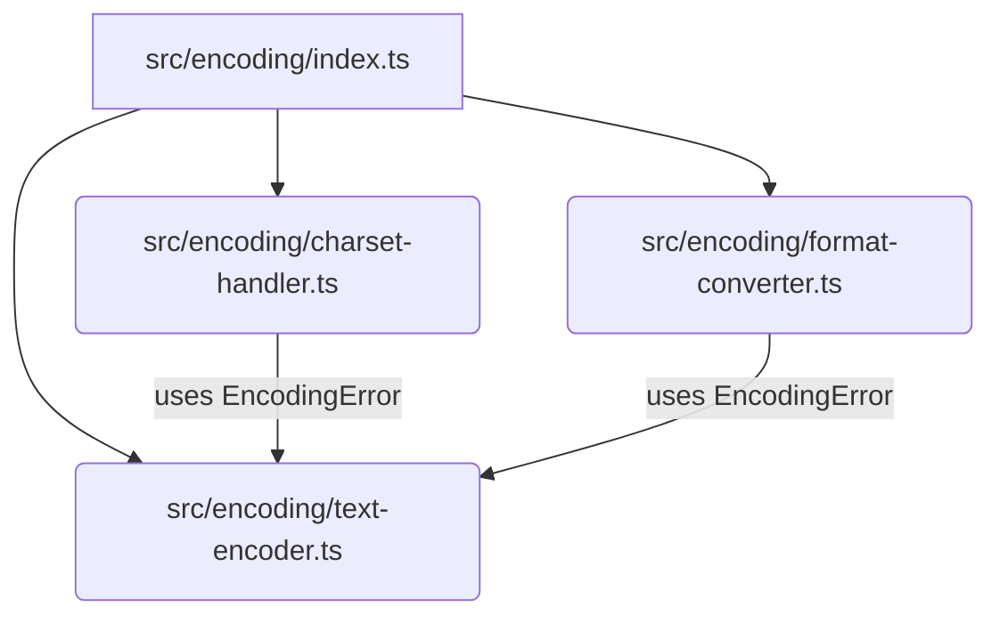

# src — encoding

The `src/encoding` module provides a comprehensive suite of utilities for handling various aspects of text and data encoding, decoding, character set management, and format conversions. It aims to centralize common encoding-related operations, ensuring consistency and robustness across the application.

## Module Structure

The `encoding` module is organized into three primary sub-modules, all re-exported through `src/encoding/index.ts` for a unified public API.



*   **`src/encoding/text-encoder.ts`**: Handles fundamental text encoding and decoding operations (e.g., Base64, Hex, URL, HTML entities, Unicode escapes) and conversions between strings and byte arrays. It also defines the module's custom error class.
*   **`src/encoding/charset-handler.ts`**: Focuses on character set detection, validation, and manipulation, including Byte Order Marks (BOMs), line ending normalization, and character set conversions.
*   **`src/encoding/format-converter.ts`**: Provides utilities for converting between different structured data formats like JSON, XML, CSV, YAML, and URL query strings.

## Core Concepts

### `EncodingError`

All functions within the `encoding` module throw instances of `EncodingError` when encountering invalid input, unsupported formats, or conversion failures. This custom error class, defined in `text-encoder.ts`, allows for specific error handling related to encoding operations.

```typescript
export class EncodingError extends Error {
  constructor(message: string) {
    super(message);
    this.name = 'EncodingError';
  }
}
```

### Character Set Names

The `charset-handler.ts` module defines a `CharsetName` type to standardize the character sets supported for detection and conversion:

```typescript
export type CharsetName = 'utf-8' | 'utf-16' | 'utf-16le' | 'utf-16be' | 'ascii' | 'latin1' | 'iso-8859-1';
```

## Sub-modules in Detail

### `text-encoder.ts` — Text Encoding and Decoding Primitives

This sub-module provides foundational utilities for converting strings to and from various common encoding formats. It leverages native browser/Node.js APIs like `TextEncoder`, `TextDecoder`, `btoa`, and `atob` where appropriate.

**Key Functions:**

*   **`encodeBase64(input: string): string`**
    *   Encodes a string to a standard Base64 string. Handles Unicode characters by first encoding to UTF-8 bytes.
*   **`decodeBase64(input: string): string`**
    *   Decodes a Base64 string back to its original string representation. Includes validation for Base64 format.
*   **`encodeBase64Url(input: string): string`**
    *   Encodes a string to a URL-safe Base64 string, replacing `+` with `-`, `/` with `_`, and removing padding. Internally calls `encodeBase64`.
*   **`decodeBase64Url(input: string): string`**
    *   Decodes a URL-safe Base64 string. Re-introduces padding and converts to standard Base64 before calling `decodeBase64`.
*   **`encodeHex(input: string): string`**
    *   Encodes a string into its hexadecimal representation (UTF-8 bytes).
*   **`decodeHex(input: string): string`**
    *   Decodes a hexadecimal string back to its original string. Validates for correct hex format and even length.
*   **`encodeURL(input: string): string`**
    *   Performs URL encoding using `encodeURIComponent`.
*   **`decodeURL(input: string): string`**
    *   Performs URL decoding using `decodeURIComponent`.
*   **`encodeHTMLEntities(input: string): string`**
    *   Converts common HTML special characters (`&`, `<`, `>`, `"`, `'`) into their respective HTML entities.
*   **`decodeHTMLEntities(input: string): string`**
    *   Decodes common HTML named and numeric entities back to their characters.
*   **`stringToBytes(input: string, encoding: 'utf-8' | 'utf-16' | 'ascii' = 'utf-8'): Uint8Array`**
    *   Converts a string into a `Uint8Array` based on the specified encoding. Throws `EncodingError` if characters cannot be represented in the target encoding (e.g., non-ASCII characters for `'ascii'`).
*   **`bytesToString(bytes: Uint8Array, encoding: 'utf-8' | 'utf-16' | 'ascii' = 'utf-8'): string`**
    *   Converts a `Uint8Array` back into a string using the specified encoding. Throws `EncodingError` for invalid byte sequences.
*   **`escapeUnicode(input: string): string`**
    *   Replaces non-ASCII Unicode characters with `\uXXXX` or `\uXXXX\uXXXX` escape sequences.
*   **`unescapeUnicode(input: string): string`**
    *   Converts `\uXXXX` Unicode escape sequences back to their corresponding characters.

### `charset-handler.ts` — Character Set and Line Ending Utilities

This sub-module provides tools for identifying, validating, and manipulating character sets and line endings within text data.

**Key Functions:**

*   **`detectCharset(bytes: Uint8Array): CharsetInfo`**
    *   Analyzes a `Uint8Array` to determine its likely character set (`CharsetName`), a confidence score, and whether a Byte Order Mark (BOM) was detected. It prioritizes BOMs, then UTF-8 validity, then ASCII, and finally Latin-1.
*   **`isAscii(input: string): boolean`**
    *   Checks if a string contains only ASCII characters (code points 0-127).
*   **`isPrintableAscii(input: string): boolean`**
    *   Checks if a string contains only printable ASCII characters (code points 32-126), allowing for common whitespace (tab, newline, carriage return).
*   **`isValidUtf8(bytes: Uint8Array): boolean`**
    *   Validates if a `Uint8Array` represents a correctly formed UTF-8 sequence, including checks for overlong encodings.
*   **`removeBOM(bytes: Uint8Array): Uint8Array`**
    *   Removes a detected UTF-8, UTF-16 LE, or UTF-16 BE Byte Order Mark from the beginning of a `Uint8Array`.
*   **`addUtf8BOM(bytes: Uint8Array): Uint8Array`**
    *   Prepends a UTF-8 BOM to a `Uint8Array` if one is not already present.
*   **`normalizeLineEndings(input: string, format: 'lf' | 'crlf' | 'cr' = 'lf'): string`**
    *   Converts all line endings (`\r\n`, `\r`, `\n`) in a string to a specified target format (`'lf'`, `'crlf'`, or `'cr'`).
*   **`detectLineEndings(input: string): 'lf' | 'crlf' | 'cr' | 'mixed' | 'none'`**
    *   Analyzes a string to determine the predominant line ending format used. Returns `'mixed'` if multiple formats are present, or `'none'` if no line endings are found.
*   **`convertCharset(input: string | Uint8Array, fromCharset: CharsetName, toCharset: CharsetName): string`**
    *   Converts text from a source character set to a target character set. If the input is a `Uint8Array`, it's first decoded using `TextDecoder`. If the target charset is ASCII or Latin-1, it validates character representability.
*   **`getByteLength(input: string, charset: CharsetName = 'utf-8'): number`**
    *   Calculates the byte length of a string when encoded in a specific character set. Throws `EncodingError` if characters cannot be represented in the target charset.
*   **`sanitizeForCharset(input: string, charset: CharsetName, replacement: string = '?'): string`**
    *   Replaces characters in a string that cannot be represented in the target `charset` with a specified `replacement` character.
*   **`canEncodeAs(input: string, charset: CharsetName): boolean`**
    *   Checks if all characters in a string can be encoded in the specified `charset` without data loss.
*   **`getCodePoints(input: string): number[]`**
    *   Returns an array of Unicode code points for a given string, correctly handling surrogate pairs.
*   **`fromCodePoints(codePoints: number[]): string`**
    *   Creates a string from an array of Unicode code points. Validates code point values.

### `format-converter.ts` — Structured Data Format Conversions

This sub-module provides utilities for converting between common structured data formats, facilitating interoperability.

**Key Functions:**

*   **`jsonToXml(json: unknown, options?: JsonToXmlOptions): string`**
    *   Converts a JSON object or string into an XML string. Supports options for root element name, indentation, and XML declaration.
    *   *Internal Helpers*: `escapeXml`, `convert` (recursive).
*   **`xmlToJson(xml: string, options?: XmlToJsonOptions): Record<string, unknown>`**
    *   Converts an XML string into a JSON object. This is a simplified parser designed for basic XML structures. Options allow preserving attributes (under `@attributes` key) and trimming text content.
    *   *Internal Helpers*: `parseNode` (recursive), `parseAttributes`, `parseChildElement` (recursive).
*   **`csvToJson(csv: string, options?: CsvToJsonOptions): Record<string, string>[]`**
    *   Converts a CSV string into an array of JSON objects. Options include specifying the delimiter, whether a header row is present, and if values should be trimmed.
    *   *Internal Helper*: `parseRow`.
*   **`jsonToCsv(json: Record<string, unknown>[] | string, options?: { delimiter?: string; includeHeader?: boolean }): string`**
    *   Converts an array of JSON objects (or a JSON string representing such an array) into a CSV string. Options allow specifying the delimiter and whether to include a header row.
    *   *Internal Helper*: `escapeValue`.
*   **`yamlToJson(yaml: string): Record<string, unknown>`**
    *   Converts a YAML-like string into a JSON object. This is a simplified parser that handles basic YAML structures, including nested objects, arrays, and primitive types.
*   **`jsonToYaml(json: unknown, indent: string = '  '): string`**
    *   Converts a JSON object or string into a YAML-like string. Supports custom indentation.
    *   *Internal Helper*: `convert` (recursive).
*   **`queryStringToJson(queryString: string): Record<string, string | string[]>`**
    *   Parses a URL query string (e.g., `?param1=value1&param2=value2`) into a JSON object. Handles duplicate keys by converting values into arrays.
*   **`jsonToQueryString(json: Record<string, unknown>, includeQuestionMark: boolean = false): string`**
    *   Converts a JSON object into a URL query string. Handles array values by repeating the key.

## Error Handling

All public functions in the `encoding` module perform input validation and throw an `EncodingError` if inputs are `null`, `undefined`, of the wrong type, or if the content is malformed for the intended operation (e.g., invalid Base64 string, non-ASCII characters for ASCII encoding). Developers should wrap calls to these functions in `try...catch` blocks to handle potential encoding-related issues gracefully.

## Integration Points

The `encoding` module is designed to be a foundational utility layer.

**Internal Usage:**
*   All three sub-modules (`charset-handler.ts`, `format-converter.ts`, `text-encoder.ts`) consistently use the `EncodingError` class defined in `text-encoder.ts` for error reporting.
*   `charset-handler.ts`'s `convertCharset` function utilizes `TextDecoder` for byte-to-string conversions.
*   `format-converter.ts` functions like `jsonToXml`, `xmlToJson`, `jsonToYaml` employ internal recursive helper functions (`convert`, `parseNode`, `parseChildElement`) to process nested data structures.

**External Usage:**
*   **`src/tools/qr-tool.ts`**: This module appears to utilize several decoding functions from `src/encoding/text-encoder.ts` and `src/encoding/charset-handler.ts`, specifically `decodeHex`, `decodeBase64`, `convertCharset`, and `bytesToString`. This suggests the QR tool might handle various encoded data formats.
*   **`tests/unit/encoding.test.ts`**: As expected, the entire public API of the `encoding` module is thoroughly tested by its dedicated unit tests.

**Note on Call Graph Interpretation:**
The provided call graph indicates some "outgoing calls" to `test` and `padStart` from within `src/encoding`. These are not calls to external modules but rather invocations of built-in JavaScript methods:
*   `RegExp.prototype.test()`: Used for pattern validation (e.g., in `decodeBase64`, `decodeHex`, `xmlToJson`).
*   `String.prototype.padStart()`: Used for string formatting (e.g., in `encodeHex`, `escapeUnicode`).
These are standard language features and do not represent dependencies on other application modules.

## Contributing

When contributing to the `src/encoding` module:

1.  **Consistency**: Adhere to the existing patterns for input validation and error handling, consistently throwing `EncodingError` for invalid operations.
2.  **Performance**: Be mindful of performance, especially for functions processing large strings or byte arrays. Leverage native APIs (`TextEncoder`, `TextDecoder`, `btoa`, `atob`) where appropriate.
3.  **Robustness**: Ensure new functions handle edge cases (empty inputs, malformed data, boundary conditions) gracefully.
4.  **Test Coverage**: All new functions and significant changes must be accompanied by comprehensive unit tests in `tests/unit/encoding.test.ts`.
5.  **Clarity**: Keep function signatures and documentation clear, explaining expected inputs, outputs, and potential errors.
6.  **Charset Handling**: When dealing with character sets, be explicit about the encoding used and consider Unicode compatibility. Avoid assumptions about default encodings.