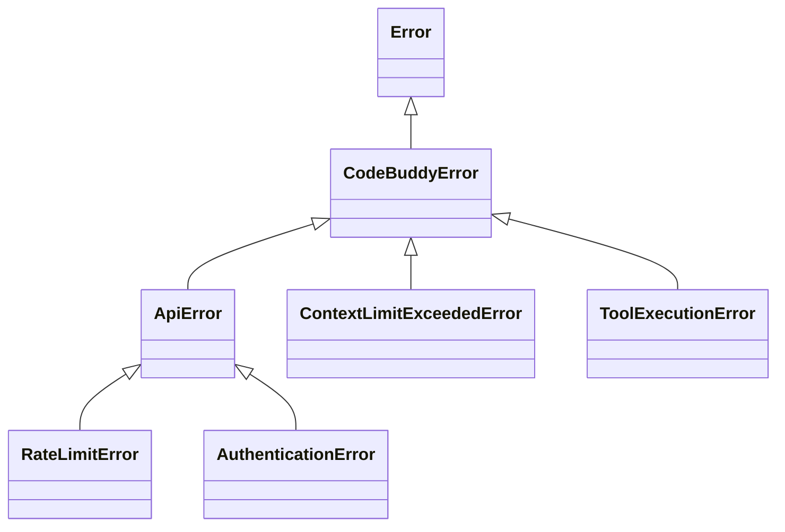

# src — errors

The `src/errors` module provides a comprehensive and centralized system for error handling, classification, and recovery within the Code Buddy application. It defines a custom error hierarchy, implements robust crash handling for unexpected shutdowns, and offers an intelligent error recovery mechanism for common operational issues.

This module aims to:
*   **Standardize Errors**: Provide a consistent base class for all application-specific errors.
*   **Categorize and Classify**: Automatically identify error types and severities to enable targeted handling.
*   **Facilitate Recovery**: Implement strategies for gracefully recovering from transient errors (e.g., network issues, rate limits).
*   **Ensure Resilience**: Preserve session state and provide recovery options in the event of an application crash.
*   **Improve User Experience**: Generate user-friendly messages and actionable suggestions for errors.
*   **Aid Debugging**: Collect and format detailed technical context for debugging purposes.

## 1. Core Error Hierarchy

At the heart of the error system is `CodeBuddyError`, a custom base class that extends Node.js's native `Error`. All application-specific errors inherit from `CodeBuddyError`, ensuring a consistent structure and additional metadata.

### `src/errors/base-error.ts`

**`CodeBuddyError`**
This class serves as the foundation for all custom errors. It adds several key properties:
*   `code: string`: A unique, machine-readable error code (e.g., `API_ERROR`, `CONTEXT_LIMIT_EXCEEDED`).
*   `isOperational: boolean`: Indicates if the error is an expected, operational error (e.g., API rate limit) that the application can potentially handle, versus a programming error or unexpected system failure.
*   `timestamp: Date`: When the error occurred.
*   `context?: Record<string, unknown>`: Optional additional data relevant to the error.
*   `cause?: Error`: The original error that caused this `CodeBuddyError`, useful for wrapping external errors.

It also includes a `toJSON()` method for easy serialization of error details.

### `src/errors/index.ts` - Utility Functions

This file aggregates all error exports and provides several utility functions for working with errors:

*   **`getErrorMessage(error: unknown): string`**: Safely extracts a human-readable message from any `unknown` error type, handling `Error` instances, strings, and objects with a `message` property.
*   **`isCodeBuddyError(error: unknown): error is CodeBuddyError`**: Type guard to check if an error is an instance of `CodeBuddyError`.
*   **`isOperationalError(error: unknown): boolean`**: Checks the `isOperational` flag of a `CodeBuddyError`.
*   **`wrapError(error: unknown, code: string = 'UNKNOWN_ERROR'): CodeBuddyError`**: Converts any `unknown` error into a `CodeBuddyError`, preserving the original error as `cause`. This is crucial for standardizing error handling when dealing with third-party libraries or unexpected exceptions.
*   **`createApiError(statusCode: number, message: string, endpoint?: string): ApiError`**: A factory function to create specific `ApiError` subclasses (`AuthenticationError`, `RateLimitError`) based on HTTP status codes.

#### Error Hierarchy Diagram



## 2. Specific Error Types

The module defines several specialized error classes, each extending `CodeBuddyError` and adding domain-specific properties.

### `src/errors/agent-error.ts`

Errors related to the agent's operational constraints or user interaction:

*   **`ContextLimitExceededError`**: Thrown when the AI model's context window is exceeded. Includes `currentTokens`, `maxTokens`, and `overflow` properties.
*   **`SandboxViolationError`**: Indicates an operation was blocked by the security sandbox. Includes `operation` and `reason`.
*   **`ConfirmationDeniedError`**: Occurs when the user explicitly denies a requested operation. Includes `operation` and optional `target`.

### `src/errors/tool-error.ts`

Errors specific to tool usage and execution:

*   **`ToolExecutionError`**: A general error during a tool's execution. Includes `toolName` and optional `args`.
*   **`ToolValidationError`**: Thrown when tool input validation fails. Includes `toolName` and `validationErrors`.
*   **`ToolNotFoundError`**: Indicates an attempt to use a non-existent tool. Includes `toolName`.

### `src/errors/provider-error.ts`

Errors originating from external API providers:

*   **`ApiError`**: Base class for API-related errors. Includes optional `statusCode` and `endpoint`.
*   **`RateLimitError`**: A specific `ApiError` indicating that an API rate limit has been hit. Includes optional `retryAfter` duration.
*   **`AuthenticationError`**: A specific `ApiError` for authentication failures (e.g., invalid API key).

## 3. Error Recovery System

The `error-recovery.ts` module provides a sophisticated system for classifying errors and attempting automatic recovery. It's designed for *handled* errors within the application's operational flow, offering a more graceful response than simply crashing.

### `src/errors/error-recovery.ts`

**`ErrorRecoveryManager`** (Singleton)
This class manages error classification, recovery strategies, and provides formatted messages.

*   **`classifyError(error: unknown, context?: Record<string, unknown>): ClassifiedError`**:
    *   This is a core function that takes any error and attempts to categorize it based on predefined `ERROR_PATTERNS`.
    *   It assigns a `category` (e.g., `network`, `api`, `rate_limit`), `severity` (`low`, `medium`, `high`, `critical`), and determines if it's `recoverable`.
    *   It also generates a `userMessage` and `suggestedActions`.
    *   **`ERROR_PATTERNS`**: A static array of regular expressions or functions used to match error messages against known error types.

*   **`handleError(error: unknown, context?: Record<string, unknown>): Promise<{ classified: ClassifiedError; recovered: boolean; strategy?: string; }>`**:
    *   The primary entry point for handling errors.
    *   It first `classifyError` to get a `ClassifiedError` object.
    *   If the error is classified as `recoverable`, it iterates through registered `RecoveryStrategy` instances to find one that can handle the error.
    *   It emits `error` and `recovered` or `unrecoverable` events.

*   **`registerStrategy(strategy: RecoveryStrategy): void`**: Allows custom recovery strategies to be added. Default strategies include `retry` for network/API errors and `wait` for rate limits.

*   **`formatError(classified: ClassifiedError): string`**: Generates a user-friendly message, including suggested actions, suitable for display in the UI.

*   **`formatDebug(classified: ClassifiedError): string`**: Provides a detailed technical breakdown of the error, including category, severity, stack trace, and context, for debugging.

*   **`getErrorRecoveryManager(): ErrorRecoveryManager`**: Provides a singleton instance of the manager.
*   **`resetErrorRecoveryManager(): void`**: Clears history and disposes of the singleton instance, useful for testing or application shutdown.

#### Error Recovery Flow

```mermaid
graph TD
    A[Application Code] --> B{Throw Error}
    B --> C[getErrorRecoveryManager().handleError(error)]
    C --> D[classifyError(error)]
    D -- ClassifiedError --> E{Is Recoverable?}
    E -- Yes --> F[Apply Recovery Strategies]
    F -- Strategy Success --> G[Emit 'recovered' event]
    F -- Strategy Fail --> H[Emit 'unrecoverable' event]
    E -- No --> H
    H --> I[Log & Display Error]
```

## 4. Crash Handling

The `crash-handler.ts` module is responsible for gracefully handling *unhandled* exceptions and process signals (like `SIGINT`, `SIGTERM`) that would otherwise lead to an abrupt application termination. Its primary goal is to preserve session state and provide recovery options.

### `src/errors/crash-handler.ts`

**`CrashHandler`** (Singleton)
This class manages the process of saving crash context and restoring the terminal state.

*   **`initialize(): void`**: Ensures the recovery directory (`~/.codebuddy/recovery`) exists.
*   **`setSessionId(sessionId: string): void`**: Sets the current session ID, crucial for linking crash data to a specific session.
*   **`trackMessage(role: string, content: string): void`**: Stores the last few messages (up to 10) for context in case of a crash.
*   **`trackOperation(operation: string): void` / `clearOperation(operation: string): void`**: Tracks pending operations, which can be useful for understanding what the agent was doing when it crashed.
*   **`saveCrashContext(error: Error, reason: string): string | null`**:
    *   The core function for writing crash data to disk.
    *   It creates a detailed `CrashContext` object, including error details, session ID, working directory, Node.js version, platform, last messages, and pending operations.
    *   This context is written to a unique `crash_*.json` file in `RECOVERY_DIR`.
    *   It also writes a `latest.json` file with `RecoveryInfo` for quick detection of the most recent crash.
*   **`handleCrash(error: Error, reason: string): string | null`**:
    *   The main entry point for handling a crash.
    *   It first calls `restoreTerminal()` to ensure the user's terminal is reset to a normal state (e.g., showing cursor, resetting colors).
    *   Then, it calls `saveCrashContext()`.
*   **`restoreTerminal(): void`**: Resets terminal raw mode, shows the cursor, and resets colors. This is critical for a good user experience after a crash.
*   **`cleanupOldCrashes(): void`**: Periodically removes old crash files, keeping only the 10 most recent.
*   **`getLatestRecovery(): RecoveryInfo | null`**: Reads the `latest.json` file to quickly check for a recent crash.
*   **`getCrashContext(filePath: string): CrashContext | null`**: Reads a specific crash file.
*   **`clearRecovery(): void`**: Removes the `latest.json` file, typically called after a successful session start or recovery.

*   **`RECOVERY_DIR`**: `~/.codebuddy/recovery` – the standard location for all crash and recovery files.
*   **`CrashContext`**: Interface defining the structure of the detailed crash data saved to disk.
*   **`RecoveryInfo`**: Interface defining the lightweight information saved to `latest.json` for quick recovery checks.

*   **`getCrashHandler(): CrashHandler`**: Provides a singleton instance of the handler.
*   **`formatCrashInfo(recovery: RecoveryInfo): string`**: Formats the `RecoveryInfo` into a user-friendly message for display.

## 5. Crash Recovery

The `crash-recovery.ts` module works in conjunction with `crash-handler.ts` to detect and offer recovery from previous unclean shutdowns *at application startup*.

### `src/errors/crash-recovery.ts`

*   **`checkCrashRecovery(cwd: string = process.cwd()): Promise<RecoveryInfo | null>`**:
    *   This is the primary function called at application startup.
    *   It first checks for the `latest.json` file written by `CrashHandler`.
    *   If `latest.json` exists and is recent (within the last hour), it attempts to load the full `CrashContext` from the referenced `recoveryFilePath` to gather more details like `lastMessages`.
    *   As a fallback, it scans the `RECOVERY_DIR` for `crash_*.json` files if `latest.json` is not found or corrupted.
    *   Returns a `RecoveryInfo` object (note: this `RecoveryInfo` interface is slightly different from the one in `crash-handler.ts`, but serves a similar purpose of summarizing recovery data) if a recent, resumable crash is detected.
*   **`clearRecoveryFiles(): Promise<void>`**: Removes the `latest.json` file. This is typically called after a user successfully resumes a session or explicitly declines recovery.
*   **`saveRecoveryCheckpoint(cwd: string, sessionId: string, messageCount: number, lastUserMessage: string): Promise<void>`**:
    *   This function allows the application to periodically save a lightweight checkpoint during a session.
    *   It creates `recovery-${sessionId}.json` files, providing an additional layer of resilience beyond just crash handling.

## 6. Integration and Usage

*   **Throwing Errors**: When an application-specific error occurs, throw the appropriate `CodeBuddyError` subclass (e.g., `throw new ContextLimitExceededError(...)`). For external errors, use `wrapError()` to convert them into `CodeBuddyError` instances.
*   **Handling Operational Errors**: For expected, recoverable errors (e.g., API issues), use `getErrorRecoveryManager().handleError(error, context)` within `try...catch` blocks. This allows the system to classify the error, attempt recovery, and provide user-friendly feedback.
*   **Handling Crashes**: The `getCrashHandler().handleCrash(error, reason)` function is typically registered as a global handler for `process.on('uncaughtException')` and `process.on('unhandledRejection')`, as well as for process signals (`SIGINT`, `SIGTERM`) in `src/app/application-factory.ts` and `src/utils/graceful-shutdown.ts`. This ensures that even unexpected failures are caught, logged, and allow for recovery.
*   **Startup Recovery**: At application startup (`src/index.ts`), `checkCrashRecovery()` is called to detect if a previous session crashed and offer the user a chance to resume.
*   **Terminal Restoration**: `restoreTerminal()` is crucial and is called by `handleCrash()` and also directly by `src/utils/graceful-shutdown.ts` and `src/app/application-factory.ts` to ensure the terminal is always left in a clean state.

This robust error management system is critical for Code Buddy's stability, user experience, and maintainability, providing clear error context for developers and graceful recovery options for users.