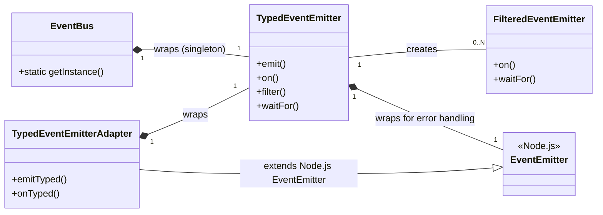

# src — events

The `src/events` module provides a robust, type-safe, and centralized event system for the application. It aims to replace or augment the scattered use of Node.js's native `EventEmitter` with a unified, developer-friendly solution that offers strong TypeScript support, advanced listening capabilities, and a clear structure for application-wide communication.

## Purpose and Key Features

The primary goal of this module is to establish a consistent and predictable way for different parts of the application to communicate without direct coupling. By leveraging TypeScript, it ensures that event names and their associated data payloads are strictly typed, preventing common runtime errors and improving developer experience through auto-completion and compile-time checks.

Key features include:

*   **Type-Safe Events**: All events and their payloads are defined with TypeScript interfaces, providing full auto-completion and compile-time validation.
*   **Centralized Event Bus**: A global singleton `EventBus` allows any part of the application to emit or listen to events.
*   **Advanced Listener Options**: Support for event filtering (predicate-based), priority handling, and one-time listeners (`once`).
*   **Wildcard Listeners**: Subscribe to all events (`onAny`) for logging, debugging, or cross-cutting concerns.
*   **Event History & Statistics**: Track recent events and gather statistics on emitted events and active listeners.
*   **Asynchronous Event Handling**: Listeners can return Promises, and the system handles their resolution and error reporting.
*   **Migration Path**: `TypedEventEmitterAdapter` facilitates gradual migration from existing Node.js `EventEmitter` implementations.
*   **Scoped Event Views**: `FilteredEventEmitter` allows creating specialized views of an event stream based on a filter.

## Core Concepts

At the heart of the event system are a few fundamental concepts:

1.  **`BaseEvent`**: All events must extend this interface, which defines common properties like `type` (a string identifier) and `timestamp`.
2.  **Event Type Maps**: Interfaces like `ApplicationEvents` and `AllEvents` map event names (e.g., `'agent:started'`) to their specific event data interfaces (e.g., `AgentEvent`). These maps are crucial for providing type safety across the system.
3.  **`TypedEventEmitter`**: The generic class that implements the core event emission and listening logic, enforcing type safety based on the provided event map.
4.  **`EventBus`**: A singleton instance of `TypedEventEmitter` configured with `AllEvents`, serving as the global communication hub.

## Module Architecture

The `src/events` module is structured into several interconnected files, each with a specific responsibility:



### `src/events/types.ts`: Event Definitions

This file is the backbone of the type-safe event system. It defines:

*   **`BaseEvent`**: The foundational interface for all events, requiring `type: string` and `timestamp: number`.
*   **Specific Event Interfaces**: Detailed interfaces for various event categories (e.g., `AgentEvent`, `ToolEvent`, `SessionEvent`, `FileEvent`, `CacheEvent`, `SyncEvent`, `WorkflowEvent`, etc.). Each interface extends `BaseEvent` and defines the specific payload for that event type.
*   **Event Listener and Filter Types**: `EventListener<T>` and `EventFilter<T>` provide type definitions for callback functions.
*   **`AllEvents`**: A comprehensive interface that maps every possible event type string to its corresponding event data interface. This is the master type used by the global `EventBus`.
*   **`ApplicationEvents`**: A subset of `AllEvents`, primarily for backward compatibility or scenarios where only core application events are needed.

**Contribution Note**: When adding new event types, define a new interface extending `BaseEvent` and add it to the `AllEvents` (and potentially other category-specific) interface.

### `src/events/typed-emitter.ts`: The Type-Safe Emitter

This file contains the core `TypedEventEmitter` class and the `TypedEventEmitterAdapter` for migration.

#### `TypedEventEmitter<TEvents>`

This is the primary class for creating type-safe event emitters. It manages listeners, handles event emission, and provides advanced features:

*   **Type Safety**: The generic `TEvents` parameter ensures that `emit` calls only use defined event types with correct payloads, and `on`/`once` listeners receive correctly typed event objects.
*   **Internal `EventEmitter`**: It wraps a Node.js `EventEmitter` instance internally, primarily for robust error handling (emitting an `'error'` event if a listener throws an exception or an async listener rejects).
*   **Listener Management**: It maintains its own `Map` of listeners, allowing for features like:
    *   **`on(type, listener, options)`**: Adds a listener. `options` can include `priority` (higher runs first) and `filter` (a predicate function).
    *   **`once(type, listener, options)`**: Adds a listener that is automatically removed after the first event.
    *   **`onAny(listener, options)`**: Adds a wildcard listener that receives *all* emitted events (typed as `BaseEvent`).
    *   **`off(listenerId)`**: Removes a specific listener by its unique ID.
    *   **`offAll(type?)`**: Removes all listeners for a specific type, or all listeners entirely if no type is provided.
*   **`emit(type, event)`**: Emits an event. It constructs the full event object (adding `type` and `timestamp`), updates statistics, adds to history, sorts listeners by priority, applies filters, and executes listeners. It gracefully handles synchronous and asynchronous listener errors.
*   **`waitFor(type, options)`**: Returns a `Promise` that resolves with the next event of the specified type (optionally filtered) or rejects after a timeout.
*   **`filter(type, predicate)`**: Returns a `FilteredEventEmitter` instance, providing a scoped view of events.
*   **`getHistory()` / `getFilteredHistory()`**: Accesses a configurable-size history of emitted events.
*   **`getStats()` / `resetStats()`**: Provides runtime statistics on emitted events and active listeners.
*   **`dispose()`**: Cleans up all listeners and history, useful for resource management.

#### `TypedEventEmitterAdapter<TEvents>`

This class is designed to facilitate a gradual migration from existing codebases that use Node.js's native `EventEmitter`.

*   It **extends `EventEmitter`**: This means existing code expecting an `EventEmitter` instance will still work.
*   It **wraps a `TypedEventEmitter`**: It internally holds an instance of `TypedEventEmitter`.
*   **`emitTyped(type, event)` / `onTyped(type, listener, options)` / `onceTyped(...)` / `offTyped(...)` / `waitForTyped(...)`**: These methods provide the type-safe API of `TypedEventEmitter`. When `emitTyped` is called, it emits the event through *both* the native `EventEmitter` (for old listeners) and the internal `TypedEventEmitter` (for new, type-safe listeners).

This adapter allows developers to incrementally update their event handling logic without breaking existing functionality.

### `src/events/filtered-emitter.ts`: Scoped Event Views

The `FilteredEventEmitter` class provides a specialized "view" of events from a `TypedEventEmitter`. It's not meant to be instantiated directly but is returned by `TypedEventEmitter.filter()`.

*   It takes a `TypedEventEmitter` source, an event `type`, and an `EventFilter` predicate in its constructor.
*   Its `on()`, `once()`, and `waitFor()` methods internally call the corresponding methods on the `source` `TypedEventEmitter`, automatically applying the configured `predicate` as a filter.
*   It tracks listener IDs created through itself, allowing `offAll()` to easily remove only its own listeners from the source emitter.

This component simplifies listening to specific subsets of events without repeatedly defining the same filter logic.

### `src/events/event-bus.ts`: The Global Event Bus

This file provides the singleton `EventBus` for application-wide event communication.

*   **`EventBus<TEvents>`**: A class that extends `TypedEventEmitter`. Its primary purpose is to implement the singleton pattern.
*   **`static getInstance<T>()`**: The static method to retrieve the single instance of the `EventBus`. It ensures that only one instance is ever created.
*   **`getGlobalEventBus()`**: A convenience function that returns the singleton `EventBus` instance, explicitly typed with `AllEvents`. This is the recommended way to access the global bus for full type safety.
*   **`getEventBus()`**: Another convenience function, returning the `EventBus` typed with `ApplicationEvents`. This might be used for specific contexts or backward compatibility.
*   **`resetEventBus()`**: A utility function (primarily for testing) to clear and re-initialize the singleton instance.

The global `EventBus` is the central nervous system for decoupled communication across the application.

### `src/events/type-guards.ts`: Runtime Type Narrowing

This file provides utility functions for runtime type checking of events.

*   **`isEventType<K extends keyof AllEvents>(event: BaseEvent, type: K)`**: A generic type guard that checks if an event's `type` property matches a given string literal, narrowing the event's type accordingly.
*   **Category-Specific Type Guards**: Functions like `isAgentEvent(event: BaseEvent)` or `isToolEvent(event: BaseEvent)` use `startsWith()` checks on the event `type` to narrow down `BaseEvent` to a specific category of events. These are particularly useful when working with `onAny` listeners or `getFilteredHistory` where the initial event type is `BaseEvent`.

## Usage Patterns

### Using `TypedEventEmitter` Directly

For module-specific or component-specific eventing, you can instantiate `TypedEventEmitter` directly:

```typescript
import { TypedEventEmitter, ToolEvents } from './events/index.js';

// Create an emitter for ToolEvents
const toolEmitter = new TypedEventEmitter<ToolEvents>();

// Listen for a specific tool event
toolEmitter.on('tool:started', (event) => {
  console.log(`Tool '${event.toolName}' started with args:`, event.args);
});

// Listen for any tool event
toolEmitter.onAny((event) => {
  if (event.type.startsWith('tool:')) {
    console.log(`A tool event occurred: ${event.type}`);
  }
});

// Emit a tool event (type-safe)
toolEmitter.emit('tool:started', { toolName: 'git', args: { command: 'clone' } });
toolEmitter.emit('tool:completed', { toolName: 'git', result: { success: true, output: 'Cloned repo' } });
```

### Using the Global `EventBus`

For application-wide events, use the singleton `EventBus`:

```typescript
import { getGlobalEventBus, AllEvents } from './events/index.js';

const bus = getGlobalEventBus();

// Listen for an agent event
bus.on('agent:started', (event) => {
  console.log(`Agent '${event.agentId}' has started.`);
});

// Listen for a file event with a filter
const listenerId = bus.on('file:modified', (event) => {
  console.log(`File modified: ${event.filePath}`);
}, {
  filter: (event) => event.filePath.endsWith('.ts')
});

// Emit events
bus.emit('agent:started', { agentId: 'my-agent-123' });
bus.emit('file:modified', { filePath: '/src/main.ts', operation: 'edit' });
bus.emit('file:modified', { filePath: '/README.md', operation: 'edit' }); // This won't trigger the listener above

// Later, remove the listener
bus.off(listenerId);
```

### Filtering Events with `FilteredEventEmitter`

You can create a filtered view for a specific event type:

```typescript
import { getGlobalEventBus, AllEvents } from './events/index.js';

const bus = getGlobalEventBus();

// Create a filtered emitter for 'file:modified' events on '.js' files
const jsFileModifiedEmitter = bus.filter('file:modified', (event) => event.filePath.endsWith('.js'));

jsFileModifiedEmitter.on((event) => {
  console.log(`JavaScript file modified: ${event.filePath}`);
});

bus.emit('file:modified', { filePath: 'index.js', operation: 'save' }); // Triggers listener
bus.emit('file:modified', { filePath: 'style.css', operation: 'save' }); // Does not trigger
```

### Waiting for Events

The `waitFor` method is useful for scenarios where you need to react to the *next* occurrence of an event:

```typescript
import { getGlobalEventBus, AllEvents } from './events/index.js';

const bus = getGlobalEventBus();

async function waitForAgentCompletion() {
  console.log('Waiting for agent to complete...');
  try {
    const completionEvent = await bus.waitFor('agent:stopped', { timeout: 5000 });
    console.log(`Agent '${completionEvent.agentId}' stopped successfully.`);
  } catch (error) {
    console.error('Agent did not stop in time:', error);
  }
}

waitForAgentCompletion();

// Simulate agent stopping after a delay
setTimeout(() => {
  bus.emit('agent:stopped', { agentId: 'my-agent-456' });
}, 2000);
```

### Gradual Migration with `TypedEventEmitterAdapter`

If you have existing classes that extend Node.js `EventEmitter`, you can switch them to `TypedEventEmitterAdapter` to gradually introduce type safety:

```typescript
import { TypedEventEmitterAdapter, SessionEvent } from './events/index.js';
import { EventEmitter } from 'events'; // Native EventEmitter

interface MySessionEvents extends Record<string, SessionEvent> {
  'session:started': SessionEvent;
  'session:ended': SessionEvent;
  'legacy-event': { data: string }; // Keep old untyped events if needed
}

// Old class (extends native EventEmitter)
class OldSessionManager extends EventEmitter {
  startSession(sessionId: string) {
    this.emit('session:started', { sessionId, timestamp: Date.now() }); // Untyped emit
    this.emit('legacy-event', { data: 'old data' });
  }
}

// New class (extends TypedEventEmitterAdapter)
class NewSessionManager extends TypedEventEmitterAdapter<MySessionEvents> {
  startSession(sessionId: string) {
    // New type-safe API
    this.emitTyped('session:started', { sessionId });

    // Old API still works for backward compatibility
    this.emit('legacy-event', { data: 'new data' }); // This will also trigger native EventEmitter listeners
  }
}

const newManager = new NewSessionManager();

// Listen using the new type-safe API
newManager.onTyped('session:started', (event) => {
  console.log(`Typed session started: ${event.sessionId}`);
});

// Listen using the old native EventEmitter API (still works)
newManager.on('legacy-event', (data: { data: string }) => {
  console.log(`Legacy event received: ${data.data}`);
});

newManager.startSession('session-abc');
```

### Event History and Statistics

`TypedEventEmitter` instances (including the `EventBus`) track emitted events and listener counts:

```typescript
import { getGlobalEventBus } from './events/index.js';

const bus = getGlobalEventBus();

bus.emit('agent:started', { agentId: 'test-agent' });
bus.emit('tool:completed', { toolName: 'test-tool', result: { success: true } });

console.log('Event History:', bus.getHistory());
console.log('Event Stats:', bus.getStats());

// Filter history
const agentEvents = bus.getFilteredHistory((entry) => entry.event.type.startsWith('agent:'));
console.log('Agent Event History:', agentEvents);
```

## Integration Points

The event system is designed to be a central communication layer. Based on the call graph, here's how other parts of the codebase interact with it:

*   **`src/tools/tool-manager.ts`**: Emits `tool:started`, `tool:completed`, `tool:error`, `tool:registered`, `tool:instantiated`, `tool:disabled` events using `emitTyped` when tools are executed or managed.
*   **`sync/cloud/sync-manager.ts`**: Emits various `sync:*` events (e.g., `sync:started`, `sync:completed`, `sync:failed`, `sync:progress`, `sync:item_uploaded`, `sync:item_downloaded`, `sync:conflict_detected`, `sync:conflict_resolved`) using `emitTyped` to report synchronization status. It also listens to `sync:*` events using `onTyped`.
*   **`src/undo/checkpoint-manager.ts`**: Likely emits `checkpoint:*` and `undo:*`/`redo:*` events, and uses `dispose` to clean up its event listeners.
*   **`agent/multi-agent/multi-agent-system.ts`**: Uses `listenerCount` for internal logic, possibly related to monitoring event activity.
*   **`src/channels/reconnection-manager.ts`**: Uses `listenerCount`, suggesting it might monitor event activity to manage reconnection logic.
*   **Unit Tests (`tests/unit/*.test.ts`, `tests/ai-integration-tests.test.ts`)**: Heavily utilize all aspects of the event system, including `on`, `once`, `emit`, `waitFor`, `listenerCount`, `getEventBus`, `resetEventBus`, `dispose`, and `FilteredEventEmitter` methods, to verify correct behavior.

This demonstrates that core application logic, such as tool execution and cloud synchronization, relies on the event system for reporting status and enabling decoupled reactions.

## Contributing to Events

When adding new event types or categories:

1.  **Define Event Interface**: Create a new interface in `src/events/types.ts` that extends `BaseEvent`. Ensure it has a unique `type` string literal and defines all necessary payload properties.
    ```typescript
    export interface MyNewFeatureEvent extends BaseEvent {
      type: 'myfeature:started' | 'myfeature:completed';
      featureId: string;
      // ... other properties
    }
    ```
2.  **Add to `AllEvents`**: Include your new event interface in the `AllEvents` map in `src/events/types.ts` to make it globally available. Consider adding it to a category-specific map if appropriate (e.g., `PluginEvents`).
    ```typescript
    export interface AllEvents extends Record<string, BaseEvent> {
      // ... existing events
      'myfeature:started': MyNewFeatureEvent;
      'myfeature:completed': MyNewFeatureEvent;
    }
    ```
3.  **Implement Emission**: Use `getGlobalEventBus().emit('myfeature:started', { featureId: '...' })` or `this.emitTyped('myfeature:started', { featureId: '...' })` if using `TypedEventEmitterAdapter`.
4.  **Add Type Guards (Optional)**: If your new event category will be frequently checked at runtime (e.g., in `onAny` listeners), consider adding a type guard function to `src/events/type-guards.ts`.
    ```typescript
    export function isMyNewFeatureEvent(event: BaseEvent): event is MyNewFeatureEvent {
      return event.type.startsWith('myfeature:');
    }
    ```
5.  **Update `index.ts`**: Ensure your new types are exported from `src/events/index.ts` if they are intended for public consumption.

By following these guidelines, the event system remains consistent, type-safe, and easy to extend.