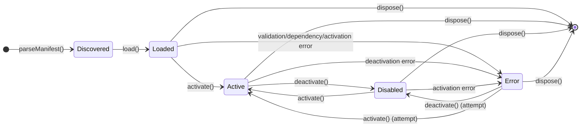

# src — extensions

The `src/extensions/extension-loader.ts` module is responsible for discovering, loading, and managing the lifecycle of extensions within the application. It provides a robust mechanism for dynamically integrating new functionalities, such as channels, tools, providers, and integrations, based on a defined manifest and lifecycle hooks.

## Purpose and Core Responsibilities

The primary goal of the `ExtensionLoader` is to enable a pluggable architecture. It handles:

1.  **Discovery:** Locating extension directories within predefined search paths.
2.  **Parsing:** Reading and validating `extension.json` manifest files.
3.  **Loading:** Instantiating extensions and making them available.
4.  **Lifecycle Management:** Orchestrating activation, deactivation, and disposal of extensions, including dependency resolution and configuration validation.
5.  **State Tracking:** Maintaining the current status of each loaded extension.

This module acts as the central registry and orchestrator for all extensions, ensuring they adhere to a common structure and can be managed programmatically.

## Core Concepts

### Extension Manifest (`ExtensionManifest`)

The `ExtensionManifest` interface defines the metadata required for every extension. This data is read from an `extension.json` file located in the extension's root directory.

```typescript
export interface ExtensionManifest {
  name: string;          // Unique identifier for the extension
  version: string;       // Semantic versioning
  description: string;   // Brief description
  author?: string;       // Optional author information
  type: 'channel' | 'tool' | 'provider' | 'integration'; // Categorization
  entryPoint: string;    // Path to the main module file (relative to extension root)
  configSchema?: Record<string, { type: string; required?: boolean; default?: unknown; description?: string }>; // Schema for configuration
  dependencies?: string[]; // List of other extension names this extension depends on
}
```

Key fields like `name`, `version`, `type`, and `entryPoint` are mandatory. The `configSchema` allows extensions to declare their expected configuration parameters, enabling automatic validation.

### Extension Instance (`ExtensionInstance`)

An `ExtensionInstance` represents a loaded extension at runtime. It encapsulates the manifest, its file system path, and its current operational status.

```typescript
export interface ExtensionInstance {
  manifest: ExtensionManifest;
  path: string;
  status: 'loaded' | 'active' | 'error' | 'disabled'; // Current state
  error?: string; // Details if status is 'error'
  loadedAt?: number; // Timestamp of loading
}
```

### Extension Lifecycle Hooks (`ExtensionLifecycle`)

Extensions can define optional lifecycle methods that the `ExtensionLoader` will call at specific points. These methods allow extensions to perform setup, teardown, and configuration tasks.

```typescript
export interface ExtensionLifecycle {
  onLoad?(): Promise<void>;         // Called immediately after the extension module is loaded (not yet implemented for actual module loading)
  onActivate?(config: Record<string, unknown>): Promise<void>; // Called when the extension is activated, receiving its configuration
  onDeactivate?(): Promise<void>;   // Called when the extension is deactivated
  onDispose?(): Promise<void>;      // Called when the extension loader is shutting down or the extension is being removed
}
```
*Note: While `onLoad` is defined in the interface, the current `ExtensionLoader` implementation primarily focuses on `onActivate`, `onDeactivate`, and `onDispose` for runtime interaction. The actual module loading and instantiation of the `ExtensionLifecycle` object is an implicit future step not fully detailed in the provided code.*

### Extension Search Paths

The `ExtensionLoader` looks for extensions in a predefined set of directories. By default, these include:
*   `.codebuddy/extensions` in the current working directory.
*   `.codebuddy/extensions` in the user's home directory.

These paths can be customized during the `ExtensionLoader`'s instantiation.

## The `ExtensionLoader` Class

The `ExtensionLoader` class is the central component of this module. It extends `EventEmitter` to broadcast significant events during the extension lifecycle.

### Constructor

```typescript
constructor(searchPaths?: string[])
```
Initializes the loader with an optional array of `searchPaths`. If not provided, it defaults to the standard paths.

### Static Method: `parseManifest`

```typescript
static parseManifest(dir: string): ExtensionManifest | null
```
This static helper method is responsible for reading and validating the `extension.json` file within a given directory. It performs checks for:
*   File existence.
*   Valid JSON format.
*   Presence of all `REQUIRED_MANIFEST_FIELDS` (`name`, `version`, `type`, `entryPoint`).
*   Valid `type` against `VALID_TYPES`.

It returns the parsed `ExtensionManifest` or `null` if any validation fails.

### Instance Methods

#### Discovery

*   **`discover(): ExtensionManifest[]`**
    Iterates through all configured `searchPaths`, finds subdirectories, and attempts to parse an `extension.json` manifest in each. It returns a list of all valid `ExtensionManifest` objects found.

#### Loading

*   **`load(name: string): ExtensionInstance | { error: string }`**
    Attempts to load a specific extension by its `name`. It searches through the configured paths for a directory matching the name, parses its manifest, and creates an `ExtensionInstance`. It performs basic validation on the `name` to prevent path traversal issues (e.g., `name.includes('..')`).
    Upon successful loading, it stores the `ExtensionInstance` internally and emits a `loaded` event.

*   **`loadAll(): ExtensionInstance[]`**
    Combines `discover()` and `load()`. It first discovers all available manifests and then attempts to load each one. It returns an array of all successfully loaded `ExtensionInstance` objects.

#### Management

*   **`get(name: string): ExtensionInstance | undefined`**
    Retrieves a specific `ExtensionInstance` by its name if it has been loaded.

*   **`list(type?: ExtensionManifest['type']): ExtensionInstance[]`**
    Returns an array of all currently loaded `ExtensionInstance` objects. Optionally, it can filter by `type` (e.g., `'channel'`, `'tool'`).

#### Lifecycle Management

*   **`async activate(name: string, config?: Record<string, unknown>): Promise<boolean>`**
    Activates a loaded extension. Before calling the extension's `onActivate` hook, it performs:
    1.  **Configuration Validation:** Uses `validateConfig()` against the `configSchema` defined in the manifest.
    2.  **Dependency Checking:** Uses `checkDependencies()` to ensure all declared dependencies are loaded.
    If validation or dependency checks fail, or if the `onActivate` hook throws an error, the extension's status is set to `'error'`. On success, the status becomes `'active'`, and an `activated` event is emitted.

*   **`async deactivate(name: string): Promise<boolean>`**
    Deactivates an active extension. It calls the extension's `onDeactivate` hook. On success, the status becomes `'disabled'`, and a `deactivated` event is emitted. If the hook throws an error, the status is set to `'error'`.

*   **`async dispose(): Promise<void>`**
    Performs a best-effort cleanup for all loaded extensions. It iterates through all extensions and calls their `onDispose` hook. Finally, it clears all internal maps and emits a `disposed` event.

#### Validation & Dependencies

*   **`validateConfig(name: string, config: Record<string, unknown>): { valid: boolean; errors: string[] }`**
    Validates a given `config` object against the `configSchema` defined in the extension's manifest. It checks for required fields and type correctness.

*   **`checkDependencies(name: string): { satisfied: boolean; missing: string[] }`**
    Checks if all extensions listed in the `dependencies` array of the specified extension's manifest are currently loaded by the `ExtensionLoader`.

### Events

The `ExtensionLoader` extends `EventEmitter` and emits the following events:

*   **`loaded`**: Emitted when an extension is successfully loaded.
*   **`activated`**: Emitted when an extension is successfully activated.
*   **`deactivated`**: Emitted when an extension is successfully deactivated.
*   **`disposed`**: Emitted when the `ExtensionLoader` is disposed.

## Extension Lifecycle Workflow

The following diagram illustrates the typical state transitions for an `ExtensionInstance` managed by the `ExtensionLoader`.



## Error Handling and Validation

The `ExtensionLoader` incorporates several layers of validation and error handling:

*   **Manifest Parsing:** `parseManifest` rigorously checks for file existence, JSON validity, and required fields.
*   **Extension Name Validation:** The `load` method uses a regular expression (`/^[a-zA-Z0-9_@][a-zA-Z0-9_\-./]*$/.test(name)`) to validate extension names, preventing malicious path traversal attempts.
*   **Configuration Schema Validation:** `validateConfig` ensures that provided runtime configuration adheres to the schema defined in the `extension.json`.
*   **Dependency Resolution:** `checkDependencies` verifies that all declared extension dependencies are loaded before activation.
*   **Lifecycle Hook Error Handling:** `activate`, `deactivate`, and `dispose` methods wrap calls to extension lifecycle hooks in `try...catch` blocks, setting the extension status to `'error'` if an exception occurs.

## Integration and Usage

A typical usage pattern for the `ExtensionLoader` would involve:

1.  **Instantiation:** Create an instance of `ExtensionLoader`.
2.  **Loading:** Call `loadAll()` to discover and load all available extensions.
3.  **Activation:** Iterate through loaded extensions and call `activate()` for those that should be active, potentially providing configuration.
4.  **Management:** Use `get()` or `list()` to retrieve specific extensions or groups of extensions.
5.  **Deactivation/Disposal:** Call `deactivate()` for individual extensions or `dispose()` for a full shutdown.

```typescript
import { ExtensionLoader } from './extension-loader';

async function initializeExtensions() {
  const loader = new ExtensionLoader();

  // Discover and load all extensions
  const loadedInstances = loader.loadAll();
  console.log(`Loaded ${loadedInstances.length} extensions.`);

  // Activate a specific extension with configuration
  const myToolConfig = { apiKey: 'abc-123', endpoint: 'https://api.example.com' };
  const activated = await loader.activate('my-tool-extension', myToolConfig);
  if (activated) {
    console.log('my-tool-extension activated successfully.');
  } else {
    const instance = loader.get('my-tool-extension');
    console.error(`Failed to activate my-tool-extension: ${instance?.error}`);
  }

  // List all active 'channel' type extensions
  const activeChannels = loader.list('channel').filter(ext => ext.status === 'active');
  console.log(`Active channels: ${activeChannels.map(c => c.manifest.name).join(', ')}`);

  // ... later, when shutting down or removing an extension
  await loader.deactivate('my-tool-extension');
  console.log('my-tool-extension deactivated.');

  await loader.dispose();
  console.log('Extension loader disposed.');
}

initializeExtensions();
```

The `ExtensionLoader` is designed to be a standalone component that other parts of the application can depend on to manage their extension ecosystem. Its primary interaction points are through its public methods and emitted events.