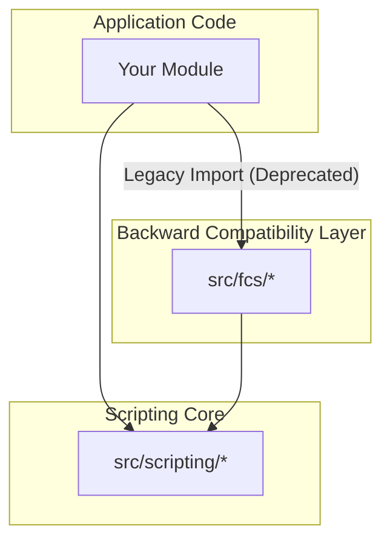

# src — fcs

The `src/fcs` module serves as a **backward compatibility layer** for components that were previously located under an `fcs` namespace. All files within this module are explicitly marked as `@deprecated` and simply re-export their counterparts from the `src/scripting` module.

## Module Overview

The `src/fcs` module does not contain any original code or unique business logic. Its sole purpose is to provide a temporary alias for core scripting functionalities that have been refactored and moved to the `src/scripting` module. This allows existing codebases that still import from `src/fcs` to continue functioning without immediate breakage, while clearly signaling the preferred new location.

**Key Characteristics:**

*   **No Original Code:** Every file in `src/fcs` is a direct re-export of a corresponding file in `src/scripting`.
*   **Deprecated:** All exports from this module are explicitly marked with `@deprecated` in their JSDoc comments.
*   **Backward Compatibility:** It exists purely to maintain compatibility for consumers who have not yet updated their import paths.
*   **No Internal Execution:** As confirmed by the call graph analysis, this module has no internal calls, outgoing calls, or execution flows of its own. It merely acts as a pass-through.

## Purpose and Rationale

Historically, various components related to the application's scripting capabilities (such as lexing, parsing, runtime execution, built-in functions, script registry, and integration bindings) resided under an `fcs` namespace. To improve the clarity, organization, and future maintainability of the codebase, these core scripting functionalities were consolidated and moved to the `src/scripting` module.

The `src/fcs` module was introduced during this transition to provide a grace period for migration. It allows developers to update their import statements incrementally without causing immediate build failures or runtime errors in dependent projects.

## Migration Path

Developers are **strongly encouraged** to update their import statements to reference `src/scripting` directly. This ensures that your code uses the canonical and actively maintained source for these functionalities and avoids relying on deprecated paths that will eventually be removed.

Here's a mapping of the deprecated `src/fcs` paths to their preferred `src/scripting` counterparts:

| Deprecated Import Path                  | Preferred Import Path                     |
| :-------------------------------------- | :---------------------------------------- |
| `src/fcs/builtins.ts`                   | `src/scripting/builtins.ts`               |
| `src/fcs/codebuddy-bindings.ts`         | `src/scripting/codebuddy-bindings.ts`     |
| `src/fcs/index.ts`                      | `src/scripting/index.ts`                  |
| `src/fcs/lexer.ts`                      | `src/scripting/lexer.ts`                  |
| `src/fcs/parser.ts`                     | `src/scripting/parser.ts`                 |
| `src/fcs/runtime.ts`                    | `src/scripting/runtime.ts`                |
| `src/fcs/script-registry.ts`            | `src/scripting/script-registry.ts`        |
| `src/fcs/sync-bindings.ts`              | `src/scripting/sync-bindings.ts`          |
| `src/fcs/types.ts`                      | `src/scripting/types.ts`                  |

**Example Migration:**

```typescript
// Old (deprecated) import
import { FCSLexer, tokenize } from 'src/fcs/lexer';
import { createBuiltins } from 'src/fcs/builtins';

// New (preferred) import
import { FCSLexer, tokenize } from 'src/scripting/lexer';
import { createBuiltins } from 'src/scripting/builtins';
```

## Architectural Relationship

The following diagram illustrates the relationship between application code, the deprecated `src/fcs` module, and the active `src/scripting` module:



This diagram shows that while application code can still import from `src/fcs` (the deprecated path), the underlying implementation is always provided by `src/scripting`. The recommended practice is to import directly from `src/scripting`.

## Future State

The `src/fcs` module is considered a temporary measure. It is intended for eventual removal in a future major version of the codebase once sufficient time has passed for all consumers to migrate their dependencies. New development should **never** introduce imports from `src/fcs`.