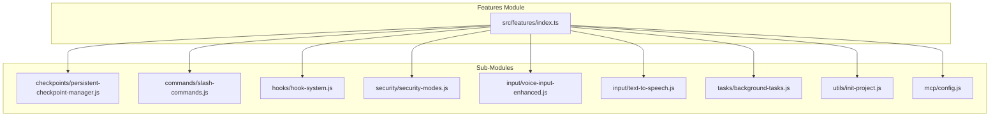

# src — features

The `src/features` module serves as the central aggregation point for Code Buddy's "enhanced features." It provides a unified interface to access and manage various sophisticated functionalities, drawing inspiration from tools natively, OpenAI Codex CLI, Gemini CLI, and Aider.

This module does not contain the implementation logic for these features directly. Instead, it re-exports the core components (manager classes, utility functions, and types) from their respective sub-modules, making them easily discoverable and accessible throughout the application.

## Purpose

The primary goals of `src/features/index.ts` are:

1.  **Centralized Access**: Provide a single entry point for consuming all enhanced features, simplifying imports and reducing boilerplate in other parts of the codebase.
2.  **Feature Discovery**: Clearly list and categorize the available features, making it easier for developers to understand Code Buddy's capabilities.
3.  **Initialization & Management**: Offer convenience functions (`initializeEnhancedFeatures`, `resetAllEnhancedFeatures`) to set up and tear down all feature managers consistently.
4.  **Status Reporting**: Provide a diagnostic function (`getFeatureStatusSummary`) for quick insights into the operational state of various features.

## Architecture

The `src/features` module acts as a facade, importing specific components from dedicated sub-modules and re-exporting them. Each major feature typically follows a singleton pattern, managed by a dedicated "Manager" class, accessible via a `get*Manager()` function.



Notice the aliasing pattern (`_PersistentCheckpointManager as PersistentCheckpointManager`). This is a common practice to clearly distinguish the imported symbol from the re-exported symbol, especially when the imported symbol might be used internally within `index.ts` (though not in this specific case for the managers).

## Key Features and Exports

This module exports a comprehensive set of functionalities. For each, the primary manager class, its singleton getter, and a reset function (useful for testing) are typically exported, along with relevant types.

### 1. Persistent Checkpoints

Inspired by Gemini CLI, this feature allows saving and restoring the state of the project at various points.

*   **Purpose**: Manage snapshots of the project's file system, enabling users to revert to previous states.
*   **Exports**:
    *   `PersistentCheckpointManager`: The class managing checkpoints.
    *   `getPersistentCheckpointManager()`: Retrieves the singleton instance.
    *   `resetPersistentCheckpointManager()`: Resets the manager (e.g., for testing).
    *   `PersistentCheckpoint`, `FileSnapshot`, `CheckpointIndex`, `PersistentCheckpointManagerOptions` (types).

### 2. Slash Commands

Advanced enterprise architecture for, this system allows defining and executing commands prefixed with a slash.

*   **Purpose**: Provide an extensible mechanism for user interaction via text commands.
*   **Exports**:
    *   `SlashCommandManager`: The class managing slash commands.
    *   `getSlashCommandManager()`: Retrieves the singleton instance.
    *   `resetSlashCommandManager()`: Resets the manager.
    *   `SlashCommand`, `SlashCommandArgument`, `SlashCommandResult` (types).

### 3. Hook System

Advanced enterprise architecture for, this allows custom logic to be injected at various points in the application lifecycle.

*   **Purpose**: Enable developers and users to extend Code Buddy's behavior by registering functions to be called before or after specific events.
*   **Exports**:
    *   `HookSystem`: The class managing hooks.
    *   `getHookSystem()`: Retrieves the singleton instance.
    *   `resetHookSystem()`: Resets the system.
    *   `Hook`, `HookType`, `HooksConfig`, `HookResult`, `HookContext` (types).

### 4. Security Modes

Inspired by OpenAI Codex CLI, this feature controls the operational security posture of Code Buddy.

*   **Purpose**: Define and enforce security policies, such as network access restrictions or requiring explicit user approval for certain actions.
*   **Exports**:
    *   `SecurityModeManager`: The class managing security modes.
    *   `getSecurityModeManager()`: Retrieves the singleton instance.
    *   `resetSecurityModeManager()`: Resets the manager.
    *   `SecurityMode`, `SecurityModeConfig`, `ApprovalRequest`, `ApprovalResult` (types).

### 5. Voice Input

Inspired by Aider, this enables interaction with Code Buddy using spoken language.

*   **Purpose**: Provide an alternative input method through speech-to-text transcription.
*   **Exports**:
    *   `VoiceInputManager`: The class managing voice input.
    *   `getVoiceInputManager()`: Retrieves the singleton instance.
    *   `resetVoiceInputManager()`: Resets the manager.
    *   `VoiceInputConfig`, `TranscriptionResult`, `VoiceInputState` (types).

### 6. Text-to-Speech (TTS)

This feature integrates text-to-speech capabilities, often complementing voice input.

*   **Purpose**: Convert textual responses from Code Buddy into spoken audio.
*   **Exports**:
    *   `TextToSpeechManager`: The class managing TTS.
    *   `getTTSManager()`: Retrieves the singleton instance.
    *   `resetTTSManager()`: Resets the manager.
    *   `TTSConfig`, `TTSState` (types).

### 7. Background Tasks

Inspired by Codex CLI Cloud, this allows for asynchronous, non-blocking operations.

*   **Purpose**: Manage long-running or resource-intensive operations in the background, preventing the main application thread from blocking.
*   **Exports**:
    *   `BackgroundTaskManager`: The class managing background tasks.
    *   `getBackgroundTaskManager()`: Retrieves the singleton instance.
    *   `resetBackgroundTaskManager()`: Resets the manager.
    *   `BackgroundTask`, `TaskResult`, `TaskStatus`, `TaskPriority`, `TaskListOptions` (types).

### 8. Project Initialization

Utilities for setting up a new Code Buddy project.

*   **Purpose**: Provide functions to initialize the necessary configuration and directory structure for a Code Buddy project.
*   **Exports**:
    *   `initCodeBuddyProject()`: Initializes a project.
    *   `formatInitResult()`: Formats the result of initialization.
    *   `InitOptions`, `InitResult` (types).

### 9. MCP Config Extensions

Utilities for managing the Code Buddy's Master Configuration Protocol (MCP) configuration.

*   **Purpose**: Provide functions to load, save, and manipulate Code Buddy's configuration files, including server settings.
*   **Exports**:
    *   `loadMCPConfig()`, `saveMCPConfig()`, `saveProjectMCPConfig()`: Configuration file operations.
    *   `createMCPConfigTemplate()`, `hasProjectMCPConfig()`, `getMCPConfigPaths()`: Configuration utility functions.
    *   `addMCPServer()`, `removeMCPServer()`, `getMCPServer()`: MCP server management.

## Core Utility Functions

Beyond re-exporting individual feature components, `src/features/index.ts` provides several high-level functions for managing the entire suite of features:

### `initializeEnhancedFeatures(workingDirectory?: string)`

This function initializes all singleton feature managers. It's the recommended way to set up Code Buddy's enhanced capabilities at application startup.

```typescript
import { initializeEnhancedFeatures } from './features';

const { checkpoints, slashCommands, hooks, security, voiceInput, tasks } =
  initializeEnhancedFeatures('/path/to/project');

// Now you can interact with the managers:
slashCommands.registerCommand({
  name: 'mycommand',
  description: 'A custom command',
  handler: async (args) => { /* ... */ }
});
```

### `resetAllEnhancedFeatures()`

This function resets all feature managers to their initial state. It's primarily useful for testing scenarios to ensure a clean slate between tests.

```typescript
import { resetAllEnhancedFeatures, getSlashCommandManager } from './features';

// Perform some operations...
getSlashCommandManager().registerCommand(...);

// Reset for the next test
resetAllEnhancedFeatures();

// Now getSlashCommandManager() will return a fresh instance
// with no registered commands from previous operations.
```

### `getFeatureStatusSummary()`

This function generates a human-readable string summarizing the current status and configuration of all enhanced features. It's invaluable for debugging, diagnostics, or providing users with an overview of Code Buddy's active capabilities.

```typescript
import { getFeatureStatusSummary } from './features';

console.log(getFeatureStatusSummary());
/* Example Output:
🌟 Code Buddy Enhanced Features
════════════════════════════════════════════════════════════━━━━
...
📸 Persistent Checkpoints
   • 0 checkpoints stored
   • Storage: /tmp/codebuddy-checkpoints
...
*/
```

## Contribution Guidelines

When adding a new enhanced feature to Code Buddy:

1.  **Create a Dedicated Module**: Implement the feature in its own sub-module (e.g., `src/new-feature/new-feature-manager.ts`). Follow the singleton manager pattern if applicable.
2.  **Export via `src/features/index.ts`**: Import the necessary components from your new module into `src/features/index.ts` and re-export them.
    ```typescript
    // src/features/index.ts
    import {
      NewFeatureManager as _NewFeatureManager,
      getNewFeatureManager as _getNewFeatureManager,
      resetNewFeatureManager as _resetNewFeatureManager,
    } from '../new-feature/new-feature-manager.js';

    export {
      _NewFeatureManager as NewFeatureManager,
      _getNewFeatureManager as getNewFeatureManager,
      _resetNewFeatureManager as resetNewFeatureManager,
    };
    export type { NewFeatureConfig } from '../new-feature/new-feature-manager.js';
    ```
3.  **Integrate with Utilities**:
    *   If your feature requires initialization, add a call to its `get*Manager()` function within `initializeEnhancedFeatures()`.
    *   If it needs to be reset, add a call to its `reset*Manager()` function within `resetAllEnhancedFeatures()`.
    *   If it has status to report, update `getFeatureStatusSummary()` to include relevant information.

This approach ensures consistency, maintainability, and ease of use for all enhanced features within Code Buddy.