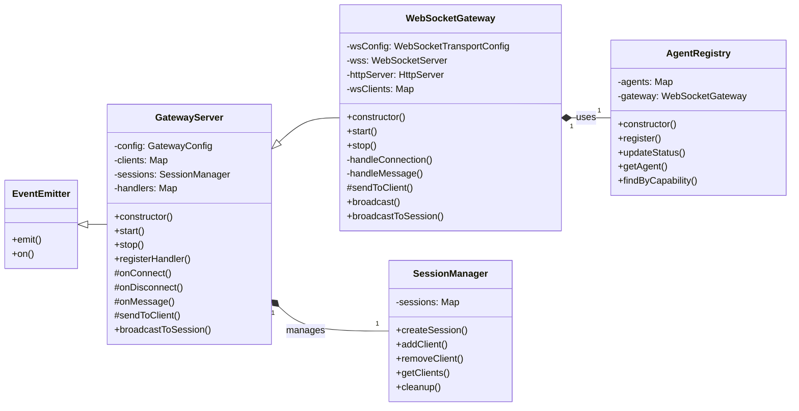

# src — gateway

The `src/gateway` module provides a robust, centralized WebSocket gateway designed for multi-client communication. It acts as a unified control plane, enabling real-time interaction between various clients such as agents, tools, and user interfaces. Inspired by established WebSocket gateway patterns, it offers features like session management, authentication, message routing, and agent registration.

This module is critical for enabling the real-time, interactive nature of the system, allowing different components to communicate and coordinate seamlessly.

## Core Concepts

Before diving into the components, understanding the fundamental concepts is key:

*   **`GatewayMessage`**: The standard format for all communication through the gateway. Each message has a `type`, a unique `id`, an optional `sessionId`, a `payload` (typed based on `type`), and a `timestamp`.
*   **`ClientState`**: Represents the internal state of a connected client, including its authentication status, associated sessions, connection timestamps, and metadata.
*   **Session**: A logical grouping of clients. Messages can be broadcast to all clients within a specific session, facilitating collaborative or multi-participant interactions.
*   **Agent**: A specialized client (e.g., an AI agent, a tool runner) that registers its capabilities with the gateway. The gateway can then route requests to appropriate agents.

## Architecture Overview

The gateway module employs an abstract base server (`GatewayServer`) and a concrete WebSocket implementation (`WebSocketGateway`). This separation allows for potential future transport layers while keeping core logic consistent.

1.  **`GatewayServer` (src/gateway/server.ts)**: The abstract base class. It defines the core logic for managing client states, sessions, message handlers, and authentication. It's transport-agnostic, meaning it doesn't care *how* messages are sent or received, only *what* to do with them.
2.  **`WebSocketGateway` (src/gateway/ws-transport.ts)**: Extends `GatewayServer` to provide a concrete implementation using WebSockets. It handles the low-level WebSocket server setup, connection management, message serialization/deserialization, and heartbeat mechanisms.
3.  **`SessionManager` (src/gateway/server.ts)**: A utility class used by `GatewayServer` to manage logical sessions, allowing clients to join and leave, and facilitating message broadcasting within a session.
4.  **`AgentRegistry` (src/gateway/ws-transport.ts)**: Manages the registration and lifecycle of various agents (e.g., AI models, tool executors) connected via the `WebSocketGateway`.

## Key Components

### 1. `src/gateway/types.ts`

This file defines all the essential types and interfaces used throughout the gateway module:

*   **`GatewayMessageType`**: A union type listing all supported message types (e.g., `'connect'`, `'auth'`, `'chat'`, `'session_create'`, `'error'`).
*   **`GatewayMessage<T>`**: The generic interface for all messages, encapsulating `type`, `id`, `sessionId`, `payload`, and `timestamp`.
*   **Payload Interfaces**: Specific interfaces for the `payload` of each message type, such as `ConnectPayload`, `AuthPayload`, `ChatPayload`, `ErrorPayload`, etc.
*   **`ClientState`**: Describes the internal state maintained for each connected client.
*   **`GatewayConfig` & `WebSocketTransportConfig`**: Configuration interfaces for the base gateway and its WebSocket-specific extensions, including authentication modes, ports, timeouts, and security settings.
*   **`DEFAULT_GATEWAY_CONFIG` & `DEFAULT_WS_CONFIG`**: Default configuration objects for easy setup.
*   **`GatewayEvents`**: Defines the custom events emitted by the `GatewayServer` (e.g., `client:connect`, `session:create`).

### 2. `src/gateway/server.ts`

This file contains the core, transport-agnostic logic of the gateway.

#### `createMessage<T>(type, payload, sessionId?)`

A utility function to construct a standard `GatewayMessage` object, assigning a unique ID and timestamp.

#### `createErrorMessage(code, message, details?)`

A specialized utility to create an `error` type `GatewayMessage` with a structured error payload.

#### `SessionManager` Class

Manages the lifecycle and client membership of sessions.

*   **`createSession(sessionId, options?)`**: Initializes a new session.
*   **`getSession(sessionId)`**: Retrieves session details.
*   **`addClient(sessionId, clientId)`**: Adds a client to a specified session.
*   **`removeClient(sessionId, clientId)`**: Removes a client from a session.
*   **`getClients(sessionId)`**: Returns a list of client IDs in a session.
*   **`cleanup()`**: Removes sessions that no longer have any connected clients.
*   **`getAllSessions()`**: Returns details for all active sessions.

#### `GatewayServer` Class

The abstract base class for the gateway server. It extends `EventEmitter` to allow for event-driven communication within the server.

*   **`constructor(config?)`**: Initializes the server with provided or default configuration and sets up default message handlers.
*   **`setupDefaultHandlers()`**: Registers handlers for common message types like `ping`, `connect`, `auth`, `session_create`, `session_join`, `session_leave`, `session_patch`, and `presence`.
    *   **`connect`**: Handles the initial client handshake, providing `HelloOkPayload` with gateway status and presence snapshot. Includes logic for skipping local TLS pairing.
    *   **`auth`**: Processes authentication requests based on `authMode` (token, password, or none). Calls `validateToken` for custom token validation.
    *   **Session Handlers**: Manage client membership in sessions via the `SessionManager`.
*   **`validateToken(token)`**: A protected method intended for override. By default, it accepts all tokens if authentication is disabled. Developers should override this for custom token validation logic.
*   **`registerHandler(type, handler)`**: Allows external modules to register custom handlers for specific `GatewayMessageType`s.
*   **`onConnect(clientId)`**: Protected method called when a new client connects. Initializes `ClientState` and emits `client:connect`.
*   **`onDisconnect(clientId)`**: Protected method called when a client disconnects. Cleans up client's session memberships and emits `client:disconnect`.
*   **`onMessage(clientId, message, send)`**: Protected method that processes incoming `GatewayMessage`s. It updates client activity, enforces authentication, and dispatches the message to the appropriate registered handler. If no specific handler is found, it emits a generic `message` event.
*   **`broadcastToSession(sessionId, message, excludeClientId?)`**: Sends a message to all clients within a specified session, optionally excluding one client.
*   **`sendToClient(clientId, message)`**: An abstract protected method that *must* be implemented by transport-specific subclasses (e.g., `WebSocketGateway`) to send a message to a single client.
*   **`start()` / `stop()`**: Lifecycle methods to start and stop the server, including managing the internal ping interval for client liveness and session cleanup.
*   **`getBindAddress()`**: Resolves the network interface to bind to based on `GatewayConfig.bind` mode.
*   **`getStats()`**: Provides runtime statistics about connected clients and active sessions.

#### Singleton Access

*   **`getGatewayServer(config?)`**: Returns a singleton instance of `GatewayServer`, creating it if it doesn't exist.
*   **`resetGatewayServer()`**: Stops and clears the singleton `GatewayServer` instance.

### 3. `src/gateway/ws-transport.ts`

This file implements the WebSocket-specific transport layer for the gateway.

#### `WebSocketTransportConfig` & `DEFAULT_WS_CONFIG`

Extends `GatewayConfig` with WebSocket-specific settings like `path`, `perMessageDeflate`, `maxPayload`, `heartbeatInterval`, `clientTimeout`, and `corsOrigins`.

#### `isOriginAllowed(origin, allowedOrigins)`

A security utility function to validate incoming WebSocket connection origins against a list of allowed patterns, supporting wildcards. This is crucial for preventing Cross-Site WebSocket Hijacking (CSWH).

#### `WebSocketGateway` Class

Extends `GatewayServer` to provide a concrete WebSocket implementation.

*   **`constructor(config?)`**: Initializes with WebSocket-specific configuration.
*   **`start()`**: Overrides the base `start()` method.
    *   Creates an `http.Server` for the WebSocket server and a basic HTTP health check endpoint.
    *   Initializes `WebSocketServer` (`wss`) with configured path, compression, and payload limits.
    *   Implements `verifyClient` for CORS origin validation using `isOriginAllowed` and handles stripping proxy headers from untrusted sources (GHSA-5wcw-8jjv-m286).
    *   Sets up `connection` and `error` listeners for the `wss`.
    *   Starts the WebSocket heartbeat mechanism.
    *   Listens on the configured port and host.
    *   Calls `super.start()` to activate base `GatewayServer` logic.
*   **`stop()`**: Overrides the base `stop()` method.
    *   Stops the WebSocket heartbeat.
    *   Closes all active client WebSocket connections.
    *   Shuts down the `WebSocketServer` and `http.Server`.
    *   Calls `super.stop()`.
*   **`handleConnection(socket, request)`**: Manages a new incoming WebSocket connection.
    *   Generates a unique `clientId`.
    *   Creates a `WebSocketClient` object, storing the `WebSocket` instance and `ClientState`.
    *   Calls `this.onConnect(clientId)` (from `GatewayServer`).
    *   Registers listeners for `message`, `pong`, `close`, and `error` events on the `socket`.
    *   Sends an initial `session_info` message to the client.
*   **`handleMessage(client, data)`**: Processes raw incoming WebSocket data.
    *   Updates client activity and `isAlive` status.
    *   Parses the JSON message.
    *   Performs basic message validation (type, id, size).
    *   Delegates to `this.onMessage(client.id, message, send)` (from `GatewayServer`).
*   **`handleDisconnect(client, code, reason)`**: Handles client disconnection.
    *   Removes the client from `wsClients`.
    *   Calls `this.onDisconnect(client.id)` (from `GatewayServer`).
    *   Emits `client:disconnect:details` with additional context.
*   **`sendToClient(clientId, message)`**: Implements the abstract method from `GatewayServer`. Serializes the `GatewayMessage` to JSON and sends it over the client's WebSocket.
*   **`broadcast(message, filter?)`**: Sends a message to all connected WebSocket clients, optionally filtered.
*   **`broadcastToSession(sessionId, message, excludeClientId?)`**: Overrides the base method for WebSocket-specific session broadcasting, iterating through `wsClients` and checking session membership.
*   **`startHeartbeat()` / `stopHeartbeat()`**: Manages a periodic interval to send `ping` messages to clients and terminate unresponsive connections, ensuring client liveness.
*   **`getWebSocketStats()`**: Provides WebSocket-specific runtime statistics.
*   **`getClientInfo(clientId)`**: Retrieves detailed information about a specific connected WebSocket client.
*   **`kickClient(clientId, reason?)`**: Forcibly disconnects a client.

#### `AgentRegistry` Class

Manages the registration and status of agents connected to the `WebSocketGateway`.

*   **`constructor(gateway)`**: Takes a `WebSocketGateway` instance and listens for `client:disconnect` events to automatically update agent statuses.
*   **`register(agent)`**: Registers a new agent with its capabilities.
*   **`unregister(agentId)`**: Removes an agent from the registry.
*   **`updateStatus(agentId, status, clientId?)`**: Updates an agent's online status and associated client ID.
*   **`getAgent(agentId)`**: Retrieves an agent by ID.
*   **`getAllAgents()` / `getOnlineAgents()`**: Returns lists of agents.
*   **`findByCapability(capability)`**: Finds agents that possess a specific capability (e.g., `'chat'`, `'tools:code_interpreter'`).
*   **`findByType(type)`**: Finds agents of a specific type (e.g., `'pi'`, `'webchat'`).
*   **`broadcastToAgents(message, filter?)`**: Sends a message to all online agents, optionally filtered.
*   **`getStats()`**: Provides statistics about registered agents (total, online, by type).

#### Control Messages

*   **`ControlMessageType`**: Defines types for internal gateway coordination messages (e.g., `agent_register`, `route_request`).
*   **`ControlMessage`**: Interface for internal control messages.
*   **`createControlMessage(type, source, payload, target?)`**: Utility to create control messages.

#### Singleton Access

*   **`getWebSocketGateway(config?)`**: Returns a singleton instance of `WebSocketGateway`, creating it if it doesn't exist.
*   **`resetWebSocketGateway()`**: Stops and clears the singleton `WebSocketGateway` instance.

## Message Flow Example: Client Connect and Auth

1.  **Client Connect**:
    *   A client establishes a WebSocket connection to `ws://<host>:<port>/ws`.
    *   `WebSocketGateway.handleConnection` is triggered.
    *   A `clientId` is generated, and a `WebSocketClient` object is created.
    *   `GatewayServer.onConnect(clientId)` is called, initializing the `ClientState` for this client.
    *   A `session_info` message is sent to the client, indicating connection status and if authentication is required.
    *   The client then sends a `connect` message (e.g., `createMessage('connect', { deviceId: '...', role: 'control' })`).
    *   `WebSocketGateway.handleMessage` receives and parses it, then calls `GatewayServer.onMessage`.
    *   `GatewayServer.onMessage` dispatches to the `connect` handler (set up in `setupDefaultHandlers`).
    *   The `connect` handler updates client metadata and sends a `hello_ok` message back to the client with gateway uptime, presence, and auth requirements.

2.  **Client Authentication**:
    *   If `authRequired` was true, the client sends an `auth` message (e.g., `createMessage('auth', { token: 'my-api-key' })`).
    *   `GatewayServer.onMessage` dispatches to the `auth` handler.
    *   The `auth` handler checks `GatewayConfig.authMode`.
        *   If `password` mode, it validates `payload.password` against `config.authPassword`.
        *   If `token` mode (default), it calls `this.validateToken(payload.token)`.
    *   If authentication succeeds, `ClientState.authenticated` is set to `true`, `userId` is assigned, and `client:auth` is emitted. An `auth_success` message is sent to the client.
    *   If authentication fails, an `error` message is sent to the client.

## Extensibility

*   **Custom Message Handlers**: Developers can register their own `MessageHandler` functions using `gateway.registerHandler('my_custom_type', async (clientId, message, send) => { ... })` to extend gateway functionality.
*   **Custom Authentication**: Override the `validateToken` method in a subclass of `GatewayServer` (or `WebSocketGateway`) to integrate with custom authentication systems (e.g., JWT validation, database lookups).
*   **Agent Integration**: Agents can register themselves with the `AgentRegistry` to advertise their capabilities, allowing the gateway to route specific tasks or queries to them.

## Security Considerations

*   **Authentication**: The gateway supports token, password, or no authentication. It's crucial to enable and configure authentication (`authEnabled: true`, `authMode: 'token'`) in production environments.
*   **CORS Origin Validation**: `WebSocketGateway` includes `isOriginAllowed` to validate the `Origin` header of incoming WebSocket connections against a configurable list of `corsOrigins`. This prevents unauthorized domains from connecting. A warning is logged if `corsOrigins` is `*` and authentication is enabled, highlighting a potential security risk.
*   **Trusted Proxies**: The `WebSocketGateway` handles `x-forwarded-*` headers. If a connection comes from an untrusted IP and includes these headers, they are stripped to prevent IP spoofing or origin manipulation (GHSA-5wcw-8jjv-m286). Configure `trustedProxies` to list your legitimate proxy servers.
*   **Message Size Limits**: `maxMessageSize` prevents denial-of-service attacks via excessively large messages.
*   **Connection Timeouts**: `connectionTimeoutMs` and `clientTimeout` (for WebSocket) help manage inactive connections and free up resources.

## Connection to the Rest of the Codebase

The `src/gateway` module serves as the central nervous system for real-time communication. Other modules would interact with it by:

*   **Clients**: Connecting to the `WebSocketGateway` and sending/receiving `GatewayMessage`s.
*   **Agents/Tools**: Registering their capabilities with the `AgentRegistry` and listening for specific `GatewayMessage` types (e.g., `tool_start`, `chat`).
*   **Core Logic**: Registering custom `MessageHandler`s with the `GatewayServer` to process application-specific messages (e.g., handling `chat` messages, orchestrating tool calls).
*   **UI/Frontend**: Using the gateway to send user input and receive real-time updates (chat streams, tool progress, presence).

By providing a well-defined message format and a robust, extensible server, the `src/gateway` module ensures that all components can communicate effectively and securely in a real-time environment.