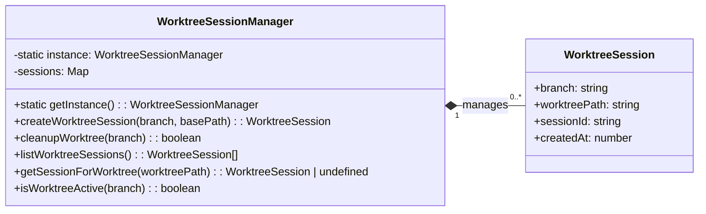

# src — git

This document provides a technical overview and usage guide for the `src/git/worktree-sessions.ts` module, which manages Git worktrees and links them to application-level sessions.

---

## Git Worktree Session Manager

The `src/git/worktree-sessions.ts` module provides a robust mechanism for managing Git worktrees, enabling developers to work on multiple branches simultaneously within a single repository context. It abstracts the underlying Git commands and maintains a registry of active worktree sessions, facilitating parallel development workflows.

### Purpose

The primary goals of this module are:

*   **Parallel Branch Development:** Allow users to create and manage isolated Git worktrees for different branches, enabling concurrent work without constantly switching branches in the main repository.
*   **Session Management:** Link each Git worktree to an application-specific "session" (represented by the `WorktreeSession` interface), providing metadata and a unique identifier for tracking.
*   **Centralized Coordination:** Implement a singleton pattern to ensure a single, globally accessible manager coordinates all worktree sessions within the application.

### Core Concepts

#### WorktreeSession

The `WorktreeSession` interface defines the structure for tracking an active worktree. Each session represents a specific branch being worked on in an isolated worktree.

```typescript
export interface WorktreeSession {
  branch: string;        // The Git branch associated with this worktree.
  worktreePath: string;  // The absolute file system path to the worktree directory.
  sessionId: string;     // A unique identifier for this application session (e.g., 'wt-feature-branch-1678886400000').
  createdAt: number;     // Timestamp when the session was created.
}
```

#### WorktreeSessionManager (Singleton)

The `WorktreeSessionManager` class is the central component of this module. It follows the **singleton pattern**, meaning only one instance of this class can exist at any given time. This ensures consistent state management for all active worktree sessions across the application.



### How It Works

#### 1. Initialization and Singleton Access

The `WorktreeSessionManager` is initialized lazily via its static `getInstance()` method. The first call creates the instance, and subsequent calls return the same instance. This ensures global coordination of worktree states.

```typescript
import { WorktreeSessionManager } from './git/worktree-sessions.js';

const manager = WorktreeSessionManager.getInstance();
// manager is now the single, globally accessible instance.
```

The `resetInstance()` static method is provided primarily for testing purposes, allowing the singleton to be reset between test runs.

#### 2. Creating Worktree Sessions

The `createWorktreeSession(branch: string, basePath: string)` method is responsible for:

1.  **Path Construction:** It determines the worktree's location, typically within a `.worktrees` subdirectory of the `basePath` (e.g., `basePath/.worktrees/my-feature-branch`).
2.  **Directory Creation:** Ensures the parent directories for the new worktree exist using `fs.mkdirSync`.
3.  **Git Worktree Creation:** Executes the `git worktree add` command.
    *   It first attempts `git worktree add "${worktreePath}" "${branch}"`.
    *   If this fails (e.g., the branch doesn't exist or the worktree path is already in use), it retries with `git worktree add -b "${branch}" "${worktreePath}"` to create the branch if it doesn't exist and then add the worktree.
4.  **Session Registration:** Upon successful Git worktree creation, a `WorktreeSession` object is created with a unique `sessionId` and stored internally in a `Map`, keyed by the `branch` name.

#### 3. Managing Active Sessions

The manager maintains an internal `Map<string, WorktreeSession>` to keep track of all active worktree sessions.

*   `listWorktreeSessions()`: Returns an array of all currently registered `WorktreeSession` objects.
*   `getSessionForWorktree(worktreePath: string)`: Allows retrieval of a `WorktreeSession` by its file system path.
*   `isWorktreeActive(branch: string)`: Checks if a session for a given branch is currently active.

#### 4. Cleaning Up Worktrees

The `cleanupWorktree(branch: string)` method handles the removal of a worktree and its associated session:

1.  **Session Lookup:** It retrieves the `WorktreeSession` for the specified `branch`.
2.  **Git Worktree Removal:** If a session is found, it executes `git worktree remove "${session.worktreePath}" --force` to delete the worktree from the file system and Git's internal tracking.
3.  **Session Deregistration:** The session is then removed from the internal `sessions` Map.

### API Reference

*   `static getInstance(): WorktreeSessionManager`: Returns the singleton instance of the manager.
*   `static resetInstance(): void`: Resets the singleton instance (primarily for testing).
*   `createWorktreeSession(branch: string, basePath: string): WorktreeSession`: Creates a new Git worktree and registers a session for it. Throws an error if Git command fails.
*   `listWorktreeSessions(): WorktreeSession[]`: Returns an array of all active worktree sessions.
*   `getSessionForWorktree(worktreePath: string): WorktreeSession | undefined`: Retrieves a session by its worktree file path.
*   `cleanupWorktree(branch: string): boolean`: Removes a Git worktree and its session. Returns `true` if successful, `false` if the session was not found.
*   `isWorktreeActive(branch: string): boolean`: Checks if a worktree session exists for the given branch.

### Integration Points

This module interacts with the following:

*   **Node.js Built-ins:**
    *   `child_process.execSync`: Used to execute Git commands directly.
    *   `path`: For resolving and joining file paths.
    *   `fs`: For file system operations like creating directories (`fs.mkdirSync`).
*   **Internal Utilities:**
    *   `../utils/logger.js`: For logging debug, info, and warning messages.

**Consumers:**

The primary consumer identified is `tests/features/basse-features.test.ts`, which extensively uses all public methods of `WorktreeSessionManager` to validate its functionality. This indicates its role as a foundational utility for features requiring isolated Git environments.

### Usage Example

```typescript
import { WorktreeSessionManager } from './git/worktree-sessions.js';
import * as path from 'path';
import * as os from 'os';
import * as fs from 'fs';

async function demonstrateWorktreeManagement() {
  const manager = WorktreeSessionManager.getInstance();
  const repoBasePath = path.join(os.tmpdir(), 'my-test-repo');

  // Ensure a dummy git repo exists for demonstration
  if (!fs.existsSync(repoBasePath)) {
    fs.mkdirSync(repoBasePath, { recursive: true });
    execSync('git init', { cwd: repoBasePath });
    execSync('git config user.email "test@example.com"', { cwd: repoBasePath });
    execSync('git config user.name "Test User"', { cwd: repoBasePath });
    fs.writeFileSync(path.join(repoBasePath, 'README.md'), '# My Test Repo');
    execSync('git add . && git commit -m "Initial commit"', { cwd: repoBasePath });
    execSync('git branch feature-a', { cwd: repoBasePath });
    execSync('git branch feature-b', { cwd: repoBasePath });
  }

  console.log('--- Creating Worktree for feature-a ---');
  try {
    const sessionA = manager.createWorktreeSession('feature-a', repoBasePath);
    console.log(`Created session for branch: ${sessionA.branch} at ${sessionA.worktreePath}`);
  } catch (error) {
    console.error('Failed to create worktree for feature-a:', error.message);
  }

  console.log('\n--- Creating Worktree for feature-b ---');
  try {
    const sessionB = manager.createWorktreeSession('feature-b', repoBasePath);
    console.log(`Created session for branch: ${sessionB.branch} at ${sessionB.worktreePath}`);
  } catch (error) {
    console.error('Failed to create worktree for feature-b:', error.message);
  }

  console.log('\n--- Listing active sessions ---');
  const activeSessions = manager.listWorktreeSessions();
  activeSessions.forEach(s => console.log(`- Branch: ${s.branch}, Path: ${s.worktreePath}`));

  console.log('\n--- Checking if feature-a is active ---');
  console.log(`Is feature-a active? ${manager.isWorktreeActive('feature-a')}`);

  console.log('\n--- Cleaning up worktree for feature-a ---');
  const cleanedUp = manager.cleanupWorktree('feature-a');
  console.log(`Cleaned up feature-a? ${cleanedUp}`);

  console.log('\n--- Listing active sessions after cleanup ---');
  manager.listWorktreeSessions().forEach(s => console.log(`- Branch: ${s.branch}, Path: ${s.worktreePath}`));

  // Clean up the remaining worktree and the dummy repo
  manager.cleanupWorktree('feature-b');
  execSync(`rm -rf "${repoBasePath}"`);
  console.log('\nDemonstration complete. Temporary repo removed.');
}

// Note: execSync is imported from 'child_process' in the actual module.
// For this example, we'll assume it's available.
import { execSync } from 'child_process';
demonstrateWorktreeManagement();
```