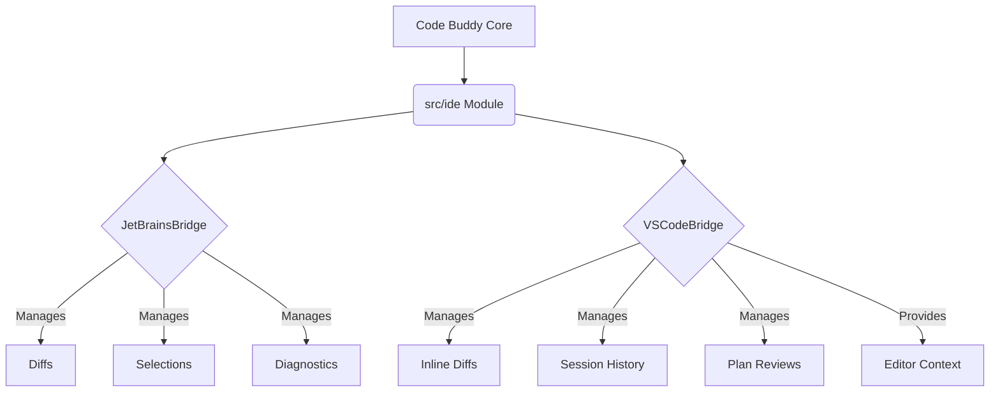

# src — ide

The `src/ide` module serves as the **integration layer** between the core Code Buddy application and various Integrated Development Environments (IDEs). It provides distinct bridges for JetBrains IDEs and VS Code, abstracting IDE-specific functionalities such as diff viewing, code selection sharing, diagnostic reporting, and session management.

This module is crucial for Code Buddy's ability to interact seamlessly with a developer's working environment, enabling features like applying AI-generated code changes, understanding the current editor context, and managing development workflows directly within the IDE.

## Module Architecture

The `src/ide` module is composed of two primary classes, each dedicated to a specific IDE family:

-   `JetBrainsBridge`: Handles interactions with JetBrains IDEs (IntelliJ IDEA, PyCharm, WebStorm, etc.).
-   `VSCodeBridge`: Manages integration with Visual Studio Code.

Both bridges encapsulate IDE-specific logic and state, providing a consistent API for the rest of the Code Buddy application to interact with the developer's environment.



---

## JetBrains Integration (`JetBrainsBridge`)

The `JetBrainsBridge` class (`src/ide/jetbrains-plugin.ts`) provides the necessary scaffolding and logic to integrate Code Buddy with JetBrains IDEs. It manages features like displaying diffs, sharing code selections, reporting diagnostics, and configuring quick launch shortcuts.

### Key Capabilities

*   **Diff Viewing:** Create, retrieve, accept, and reject code differences.
*   **Selection Sharing:** Capture and share the currently selected code in the IDE.
*   **Diagnostic Sharing:** Report and retrieve diagnostic messages (errors, warnings) from the IDE.
*   **Quick Launch:** Configure a keyboard shortcut for quickly launching Code Buddy features.
*   **IDE Compatibility:** Maintain a list of supported JetBrains IDEs.
*   **Plugin XML Generation:** Dynamically generate the `plugin.xml` manifest required for JetBrains plugins.

### Configuration (`JetBrainsConfig`)

The behavior of `JetBrainsBridge` is controlled by the `JetBrainsConfig` interface. An instance can be initialized with a partial configuration, falling back to `DEFAULT_CONFIG` for unspecified properties.

```typescript
export interface JetBrainsConfig {
  enableDiffViewer: boolean;
  enableSelectionSharing: boolean;
  enableDiagnosticSharing: boolean;
  quickLaunchShortcut: string;
  supportedIDEs: string[];
}
```

### Core Methods

*   **`constructor(config?: Partial<JetBrainsConfig>)`**: Initializes the bridge with provided or default configuration.
*   **`createDiff(file: string, before: string, after: string): JetBrainsDiff`**: Generates a diff object and stores it. Throws an error if `enableDiffViewer` is false.
*   **`getDiffs(): JetBrainsDiff[]`**: Returns all currently tracked diffs.
*   **`acceptDiff(file: string): boolean` / `rejectDiff(file: string): boolean`**: Removes a specific diff from tracking.
*   **`clearDiffs(): void`**: Clears all tracked diffs.
*   **`shareSelection(file: string, text: string): void`**: Stores a shared code selection if `enableSelectionSharing` is true.
*   **`getSharedSelections(): SharedSelection[]`**: Retrieves all shared selections.
*   **`shareDiagnostic(file: string, line: number, message: string, type: string): void`**: Stores a diagnostic message if `enableDiagnosticSharing` is true.
*   **`getDiagnostics(): SharedDiagnostic[]`**: Retrieves all shared diagnostics.
*   **`getQuickLaunchShortcut(): string` / `setQuickLaunchShortcut(shortcut: string): void`**: Manages the quick launch shortcut.
*   **`generatePluginXml(): string`**: Produces the XML content for the JetBrains plugin descriptor, including configured actions and shortcuts.

### Internal State

The `JetBrainsBridge` maintains its state using private properties:
*   `private config: JetBrainsConfig`: The active configuration.
*   `private diffs: Map<string, JetBrainsDiff>`: Stores active diffs, keyed by file path.
*   `private sharedSelections: SharedSelection[]`: A list of shared code selections.
*   `private diagnostics: SharedDiagnostic[]`: A list of shared diagnostic messages.

---

## VS Code Integration (`VSCodeBridge`)

The `VSCodeBridge` class (`src/ide/vscode-extension.ts`) provides the necessary scaffolding and logic to integrate Code Buddy with Visual Studio Code. It focuses on features like inline diffs, contextual @-mentions, plan reviews, and session history.

### Key Capabilities

*   **Inline Diffs:** Create and manage detailed inline diffs, including hunk-level information.
*   **Editor Context:** Provide rich context about the current editor state (file, selection, diagnostics, language).
*   **@-Mentions:** Generate context-aware @-mentions for files and selections.
*   **Plan Review:** Facilitate multi-step plan creation and approval workflows.
*   **Session History:** Record and retrieve historical interactions and messages.
*   **Remote Sessions:** Manage and resume remote Code Buddy sessions.
*   **Extension `package.json` Generation:** Dynamically generate the `package.json` manifest for the VS Code extension.

### Configuration (`VSCodeExtensionConfig`)

The behavior of `VSCodeBridge` is controlled by the `VSCodeExtensionConfig` interface. An instance can be initialized with a partial configuration, falling back to `DEFAULT_CONFIG`.

```typescript
export interface VSCodeExtensionConfig {
  enableInlineDiffs: boolean;
  enableAtMentions: boolean;
  enablePlanReview: boolean;
  enableSessionHistory: boolean;
  enableRemoteSessions: boolean;
  autoActivatePythonVenv: boolean;
  multilineInput: boolean;
}
```

### Core Methods

*   **`constructor(config?: Partial<VSCodeExtensionConfig>)`**: Initializes the bridge with provided or default configuration.
*   **`createInlineDiff(file: string, original: string, modified: string): InlineDiff`**: Generates an inline diff with hunks and stores it. Throws an error if `enableInlineDiffs` is false. Internally calls `computeHunks`.
*   **`getActiveDiffs(): InlineDiff[]`**: Returns all currently tracked inline diffs.
*   **`acceptDiff(file: string): boolean` / `rejectDiff(file: string): boolean`**: Removes a specific diff from tracking.
*   **`acceptAllDiffs(): number`**: Clears all tracked diffs.
*   **`getEditorContext(file: string, selection?: { start: number; end: number }): EditorContext`**: Provides contextual information about a file and optional selection, including language detection based on file extension.
*   **`buildAtMention(context: EditorContext): string`**: Constructs an @-mention string based on the provided editor context if `enableAtMentions` is true.
*   **`addSession(id: string, message: string, branch?: string): void`**: Adds an entry to the session history if `enableSessionHistory` is true.
*   **`getSessionHistory(): SessionEntry[]`**: Retrieves the full session history.
*   **`createPlanReview(steps: Array<{ description: string; files: string[] }>): PlanReview`**: Creates a new plan review with unapproved steps if `enablePlanReview` is true.
*   **`approvePlanStep(planId: string, stepIndex: number): boolean`**: Marks a specific step in a plan as approved.
*   **`listRemoteSessions(): Array<{ id: string; task: string; status: string }>`**: Lists active remote sessions if `enableRemoteSessions` is true.
*   **`resumeRemoteSession(id: string): boolean`**: Changes the status of a remote session to 'active'.
*   **`generatePackageJson(): Record<string, unknown>`**: Produces the JSON content for the VS Code extension's `package.json` manifest, including commands and configuration properties.
*   **`getUsageInfo(): { tokensUsed: number; costEstimate: number; plan: string }`**: Provides information on token usage and estimated cost.
*   **`private computeHunks(original: string, modified: string): InlineDiff['hunks']`**: A private helper method that calculates diff hunks between two strings line by line.

### Internal State

The `VSCodeBridge` maintains its state using private properties:
*   `private config: VSCodeExtensionConfig`: The active configuration.
*   `private activeDiffs: Map<string, InlineDiff>`: Stores active inline diffs, keyed by file path.
*   `private sessionHistory: SessionEntry[]`: A list of historical session entries.
*   `private plans: Map<string, PlanReview>`: Stores active plan reviews, keyed by plan ID.
*   `private remoteSessions: Array<{ id: string; task: string; status: string }>`: A list of remote sessions.
*   `private tokensUsed: number`: Tracks the number of tokens consumed.

---

## Integration Points

The `src/ide` module is primarily consumed by testing utilities and potentially other core Code Buddy features that need to interact with the IDE.

*   **`cloud-lsp-ide.test.ts`**: This test suite extensively interacts with both `JetBrainsBridge` and `VSCodeBridge` to verify their functionalities, covering almost all public methods for diff management, context retrieval, session history, and configuration.
*   **`resolveErrors (vscode-extension/src/mentions-handler.ts)`**: The provided call graph indicates a call from `resolveErrors` in `vscode-extension/src/mentions-handler.ts` to `JetBrainsBridge.getDiagnostics()`. This is an unusual cross-IDE dependency and might suggest a misattribution in the call graph data, as a VS Code-specific handler would typically interact with `VSCodeBridge` for diagnostics (e.g., via `EditorContext`). However, based on the provided data, this is an observed interaction point.
*   **`../utils/logger.js`**: Both `JetBrainsBridge` and `VSCodeBridge` utilize the shared `logger` utility for debugging and informational output, aiding in tracing their operations.