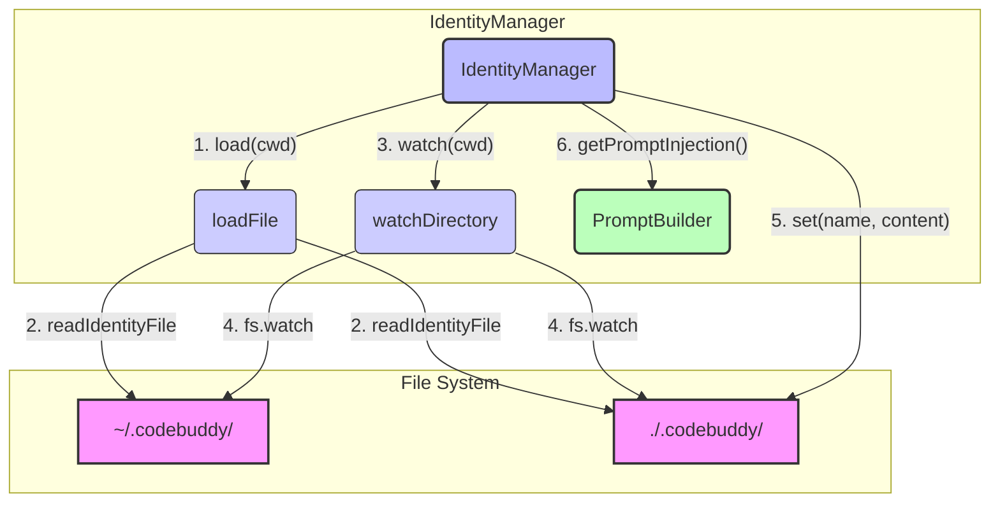

# src — identity

The `src/identity` module, centered around the `IdentityManager` class, is responsible for managing critical "identity" files within the application. These files, such as `SOUL.md`, `USER.md`, and `AGENTS.md`, define the core persona, instructions, and context for the application's AI components.

This module handles the loading, prioritization, hot-reloading, and programmatic management of these files, ensuring that the application always has access to the most current and relevant identity information.

## Purpose

The primary purpose of the `IdentityManager` is to:

1.  **Load Identity Files:** Read predefined markdown files from specific directories.
2.  **Prioritize Files:** Resolve conflicts by giving precedence to project-specific files over global configuration files.
3.  **Hot-Reload Changes:** Monitor these files for changes and automatically update their content in memory.
4.  **Provide Access:** Offer methods to retrieve individual or all loaded identity files.
5.  **Format for Prompts:** Generate a consolidated, structured string of all identity content suitable for direct injection into LLM prompts.
6.  **Programmatic Updates:** Allow identity files to be created or updated directly via code.

## Core Concepts

### Identity Files

These are markdown files (e.g., `SOUL.md`, `USER.md`, `AGENTS.md`, `TOOLS.md`, `INSTRUCTIONS.md`) that contain crucial context for the AI. Each file typically serves a specific purpose, defining aspects like the AI's core personality (`SOUL.md`), user preferences (`USER.md`), available agents (`AGENTS.md`), or specific instructions (`INSTRUCTIONS.md`).

The full list of default files is:
`SOUL.md`, `USER.md`, `AGENTS.md`, `TOOLS.md`, `IDENTITY.md`, `INSTRUCTIONS.md`, `BOOT.md`, `BOOTSTRAP.md`, `HEARTBEAT.md`.

### Project vs. Global Overrides

The `IdentityManager` operates with a clear hierarchy for identity files:

*   **Project-level files:** Located in a `.codebuddy` directory within the current working directory (`cwd`).
*   **Global-level files:** Located in a `.codebuddy` directory in the user's home directory (`~/.codebuddy`).

**Project-level files always take precedence** over global-level files with the same name. For example, if both `project/.codebuddy/SOUL.md` and `~/.codebuddy/SOUL.md` exist, the project-level file's content will be loaded and used. This allows projects to define their own specific AI behavior without affecting global defaults.

### Hot-Reloading

When `watch()` is enabled, the `IdentityManager` monitors both project and global identity directories for file changes. If a file is added, modified, or deleted, the manager automatically reloads its content and emits an `identity:changed` event. This ensures that the application's AI context remains up-to-date without requiring a restart.

## `IdentityManager` Class

The `IdentityManager` class is an `EventEmitter`, allowing other parts of the application to subscribe to identity-related events.

```typescript
export class IdentityManager extends EventEmitter { /* ... */ }
```

### Configuration (`IdentityManagerConfig`)

The manager is configured via an `IdentityManagerConfig` object, which can be partially overridden during instantiation.

```typescript
export interface IdentityManagerConfig {
  projectDir: string; // Default: '.codebuddy'
  globalDir: string;  // Default: '~/.codebuddy'
  watchForChanges: boolean; // Default: true
  fileNames: string[]; // Default: DEFAULT_IDENTITY_FILES
}
```

### Identity File Structure (`IdentityFile`)

When an identity file is loaded, its data is stored in an `IdentityFile` object:

```typescript
export interface IdentityFile {
  name: string;    // e.g., 'SOUL.md'
  content: string; // Trimmed file content
  source: 'project' | 'global'; // Where the file was found
  path: string;    // Absolute path to the file
  lastModified: Date; // Last modification timestamp
}
```

### Events (`IdentityManagerEvents`)

The `IdentityManager` emits the following events:

*   `'identity:loaded'(files: IdentityFile[])`: Emitted after the initial `load()` operation completes, providing all currently loaded files.
*   `'identity:changed'(file: IdentityFile)`: Emitted when a specific identity file's content changes due to a file system event or a programmatic `set()` call.
*   `'identity:error'(error: Error)`: Emitted if an error occurs during file operations (e.g., writing a file).

### Key Public Methods

*   `constructor(config?: Partial<IdentityManagerConfig>)`: Initializes the manager with default or provided configuration.
*   `async load(cwd: string): Promise<IdentityFile[]>`:
    *   Initiates the loading process for all configured `fileNames`.
    *   Scans the `projectDir` first, then `globalDir`.
    *   Populates the internal `files` map.
    *   Emits `'identity:loaded'`.
    *   **Must be called before `set()` or `watch()` to establish the `cwd`.**
*   `get(name: string): IdentityFile | undefined`: Retrieves a single loaded identity file by its name.
*   `getAll(): IdentityFile[]`: Returns an array of all currently loaded identity files.
*   `async set(name: string, content: string): Promise<void>`:
    *   Writes or updates an identity file in the **project directory**.
    *   Creates the project directory if it doesn't exist.
    *   Updates the internal `files` map and emits `'identity:changed'`.
    *   Throws an error if `load()` has not been called first.
*   `getPromptInjection(): string`:
    *   Concatenates the content of all loaded identity files into a single string.
    *   Each file's content is prefixed with `## FILENAME` and separated by `\n\n---\n\n`.
    *   This format is designed for direct injection into LLM system prompts.
*   `watch(cwd: string): void`:
    *   Starts watching the `projectDir` and `globalDir` for changes to configured identity files.
    *   Automatically reloads files and emits `'identity:changed'` on detection.
    *   Calls `unwatch()` first to clear any existing watchers.
*   `unwatch(): void`: Stops all active file system watchers.

### Private Methods

*   `private async loadFile(fileName: string, cwd: string): Promise<IdentityFile | null>`: Handles the logic for loading a single file, checking project directory first, then global.
*   `private async readIdentityFile(filePath: string, name: string, source: 'project' | 'global'): Promise<IdentityFile | null>`: Reads file content from a given path, trims it, and returns an `IdentityFile` object with metadata. Handles non-existent or empty files gracefully by returning `null`.
*   `private watchDirectory(dirPath: string, source: 'project' | 'global'): void`: Sets up an `fs.watch` listener for a specific directory. Filters for configured identity files and handles updates, ensuring project files maintain priority during hot-reloads.

## Singleton Pattern

The `IdentityManager` is typically accessed as a singleton throughout the application to ensure a single, consistent source of truth for identity files.

*   `getIdentityManager(): IdentityManager`: Returns the singleton instance, creating it if it doesn't already exist.
*   `resetIdentityManager(): void`: Primarily used for testing, this function clears the singleton instance and stops any active watchers.

## Architecture Diagram

The `IdentityManager` acts as a central hub for identity-related data, interacting with the file system and providing formatted content to prompt builders.



**Explanation:**

1.  `IdentityManager`'s `load()` method calls `loadFile` which in turn uses `readIdentityFile` to read from both global (`A`) and project (`B`) directories, prioritizing project files.
2.  `watch()` sets up `watchDirectory` which uses `fs.watch` to monitor changes in `A` and `B`.
3.  `set()` directly writes to the project directory (`B`).
4.  `getPromptInjection()` provides formatted content to consumers like the `PromptBuilder`.

## Integration with the Codebase

The `IdentityManager` is a foundational module, integrated across various parts of the application:

### Incoming Calls (Consumers)

*   **`src/services/prompt-builder.ts` (`buildSystemPrompt`)**: This is a critical integration point. The `PromptBuilder` uses `getIdentityManager().getPromptInjection()` to fetch all identity content and include it directly in the system prompt sent to the LLM, providing essential context.
*   **`commands/cli/Native Engine-commands.ts` (`registerIdentityCommands`)**: CLI commands interact with the `IdentityManager` to display or manage identity files (e.g., `getAll()`, `getPromptInjection()`).
*   **`src/server/index.ts` (`createApp`)**: The server might use `getIdentityManager()` to initialize or expose identity information via API endpoints.
*   **`src/tools/git-tool.ts` (`resolveAttributionName`)**: The Git tool might query identity files (e.g., `USER.md`) to determine attribution details for Git commits.
*   **Tests (`tests/identity/identity-manager.test.ts`)**: Extensive tests validate the loading, overriding, watching, and programmatic update functionalities.
*   **`src/index.ts` (`finalizeHeadlessRun`)**: Calls `resetIdentityManager()` to clean up resources after a headless run.

### Outgoing Calls (Dependencies)

*   **`fs/promises`**: Used for all file system operations: `readFile`, `writeFile`, `mkdir`, `stat`.
*   **`fs` (`watch`)**: Used for setting up file system watchers for hot-reloading.
*   **`path`**: For constructing file paths (e.g., `path.join`).
*   **`os` (`homedir`)**: To determine the user's home directory for global configuration.
*   **`events`**: Inherited by `IdentityManager` to emit events.
*   **`../utils/logger.js`**: For logging debug, info, and error messages.