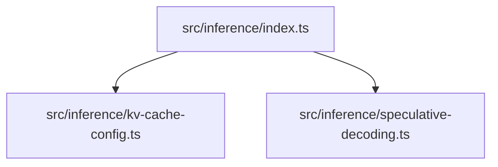

# src — inference

The `src/inference` module provides a suite of tools designed to optimize the performance of local Large Language Model (LLM) inference. It focuses on two critical areas: efficient management of the Key-Value (KV) cache and acceleration through speculative decoding.

This module aims to give developers fine-grained control over inference parameters, enabling them to maximize throughput and minimize latency when running LLMs on local hardware, particularly with backends like `llama.cpp` or `LM Studio`.

## Module Structure

The `inference` module is composed of two primary sub-modules:

*   **`kv-cache-config.ts`**: Handles the configuration and estimation of KV-Cache memory.
*   **`speculative-decoding.ts`**: Implements the logic for speculative decoding.



---

## KV-Cache Configuration

The `src/inference/kv-cache-config.ts` module is responsible for managing and estimating the memory requirements of the Key-Value (KV) cache, a crucial component for LLM inference performance. The KV cache stores the keys and values of past attention layers, preventing recomputation and speeding up token generation, especially for longer contexts.

This module provides tools to configure parameters such as context length, quantization, and memory offloading, and to estimate their impact on memory usage.

### Key Concepts

*   **KV-Cache**: Stores the key and value states of attention layers for previously processed tokens. This is essential for autoregressive generation.
*   **Quantization (`KVQuantization`)**: Reduces the precision of KV cache entries (e.g., from `f16` to `q8_0` or `q4_0`) to save VRAM, at the potential cost of minor quality degradation.
*   **Context Length (`contextLength`)**: The maximum number of tokens the model can process, directly impacting KV cache size.
*   **Memory Offloading (`offloadMode`, `cpuOffloadLayers`)**: Allows moving some KV cache layers from GPU VRAM to system RAM (CPU) to accommodate larger models or contexts on GPUs with limited memory.
*   **Model Architecture (`ModelArchitecture`)**: Specific parameters of an LLM (number of layers, embedding size, attention heads) are critical for accurate KV cache memory estimation.

### `KVCacheManager` Class

The `KVCacheManager` class is the central component for KV cache management. It extends `EventEmitter` to allow for configuration change notifications.

#### Initialization

```typescript
import { KVCacheManager, DEFAULT_KV_CACHE_CONFIG } from './kv-cache-config.js';

const manager = new KVCacheManager({
  contextLength: 8192,
  kvQuantization: 'q8_0',
});
// Or use the singleton instance
const manager = getKVCacheManager();
```

The constructor accepts a `Partial<KVCacheConfig>` to override `DEFAULT_KV_CACHE_CONFIG`. A singleton instance can be retrieved using `getKVCacheManager()`.

#### Core Functionality

1.  **`setArchitecture(arch: ModelArchitecture | string): void`**
    *   Sets the model's architectural parameters. This is crucial for accurate memory estimation.
    *   It can infer architecture from common model names (e.g., `'llama-3.1-8b'`) using the `MODEL_ARCHITECTURES` map, or accept a direct `ModelArchitecture` object.
    *   If an unknown string is provided, it defaults to a generic 7B architecture.

2.  **`estimateMemory(contextLength?: number, batchSize?: number): KVCacheEstimate`**
    *   Calculates the estimated memory footprint of the KV cache based on the current configuration and (if set) the model architecture.
    *   If no architecture is set, it falls back to a `estimateGeneric` heuristic.
    *   It returns a `KVCacheEstimate` object, including GPU/CPU memory usage, total bytes, and a `recommendation` string.

    ```mermaid
    graph TD
        A[KVCacheManager.estimateMemory()] --> B{Architecture Known?}
        B -- Yes --> C[Calculate based on ModelArchitecture]
        B -- No --> D[estimateGeneric()]
        C --> E[Calculate GPU/CPU Memory]
        D --> E
        E --> F[generateRecommendation()]
        F --> G[Return KVCacheEstimate]
    ```

3.  **`optimizeForVRAM(availableVRAMMB: number, modelSizeMB: number): KVCacheConfig`**
    *   Suggests an optimized `KVCacheConfig` based on available VRAM and the model's weight size. This is a heuristic to help users find a working configuration.

4.  **`generateLlamaCppArgs(): string[]`**
    *   Translates the current `KVCacheConfig` into command-line arguments suitable for `llama.cpp` servers (e.g., `-c`, `-b`, `--cache-type-k`, `-ngl`).

5.  **`generateLMStudioConfig(): Record<string, unknown>`**
    *   Generates a configuration object compatible with LM Studio's settings for KV cache and GPU offload.

#### Configuration Management

*   **`getConfig(): KVCacheConfig`**: Returns the current active configuration.
*   **`updateConfig(config: Partial<KVCacheConfig>): void`**: Merges new settings into the current configuration and emits a `configUpdated` event.
*   **`formatConfig(): string`**: Provides a human-readable string representation of the current configuration and memory estimate.

#### Types and Constants

*   **`KVQuantization`**: `'f16' | 'f32' | 'q8_0' | 'q4_0' | 'q4_1'`
*   **`OffloadMode`**: `'none' | 'partial' | 'full'`
*   **`ModelArchitecture`**: Defines model parameters like `nLayers`, `nEmbed`, `nHead`, `nKVHead`.
*   **`KVCacheConfig`**: The main configuration interface for KV cache settings.
*   **`KVCacheEstimate`**: The result of a memory estimation, including `gpuMemoryMB`, `cpuMemoryMB`, and `recommendation`.
*   **`InferenceServerConfig`**: Broader server configuration including `kvCache` and `architecture`.
*   **`DEFAULT_KV_CACHE_CONFIG`**: Baseline settings.
*   **`MODEL_ARCHITECTURES`**: A map of common model names to their `ModelArchitecture` definitions, used for automatic detection.

### Singleton Access

The module provides `getKVCacheManager()` to ensure a single instance of `KVCacheManager` is used throughout the application, and `resetKVCacheManager()` for testing or re-initialization.

---

## Speculative Decoding

The `src/inference/speculative-decoding.ts` module implements speculative decoding, an advanced technique to accelerate LLM inference. It leverages a smaller, faster "draft" model to propose a sequence of tokens, which are then quickly verified by the larger, more accurate "target" model. This can significantly reduce the total time required for autoregressive generation.

### Key Concepts

*   **Draft Model**: A smaller, faster LLM used to quickly generate a sequence of speculative tokens.
*   **Target Model**: The main, larger LLM that verifies the tokens proposed by the draft model.
*   **Speculation Length (`speculationLength`)**: The number of tokens the draft model attempts to generate in a single step.
*   **Acceptance Rate**: The proportion of draft tokens that are successfully verified by the target model. A higher rate indicates better draft model quality and leads to greater speedup.
*   **Adaptive Length (`adaptiveLength`)**: Dynamically adjusts the `speculationLength` based on the observed acceptance rate to optimize performance.

### `SpeculativeDecoder` Class

The `SpeculativeDecoder` class orchestrates the speculative decoding process. It also extends `EventEmitter` to provide updates on the generation process.

#### Initialization

```typescript
import { SpeculativeDecoder, DEFAULT_SPECULATIVE_CONFIG } from './speculative-decoding.js';

const decoder = new SpeculativeDecoder({
  speculationLength: 5,
  minAcceptanceRate: 0.6,
});
// Or use the singleton instance
const decoder = getSpeculativeDecoder();
```

The constructor takes a `Partial<SpeculativeConfig>` to customize behavior, falling back to `DEFAULT_SPECULATIVE_CONFIG`. A singleton instance is available via `getSpeculativeDecoder()`.

#### Core Functionality

1.  **`generate(prompt, maxTokens, draftCallback, targetCallback, onToken?): Promise<{ tokens: number[]; stats: SpeculativeStats }>`**
    *   This is the main method for performing speculative generation.
    *   It takes a `prompt`, `maxTokens` to generate, and two crucial callback functions:
        *   `draftCallback`: A function that simulates or calls the draft model to propose tokens.
        *   `targetCallback`: A function that simulates or calls the target model to verify the proposed tokens.
    *   It emits `draft`, `verify`, and `complete` events during the process.

    ```mermaid
    graph TD
        A[SpeculativeDecoder.generate()] --> B{Loop until maxTokens or EOS}
        B --> C[draftCallback(currentPrompt, currentSpecLength)]
        C --> D[targetCallback(currentPrompt, draftTokens)]
        D --> E[updateStats(proposed, accepted)]
        E --> F[updatePrompt(currentPrompt, finalTokens)]
        F --> G{adaptiveLength enabled?}
        G -- Yes --> H[adaptSpeculationLength(accepted, proposed)]
        H --> B
        G -- No --> B
        B --> I[Return generated tokens and stats]
    ```

2.  **`updateStats(proposed: number, accepted: number): void`**
    *   Internal method to update `SpeculativeStats` after each speculation round, calculating acceptance rate, average tokens per round, and estimated speedup.

3.  **`adaptSpeculationLength(accepted: number, proposed: number): void`**
    *   Dynamically adjusts `currentSpecLength` based on the acceptance rate. High acceptance increases length, low acceptance decreases it.

4.  **`shouldUseSpeculation(): boolean`**
    *   Provides a heuristic to determine if speculative decoding is currently beneficial, based on acceptance rate and estimated speedup.

5.  **`generateLlamaCppArgs(): string[]`**
    *   Generates command-line arguments for `llama.cpp` to enable speculative decoding (e.g., `--model-draft`, `--draft`). Note that this requires the draft model to be loaded separately.

#### Configuration and Statistics

*   **`getConfig(): SpeculativeConfig`**: Returns the current configuration.
*   **`updateConfig(config: Partial<SpeculativeConfig>): void`**: Updates the configuration and emits a `configUpdated` event.
*   **`getStats(): SpeculativeStats`**: Returns the current performance statistics.
*   **`resetStats(): void`**: Resets all performance statistics and the adaptive speculation length.
*   **`formatStats(): string`**: Provides a human-readable string representation of the current statistics.

#### Static Utility

*   **`static getRecommendedDraft(targetModel: string): ModelPair | null`**
    *   Suggests a suitable draft model for a given target model based on `RECOMMENDED_PAIRS`. This helps users select compatible model pairs for optimal performance.

#### Types and Constants

*   **`SpeculativeConfig`**: The main configuration interface for speculative decoding.
*   **`SpeculativeStats`**: Tracks performance metrics like `totalTokens`, `acceptanceRate`, `estimatedSpeedup`.
*   **`DraftProposal`**: The output of the draft model callback.
*   **`VerificationResult`**: The output of the target model callback.
*   **`DraftModelCallback`**, **`TargetModelCallback`**: Type definitions for the asynchronous functions that interact with the actual LLM inference backends.
*   **`ModelPair`**: Defines recommended draft/target model combinations.
*   **`DEFAULT_SPECULATIVE_CONFIG`**: Baseline settings.
*   **`RECOMMENDED_PAIRS`**: Pre-defined compatible draft/target model pairs.

### Mock Implementations

The module includes `createMockDraftCallback()` and `createMockTargetCallback()` for testing and development purposes. These functions simulate the behavior of actual LLM calls, allowing for easy testing of the `SpeculativeDecoder` logic without needing a live LLM server.

### Singleton Access

Similar to `KVCacheManager`, `getSpeculativeDecoder()` provides a singleton instance, and `resetSpeculativeDecoder()` allows for cleanup and re-initialization. The `dispose()` method is called during `resetSpeculativeDecoder()` to clean up event listeners.

---

## Integration and Usage

The `inference` module is designed to be integrated into applications that manage local LLM inference.

*   **Configuration**: An application might use `KVCacheManager` to allow users to configure KV cache settings, estimate memory usage, and then pass the generated `llama.cpp` arguments or `LM Studio` config to the respective server processes.
*   **Dynamic Optimization**: `KVCacheManager.optimizeForVRAM()` can be used to automatically suggest configurations based on detected system resources.
*   **Accelerated Generation**: `SpeculativeDecoder` can be employed to wrap existing LLM generation logic (represented by `draftCallback` and `targetCallback`), providing a significant speedup for token generation. The `shouldUseSpeculation()` method can help decide when to enable or disable this feature dynamically.
*   **Monitoring**: Both `KVCacheManager` and `SpeculativeDecoder` provide `formatConfig()` and `formatStats()` methods, respectively, which are useful for displaying current settings and performance metrics in a user interface or logs.

Both `KVCacheManager` and `SpeculativeDecoder` extend `EventEmitter`, allowing external components to subscribe to configuration updates (`configUpdated`) or generation events (`draft`, `verify`, `complete`). The `logger` utility from `src/utils/logger.js` is used internally for debugging and informational messages.

By combining the memory efficiency of KV-Cache configuration with the speed benefits of speculative decoding, this module provides a powerful foundation for building high-performance local LLM applications.