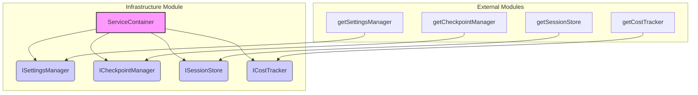

# src — infrastructure

The `src/infrastructure` module is the foundational layer for dependency injection and service management within the CodeBuddy application. It centralizes the creation and provision of core application services, promoting a loosely coupled architecture, improved testability, and clear dependency management.

## Purpose

The primary goal of the `infrastructure` module is to:

1.  **Provide a Service Container**: A central registry (`ServiceContainer`) that manages the lifecycle and dependencies of key application services.
2.  **Define Core Service Contracts**: Establish type-safe interfaces for essential services like settings management, checkpointing, session storage, and cost tracking. This allows for interchangeable implementations and easier mocking in tests.
3.  **Facilitate Dependency Injection**: Instead of services directly instantiating their dependencies, they receive them from the container, making the system more modular and testable.
4.  **Standardize Service Patterns**: Offer common interfaces for service lifecycle (`IService`), health checks (`IHealthCheckable`), logging (`ILogger`), and event handling (`IEventEmitter`).

## Core Concept: The Service Container

The heart of this module is the `ServiceContainer` class, which acts as a central hub for accessing application-wide services. It implements a singleton pattern for its default instance, ensuring that all parts of the application access the same set of core services.

### `ServiceContainer` Class

The `ServiceContainer` is responsible for:

*   **Holding Service Instances**: It directly holds references to concrete implementations of `ISettingsManager`, `ICheckpointManager`, `ISessionStore`, and `ICostTracker`.
*   **Lazy Initialization (for default services)**: When `ServiceContainer.create()` is called for the first time, it initializes the default service implementations by calling their respective factory functions (e.g., `getSettingsManager()`).
*   **Configurable Instances**: It allows for custom service implementations to be injected, which is crucial for testing.

#### Key Methods:

*   `ServiceContainer.create()`: The primary way to get the singleton instance of the container. If an instance doesn't exist, it creates a default one.
*   `ServiceContainer.createDefault()`: Creates a *new*, independent container instance with default services. This does not affect the singleton.
*   `ServiceContainer.createWithConfig(config: IServiceContainerConfig)`: Creates a new container instance, allowing specific services to be overridden with custom implementations (e.g., mocks). Any services not provided in `config` will fall back to their default implementations.
*   `ServiceContainer.reset()`: Resets the singleton instance, forcing a new default container to be created on the next `create()` call. Useful for ensuring test isolation.
*   `ServiceContainer.setInstance(container: ServiceContainer)`: Allows a custom container (e.g., a test container) to be set as the global singleton.

### Accessing the Container

The recommended way to access the singleton `ServiceContainer` is via the `getServiceContainer()` convenience function:

```typescript
import { getServiceContainer } from '../infrastructure';

const container = getServiceContainer();
const settingsManager = container.settings;
const checkpointManager = container.checkpoints;
// ... and so on
```

### Testing with the Container

The `infrastructure` module is designed with testability in mind. The `createTestContainer()` function and the `createWithConfig()` method are essential for unit and integration testing:

```typescript
import { createTestContainer, ICheckpointManager } from '../infrastructure';

// Create a mock checkpoint manager
const mockCheckpointManager: ICheckpointManager = {
  id: 'mock-checkpoints',
  name: 'Mock Checkpoint Manager',
  isInitialized: () => true,
  initialize: async () => {},
  dispose: async () => {},
  createCheckpoint: jest.fn(),
  checkpointBeforeEdit: jest.fn(),
  restoreCheckpoint: jest.fn(() => true),
  getCheckpoints: jest.fn(() => []),
  getCheckpoint: jest.fn(() => undefined),
  clearCheckpoints: jest.fn(),
  clearOldCheckpoints: jest.fn(),
  rewindToLast: jest.fn(() => ({ success: true, restored: [], errors: [] })),
  formatCheckpointList: jest.fn(() => 'Mock Checkpoints'),
  on: jest.fn(),
  off: jest.fn(),
  emit: jest.fn(),
  once: jest.fn(),
};

// Create a test container with the mock
const testContainer = createTestContainer({
  checkpoints: mockCheckpointManager,
});

// Now, testContainer.checkpoints will be your mock
testContainer.checkpoints.createCheckpoint('test');
expect(mockCheckpointManager.createCheckpoint).toHaveBeenCalledWith('test');
```

The module also provides default mock factory functions (`createMockSettingsManager`, `createMockCheckpointManager`, etc.) within `service-container.ts` that `createTestContainer` uses if no specific mocks are provided. These mocks offer basic, non-functional implementations suitable for tests that don't rely on the specific behavior of those services.

### Service Container Architecture

The following diagram illustrates the `ServiceContainer` and its direct dependencies on the core service interfaces, along with how default implementations are sourced:


This diagram shows that `ServiceContainer` is constructed with instances that conform to the `ISettingsManager`, `ICheckpointManager`, `ISessionStore`, and `ICostTracker` interfaces. The default implementations for these interfaces are provided by functions (`getSettingsManager`, etc.) located in other modules, which are then imported and used by `ServiceContainer`'s private factory methods.

## Key Service Interfaces

The `src/infrastructure/types.ts` file defines the specific interfaces for the core services managed by the `ServiceContainer`. These interfaces ensure type safety and provide a clear contract for each service.

### `ISettingsManager`

Manages user and project-level configuration settings.

*   **Purpose**: Provides a unified API to load, save, and retrieve various settings, including API keys, models, and base URLs.
*   **Key Methods**:
    *   `loadUserSettings()`, `saveUserSettings()`, `updateUserSetting()`, `getUserSetting()`: For global user preferences.
    *   `loadProjectSettings()`, `saveProjectSettings()`, `updateProjectSetting()`, `getProjectSetting()`: For project-specific configurations.
    *   `getCurrentModel()`, `setCurrentModel()`, `getAvailableModels()`, `getApiKey()`, `getBaseURL()`: Convenience methods for common settings.

### `ICheckpointManager`

Handles the creation, restoration, and management of code checkpoints.

*   **Purpose**: Allows the application to save snapshots of files at critical moments (e.g., before an AI edit) and restore them if needed.
*   **Key Methods**:
    *   `createCheckpoint(description: string, files?: string[])`: Saves the current state of specified files.
    *   `checkpointBeforeEdit(filePath: string, description?: string)`: Creates a checkpoint specifically before an edit to a file.
    *   `restoreCheckpoint(checkpointId: string)`: Reverts files to a previous checkpoint.
    *   `getCheckpoints()`, `getCheckpoint(id: string)`: Retrieve checkpoint history.
    *   `rewindToLast()`: Restores the most recent checkpoint.
*   **Events**: Extends `EventEmitter`, allowing other parts of the application to subscribe to checkpoint-related events.

### `ISessionStore`

Manages the lifecycle and data of user interaction sessions.

*   **Purpose**: Stores chat history, session metadata, and manages the active session.
*   **Key Methods**:
    *   `createSession(name: string, model: string)`: Starts a new session.
    *   `getCurrentSession()`, `setCurrentSession(sessionId: string)`: Manages the active session.
    *   `listSessions()`, `getSession(id: string)`, `deleteSession(id: string)`: For managing session history.
    *   `addMessage(message: ISessionMessage)`: Appends messages to the current session's chat history.
    *   `exportSessionToFile(sessionId: string, outputPath?: string)`: Exports session data.

### `ICostTracker`

Tracks token usage and calculates costs associated with AI model interactions.

*   **Purpose**: Monitors the financial impact of using AI models, providing insights into usage patterns and helping manage budgets.
*   **Key Methods**:
    *   `recordUsage(inputTokens: number, outputTokens: number, model: string)`: Logs token usage for a specific model.
    *   `calculateCost(inputTokens: number, outputTokens: number, model: string)`: Determines the cost of a given token exchange.
    *   `getReport()`: Generates a comprehensive cost report (session, daily, weekly, monthly, total).
    *   `setBudgetLimit(limit: number)`, `setDailyLimit(limit: number)`: Configures spending limits.
    *   `formatDashboard()`: Provides a formatted string for displaying cost information.
*   **Events**: Extends `EventEmitter`, allowing other parts of the application to react to cost-related events (e.g., budget warnings).

## General Service Contracts

The `src/infrastructure/interfaces/service.interface.ts` file defines a set of broader interfaces that establish common patterns for services throughout the application, regardless of their specific domain.

### `IService` (Lifecycle)

The fundamental interface for any managed service.

*   **Purpose**: Defines a standard lifecycle for services, including initialization, disposal, and a unique identifier.
*   **Key Methods**:
    *   `id`, `name`: Unique identifier and display name.
    *   `isInitialized()`: Checks if the service has completed initialization.
    *   `initialize()`: Asynchronous method to set up the service.
    *   `dispose()`: Asynchronous method to clean up service resources.

### `IHealthCheckable` (Health Checks)

For services that can report their operational status.

*   **Purpose**: Allows the application to monitor the health of its components, useful for diagnostics and robust operation.
*   **Key Methods**:
    *   `checkHealth()`: Returns an `IHealthCheckResult` indicating `healthy`, `degraded`, `unhealthy`, or `unknown` status.

### `IDisposable` / `ISyncDisposable` (Resource Cleanup)

For services or objects that manage resources requiring explicit cleanup.

*   **Purpose**: Ensures that resources (e.g., file handles, network connections, event listeners) are properly released when an object is no longer needed.
*   **Key Methods**:
    *   `dispose()`: Can be synchronous or asynchronous.

### `ILogger` (Logging)

A standardized interface for logging messages.

*   **Purpose**: Provides a consistent way for services to emit log messages at different levels (debug, info, warn, error), optionally with contextual data.
*   **Key Methods**: `debug()`, `info()`, `warn()`, `error()`.

### `IEventEmitter` (Events)

A type-safe interface for event publishing and subscription.

*   **Purpose**: Enables loose coupling between components by allowing them to communicate through events without direct dependencies.
*   **Key Methods**: `on()`, `off()`, `emit()`, `once()`.

### `IConfigProvider` (Configuration)

An interface for accessing configuration values.

*   **Purpose**: Provides a generic way to retrieve configuration settings, abstracting the source of the configuration.
*   **Key Methods**: `get()`, `getOrDefault()`, `has()`, `getAll()`.

### `IServiceRegistry` and `IServiceDescriptor` (Advanced DI)

These interfaces are part of a more advanced dependency injection pattern, typically used by a full-fledged DI container to register and resolve services with specific lifetimes (`singleton`, `transient`, `scoped`). While exported by this module, the current `ServiceContainer` implementation uses a simpler, direct property-based access pattern for its core services rather than a dynamic registry. They serve as foundational types for potential future expansion of the DI system.

## Module Structure and Exports

The `src/infrastructure` module is organized as follows:

*   **`index.ts`**: The main entry point. It re-exports all public types, interfaces, and the `ServiceContainer` class, `getServiceContainer` function, and `createTestContainer` function. This is the file you typically import from.
*   **`types.ts`**: Contains the specific interfaces for the core services managed by the `ServiceContainer` (e.g., `ISettingsManager`, `ICheckpointManager`). It also defines related data structures like `IUserSettings`, `ICheckpoint`, `ISession`, `ITokenUsage`.
*   **`interfaces/index.ts`**: Re-exports all general service contracts from `service.interface.ts`.
*   **`interfaces/service.interface.ts`**: Defines the general-purpose interfaces for service lifecycle, health, logging, events, etc., that can be applied to any service.
*   **`service-container.ts`**: Contains the concrete implementation of the `ServiceContainer` class, its static factory methods, and the mock factory functions used for testing.

## Integration Points

The `infrastructure` module is designed to be a central dependency for many other parts of the CodeBuddy application.

*   **Agent Infrastructure**: Modules like `agent/infrastructure/agent-infrastructure.ts` directly use `getServiceContainer()` to obtain instances of core services needed by the AI agent.
*   **Utilities**: Other utility modules or command handlers will likely access services like `ISettingsManager` or `ISessionStore` via the container.
*   **Tests**: The `createTestContainer()` and `createWithConfig()` functions are heavily used in unit and integration tests (e.g., `tests/unit/service-container.test.ts`) to inject mock dependencies and isolate components under test.

By providing a consistent and controlled way to access core services, the `infrastructure` module ensures that the application remains maintainable, scalable, and robust.