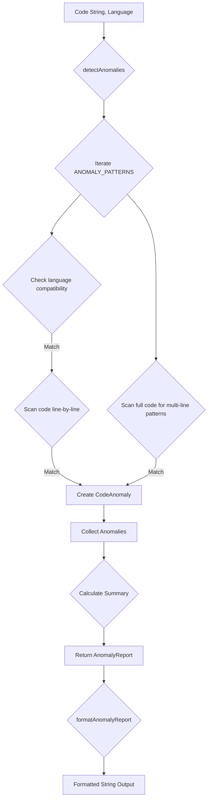
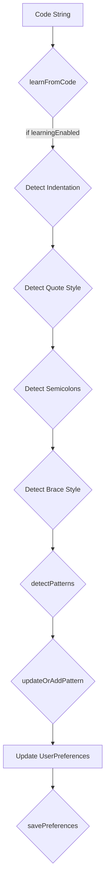

# src — intelligence

The `src/intelligence` module provides a suite of analytical and adaptive capabilities designed to enhance developer productivity and code quality. It acts as the "brain" of the system, offering insights, recommendations, and personalized experiences based on code analysis, project context, and user interactions.

This module is composed of several distinct sub-modules, each focusing on a specific aspect of intelligence:

*   **Anomaly Detector**: Identifies potential issues and anti-patterns in code.
*   **Proactive Suggestions Engine**: Generates contextual recommendations based on project state.
*   **Refactoring Recommender**: Pinpoints opportunities for code improvement and modernization.
*   **Semantic Search Engine**: Enables intelligent search through conversation history.
*   **Task Complexity Estimator**: Analyzes task descriptions to estimate effort and risks.
*   **User Preferences Learning**: Adapts to and learns user's coding and communication styles.

## Intelligence Module Overview

The core principle behind the `intelligence` module is to provide actionable insights without requiring explicit user queries for every analysis. It aims to anticipate developer needs, highlight potential problems, and guide towards best practices, ultimately reducing cognitive load and improving development workflows.

### Core Principles

*   **Pattern-Based Analysis**: Many components rely on regular expressions and keyword matching to identify specific code constructs, project states, or task characteristics.
*   **Contextual Awareness**: Information from various sources (Git, `package.json`, file system, conversation history) is aggregated to provide relevant suggestions.
*   **Adaptability**: The `UserPreferences` component allows the system to learn and tailor its output to individual developer styles.
*   **Actionable Output**: Recommendations often include concrete suggestions, commands, or examples to facilitate immediate action.

## Components

### Anomaly Detector (`anomaly-detector.ts`)

The Anomaly Detector is responsible for scanning code for unusual patterns, potential security vulnerabilities, performance anti-patterns, and inconsistencies.

#### Purpose

To automatically identify and report common code issues that might otherwise go unnoticed, helping maintain code quality and security standards.

#### How it Works

The primary function, `detectAnomalies`, takes a `code` string, `language`, and optional `filePath`. It iterates through a predefined list of `ANOMALY_PATTERNS`. Each pattern is a regular expression designed to catch specific code smells or issues.

For each pattern, it first checks if the pattern is language-specific and skips if it doesn't match the provided `language`. It then scans the code line by line. If a match is found, a `CodeAnomaly` object is created with details like category, severity, message, and line number. It also performs a full-code scan for multi-line patterns.

After all patterns are checked, `detectAnomalies` compiles an `AnomalyReport` which includes a summary of total anomalies, and counts by category and severity.

The `formatAnomalyReport` function then takes this structured report and renders it into a human-readable string, grouped by severity. The `getAnomalyStats` function aggregates reports from multiple files to provide overall project statistics.

#### Key Data Structures

*   `AnomalySeverity`: `'info' | 'warning' | 'error' | 'critical'`
*   `AnomalyCategory`: e.g., `'security'`, `'performance'`, `'logic'`
*   `CodeAnomaly`: Detailed information about a single detected anomaly.
*   `AnomalyReport`: Contains a list of `CodeAnomaly` objects and a summary for a given file.
*   `AnomalyPattern`: Internal interface defining a detection rule, including its `pattern` (RegExp), `category`, `severity`, and `message`.

#### Example Flow



### Proactive Suggestions Engine (`proactive-suggestions.ts`)

This component analyzes the current state of a project and generates actionable suggestions across various domains like Git workflow, testing, documentation, and security.

#### Purpose

To provide developers with timely, contextual advice and reminders to improve project health and adherence to best practices.

#### How it Works

The `generateSuggestions` asynchronous function is the entry point. It first calls `analyzeProjectContext` to gather comprehensive information about the project. This context includes:

*   **Git Status**: Obtained via `getGitStatus`, which executes `git` commands using `child_process.execSync` to determine branch, uncommitted changes, unpushed commits, etc.
*   **Package Info**: Reads `package.json` to get dependencies, scripts, and check for lockfiles.
*   **File Existence Checks**: Uses `fs-extra.pathExists` to check for common test directories, documentation files (README.md, docs/), and CI/CD configurations (.github/workflows, .gitlab-ci.yml).

Once the `ProjectContext` is assembled, `generateSuggestions` dispatches to several helper functions:
*   `generateGitSuggestions(context.gitStatus)`
*   `generatePackageSuggestions(context.packageInfo)`
*   `generateTestingSuggestions(projectPath, context)`
*   `generateDocSuggestions(projectPath, context)`
*   `generateSecuritySuggestions(projectPath, context)`
*   `generateWorkflowSuggestions(context)`

Each of these functions applies specific rules to the context data and returns an array of `ProactiveSuggestion` objects. These suggestions are then aggregated and sorted by `SuggestionPriority` before being returned.

The `formatSuggestions` function provides a display-ready string representation of the suggestions.

#### Key Data Structures

*   `SuggestionType`: e.g., `'git'`, `'code-quality'`, `'security'`
*   `SuggestionPriority`: `'low' | 'medium' | 'high' | 'urgent'`
*   `ProactiveSuggestion`: Details a single suggestion, including title, description, and optional `action` or `command`.
*   `ProjectContext`: Aggregates various pieces of project information.
*   `GitStatus`: Specific details about the Git repository state.
*   `PackageInfo`: Details extracted from `package.json`.

#### Integration

*   **Incoming Calls**: `handleSuggest` (from `commands/handlers/suggest-handler.ts`) is a known consumer of `generateSuggestions`.
*   **Outgoing Calls**: `getGitStatus` internally calls `execSync` (which is an outgoing call to `src/desktop-automation/base-native-provider.ts`). `generateSecuritySuggestions` calls `fs.readFile` (an outgoing call to `src/sandbox/e2b-sandbox.ts`).

#### Execution Flow: HandleSuggest → ExecSync

1.  `handleSuggest` (commands/handlers/suggest-handler.ts) initiates the process.
2.  It calls `generateSuggestions` (src/intelligence/proactive-suggestions.ts).
3.  `generateSuggestions` calls `analyzeProjectContext` to gather project data.
4.  `analyzeProjectContext` calls `getGitStatus` to query the Git repository.
5.  `getGitStatus` executes `git` commands using `execSync` (src/desktop-automation/base-native-provider.ts) to retrieve status information.

### Refactoring Recommender (`refactoring-recommender.ts`)

This component analyzes code to identify common code smells and opportunities for refactoring, aiming to improve readability, maintainability, and performance.

#### Purpose

To guide developers in improving code quality by suggesting specific refactoring techniques based on detected patterns.

#### How it Works

The `analyzeForRefactoring` function takes `code`, `language`, and `filePath`. Similar to the Anomaly Detector, it uses a set of `REFACTORING_RULES`, each with a `pattern` (RegExp), `category`, `priority`, and `suggestion`.

It iterates through these rules, applying them to the code. Rules can be `multiLine` or single-line. For multi-line rules, `matchAll` is used on the entire code string; for single-line rules, each line is checked. When a match is found, a `RefactoringRecommendation` is created, including an estimated impact on readability, maintainability, and performance (calculated by `getImpactEstimate`).

After processing all rules, `analyzeForRefactoring` calls `calculateSummary` to aggregate statistics by category and priority, and compute an `overallScore` (0-100, higher is better). The result is a `RefactoringReport`.

The `formatRefactoringReport` function then converts this report into a formatted string for display. Helper functions like `getPriorityRecommendations` and `getRecommendationsByCategory` allow filtering the results, and `estimateRefactoringEffort` provides a time estimate for addressing the recommendations.

#### Key Data Structures

*   `RefactoringCategory`: e.g., `'extract-method'`, `'simplify'`, `'modernize'`
*   `RefactoringPriority`: `'low' | 'medium' | 'high' | 'critical'`
*   `RefactoringRecommendation`: Details a single refactoring opportunity, including location, suggestion, and estimated impact.
*   `RefactoringReport`: Contains a list of `RefactoringRecommendation` objects and a summary for a given file.
*   `RefactoringRule`: Internal interface defining a refactoring detection rule.

### Semantic Search Engine (`semantic-search.ts`)

The Semantic Search Engine provides intelligent search capabilities over conversation history, allowing users to quickly find relevant past interactions.

#### Purpose

To enable efficient and context-aware retrieval of past conversation messages, supporting knowledge recall and continuity.

#### How it Works

This component is implemented as a stateful class, `SemanticSearchEngine`. It maintains an in-memory index of `ConversationMessage` objects.

1.  **Initialization & Persistence**: The constructor loads messages from a JSON file (`~/.codebuddy/search-index.json`) using `fs-extra`. Messages are stored in an array, and a `wordIndex` (Map<string, Set<string>>) maps words to message IDs for fast lookup. `loadIndex` and `saveIndex` handle disk persistence.
2.  **Indexing**: `addMessage` and `addMessages` append new conversations. Each message's content and metadata (tools) are tokenized (`tokenize` function, which filters stop words) and added to the `wordIndex`.
3.  **Trimming**: To prevent memory bloat, `trimIfNeeded` automatically prunes older messages and rebuilds the index if `MAX_MESSAGES` is exceeded. `trimWordIndex` limits entries per word.
4.  **Searching**: The `search` method takes a `query` and `SearchOptions`.
    *   It first tokenizes the query.
    *   `findCandidates` uses the `wordIndex` for fast retrieval of messages containing query terms (exact and prefix matches).
    *   For each candidate message, `scoreMessage` calculates a relevance score based on:
        *   Exact phrase match.
        *   Term frequency and fuzzy matching (`fuzzyMatch`).
        *   Coverage of query terms.
        *   Recency bonus.
        *   Role bonus (user messages slightly preferred).
    *   Messages are filtered by `role`, `sessionId`, and `dateRange` as specified in `SearchOptions`.
    *   Results are sorted by score and limited.
    *   If `contextSize` is specified, `addContext` retrieves surrounding messages from the same session.
5.  **Utility Functions**: `findSimilar`, `getRecent`, `getBySession`, `getStats`, `clear`, `pruneOlderThan`, and `formatResults` provide additional functionalities.
6.  **Singleton**: `getSemanticSearchEngine` ensures only one instance of the engine exists, managing a shared index.

#### Key Data Structures

*   `ConversationMessage`: Represents a single message in the conversation history.
*   `SearchResult`: Contains a matching `ConversationMessage`, its `score`, `highlights`, and `matchType`.
*   `SearchOptions`: Allows specifying search parameters like `limit`, `role`, `dateRange`, `fuzzyMatch`, etc.
*   `wordIndex`: `Map<string, Set<string>>` - the core inverted index for fast word-to-message-ID lookup.

#### Example Flow (Search)

```mermaid
graph TD
    A[Query, Options] --> B{search}
    B --> C{tokenize Query}
    C --> D{findCandidates (using wordIndex)}
    D --> E{Filter Candidates by Options}
    E --> F{scoreMessage for each candidate}
    F -- Score, Highlights, MatchType --> G[Collect SearchResults]
    G --> H{Sort by Score}
    H --> I{Limit Results}
    I -- if contextSize > 0 --> J{addContext}
    J --> K[Return SearchResult[]]
```

### Task Complexity Estimator (`task-complexity-estimator.ts`)

This component analyzes natural language task descriptions to estimate their complexity, identify risks, and provide effort estimates.

#### Purpose

To assist developers and project managers in understanding the scope, challenges, and time investment required for a given task.

#### How it Works

The `estimateTaskComplexity` function is the core of this component.

1.  **Task Classification**: It iterates through `TASK_PATTERNS` (regular expressions) to classify the task into a `TaskCategory` (e.g., 'bug-fix', 'feature', 'refactor'). Each pattern has a `baseComplexity` score and initial `ComplexityFactors`.
2.  **Complexity Modifiers**: It then applies `COMPLEXITY_MODIFIERS` (more regex patterns) to adjust the `complexityMultiplier` based on keywords indicating urgency, legacy code, broad scope, etc.
3.  **Score Calculation**: A final `complexityScore` (1-100) is calculated, and a `ComplexityLevel` is derived using `getComplexityLevel`.
4.  **Factor Adjustment**: `ComplexityFactors` (scope, technical debt, unknowns, dependencies, testing effort, regression risk) are refined based on the task description and modifiers.
5.  **Risk Assessment**: `RiskAssessment` objects are generated, including both predefined risks from `TASK_PATTERNS` and generic risks derived from high `ComplexityFactors`. `getRiskLevel` determines the severity.
6.  **Effort Estimation**: `calculateEffort` uses the `complexityScore` and `factors` to determine `minHours`, `maxHours`, `typicalHours`, and a `breakdown` for planning, implementation, testing, and review.
7.  **Suggestions**: `generateSuggestions` provides contextual advice based on the task category, complexity, and factors.
8.  **Confidence**: A `confidence` score is assigned based on how well the task description matched known patterns.

The `formatTaskEstimate` function renders the detailed estimate into a readable string, including a visual bar for factors using `renderBar`. `compareTasks` allows estimating and comparing multiple tasks.

#### Key Data Structures

*   `ComplexityLevel`: `'trivial' | 'simple' | 'moderate' | 'complex' | 'very-complex'`
*   `RiskLevel`: `'low' | 'medium' | 'high' | 'critical'`
*   `TaskCategory`: e.g., `'bug-fix'`, `'feature'`, `'refactor'`
*   `ComplexityFactors`: Numerical scores (1-10) for various aspects influencing complexity.
*   `TaskEstimate`: The comprehensive output of the estimation, including category, complexity, factors, risks, effort, and suggestions.
*   `EffortEstimate`: Detailed breakdown of estimated hours.
*   `TaskPattern`: Internal interface defining rules for task classification.
*   `COMPLEXITY_MODIFIERS`: Internal array for adjusting complexity based on keywords.

#### Example Flow

```mermaid
graph TD
    A[Task Description] --> B{estimateTaskComplexity}
    B --> C{Classify Task (TASK_PATTERNS)}
    C --> D{Apply Modifiers (COMPLEXITY_MODIFIERS)}
    D --> E{Calculate Complexity Score & Level}
    E --> F{Adjust Complexity Factors}
    F --> G{Assess Risks}
    G --> H{Calculate Effort (calculateEffort)}
    H --> I{Generate Suggestions}
    I --> J[Return TaskEstimate]
    J --> K{formatTaskEstimate}
    K --> L[Formatted String Output]
```

### User Preferences Learning (`user-preferences.ts`)

This component learns and adapts to a user's individual preferences, including coding style, tool usage, and communication style.

#### Purpose

To personalize the system's behavior and output, making it more aligned with the user's habits and expectations, thereby improving user experience and efficiency.

#### How it Works

The `PreferencesManager` is a stateful class that manages `UserPreferences`.

1.  **Initialization & Persistence**: The constructor loads preferences from a JSON file (`~/.codebuddy/preferences.json`). `loadPreferences` and `savePreferences` handle disk I/O. Default preferences are used if no file exists.
2.  **Coding Style Learning**: `learnFromCode` analyzes a provided code string to infer preferences like `indentation` (spaces/tabs, size), `quotes` (single/double), `semicolons`, and `braceStyle`. It also calls `detectPatterns` to identify common coding patterns (e.g., naming conventions, import styles).
3.  **Tool Usage Tracking**: `recordToolUsage` tracks how often tools are used, their success rates, average response times, and preferred options. This data helps the system recommend tools or configure them appropriately.
4.  **Communication Style**: `updateCommunicationStyle` allows explicit setting of preferences like `verbosity`, `includeExplanations`, and `responseFormat`.
5.  **Custom Rules**: Users can define `CustomRule`s, which are stored and can be retrieved via `getActiveRules`.
6.  **Management Functions**: Methods like `getPreferences`, `updateCodingStyle`, `addPattern`, `removeCustomRule`, `setLearningEnabled`, `reset`, `export`, and `import` provide comprehensive control over preferences.
7.  **Singleton**: `getPreferencesManager` ensures a single, shared instance of the manager.

#### Key Data Structures

*   `CodingStyle`: Defines preferences for code formatting.
*   `ToolPreference`: Tracks usage statistics and preferred options for a specific tool.
*   `CommunicationStyle`: Defines how the system should communicate with the user.
*   `UserPreferences`: The top-level interface holding all user preferences.
*   `LearnedPattern`: Represents a coding pattern identified from user code.
*   `CustomRule`: User-defined rules for system behavior.

#### Example Flow (Learning from Code)



## Integration and Usage

The `intelligence` module is designed to be a central hub for analytical capabilities.

*   **Command Handlers**: As seen with `handleSuggest` calling `generateSuggestions`, command handlers are a primary consumer, triggering analysis and displaying results to the user.
*   **Code Generation/Modification**: The `Anomaly Detector` and `Refactoring Recommender` outputs can inform code generation or automated refactoring tools, ensuring generated code adheres to quality standards or suggesting improvements to existing code.
*   **Conversation Management**: The `Semantic Search Engine` is crucial for retrieving past interactions, allowing the system to maintain context and provide more relevant responses in ongoing conversations.
*   **Personalization**: The `User Preferences Learning` component influences how the system generates code, formats output, and communicates, ensuring a tailored experience.
*   **Task Management**: The `Task Complexity Estimator` can be integrated into task creation workflows to provide immediate insights into effort and risks.

These components work together to create a more intelligent and adaptive development assistant, providing value across various stages of the software development lifecycle.