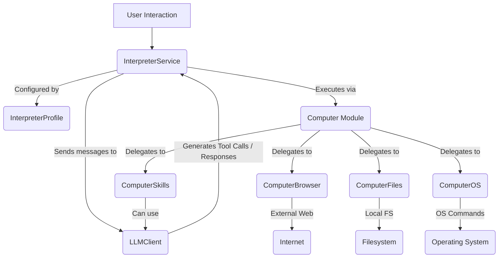

# src — interpreter

The `src/interpreter` module serves as the central intelligence and control unit for Code Buddy, enabling the AI to understand, reason, and interact with the host computer and external services. Inspired by the Open Interpreter project, it provides a robust framework for managing AI conversations, executing tasks, adhering to safety protocols, and tracking resource usage.

## Purpose

The primary goal of the `interpreter` module is to:

1.  **Orchestrate AI Interactions**: Manage the flow of conversation between the user and the AI, processing messages, generating responses, and executing actions.
2.  **Provide Computer Capabilities**: Offer a structured and safe interface for the AI to perform operations on the local machine (file system, OS commands, web browsing) and leverage external tools (skills, LLMs).
3.  **Manage AI Behavior**: Allow configuration of the AI's personality, capabilities, and safety settings through a profile system.
4.  **Ensure Safety and Budget**: Implement mechanisms for user approval of actions and track token usage and cost to prevent unintended consequences or overspending.

## Core Concepts

Before diving into the components, understanding these core concepts is crucial:

*   **Profiles**: Pre-configured sets of settings that define the interpreter's behavior, capabilities, and safety preferences for different use cases (e.g., `fast`, `vision`, `safe`, `coding`).
*   **Safe Mode**: A configurable setting (`off`, `ask`, `auto`) that dictates how the interpreter handles potentially risky actions, ranging from no confirmation to requiring explicit user approval for all or critical operations.
*   **Auto-Run**: A boolean flag that, when enabled, allows the interpreter to automatically execute suggested actions without explicit user confirmation (subject to `safeMode` restrictions).
*   **Budget & Usage Tracking**: A system to monitor the AI's token consumption and estimated monetary cost, allowing users to set maximum spending limits and receive warnings.

## Architecture Overview

The `InterpreterService` acts as the central hub, orchestrating interactions between the user, the underlying Large Language Model (LLM), and the `Computer` module. It uses `InterpreterProfile` configurations to guide its behavior and delegates specific tasks to specialized sub-modules.



## Key Components

The `src/interpreter` module is composed of several interconnected classes and files:

### 1. `InterpreterService` (`src/interpreter/interpreter-service.ts`)

This is the core class that manages the AI's conversational state, profile, budget, and the execution of actions. It's the primary interface for interacting with the Code Buddy AI.

**Key Responsibilities:**

*   **Chat Management**: Handles incoming user messages (`chat()`) and maintains the `conversationHistory`. It interacts with an external `CodeBuddyClient` (LLM) to generate responses and potential tool calls.
*   **Profile Loading**: Allows dynamic switching of AI behavior by loading different `InterpreterProfile` configurations (`loadProfile()`).
*   **Safety & Approval**: Implements the `safeMode` logic, determining when actions require user approval (`needsApproval()`, `requestApproval()`, `approve()`, `reject()`).
*   **Budget & Usage Tracking**: Monitors token usage and calculates costs (`updateUsage()`, `calculateCost()`). It enforces `maxBudget` limits and can persist usage data.
*   **Loop Mode**: Supports continuous operation where the AI can autonomously continue its task (`continue()`).
*   **State Management**: Stores the active profile, auto-run status, safe mode, custom instructions, and all usage statistics.
*   **Event Emitter**: Extends `EventEmitter` to notify other parts of the application about changes in profile, auto-run, safe mode, usage, and pending approvals.

**Execution Flow for `chat()`:**

1.  Checks if already processing or if budget is exceeded.
2.  Adds the user message to `conversationHistory`.
3.  Constructs a message payload for the LLM, including system prompts (from profile/custom instructions) and a slice of recent conversation history.
4.  Calls the `CodeBuddyClient.chat()` method with the constructed messages and model parameters from the active profile.
5.  Parses the LLM's response, extracts content, token usage, cost, and any tool calls.
6.  Updates internal `tokenUsage` and `totalCost` statistics, and checks `budgetStatus`.
7.  Adds the assistant's response (including tool calls/results) to `conversationHistory`.
8.  Returns the `ChatResult`.

### 2. `Computer` Module (`src/interpreter/computer/index.ts`)

This module provides a unified, high-level interface for the AI to interact with the host computer's environment. It aggregates several specialized sub-modules, each handling a distinct domain of computer interaction.

The `computer` object (or `getComputer()` singleton) provides access to these capabilities:
*   `computer.browser`: For web interactions.
*   `computer.files`: For file system operations.
*   `computer.os`: For operating system interactions.
*   `computer.skills`: For managing and executing reusable automations.

#### 2.1. `ComputerBrowser` (`src/interpreter/computer/browser.ts`)

Enables the AI to perform web searches and fetch web page content without requiring a visible browser window.

**Key Methods:**

*   `search(query: string, options?: SearchOptions)`: Executes a web search. It supports different engines (`serper`, `duckduckgo`) and various filtering options (number of results, site, file type, time range). It includes a caching mechanism to avoid redundant searches.
    *   `searchSerper()`: Uses the Serper.dev API for more structured search results (requires API key).
    *   `searchDuckDuckGo()`: Scrapes DuckDuckGo's HTML search results, providing a free alternative.
    *   `parseDuckDuckGoResults()`: Internal method to extract `SearchResult` data from DuckDuckGo's HTML.
*   `fetch(url: string, options?: FetchOptions)`: Retrieves the HTML content of a given URL and parses it to extract the page title, main text content, links, images, and metadata. Includes timeout and content length limits.
    *   `parseHtml()`: Internal method to clean HTML, extract text, links, and images.
*   **Caching**: Implements a simple in-memory cache for search and fetch results, configurable via `BrowserConfig`.
*   **Events**: Emits `search` and `fetch` events upon completion.

#### 2.2. `ComputerFiles` (`src/interpreter/computer/files.ts`)

Provides a comprehensive API for interacting with the local file system, abstracting away raw Node.js `fs` operations.

**Key Methods:**

*   **Read Operations**:
    *   `read(filePath: string, options?: ReadOptions)`: Reads file content as a string, supporting line-based or byte-range reads.
    *   `readBuffer(filePath: string)`: Reads file content as a `Buffer`.
    *   `readLines(filePath: string, start?: number, count?: number)`: Reads specific lines from a file.
    *   `readJson<T>(filePath: string)`: Reads and parses a JSON file.
*   **Write Operations**:
    *   `write(filePath: string, content: string | Buffer, options?: WriteOptions)`: Writes content to a file, with options for appending or creating parent directories.
    *   `writeJson(filePath: string, data: unknown, options?: WriteOptions & { pretty?: boolean })`: Writes JSON data to a file.
    *   `append(filePath: string, content: string | Buffer, options?: WriteOptions)`: Appends content to a file.
*   **File/Directory Management**:
    *   `copy(src: string, dest: string, options?: CopyOptions)`: Copies files or directories (recursively).
    *   `move(src: string, dest: string, options?: CopyOptions)`: Moves files or directories.
    *   `delete(filePath: string, options?: { recursive?: boolean; force?: boolean })`: Deletes files or directories.
    *   `rename(oldPath: string, newPath: string)`: Renames a file or directory.
    *   `mkdir(dirPath: string, options?: { recursive?: boolean })`: Creates a directory.
    *   `symlink(target: string, linkPath: string)`: Creates a symbolic link.
*   **Information & Search**:
    *   `info(filePath: string)`: Retrieves detailed `FileInfo` (size, dates, type, permissions).
    *   `exists(filePath: string)`: Checks if a path exists.
    *   `size(filePath: string)`: Gets file size.
    *   `hash(filePath: string, algorithm?: string)`: Calculates file hash.
    *   `list(dirPath: string, options?: FileSearchOptions)`: Lists directory contents with extensive filtering.
    *   `search(rootPath: string, options?: FileSearchOptions)`: Recursively searches for files based on various criteria.
    *   `tree(dirPath: string, maxDepth?: number)`: Generates a directory tree string.
*   **Watch Operations**:
    *   `watch(filePath: string, callback: WatchCallback)`: Monitors a file or directory for changes.
    *   `unwatchAll()`: Stops all active file watchers.
*   **Utilities**: `resolvePath()` (handles `~` for home directory), `matchPattern()` (simple glob matching), `getMimeType()`, `formatSize()`.

#### 2.3. `ComputerOS` (`src/interpreter/computer/os.ts`)

Provides capabilities for interacting with the operating system, including clipboard, processes, and system information. It handles platform-specific commands for macOS, Linux, and Windows.

**Key Methods:**

*   **Clipboard**:
    *   `getSelectedText()`: Retrieves text currently selected by the user.
    *   `getClipboardText()`, `setClipboardText(text: string)`: Reads from and writes to the system clipboard.
    *   `getClipboard()`: Attempts to retrieve full clipboard content (text, HTML, etc.).
*   **System Information**:
    *   `getSystemInfo()`: Returns comprehensive system details (platform, architecture, memory, uptime, environment variables).
    *   `getUsername()`, `getHomeDir()`, `getCwd()`, `getEnv()`, `setEnv()`: Accesses common OS information.
*   **Process Management**:
    *   `listProcesses()`: Lists currently running processes with details like PID, name, CPU, memory.
    *   `killProcess(pid: number, signal?: NodeJS.Signals)`: Terminates a process.
    *   `findProcess(name: string)`: Searches for processes by name.
*   **Display Information**:
    *   `getDisplays()`: Retrieves information about connected displays (resolution, position, primary status).
*   **Application Launching**:
    *   `open(target: string)`: Opens a file or URL using the system's default application.
    *   `launchApp(appName: string, args?: string[])`: Launches an application by name.
*   **Shell Commands**:
    *   `exec(command: string, options?: { timeout?: number; cwd?: string })`: Executes a shell command asynchronously.
    *   `execSync(command: string, options?: { cwd?: string })`: Executes a shell command synchronously.
    *   `getShell()`: Returns the default shell for the current platform.
*   **Notifications**:
    *   `notify(title: string, message: string)`: Displays a system notification.

#### 2.4. `ComputerSkills` (`src/interpreter/computer/skills.ts`)

Manages a library of reusable automations or "skills" that the AI can discover, run, and even create. Skills are defined as structured JSON/YAML files containing a sequence of steps.

**Key Methods:**

*   **Skill Discovery**:
    *   `load()`: Discovers and loads built-in skills and custom skills from configured `skillPaths`.
    *   `list(filter?: { tags?: string[]; search?: string })`: Returns a filtered list of loaded skills.
    *   `search(query: string)`: Performs a keyword search across skill names, descriptions, and tags.
    *   `get(skillId: string)`: Retrieves a specific skill by its ID.
*   **Skill Execution**:
    *   `run(skillId: string, params: Record<string, unknown>)`: Executes a skill by iterating through its `steps`.
    *   `executeStep()`: Internal method that dispatches to specific step handlers based on `step.type`.
    *   `executeCodeStep()`: Executes JavaScript code within a sandboxed environment (`safeEvalAsync`).
    *   `executeShellStep()`: Executes shell commands, interpolating parameters.
    *   `executeLLMStep()`: Sends a prompt to the LLM, interpolating parameters.
    *   `executeConditionStep()`: Evaluates a JavaScript condition.
    *   `executeLoopStep()`: Iterates over a list of items, executing a sub-step for each.
*   **Skill Management**:
    *   `register(skill: Skill)`: Adds a new skill programmatically.
    *   `unregister(skillId: string)`: Removes a skill.
    *   `save(skill: Skill, filePath?: string)`: Persists a skill definition to disk.
    *   `delete(skillId: string)`: Removes a skill from disk and the library.
*   **Built-in Skills**: A predefined set of essential skills (e.g., `web-search`, `read-file`, `run-shell`, `llm-ask`) are loaded by default.
*   **Event Emitter**: Emits `loaded`, `step:complete`, `step:error`, `complete`, `registered`, `unregistered` events.
*   **Utilities**: `validateParams()`, `applyDefaults()`, `validateSkill()`, `interpolate()` (for template variables), `resolvePath()`.

### 3. `Interpreter Profiles` (`src/interpreter/profiles.ts`)

This file defines a collection of predefined `InterpreterProfile` objects, each tailored for a specific use case or AI behavior. These profiles are used by `InterpreterService` to quickly configure the AI.

**Built-in Profiles:**

*   `DEFAULT_PROFILE`: General-purpose assistant.
*   `FAST_PROFILE`: Optimized for quick responses with auto-execution.
*   `VISION_PROFILE`: Designed for screen control and visual understanding.
*   `SAFE_PROFILE`: Prioritizes maximum security with strict approval requirements.
*   `LOCAL_PROFILE`: Configured for offline use with local LLMs (e.g., LM Studio).
*   `CODING_PROFILE`: Specialized for code generation and development tasks.
*   `RESEARCH_PROFILE`: Focused on web research and information gathering.

**Profile Configuration:**

Each profile specifies:
*   LLM `provider` and `model`.
*   `autoRun` and `safeMode` settings.
*   `maxBudget`, `temperature`, `maxTokens`.
*   `customInstructions` (system prompt).
*   `capabilities` (e.g., `vision`, `codeExecution`, `fileOperations`, `webSearch`, `shellCommands`).
*   `toolRestrictions` (whitelists/blacklists for tools, paths, commands).

**Utilities:**

*   `getBuiltinProfile(id: string)`: Retrieves a specific built-in profile.
*   `listBuiltinProfiles()`: Lists all available built-in profile IDs.
*   `mergeProfile(base: InterpreterProfile, overrides: Partial<InterpreterProfile>)`: Combines a base profile with custom overrides.
*   `validateProfile(profile: InterpreterProfile)`: Ensures a profile configuration is valid.

### 4. `Interpreter Types` (`src/interpreter/types.ts`)

This file centralizes all TypeScript interfaces and types used across the `interpreter` module, ensuring consistency and clarity.

**Key Types Defined:**

*   `SafeMode`: `'off' | 'ask' | 'auto'`.
*   `InterpreterProfile`, `ProfileCapabilities`, `ToolRestrictions`: For defining AI behavior and access.
*   `TokenUsage`, `CostBreakdown`, `BudgetStatus`, `UsageStats`: For tracking resource consumption.
*   `ChatMessage`, `ChatResult`: For representing conversational turns and LLM responses.
*   `PendingApproval`: For managing actions awaiting user confirmation.
*   `InterpreterConfig`, `InterpreterState`: Internal configuration and state of the `InterpreterService`.

## Integration Points

The `interpreter` module integrates with several other parts of the Code Buddy codebase:

*   **LLM Client (`src/codebuddy/client.ts`)**: Both `InterpreterService` and `ComputerSkills` (for `llm` steps) rely on `CodeBuddyClient` to communicate with various LLM providers (Grok, OpenAI, Anthropic, Gemini, LM Studio, Ollama). This client handles API calls, model selection, and response parsing.
*   **Sandboxing (`src/sandbox/safe-eval.ts`)**: `ComputerSkills` uses `safeEval`, `safeEvalAsync`, and `safeInterpolate` to execute JavaScript code within skill steps in a controlled, isolated environment, preventing arbitrary code execution from compromising the system.
*   **Logging (`src/utils/logger.ts`)**: Used throughout the module for debugging and operational insights.
*   **Model Defaults (`src/config/model-defaults.ts`)**: Provides default model names and pricing information, which `InterpreterService` uses for cost calculation.
*   **YAML Parsing (`yaml` package)**: Used by `InterpreterService` for loading and saving custom profiles from YAML files.
*   **Node.js Built-ins**: Extensive use of `fs`, `path`, `os`, `child_process`, `util`, `crypto`, and `events` for low-level system interactions, especially within the `Computer` sub-modules.

## Usage Examples

The `interpreter` module is designed to be easily accessible through singleton instances:

```typescript
import { interpreter, computer } from './interpreter'; // Or from the main entry point

async function demonstrateInterpreter() {
  // --- Interpreter Service Usage ---

  // Load a specific profile
  interpreter.loadProfile('coding');
  console.log(`Active profile: ${interpreter.profile.name}`);

  // Configure interpreter settings
  interpreter.autoRun = true;
  interpreter.safeMode = 'ask'; // Will ask for approval for actions
  interpreter.maxBudget = 5.00;
  interpreter.customInstructions = 'Always use TypeScript for code examples.';

  // Send a message to the AI
  console.log('\n--- Chatting with Interpreter ---');
  const chatResult = await interpreter.chat('Write a simple Node.js script to list files in the current directory.');
  console.log('AI Response:', chatResult.content);
  console.log('Token Usage:', interpreter.tokenUsage);
  console.log('Total Cost:', interpreter.totalCost.toFixed(4));

  // If there are pending approvals (due to safeMode: 'ask'), you can approve them
  const pending = interpreter.getPendingApprovals();
  if (pending.length > 0) {
    console('\n--- Approving pending action ---');
    console.log('Pending action:', pending[0].description);
    // await interpreter.approve(pending[0].id);
    // console.log('Action approved and executed.');
  }

  // Reset conversation and usage
  interpreter.reset();
  interpreter.resetUsage();
  console.log('\nInterpreter reset and usage cleared.');

  // --- Computer Module Usage ---

  console.log('\n--- Using Computer Capabilities ---');

  // Web Search
  const searchResults = await computer.browser.search('TypeScript best practices', { numResults: 3 });
  console.log('Web Search Results:', searchResults.map(r => r.title));

  // File Operations
  const tempFilePath = 'temp_test_file.txt';
  await computer.files.write(tempFilePath, 'Hello, Code Buddy!');
  const fileContent = await computer.files.read(tempFilePath);
  console.log(`File content of ${tempFilePath}: "${fileContent}"`);
  const fileInfo = await computer.files.info(tempFilePath);
  console.log('File Info:', fileInfo.name, fileInfo.size, fileInfo.isFile);
  await computer.files.delete(tempFilePath);

  // OS Operations
  const systemInfo = computer.os.getSystemInfo();
  console.log('OS Platform:', systemInfo.platform);
  console.log('Current User:', computer.os.getUsername());
  // await computer.os.notify('Code Buddy', 'Hello from the interpreter!');

  // Skills Execution
  console.log('\n--- Running a Skill ---');
  const skillResult = await computer.skills.run('llm-ask', { prompt: 'What is the capital of Canada?' });
  console.log('Skill "llm-ask" Output:', (skillResult.output as any)?.content);
}

demonstrateInterpreter().catch(console.error);
```