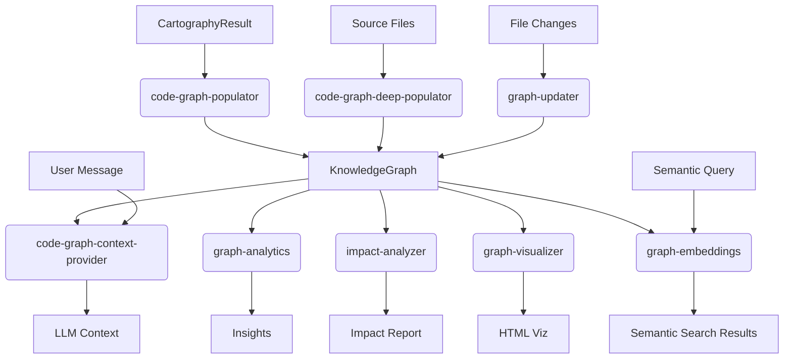

# src — knowledge

The `src/knowledge` module is the core intelligence layer of the CodeBuddy system, responsible for building, maintaining, querying, and analyzing a comprehensive **Knowledge Graph** of the codebase. This graph represents the structural and semantic relationships between various code entities (modules, classes, functions, interfaces, architectural layers, design patterns, etc.).

By transforming raw source code and project metadata into a structured graph, this module enables advanced AI agent capabilities such as:
*   **Context Provisioning:** Providing relevant code snippets to LLMs based on user queries, recent activity, or error messages.
*   **Impact Analysis:** Identifying all code entities potentially affected by a change to a specific function or module.
*   **Code Review & Refactoring Suggestions:** Detecting dead code, coupling hotspots, and architectural smells.
*   **Architectural Insights:** Discovering communities (subsystems), tracking drift, and visualizing dependencies.
*   **Semantic Search:** Allowing fuzzy, natural language queries over the codebase.

## Core Concept: The Knowledge Graph

At the heart of this module is the `KnowledgeGraph` class (defined in `src/knowledge/knowledge-graph.ts`, though not provided in the prompt). It acts as an in-memory, RDF-like triple store, storing relationships as `(subject, predicate, object)` triples, optionally with metadata.

**Key `KnowledgeGraph` Operations (inferred from usage):**
*   `add(subject, predicate, object, metadata)`: Adds a new triple to the graph.
*   `query({ subject?, predicate?, object? })`: Retrieves triples matching specific criteria.
*   `remove({ subject?, predicate?, object? })`: Deletes triples.
*   `toJSON()` / `loadJSON(triples)`: Serializes/deserializes the graph.
*   `getStats()`: Returns basic statistics like triple count.
*   `findEntity(candidate)`: Resolves a natural language candidate to a graph entity.
*   `getEntityRank(entity)`: Retrieves the PageRank score for an entity.
*   `getPageRank()`: Computes and returns PageRank scores for all entities.
*   `formatEgoGraph(entity, depth, maxChars)`: Extracts a subgraph around a specific entity.

Entities in the graph follow a consistent naming convention (e.g., `mod:src/utils/logger`, `cls:KnowledgeGraph`, `fn:add`, `iface:ImpactOptions`, `layer:agent`, `pat:singleton`).

## Architecture Overview

The knowledge graph is built and utilized through a series of specialized components:

## Graph Population

The graph is populated in stages, combining high-level architectural insights with deep code analysis.

### `code-graph-populator.ts` (Initial Population)
This module (`populateCodeGraph`) takes a `CartographyResult` (generated by `src/agent/repo-profiling/cartography.ts`) and translates its findings into `KnowledgeGraph` triples. This includes:
*   **Architecture Layers:** `layer:name` entities with `hasDirectory` relations.
*   **Import Edges:** `mod:importer` `imports` `mod:imported` relations.
*   **Hot Modules:** Modules with high incoming import counts.
*   **Components:** `cls:AgentName` `definedIn` `mod:filePath` for agents, tools, channels, etc.
*   **Key Exports:** `mod:module` `exports` `fn:functionName` or `cls:ClassName`.
*   **Design Patterns:** `mod:module` `patternOf` `pat:singleton`.
*   **API Surface:** `mod:module` `exposes` `GET /api/route`.
*   **Circular Dependencies:** `mod:A` `circularWith` `mod:B` warnings.

This initial population provides a broad, high-level understanding of the project structure.

### `code-graph-deep-populator.ts` (Deep Population)
The `populateDeepCodeGraph` function enriches the graph with fine-grained structural details by scanning source files. It's designed for on-demand use and delegates to language-specific regex scanners (found in `src/knowledge/scanners/`).

**Process:**
1.  **File Discovery:** Walks source directories (`src`, `app`, etc.), skipping common build/test directories and large files.
2.  **Symbol Extraction (First Pass):** For each relevant source file, it uses `getScannerForExt` (from `src/knowledge/scanners/index.ts`) to get a language-specific scanner (e.g., `TypeScriptScanner`, `PythonScanner`). The scanner extracts `SymbolDef` (classes, functions, methods), `CallSite` (function calls), and `InheritanceInfo` (extends/implements).
3.  **Hierarchy Population:** Adds `cls:Class` `definedIn` `mod:module`, `cls:Class` `hasMethod` `fn:Method`, and `fn:Function` `definedIn` `mod:module` triples.
4.  **Inheritance Population:** Adds `cls:Class` `extends` `cls:Parent` and `cls:Class` `implements` `iface:Interface` triples.
5.  **Call Graph Resolution:** Resolves `CallSite` entries to specific `fn:` entities and adds `caller` `calls` `callee` triples.
6.  **Dynamic Imports:** Scans for `await import()` patterns to add `mod:source` `imports` `mod:target` edges.

This deep population provides the detailed call graph and class hierarchy crucial for impact analysis and refactoring.

### `graph-updater.ts` (Incremental Updates)
The `updateGraphForFile` function handles changes to individual files. When a file is modified or deleted, it:
1.  Identifies and removes all existing triples related to the module and its contained entities.
2.  Re-reads the file (if it still exists).
3.  Re-scans the file using the appropriate language scanner.
4.  Re-populates the graph with new triples for that module and its entities.

This ensures the graph remains up-to-date without requiring a full rebuild, which is critical for responsiveness.

## Graph Persistence

### `code-graph-persistence.ts`
This module handles saving and loading the `KnowledgeGraph` to/from disk.
*   `saveCodeGraph(graph, cwd)`: Serializes the current graph state to `.codebuddy/code-graph.json`.
*   `loadCodeGraph(graph, cwd)`: Deserializes the graph from the saved file.
*   `codeGraphExists(cwd)`: Checks for the existence of the graph file.

This allows the graph to persist across sessions, avoiding expensive rebuilds on every startup.

## Graph Analysis & Insights

### `code-graph-context-provider.ts` (LLM Context)
The `buildCodeGraphContext` function is a key component for providing relevant code context to LLMs. It intelligently extracts entities from a user's message and augments them with graph data.

**Context Sources:**
1.  **User Message Entities:** Uses `extractEntities` (with `ENTITY_PATTERNS`) to find file paths, class names, module names, etc.
2.  **Recent Files:** Prioritizes files recently read or written by the agent (`trackRecentFile`).
3.  **Error Messages:** Uses `extractErrorEntities` (with `ERROR_PATTERNS`) to find function names from stack traces.
4.  **Code Review Context:** `buildReviewContext` provides specialized context for review scenarios, including dependencies of recently touched modules.
5.  **Semantic Fallback:** If no exact entity matches, `semanticFallbackSync` attempts a fuzzy match using a pre-built embedding index (see `graph-embeddings.ts`).

The collected entities are resolved against the `KnowledgeGraph`, sorted by PageRank, and structured into a concise text block, capped at `MAX_CONTEXT_CHARS` (800 characters) to manage token budgets.

### `graph-pagerank.ts` (Entity Importance)
The `computePageRank` function implements the PageRank algorithm to assign importance scores to every entity in the graph. It considers `calls` and `imports` as "links." Entities with more incoming links from important sources will have higher PageRank.
*   `KnowledgeGraph.getPageRank()` internally calls this module.
*   PageRank scores are used for sorting entities in context provision, community detection, and visualization.

### `community-detection.ts` (Architectural Subsystems)
This module's `detectCommunities` function uses a deterministic Label Propagation algorithm to identify tightly-connected clusters of modules (architectural subsystems).
*   Each module starts with a unique label.
*   Iteratively, modules adopt the most common label among their neighbors.
*   Ties are broken using PageRank scores for stability.
*   `summarizeCommunity` provides human-readable descriptions of detected communities.

*(Note: `community-detector.ts` provides an alternative, simpler Label Propagation implementation, also used in some contexts, but `community-detection.ts` is more integrated with PageRank and used by `graph-analytics.ts` and `graph-visualizer.ts`.)*

### `graph-analytics.ts` (Actionable Insights)
This module provides advanced analytical capabilities:
*   **Dead Code Detection (`detectDeadCode`):** Identifies `uncalledFunctions`, `unimportedModules`, and `unusedClasses`. It assigns a `DeadCodeConfidence` (high, medium, low) to functions, accounting for dynamic dispatch patterns, exports, and framework-specific entry points (via `classifyDeadCodeConfidence` and `framework-plugins.ts`).
*   **Coupling Heatmap (`computeCoupling`):** Calculates inter-module coupling by counting `calls` and `imports` between module pairs. It identifies `hotspots` and modules with the most incoming/outgoing dependencies.
*   **Refactoring Suggestions (`suggestRefactoring`):** Identifies candidates for refactoring based on PageRank, cross-community calls (potential shared utilities), high outgoing calls (god functions), and excessive imports (hub modules).

### `graph-drift.ts` (Architecture Monitoring)
The `detectDrift` function compares the current `KnowledgeGraph` against a saved snapshot (`.codebuddy/code-graph-snapshot.json`) to identify architectural changes over time.
*   `saveSnapshot(graph, cwd)`: Stores the current graph state.
*   `loadSnapshot(cwd)`: Retrieves a previous snapshot.
*   **Drift Detection:** Reports `addedModules`, `removedModules`, `newCoupling` (new import edges), `removedCoupling`, and `rankGainers`/`rankLosers` (entities with significant PageRank shifts).
*   `formatDrift` provides a human-readable summary of changes.

### `graph-embeddings.ts` (Semantic Search)
This module provides a `GraphEmbeddingIndex` for semantic search over graph entities.
*   `createGraphEmbeddingIndex(graph, config)`: Builds an index by generating text representations for entities (path, function names, imports) and embedding them using an `EmbeddingProvider` (from `src/embeddings/embedding-provider.ts`).
*   It uses `USearchVectorIndex` (from `src/search/usearch-index.ts`) for efficient vector search, with a `BruteForceIndex` fallback.
*   `rebuild()`: Lazily builds the index on first use or explicitly.
*   `search(query, k)`: Finds top-k entities semantically similar to the query.

This enables fuzzy search capabilities, allowing users to find relevant code even without exact entity names.

### `impact-analyzer.ts` (Transitive Impact)
The `analyzeImpact` function performs transitive impact analysis using Breadth-First Search (BFS) on the graph.
*   It can trace dependencies `up` (callers, importers, extenders), `down` (callees, imports, dependencies), or `both`.
*   It returns an `ImpactReport` detailing `affectedSymbols`, `affectedProcesses` (integrating with `process-detector.ts`), `affectedFiles`, and an overall `riskLevel` based on distance from the change target.
*   `distanceToRisk` and `overallRisk` functions assign risk levels.
*   `resolveFilePath` helps map symbols back to their source files.

## Visualization

### `graph-visualizer.ts`
The `generateVisualization` function creates a self-contained HTML file (`.codebuddy/graph-viz.html`) that visualizes the `KnowledgeGraph` using D3.js.
*   It renders a force-directed graph layout.
*   Nodes are colored by entity type and community (if `CommunityResult` is provided).
*   Node size is proportional to PageRank.
*   Includes interactive filters for predicate types, search, and tooltips with entity details.
*   This provides a powerful way for developers to explore the codebase's architecture visually.

## Integration Points

The `src/knowledge` module is deeply integrated throughout the CodeBuddy system:
*   **`src/agent/repo-profiler.ts`**: Uses the graph to get project profiles and architectural insights.
*   **`src/commands/knowledge.ts`**: Provides CLI access to graph operations.
*   **`src/services/prompt-builder.ts`**: Leverages `code-graph-context-provider.ts` to inject relevant context into LLM prompts.
*   **`src/tools/`**: Many agent tools (e.g., `code-graph-tools.ts`, `advanced-tools.ts`, `misc-tools.ts`) directly query or manipulate the `KnowledgeGraph` or use its analytical functions.
*   **`src/docs/docs-generator.ts`**: Uses graph data to generate architectural diagrams and documentation.
*   **`src/embeddings/embedding-provider.ts`** and **`src/search/usearch-index.ts`**: External dependencies for `graph-embeddings.ts`.
*   **`src/knowledge/scanners/`**: Language-specific scanners are crucial for deep graph population.

This module forms the "brain" of CodeBuddy, enabling it to understand, reason about, and interact with complex codebases effectively.