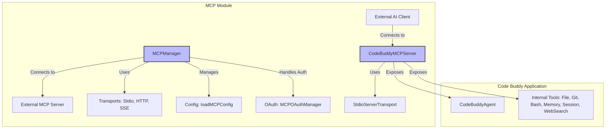

# src — mcp

The `src/mcp` module provides Code Buddy's integration with the **Model Context Protocol (MCP)**. This protocol enables AI agents to discover and interact with tools, resources, and prompts provided by other services or applications.

The `mcp` module serves a dual purpose within Code Buddy:

1.  **MCP Client:** Code Buddy can connect to and utilize tools exposed by external MCP servers (e.g., web search, calendar integrations).
2.  **MCP Server:** Code Buddy can expose its own internal capabilities (file system, Git, Bash, AI agent, memory, sessions) as tools, resources, and prompts to other AI clients (e.g., VS Code extensions, other AI agents).

This module is critical for extending Code Buddy's functionality through external integrations and for allowing Code Buddy's powerful internal tools to be leveraged by other AI systems.

## Core Concepts

The Model Context Protocol (MCP) defines a standardized way for AI agents to:
*   **Discover Tools:** Get a list of available functions, their descriptions, and input schemas.
*   **Call Tools:** Invoke these functions with specific arguments.
*   **Access Resources:** Read structured data (e.g., project context, session history) via URIs.
*   **Utilize Prompts:** Access predefined workflow templates.

The `mcp` module implements both the client and server sides of this protocol, allowing Code Buddy to be a flexible participant in an AI-driven ecosystem.

## Architecture Overview

The `mcp` module's architecture can be visualized as follows, highlighting its dual role as both a client and a server:

## Key Components

### `MCPManager` (`client.ts`)

The `MCPManager` class is the primary client-side component for interacting with external MCP servers. It acts as an orchestrator for multiple MCP connections.

**Responsibilities:**
*   **Server Management:** Adds, removes, and tracks the status of multiple external MCP servers.
*   **Transport Handling:** Uses the `createTransport` factory to establish connections via `stdio`, `http`, or `sse` transports.
*   **SDK Integration:** Wraps the `@modelcontextprotocol/sdk/client` `Client` class, providing a higher-level interface.
*   **Tool Registration:** Discovers tools from connected servers and registers them internally with a unique prefix (`mcp__<serverName>__<toolName>`) to prevent naming conflicts.
*   **Health Checks & Reconnection:** Periodically pings connected servers (`listTools` is used as a heartbeat) and attempts auto-reconnection if configured.
*   **Tool Invocation:** Provides `callTool` to execute remote tools.
*   **Initialization:** The `ensureServersInitialized` method loads configurations and connects to all enabled servers in parallel.

**Execution Flow (Adding a Server):**
1.  `addServer(config: MCPServerConfig)` is called.
2.  A `MCPTransport` is created via `createTransport(config.transport)`.
3.  An `@modelcontextprotocol/sdk/client` `Client` instance is created.
4.  The `MCPTransport` connects, returning an SDK `Transport` instance.
5.  The SDK `Client` connects using the SDK `Transport`.
6.  `client.listTools()` is called to discover available tools.
7.  Discovered tools are registered in `MCPManager`'s internal `tools` map.
8.  A health check interval is started for the server.

### `CodeBuddyMCPServer` (`mcp-server.ts`)

The `CodeBuddyMCPServer` class enables Code Buddy to act as an MCP server, exposing its internal capabilities to external AI clients.

**Responsibilities:**
*   **SDK Integration:** Uses the `@modelcontextprotocol/sdk/server/mcp.js` `McpServer` class.
*   **Stdio Transport:** Connects via `StdioServerTransport`, making it accessible to clients that can spawn Code Buddy as a child process and communicate over standard I/O.
*   **Tool Exposure:** Registers a comprehensive set of Code Buddy's internal functionalities as MCP tools.
*   **Resource Exposure:** Provides read-only access to various aspects of the Code Buddy environment as MCP resources.
*   **Prompt Exposure:** Offers predefined workflow templates as MCP prompts.
*   **Lazy Initialization:** Internal tools (`TextEditorTool`, `SearchTool`, `GitTool`, `BashTool`) and the `CodeBuddyAgent` are lazily initialized on first use to optimize startup performance.
*   **Auto-Approval:** Sets `ConfirmationService` to auto-approve operations, as a server typically operates non-interactively.

**Exposed Capabilities:**

*   **Tools:**
    *   `read_file`, `write_file`, `edit_file`: File system manipulation.
    *   `bash`: Execute shell commands.
    *   `search_files`, `list_files`: Project exploration.
    *   `git`: Git repository operations (status, diff, commit, etc.).
    *   `agent_chat`, `agent_task`, `agent_plan`: Access to Code Buddy's AI agent capabilities.
    *   `memory_search`, `memory_save`: Interaction with Code Buddy's semantic and persistent memory.
    *   `session_list`, `session_resume`: Session management.
    *   `web_search`: Web search via configured providers.

*   **Resources (URI scheme `codebuddy://`):**
    *   `codebuddy://project/context`: Project context files and Git status.
    *   `codebuddy://project/instructions`: Custom project instructions (e.g., `CODEBUDDY.md`).
    *   `codebuddy://sessions/latest`: Latest session data.
    *   `codebuddy://memory/all`: All stored memories.

*   **Prompts:**
    *   `code_review`: Review code changes.
    *   `explain_code`: Explain file/function.
    *   `generate_tests`: Generate tests.
    *   `refactor`: Refactor code with a strategy.
    *   `fix_bugs`: Find and fix bugs.

### Configuration (`config.ts`)

This module handles the loading and saving of MCP server configurations.

**Key Functions:**
*   `loadMCPConfig()`: Aggregates configurations from multiple sources with a defined priority:
    1.  `./.codebuddy/mcp.json` (project-specific, committable)
    2.  `./.codebuddy/settings.json` (project-specific, user-managed)
    3.  `~/.codebuddy/mcp.json` (user-global)
    It also resolves `${ENV_VAR}` references in environment variables.
*   `saveMCPConfig()`, `addMCPServer()`, `removeMCPServer()`, `getMCPServer()`: Provide CRUD operations for server configurations, primarily interacting with `src/utils/settings-manager.ts`.
*   `PREDEFINED_SERVERS`: A collection of common external MCP server configurations (e.g., Brave Search, Playwright), typically disabled by default and activated by the user.
*   `createMCPConfigTemplate()`: Generates a template `mcp.json` file.

### Transports (`transports.ts`)

This module defines the `MCPTransport` interface and concrete implementations for different communication methods.

**Implementations:**
*   `StdioTransport`: For servers communicating over standard input/output. It wraps the SDK's `StdioClientTransport`.
*   `HttpTransport`: For servers exposing an HTTP endpoint. Uses `axios` for requests.
*   `SSETransport`: For servers using Server-Sent Events.
*   `StreamableHttpTransport`: A specialized HTTP transport, currently noted as potentially incompatible with the standard MCP request-response pattern.
*   `createTransport(config: TransportConfig)`: A factory function that instantiates the correct transport based on the configuration type.

### OAuth (`mcp-oauth.ts`)

The `MCPOAuthManager` class provides robust support for OAuth 2.0 Authorization Code flow with PKCE, essential for authenticating with external MCP servers that require it.

**Key Features:**
*   **PKCE Implementation:** Generates `code_verifier` and `code_challenge` for enhanced security.
*   **Local Callback Server:** Starts a temporary HTTP server to receive the OAuth redirect callback.
*   **Browser Integration:** Opens the authorization URL in the user's default browser.
*   **Token Management:** Handles exchanging authorization codes for access tokens, refreshing expired tokens, and storing/retrieving tokens.
*   **Secure Storage:** Encrypts tokens using AES-256-GCM and stores them in `.codebuddy/mcp-tokens.json` with restricted file permissions (`0o600`).
*   **Singleton:** `getMCPOAuthManager()` provides a singleton instance.

### Tool Auto-Discovery (`mcp-auto-discovery.ts`)

The `MCPAutoDiscovery` class helps manage the display and loading of tool descriptions, especially when many tools are available.

**Purpose:**
*   To prevent overwhelming the AI's context window with too many tool descriptions.
*   To provide a mechanism for searching and dynamically loading relevant tool descriptions.

**Key Methods:**
*   `shouldDeferLoading()`: Determines if tool descriptions should be deferred based on their estimated token count relative to the context window size.
*   `searchTools()`: Allows searching through deferred tools by relevance to a query.
*   `partitionTools()`: Divides a list of tools into "loaded" (eagerly provided to the AI) and "deferred" (available on demand).

### Pre-configured Connectors (`connectors.ts`)

The `ConnectorRegistry` provides a curated list of pre-configured external MCP server connectors for popular services.

**Features:**
*   **Discoverability:** Lists available connectors (e.g., Google Calendar, Linear, Notion, GitHub).
*   **Configuration Guidance:** Each connector includes `requiredEnvVars` and `setupInstructions` to guide users through activation.
*   **Status Check:** `isConfigured()` checks if a connector's required environment variables are set.
*   **Singleton:** `getConnectorRegistry()` provides a singleton instance.

### Legacy `MCPClient` (`mcp-client.ts`)

This class represents an older, manual implementation of an MCP client. While `MCPManager` is the recommended approach for new code (leveraging the SDK), `MCPClient` is still used by parts of the `codebuddy-agent` for its direct `stdio` process management and custom configuration loading.

**Key Differences from `MCPManager`:**
*   Manually implements JSON-RPC communication over stdio.
*   Manages its own configuration file (`.codebuddy/mcp-servers.json`).
*   Does not use the `@modelcontextprotocol/sdk/client`.
*   Handles process spawning and I/O directly.

## Integration Points

The `mcp` module integrates deeply with various other parts of the Code Buddy codebase:

*   **`src/codebuddy/tools.ts`**: Uses `MCPManager` to initialize and retrieve tools from external MCP servers, making them available to the core Code Buddy agent.
*   **`src/commands/mcp.ts`**: The CLI commands for managing MCP servers (add, remove, list) directly interact with `MCPManager` and the `config.ts` functions.
*   **`src/agent/codebuddy-agent.ts`**:
    *   When Code Buddy acts as an MCP server, `CodeBuddyMCPServer` instantiates and uses `CodeBuddyAgent` to provide agent-related tools.
    *   The `codebuddy-agent` itself might use `MCPClient` (legacy) or `MCPManager` to call external tools.
*   **`src/tools/*`**: `CodeBuddyMCPServer` directly utilizes instances of `TextEditorTool`, `SearchTool`, `GitTool`, `BashTool`, and `WebSearchTool` to implement its exposed MCP tools.
*   **`src/memory/*`**: `mcp-memory-tools.ts` and `mcp-resources.ts` interact with `semantic-memory-search.ts` and `persistent-memory.ts` to expose memory capabilities.
*   **`src/persistence/session-store.ts`**: `mcp-session-tools.ts` and `mcp-resources.ts` interact with the session store to expose session data.
*   **`src/utils/settings-manager.ts`**: `config.ts` relies on the settings manager for persistent storage of MCP server configurations.
*   **`src/utils/confirmation-service.ts`**: `CodeBuddyMCPServer` and its internal tool initializers set session flags to auto-approve operations, bypassing interactive confirmation when running as a server.
*   **`src/context/context-files.ts`**: `mcp-resources.ts` uses this to format and expose project context.

## Usage Patterns for Developers

### Contributing to `CodeBuddyMCPServer` (Exposing new Code Buddy tools)

To expose a new Code Buddy capability as an MCP tool, resource, or prompt:
1.  **Identify the capability:** Determine which existing Code Buddy functionality you want to expose.
2.  **Choose the type:** Is it an action (tool), read-only data (resource), or a workflow template (prompt)?
3.  **Create a registration module:** If it's a new category, create a new `mcp-<category>-tools.ts` file (e.g., `mcp-new-feature-tools.ts`). Otherwise, add to an existing one.
4.  **Define schema (for tools/prompts):** Use `zod` to define the input arguments for your tool or prompt. This schema will be exposed to MCP clients.
5.  **Implement the handler:** Write an `async` function that takes the parsed arguments, calls the underlying Code Buddy logic, and returns the result in the MCP `CallToolResult` format (for tools) or `PromptResult` format (for prompts). For resources, return `ResourceResult`.
6.  **Register with `McpServer`:** In `CodeBuddyMCPServer`'s `registerTools()` or `registerAgentLayer()` method, call `this.mcpServer.tool()`, `this.mcpServer.resource()`, or `this.mcpServer.prompt()` with your definition and handler.
7.  **Lazy Load Dependencies:** Ensure that heavy dependencies are `await import()`-ed inside the handler, not at the top level, to maintain fast startup.

### Using `MCPManager` (Connecting to external MCP servers)

To integrate with a new external MCP server:
1.  **Define `MCPServerConfig`:** Create a configuration object specifying the server's name, transport type (`stdio`, `http`, `sse`), and connection details (command/args for stdio, URL for http/sse).
2.  **Add to `MCPManager`:** Call `mcpManager.addServer(config)`. This will establish the connection, discover tools, and start health checks.
3.  **Discover Tools:** Use `mcpManager.getTools()` to retrieve a list of all available tools (including those from external servers). Remember that external tools are prefixed (e.g., `mcp__brave-search__search`).
4.  **Call Tools:** Invoke external tools using `mcpManager.callTool(toolName, arguments_)`.
5.  **OAuth (if required):** If the external server requires OAuth, you'll need to integrate with `MCPOAuthManager` to obtain and manage tokens.

### Configuration Management

Developers can manage MCP server configurations through:
*   **CLI:** Code Buddy's `mcp` command provides subcommands to add, remove, and list servers.
*   **Configuration Files:** Directly edit `.codebuddy/mcp.json` (project-level, committable) or `~/.codebuddy/mcp.json` (user-level). The `createMCPConfigTemplate()` function can generate a starting point.

This module forms a powerful bridge, allowing Code Buddy to both consume and provide AI-driven capabilities within a broader ecosystem.