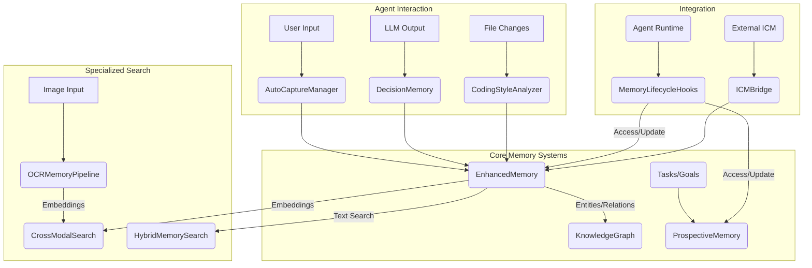

# src — memory

The `src/memory` module is the brain of the Code Buddy agent, providing a sophisticated, multi-layered system for storing, recalling, and learning from information. It encompasses various memory types, from short-term conversational context to long-term, semantically searchable knowledge, and even specialized memories for code style, decisions, and tasks.

This documentation outlines the purpose, architecture, and key components of the memory system, detailing how they interact to enable intelligent and context-aware agent behavior.

## Memory System Overview

The memory system is designed to allow Code Buddy to:

*   **Remember** user preferences, project details, and past interactions.
*   **Learn** from conversations, code changes, and agent actions.
*   **Recall** relevant information efficiently based on context and semantic similarity.
*   **Adapt** its behavior over time based on learned patterns and decisions.

At its core, the system leverages a combination of structured and unstructured storage, semantic embeddings for advanced retrieval, and various specialized modules for different types of knowledge.

### High-Level Architecture

The following diagram illustrates the primary data flows and interactions between the core memory components:

## Core Memory Systems

### 1. Enhanced Memory (`EnhancedMemory` - `src/memory/enhanced-memory.ts`)

`EnhancedMemory` is the central, most robust long-term memory store. It's designed for persistent, semantically searchable information and acts as a hub for various other memory components.

**Key Features:**

*   **SQLite Backend:** Stores memory entries in a SQLite database for structured, scalable persistence.
*   **Semantic Search:** Utilizes embedding models (e.g., `Xenova/all-MiniLM-L6-v2` locally) to generate vector embeddings for memory content, enabling semantic similarity search.
*   **Memory Types & Tags:** Categorizes memories (e.g., `fact`, `preference`, `decision`, `error`) and allows tagging for granular filtering.
*   **Importance & Decay:** Assigns an importance score to each memory, which decays over time and with infrequent access, allowing less relevant information to fade.
*   **Project Context:** Manages project-specific memories, including detected code conventions.
*   **User Profile:** Stores user preferences, skills, and interaction history.
*   **Conversation Summaries:** Stores high-level summaries of past conversations.
*   **Deduplication:** Prevents storing redundant information.
*   **Lifecycle Management:** Handles loading, saving, and enforcing memory limits.

**Usage Pattern:**

1.  **Initialization:** `getEnhancedMemory()` retrieves the singleton instance, initializing the SQLite database and embedding provider.
2.  **Storing:** `memory.store({ type, content, importance, tags, metadata, projectId, sessionId })` adds a new memory. An embedding is generated if enabled.
3.  **Recalling:** `memory.recall({ query, types, tags, projectId, minImportance, limit })` retrieves relevant memories. If embeddings are enabled, it performs semantic search; otherwise, it falls back to keyword search.
4.  **Project Context:** `memory.setProjectContext(projectPath)` establishes the current project, allowing project-scoped memory operations.
5.  **User Profile:** `memory.updateUserProfile(updates)` and `memory.getUserProfile()` manage user-specific data.

### 2. Auto-Capture Memory (`AutoCaptureManager` - `src/memory/auto-capture.ts`)

Inspired by intelligent memory capture systems, `AutoCaptureManager` automatically detects and stores important information from conversations into `EnhancedMemory`.

**Key Features:**

*   **Pattern-Based Detection:** Uses a configurable set of regex patterns (e.g., "remember X", "my preference is Y", "contact Z") to identify capturable content.
*   **Content Extraction:** Can extract specific matched groups from a pattern or capture the entire message.
*   **Deduplication:** Checks for similar existing memories in `EnhancedMemory` using content hashing and Jaccard similarity to avoid redundancy.
*   **Exclusion Rules:** Ignores system messages, code blocks, or content outside specified length limits.
*   **Integration with `EnhancedMemory`:** Captured information is stored as `MemoryEntry` objects in `EnhancedMemory`.
*   **Coding Style Analysis Trigger:** Can trigger `CodingStyleAnalyzer` when file write tool results are detected, indicating a new code file.

**Usage Pattern:**

1.  **Initialization:** `getAutoCaptureManager(enhancedMemoryInstance)` creates an instance linked to `EnhancedMemory`.
2.  **Processing Messages:** `manager.processMessage(role, content, context)` analyzes incoming messages (typically user messages) for patterns.
3.  **Custom Patterns:** `manager.addPattern(pattern)` allows extending the built-in detection rules.

### 3. Decision Memory (`DecisionMemory` - `src/memory/decision-memory.ts`)

`DecisionMemory` specializes in extracting, persisting, and retrieving architectural and design decisions made during interactions. It uses a structured XML format within LLM responses.

**Key Features:**

*   **XML-Based Extraction:** Parses `<decision>` XML blocks from LLM output, extracting `choice`, `alternatives`, `rationale`, `context`, `confidence`, and `tags`.
*   **Persistence to `EnhancedMemory`:** Extracted decisions are stored as `decision` type memories in `EnhancedMemory` for long-term recall.
*   **Context Injection:** Can build a `<decisions_context>` XML block containing relevant past decisions for injection into future prompts.
*   **LLM Prompt Enhancement:** Provides instructions to guide LLMs in emitting decisions in the expected XML format.

**Usage Pattern:**

1.  **Extraction:** `decisionMemory.extractDecisions(llmResponse)` parses decisions from raw LLM text.
2.  **Persistence:** `decisionMemory.persistDecisions(decisions)` stores the extracted decisions.
3.  **Recall for Context:** `decisionMemory.buildDecisionContext(query)` retrieves relevant decisions and formats them for prompt injection.

### 4. Knowledge Graph (`KnowledgeGraph` - `src/memory/knowledge-graph.ts`)

Inspired by memU, the `KnowledgeGraph` captures entities and their relationships, providing a more structured and interconnected form of memory than flat entries. It aims to learn user preferences, habits, and project structures.

**Key Features:**

*   **Entities & Relations:** Stores information as `Entity` (e.g., user, project, concept) and `Relation` (e.g., `prefers`, `uses`, `depends_on`) objects.
*   **Salience Scoring:** Ranks memories based on relevance, reinforcement (mentions), and recency decay.
*   **Content-Hash Deduplication:** Prevents storing identical entities or relations.
*   **Intent Routing:** Identifies and skips trivial messages (greetings, simple commands) to optimize memory retrieval.
*   **JSON Storage:** Uses a lightweight JSON file for persistence, avoiding external graph database dependencies.

**Usage Pattern:**

1.  **Initialization:** `getKnowledgeGraph()` retrieves the singleton instance.
2.  **Extraction & Storage:** `graph.extractAndStore(message, context)` analyzes messages to identify and store new entities and relations.
3.  **Querying:** `graph.query(graphQuery)` allows traversing the graph to find related information.
4.  **Context Building:** `graph.buildContext(query, temporalContext)` generates a structured context block for LLMs, including facts, preferences, and temporal habits.

### 5. Prospective Memory (`ProspectiveMemory` - `src/memory/prospective-memory.ts`)

`ProspectiveMemory` manages tasks, goals, and reminders, enabling the agent to track ongoing work and proactively remind itself of future actions.

**Key Features:**

*   **Tasks & Subtasks:** Stores detailed tasks with priority, status, and associated subtasks.
*   **Goals & Milestones:** Tracks higher-level goals with progress and milestones.
*   **Reminders:** Schedules reminders based on time, events, or specific triggers.
*   **Trigger System:** Supports various trigger types (e.g., `time`, `event`, `file_change`, `tool_output`).
*   **Database Persistence:** Uses a SQLite database (via `src/database/database-manager.ts`) for reliable storage.

**Usage Pattern:**

1.  **Initialization:** `getProspectiveMemory()` retrieves the singleton instance.
2.  **Task Management:** `memory.createTask()`, `memory.updateTask()`, `memory.getPendingTasks()`.
3.  **Goal Management:** `memory.createGoal()`, `memory.updateGoalProgress()`.
4.  **Reminder Management:** `memory.setReminder()`, `memory.getPendingReminders()`.
5.  **Trigger Checking:** `memory.checkTriggers()` is called periodically to activate reminders or tasks.

## Specialized Memory & Search Components

### 6. Coding Style Analyzer (`CodingStyleAnalyzer` - `src/memory/coding-style-analyzer.ts`)

This module analyzes source code files to automatically detect coding conventions and style preferences using regex-based heuristics.

**Key Features:**

*   **Heuristic-Based Analysis:** Detects patterns for quote style, semicolons, indentation, import style, error handling, naming conventions, and type annotation density.
*   **File & Directory Analysis:** Can analyze single files or recursively scan directories to build a comprehensive style profile.
*   **Profile Merging:** Merges partial profiles from multiple files using majority voting to create a unified `CodingStyleProfile`.
*   **Prompt Snippet Generation:** Formats the detected style profile into a human-readable string suitable for LLM prompt injection.
*   **Persistence to `EnhancedMemory`:** Stores the generated style profile as a `pattern` type memory in `EnhancedMemory`.

**Usage Pattern:**

1.  **Initialization:** `getCodingStyleAnalyzer()` retrieves the singleton instance.
2.  **Analysis:** `analyzer.analyzeContent(content, filePath)` for a single file, or `analyzer.analyzeDirectory(dirPath)` for a project.
3.  **Persistence:** `analyzer.persistToMemory(profile, projectPath)` stores the profile.
4.  **Prompt Integration:** `analyzer.buildPromptSnippet(profile)` generates the prompt text.

### 7. OCR Memory Pipeline (`OCRMemoryPipeline` - `src/memory/ocr-memory-pipeline.ts`)

The `OCRMemoryPipeline` processes images (e.g., screenshots) by performing Optical Character Recognition (OCR) to extract text, generating embeddings for the extracted text, and indexing them for search.

**Key Features:**

*   **Image Processing:** Handles image files (PNG, JPEG) and extracts text using an OCR engine (e.g., Tesseract via `tesseract.js`).
*   **Embedding Generation:** Creates vector embeddings for the OCR'd text, enabling semantic search.
*   **Metadata Storage:** Stores image path, extracted text, OCR confidence, and embedding.
*   **Persistence:** Saves OCR entries to a JSON file.

**Usage Pattern:**

1.  **Initialization:** `getOCRMemoryPipeline()` retrieves the singleton instance.
2.  **Processing:** `pipeline.processImage(imagePath, metadata)` performs OCR and embedding.
3.  **Retrieval:** `pipeline.getAllEntries()` to get all indexed image memories.

### 8. Cross-Modal Search (`CrossModalSearch` - `src/memory/cross-modal-search.ts`)

`CrossModalSearch` enables searching across different modalities (text and images) using multimodal embeddings. This allows queries like "find screenshots of the login form" to return relevant images.

**Key Features:**

*   **Multimodal Embeddings:** Leverages a multimodal embedding provider (e.g., Gemini) to project both text queries and image content (via OCR embeddings) into a shared vector space.
*   **Aggregated Search:** Combines results from `OCRMemoryPipeline` (for images) and `SemanticMemorySearch` (for text memories).
*   **Cosine Similarity:** Ranks results based on the cosine similarity between the query embedding and memory embeddings.
*   **Fallback to Keyword Search:** If multimodal embeddings are unavailable, it falls back to keyword search on OCR'd text.

**Usage Pattern:**

1.  **Initialization:** `getCrossModalSearch()` retrieves the singleton instance.
2.  **Search:** `search.search(query, options)` performs a cross-modal search, returning a mix of text and image results.

### 9. Hybrid Memory Search (`HybridMemorySearch` - `src/memory/hybrid-search.ts`)

`HybridMemorySearch` combines the strengths of traditional keyword-based search (BM25) with modern semantic vector search for robust memory retrieval.

**Key Features:**

*   **BM25 Index:** Implements a BM25 (Okapi BM25) index for efficient keyword-based search, always available.
*   **Semantic Search:** Integrates with an `EmbeddingProvider` to perform vector similarity search.
*   **Weighted Merging:** Combines BM25 and semantic search results with configurable weights to produce a final, ranked list.
*   **Asynchronous Embedding:** Embeds documents asynchronously to avoid blocking operations.

**Usage Pattern:**

1.  **Initialization:** `HybridMemorySearch.getInstance()` retrieves the singleton.
2.  **Indexing:** `search.index(entries)` adds documents to both the BM25 index and (asynchronously) generates embeddings.
3.  **Searching:** `search.search(query, limit)` performs a hybrid search.

### 10. Semantic Memory Search (`SemanticMemorySearch` - `src/memory/semantic-memory-search.ts`)

This module provides a dedicated semantic search capability over a collection of text memories, often used by other components that need to query text embeddings.

**Key Features:**

*   **Embedding-Based Search:** Uses an `EmbeddingProvider` to generate embeddings for queries and compare them against stored memory embeddings.
*   **MMR Reranking:** Can apply Maximal Marginal Relevance (MMR) reranking to diversify search results, ensuring a balance between relevance and novelty.
*   **File-Based Indexing:** Scans specified directories for memory files (e.g., `MEMORY.md`) and indexes their content.
*   **Persistence:** Stores the semantic index (embeddings) to disk.

**Usage Pattern:**

1.  **Initialization:** `getSemanticMemorySearch()` retrieves the singleton.
2.  **Indexing:** `search.scanMemoryFiles(directory)` builds the semantic index.
3.  **Searching:** `search.search(query, options)` performs a semantic search.

## Integration & Lifecycle

### 11. Memory Lifecycle Hooks (`MemoryLifecycleHooks` - `src/memory/memory-lifecycle-hooks.ts`)

This module defines and manages hooks that allow the memory system to interact with the agent's execution flow at critical points (e.g., before executing a command, after receiving a response, at session end).

**Key Features:**

*   **`beforeExecute` Hook:** Recalls relevant memories (using `AutoCaptureManager.recall`) before the agent executes a task, injecting them into the prompt context.
*   **`afterResponse` Hook:** Processes the agent's response for auto-capture, decision extraction, and knowledge graph updates.
*   **`sessionEnd` Hook:** Performs cleanup and consolidation tasks at the end of a session, such as summarizing the conversation.
*   **Centralized Management:** Provides a single point to manage and trigger memory-related operations during the agent's lifecycle.

**Usage Pattern:**

1.  **Initialization:** `getMemoryLifecycleHooks(autoCaptureManager, decisionMemory, knowledgeGraph)` creates an instance with dependencies.
2.  **Hook Invocation:** The agent runtime calls `hooks.beforeExecute()`, `hooks.afterResponse()`, and `hooks.sessionEnd()` at appropriate times.

### 12. ICM Bridge (`ICMBridge` - `src/memory/icm-bridge.ts`)

The `ICMBridge` provides an integration point with an external "Infinite Context Memory" (ICM) system, allowing Code Buddy to leverage an external persistent memory store if available.

**Key Features:**

*   **MCP Tool Integration:** Wraps ICM's MCP (Multi-Agent Communication Protocol) tools for storing and searching memories.
*   **Silent Failure:** All methods gracefully fail (logging warnings) if the ICM server is not connected, ensuring Code Buddy's core functionality remains unaffected.
*   **Episode Storage:** `storeEpisode()` sends conversational turns or events to ICM.
*   **Memory Search:** `searchMemory()` queries ICM for relevant entries.
*   **Recent Context:** `getRecentContext()` retrieves recent memories from ICM.

**Usage Pattern:**

1.  **Initialization:** `bridge.initialize(mcpCaller)` checks for ICM server connectivity.
2.  **Conditional Usage:** Agent logic checks `bridge.isAvailable()` before attempting ICM operations.

## Legacy/Alternative Memory Systems

### 13. Persistent Memory Manager (`PersistentMemoryManager` - `src/memory/persistent-memory.ts`)

`PersistentMemoryManager` is a simpler, file-based memory system that stores memories in Markdown files (`MEMORY.md`) within user and project-specific directories. It's a more human-readable and directly editable form of memory.

**Key Features:**

*   **Markdown Storage:** Memories are stored as key-value pairs in Markdown files.
*   **Memory Categories:** Supports categories like `user`, `project`, `local`.
*   **Keyword-Based Recall:** Simple keyword matching for retrieval.
*   **Direct File Access:** Memories can be directly viewed and edited by users.

**Usage Pattern:**

1.  **Initialization:** `getMemoryManager(projectDir)` retrieves the singleton instance.
2.  **Storing:** `manager.remember(key, value, category)` adds a memory.
3.  **Recalling:** `manager.recall(key, category)` retrieves a memory by key.

### 14. Auto-Memory System (`AutoMemoryManager` - `src/memory/auto-memory.ts`)

`AutoMemoryManager` is another file-based system that automatically extracts and stores memories from agent interactions into `MEMORY.md` files. It uses predefined patterns for analysis. While `AutoCaptureManager` feeds into `EnhancedMemory`, `AutoMemoryManager` writes directly to Markdown files. It might be considered a legacy or specialized alternative for simpler, file-based auto-extraction.

**Key Features:**

*   **Pattern-Based Analysis:** Uses `ANALYSIS_PATTERNS` (e.g., `project-structure`, `user-preference`, `error-solution`) to extract memories from context and responses.
*   **Markdown Persistence:** Writes extracted memories to `MEMORY.md` files scoped to user, project, or local directories.
*   **Keyword-Based Recall:** Simple keyword matching for retrieval from its own file-based store.

**Usage Pattern:**

1.  **Initialization:** `getAutoMemoryManager(projectDir)` retrieves the singleton instance.
2.  **Analysis:** `manager.analyzeForMemories(context, response)` extracts potential memories.
3.  **Writing:** `manager.writeMemory(key, value, scope)` persists a memory.

## Key Concepts & Patterns

*   **Embeddings and Semantic Search:** Many components (Enhanced Memory, Cross-Modal Search, Semantic Memory Search) leverage vector embeddings to represent text content. This allows for "understanding" the meaning of a query and finding semantically similar memories, even if exact keywords don't match.
*   **Deduplication:** To prevent memory bloat and redundancy, various modules (Auto-Capture, Knowledge Graph) employ techniques like content hashing and similarity checks before storing new information.
*   **Importance and Decay:** Memories are not static. `EnhancedMemory` assigns an importance score that decays over time and with lack of access, simulating forgetting and prioritizing frequently used or highly relevant information.
*   **Scopes:** Memories can be scoped to the `user`, `project`, or `session`, allowing for context-specific retrieval and management.
*   **XML-based Extraction:** `DecisionMemory` uses a structured XML format within LLM outputs to reliably extract specific types of information, demonstrating a pattern for robust data extraction from generative models.
*   **Singleton Pattern:** Most memory managers (e.g., `getEnhancedMemory`, `getAutoCaptureManager`) are implemented as singletons to ensure a single, consistent state across the application.