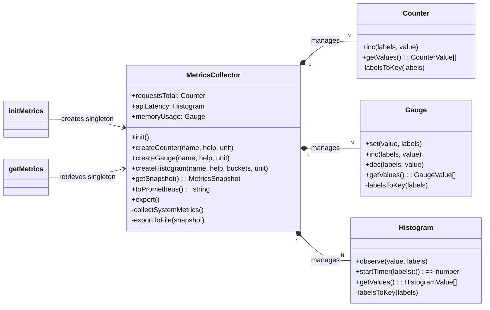

# src — metrics

The `src/metrics` module provides a robust, centralized system for collecting, managing, and exporting application and system metrics. It's designed to give developers deep insights into the application's performance, resource usage, and operational health, supporting both real-time monitoring and historical analysis.

This module supports common metric types (Counters, Gauges, Histograms) and offers flexible export options, including Prometheus-compatible format, file-based logging, and integration with OpenTelemetry.

## 1. Core Concepts

The module revolves around three fundamental metric types:

*   **Counter**: A monotonically increasing value. Ideal for tracking cumulative events like total requests, errors, or tokens used. Once incremented, its value never decreases (unless explicitly reset).
*   **Gauge**: A value that can go up and down. Suitable for tracking current states like memory usage, active connections, or active sessions.
*   **Histogram**: Tracks the distribution of observed values, providing insights into latency, duration, or response sizes. It records the count, sum, min, max, and counts within configurable buckets.

All metric types support **labels**, which are key-value pairs that add dimensions to a metric, allowing for more granular analysis (e.g., `requests_total{endpoint="/api/chat", method="POST"}`).

## 2. Architecture Overview

The `MetricsCollector` class is the central hub for all metrics. It manages the lifecycle of individual `Counter`, `Gauge`, and `Histogram` instances, collects system-level metrics, and orchestrates the export process.

A singleton pattern is used to ensure a single, globally accessible `MetricsCollector` instance throughout the application, managed by `initMetrics` and `getMetrics`.



## 3. Key Components

### 3.1. `MetricsCollector` Class

The `MetricsCollector` is the primary interface for interacting with the metrics system.

*   **Initialization (`constructor`, `init`, `initMetrics`)**:
    *   The `MetricsCollector` constructor takes a `MetricsConfig` object to configure its behavior (e.g., export intervals, file paths).
    *   It immediately initializes a set of **pre-defined metrics** (see section 3.1.7).
    *   The `init()` method, typically called once via `initMetrics()`, sets up periodic tasks:
        *   An `exportInterval` to regularly call `this.export()`.
        *   An interval to call `this.collectSystemMetrics()` every 10 seconds.
    *   `initMetrics(config?: MetricsConfig)`: This global function ensures a singleton `MetricsCollector` instance. It should be called once at application startup.
    *   `getMetrics()`: Retrieves the singleton `MetricsCollector` instance.

*   **Metric Management**:
    *   `createCounter(name: string, help: string, unit?: string)`: Registers and returns a new `Counter` instance.
    *   `createGauge(name: string, help: string, unit?: string)`: Registers and returns a new `Gauge` instance.
    *   `createHistogram(name: string, help: string, buckets?: number[], unit?: string)`: Registers and returns a new `Histogram` instance. If `buckets` are not provided, `config.defaultBuckets` are used.
    *   `getCounter(name: string)`, `getGauge(name: string)`, `getHistogram(name: string)`: Retrieve previously registered metric instances by name.

*   **System Metrics**:
    *   `collectSystemMetrics()`: Periodically called internally to update built-in `Gauge` metrics for memory usage (`codebuddy_memory_bytes`).
    *   `getSystemMetrics()`: Returns a `SystemMetrics` object containing current process memory, CPU usage, uptime, active handles, and requests. This data is included in snapshots and Prometheus exports.

*   **Exporting and Snapshots**:
    *   `getSnapshot()`: Gathers the current state of all registered counters, gauges, and histograms, along with system metrics, into a `MetricsSnapshot` object. This is the raw data representation.
    *   `export()`: This asynchronous method is called periodically (based on `exportInterval`). It performs the following:
        1.  Generates a `MetricsSnapshot`.
        2.  Adds the snapshot to an in-memory `history` buffer (capped by `maxHistorySize`).
        3.  If `consoleExport` is enabled, logs a summary to the console.
        4.  If `fileExport` is enabled, calls `exportToFile()` to append the snapshot to a daily JSONL file.
        5.  Emits an `export` event with the snapshot.
    *   `exportToFile(snapshot: MetricsSnapshot)`: Appends a JSON stringified snapshot to a file named `metrics-YYYY-MM-DD.jsonl` within the configured `filePath`.
    *   `toPrometheus()`: Generates a string representation of all current metrics in the Prometheus text exposition format. This includes `HELP` and `TYPE` comments, and correctly formats labels. It also includes system metrics.
    *   `toJSON()`: Returns the current metrics as a `MetricsSnapshot` object, suitable for JSON serialization.

*   **Lifecycle and History**:
    *   `getHistory(limit?: number)`: Retrieves a copy of the in-memory `MetricsSnapshot` history.
    *   `reset()`: Clears all values for all registered counters, gauges, and histograms, and empties the history.
    *   `shutdown()`: Clears the export interval, performs a final `export()`, and marks the collector as uninitialized.

### 3.2. `Counter` Class

Represents a single counter metric.

*   `constructor(name: string, help: string, unit?: string)`: Initializes the counter with a name, help string, and optional unit.
*   `inc(labels: MetricLabels = {}, value: number = 1)`: Increments the counter by `value` (default 1) for the given `labels`.
*   `getValues()`: Returns an array of `CounterValue` objects, each representing a unique combination of labels and its current value.
*   `reset()`: Resets all values for this counter to 0.
*   `labelsToKey(labels: MetricLabels)` / `keyToLabels(key: string)`: Internal methods for serializing/deserializing label objects into a string key for internal `Map` storage.

### 3.3. `Gauge` Class

Represents a single gauge metric.

*   `constructor(name: string, help: string, unit?: string)`: Initializes the gauge.
*   `set(value: number, labels: MetricLabels = {})`: Sets the gauge to a specific `value` for the given `labels`.
*   `inc(labels: MetricLabels = {}, value: number = 1)`: Increments the gauge by `value` (default 1).
*   `dec(labels: MetricLabels = {}, value: number = 1)`: Decrements the gauge by `value` (default 1).
*   `getValues()`: Returns an array of `GaugeValue` objects, including the value, labels, and timestamp of the last update.
*   `reset()`: Resets all values for this gauge to 0.
*   `labelsToKey(labels: MetricLabels)` / `keyToLabels(key: string)`: Internal methods for label serialization.

### 3.4. `Histogram` Class

Represents a single histogram metric.

*   `constructor(name: string, help: string, buckets?: number[], unit?: string)`: Initializes the histogram with a name, help string, optional custom `buckets` (default provided by `MetricsConfig`), and optional unit. Buckets are sorted internally.
*   `observe(value: number, labels: MetricLabels = {})`: Records an observed `value` for the given `labels`. Updates count, sum, min, max, and increments appropriate buckets.
*   `startTimer(labels: MetricLabels = {})`: Returns a function that, when called, calculates the elapsed time since `startTimer` was invoked and `observe`s that duration. Useful for measuring execution times.
*   `getValues()`: Returns an array of `HistogramValue` objects, including count, sum, min, max, bucket counts, and labels.
*   `reset()`: Resets all values for this histogram.
*   `labelsToKey(labels: MetricLabels)` / `keyToLabels(key: string)`: Internal methods for label serialization.

### 3.5. Helper Functions

For convenience, the module provides global helper functions that interact with the singleton `MetricsCollector` instance:

*   `measureTime<T>(histogramName: string, labels: MetricLabels, fn: () => Promise<T>): Promise<T>`: A utility to wrap an asynchronous function (`fn`) and automatically record its execution duration to a specified histogram.
*   `incCounter(name: string, labels: MetricLabels = {}, value: number = 1)`: Increments a counter by name.
*   `setGauge(name: string, value: number, labels: MetricLabels = {})`: Sets a gauge by name.

### 3.6. Pre-defined Metrics

The `MetricsCollector` automatically initializes several common metrics:

*   `requestsTotal`: `Counter` - Total number of requests processed.
*   `requestErrors`: `Counter` - Total number of request errors.
*   `tokensUsed`: `Counter` - Total tokens used (e.g., for LLM interactions).
*   `toolExecutions`: `Counter` - Total tool executions.
*   `apiLatency`: `Histogram` - API request latency in seconds.
*   `toolDuration`: `Histogram` - Tool execution duration in seconds.
*   `memoryUsage`: `Gauge` - Memory usage in bytes (heapUsed, heapTotal, external, rss, arrayBuffers).
*   `activeConnections`: `Gauge` - Number of active connections.
*   `activeSessions`: `Gauge` - Number of active sessions.

These pre-defined metrics are directly accessible as properties of the `MetricsCollector` instance (e.g., `metrics.requestsTotal.inc()`).

## 4. Configuration (`MetricsConfig`)

The behavior of the `MetricsCollector` is configured via the `MetricsConfig` interface:

```typescript
export interface MetricsConfig {
  consoleExport?: boolean; // Enable console export (debug mode)
  fileExport?: boolean;    // Enable file export
  filePath?: string;       // File export path (default: ~/.codebuddy/metrics)
  exportInterval?: number; // Export interval in milliseconds (default: 60000ms / 1 minute)
  otelExport?: boolean;    // Enable OpenTelemetry export (handled by OpenTelemetryIntegration)
  defaultBuckets?: number[]; // Default histogram buckets (default: [0.01, 0.05, 0.1, 0.25, 0.5, 1, 2.5, 5, 10])
  maxHistorySize?: number; // Max metrics history size (default: 1000)
}
```

## 5. Usage Examples

```typescript
import { initMetrics, getMetrics, measureTime, incCounter, setGauge } from './metrics';

// 1. Initialize metrics (call once at application startup)
const metrics = initMetrics({
  consoleExport: true, // Log summaries to console
  fileExport: true,    // Export to daily JSONL files
  exportInterval: 30000, // Export every 30 seconds
});

// 2. Use pre-defined metrics
metrics.requestsTotal.inc({ endpoint: '/api/chat', method: 'POST' });
metrics.tokensUsed.inc({ type: 'prompt', model: 'gpt-4' }, 1500);
metrics.activeSessions.set(5); // Set current active sessions

// 3. Measure latency with a histogram timer
async function handleChatRequest() {
  const end = metrics.apiLatency.startTimer({ endpoint: '/api/chat' });
  try {
    // Simulate API call
    await new Promise(resolve => setTimeout(resolve, Math.random() * 1000));
  } finally {
    end(); // Records the duration automatically
  }
}
handleChatRequest();

// 4. Create and use custom metrics
const myCustomCounter = metrics.createCounter('my_app_events_total', 'Total custom application events');
myCustomCounter.inc({ event_type: 'user_login' });

const myCustomGauge = metrics.createGauge('my_app_queue_size', 'Current size of processing queue');
myCustomGauge.set(10);

// 5. Using helper functions for convenience
incCounter('codebuddy_tool_executions_total', { tool_name: 'search' });
setGauge('codebuddy_active_connections', 100, { type: 'websocket' });

// 6. Measure time with helper function
async function performComplexTask() {
  return measureTime('codebuddy_tool_duration_seconds', { tool_name: 'complex_analysis' }, async () => {
    // Simulate complex task
    await new Promise(resolve => setTimeout(resolve, Math.random() * 5000));
    return 'task_completed';
  });
}
performComplexTask();

// 7. Accessing current snapshot or Prometheus format
// (Typically exposed via an HTTP endpoint for Prometheus scraping)
// const prometheusMetrics = metrics.toPrometheus();
// console.log(prometheusMetrics);

// 8. Shutdown (e.g., on application exit)
// await metrics.shutdown();
```

## 6. Integration Points

The metrics module is designed to be integrated throughout the codebase to provide comprehensive observability:

*   **`src/integrations/opentelemetry-integration.ts`**: This module re-exports `OpenTelemetryIntegration` and related functions. It uses `getCounter` and `getHistogram` from `MetricsCollector` to bridge internal metrics with OpenTelemetry's tracing and metrics capabilities.
*   **`server/routes/metrics.ts`**: This route likely exposes the `MetricsCollector.toPrometheus()` output, allowing a Prometheus server to scrape metrics from the application.
*   **`context/codebase-rag/codebase-rag.ts`**: This module demonstrates creating custom histograms (`initializeRerankingMetrics`) and observing values (`rerankedSearch`) for specific domain logic, such as reranking latency.
*   **`src/server/index.ts`**: The main server entry point calls `initMetrics` to set up the metrics system at application startup.

## 7. Prometheus Compatibility

The `MetricsCollector.toPrometheus()` method generates output that strictly adheres to the Prometheus text exposition format. This includes:

*   `# HELP` and `# TYPE` lines for each metric, providing metadata.
*   Correct formatting of metric names and labels (e.g., `metric_name{label_key="label_value"}`).
*   For histograms, it exports `_bucket` metrics (including `+Inf`), `_sum`, and `_count` as required by Prometheus.
*   System metrics (uptime, CPU usage) are also exposed in Prometheus format.

This allows any Prometheus server to easily scrape and ingest metrics from the application, enabling powerful dashboards and alerting.