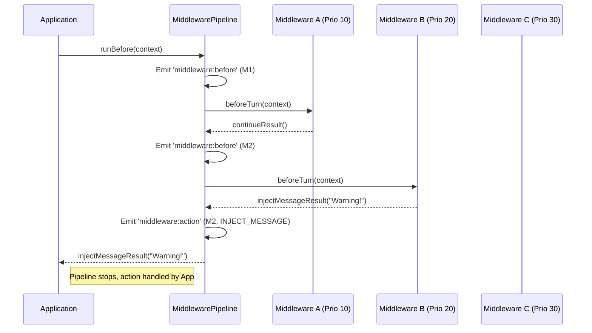

# src — middleware

The `src/middleware` module provides a robust and extensible system for controlling and enhancing conversation flow within Code-Buddy. Inspired by elegant middleware architectures, it allows for the injection of custom logic at key points in the conversation lifecycle, enabling features like turn limits, cost management, context auto-compaction, and more.

This module is designed for developers who need to understand how conversation constraints and automated actions are applied, or who wish to extend Code-Buddy's capabilities with new middleware.

## Overview

The middleware system operates on a "pipeline" model. As a conversation turn begins and ends, a series of registered `ConversationMiddleware` instances are executed in a defined order. Each middleware can inspect the current `ConversationContext` and return a `MiddlewareResult` that dictates whether the conversation should `CONTINUE`, `STOP`, `COMPACT` the context, or `INJECT_MESSAGE` into the chat.

This architecture provides a clean separation of concerns, allowing individual policies (e.g., turn limits, cost limits) to be implemented as distinct, pluggable components.

## Core Concepts

### `ConversationMiddleware` Interface

The heart of the system is the `ConversationMiddleware` interface, defined in `src/middleware/types.ts`. Any class implementing this interface can be added to the pipeline.

```typescript
export interface ConversationMiddleware {
  readonly name: string;
  readonly priority: number; // Lower priority runs first

  beforeTurn(context: ConversationContext): Promise<MiddlewareResult>;
  afterTurn(context: ConversationContext): Promise<MiddlewareResult>;
  reset(): void;
}
```

*   **`name`**: A unique identifier for the middleware.
*   **`priority`**: Determines the order of execution. Middlewares with lower `priority` values run first.
*   **`beforeTurn(context)`**: Called *before* the LLM generates a response for a user turn. This is where most preventative checks (limits, warnings) occur.
*   **`afterTurn(context)`**: Called *after* the LLM has generated a response and the conversation context has been updated. Useful for post-turn checks or cleanup.
*   **`reset()`**: Called when the conversation or session is reset (e.g., via `/clear`). This allows middlewares to clear any internal state (like warning flags).

### `ConversationContext`

The `ConversationContext` (defined in `src/middleware/types.ts`) is a comprehensive object passed to each middleware. It provides all necessary information about the current state of the conversation:

*   `messages`: The current message history.
*   `stats`: Detailed `ConversationStats` (turns, tokens, cost, tool calls, etc.).
*   `model`: `ModelInfo` about the active LLM (max context, pricing).
*   `workingDirectory`, `sessionId`, `autoApprove`, `metadata`: Other relevant session details.

### `MiddlewareResult` and `MiddlewareAction`

After executing its logic, a middleware returns a `MiddlewareResult` object. The `action` property of this result dictates the next step for the pipeline:

*   **`MiddlewareAction.CONTINUE`**: The default action. The pipeline proceeds to the next middleware.
*   **`MiddlewareAction.STOP`**: Halts the conversation immediately. Typically used when a hard limit is reached. The `message` and `reason` fields provide details to the user and for logging.
*   **`MiddlewareAction.COMPACT`**: Triggers the conversation manager to compact the message history (e.g., by summarizing older messages). The `reason` and `metadata` can provide context for the compaction.
*   **`MiddlewareAction.INJECT_MESSAGE`**: Inserts a message (e.g., a warning) into the conversation history without stopping the flow.

Helper functions like `continueResult()`, `stopResult()`, `compactResult()`, and `injectMessageResult()` are provided in `src/middleware/types.ts` for convenience.

## Middleware Implementations (`src/middleware/middlewares.ts`)

This file contains several concrete implementations of `ConversationMiddleware`, each addressing a specific aspect of conversation control:

*   **`TurnLimitMiddleware`**: Stops the conversation if a maximum number of turns is exceeded. Can issue a warning before the limit is reached.
*   **`PriceLimitMiddleware`**: Monitors the session's cumulative cost and stops the conversation if a configured maximum is surpassed. Also provides warnings.
*   **`AutoCompactMiddleware`**: Automatically triggers context compaction when the total token count exceeds a specified threshold, helping to prevent context window overflow.
*   **`ContextWarningMiddleware`**: Issues a warning message when the conversation's token usage approaches the model's maximum context window.
*   **`RateLimitMiddleware`**: Prevents rapid-fire requests by introducing a minimum interval between turns.
*   **`ToolExecutionLimitMiddleware`**: Limits the number of tool calls within a single turn. It exposes a `checkToolCall()` method for external components (like a tool executor) to query.

### Factory Functions

`src/middleware/middlewares.ts` also provides factory functions to easily create common middleware stacks:

*   **`createDefaultMiddlewares()`**: Returns a standard set of middlewares with sensible default limits for turns, cost, auto-compaction, and context warnings.
*   **`createYoloMiddlewares()`**: Returns a more relaxed set of middlewares, suitable for "YOLO" mode where limits are higher.

## Middleware Pipeline (`src/middleware/pipeline.ts`)

The `MiddlewarePipeline` class is responsible for managing and executing the registered middlewares.

### `MiddlewarePipeline`

*   **`add(middleware)`**: Adds a middleware to the pipeline, automatically sorting it by `priority`.
*   **`remove(name)`**, **`get(name)`**, **`has(name)`**, **`getNames()`**: Utility methods for managing middlewares.
*   **`setEnabled(enabled)`**: Globally enables or disables the entire pipeline.
*   **`on(handler)`**: Allows external components to subscribe to pipeline events (e.g., `middleware:before`, `middleware:action`, `middleware:error`).
*   **`runBefore(context)`**: Iterates through all registered middlewares (in priority order) and calls their `beforeTurn` method. It stops and returns the result if any middleware returns an action other than `CONTINUE`. Errors in individual middlewares are caught and emitted as events, but do not halt the pipeline.
*   **`runAfter(context)`**: Similar to `runBefore`, but calls the `afterTurn` method of each middleware.
*   **`reset()`**: Calls the `reset()` method on all registered middlewares, clearing their internal state.
*   **`clear()`**: Removes all middlewares from the pipeline.

#### Pipeline Execution Flow (`runBefore` example)



### `PipelineBuilder`

The `PipelineBuilder` class provides a fluent API for constructing `MiddlewarePipeline` instances.

*   **`use(middleware)`**: Adds a single middleware.
*   **`useAll(middlewares)`**: Adds an array of middlewares.
*   **`useIf(condition, middleware)`**: Conditionally adds a middleware.
*   **`build()`**: Creates and returns the configured `MiddlewarePipeline`.

The `createPipeline()` function is a convenient entry point to start building a pipeline.

## Integration with the Codebase

The middleware system is primarily consumed by the core conversation agent (e.g., `src/agent/codebuddy-agent.ts`).

1.  **Initialization**: An instance of `MiddlewarePipeline` is created, often using `PipelineBuilder` and factory functions like `createDefaultMiddlewares()`.
    *   `src/agent/codebuddy-agent.ts` directly instantiates `TurnLimitMiddleware` and `ContextWarningMiddleware` and adds them to a `PipelineBuilder`.
2.  **Turn Lifecycle**:
    *   Before processing a user's input and generating an LLM response, the agent calls `pipeline.runBefore(context)`.
    *   After the LLM response is received and the conversation context is updated, the agent calls `pipeline.runAfter(context)`.
3.  **Action Handling**: The agent is responsible for interpreting the `MiddlewareResult` returned by `runBefore` or `runAfter` and taking the appropriate action (e.g., stopping the conversation, triggering compaction, displaying an injected message).
4.  **Reset**: When a conversation is cleared, the agent calls `pipeline.reset()` to clear the state of all middlewares.
5.  **Tool Calls**: The `ToolExecutionLimitMiddleware.checkToolCall()` method is designed to be called by the tool execution logic to enforce per-turn tool limits.

## Extending the Module

To add new conversation control logic:

1.  **Create a new class** that implements the `ConversationMiddleware` interface.
2.  **Define `name` and `priority`**. Choose a priority that makes sense relative to existing middlewares (e.g., rate limiting might be very low, hard limits like turn/price might be low, warnings higher).
3.  **Implement `beforeTurn(context)` and/or `afterTurn(context)`**. Use the `context` object to access conversation state and return an appropriate `MiddlewareResult`.
4.  **Implement `reset()`** to clear any internal state.
5.  **Add your middleware** to a `MiddlewarePipeline` using `pipeline.add()` or `pipelineBuilder.use()`. Consider adding it to `createDefaultMiddlewares()` or `createYoloMiddlewares()` if it's a core feature.