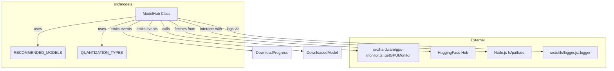

# src — models

The `src/models` module is responsible for the discovery, management, and automatic download of Large Language Models (LLMs) from the HuggingFace Hub. It's designed to facilitate local inference by providing a robust system for handling GGUF-formatted models, including intelligent selection based on available hardware resources.

## Purpose and Key Features

The primary goal of this module is to abstract away the complexities of finding, downloading, and managing LLM files. It ensures that the application can easily access the necessary models, optimizing for performance and resource availability.

Key features include:

*   **Automatic Model Discovery & Download:** Seamlessly fetches models from HuggingFace Hub.
*   **VRAM-based Recommendations:** Suggests and selects models and quantizations suitable for the host system's GPU memory.
*   **Quantization Selection:** Supports various GGUF quantization types, allowing a trade-off between model size/speed and quality.
*   **Progress Tracking:** Provides real-time updates during model downloads.
*   **Local Model Management:** Scans for existing models, stores metadata, and allows deletion.
*   **Pre-defined Model Registry:** Offers a curated list of `RECOMMENDED_MODELS` optimized for common use cases (e.g., coding, general purpose).

## Core Concepts and Data Structures

The module defines several interfaces and constants that are central to its operation:

*   **`QuantizationType` & `QUANTIZATION_TYPES`**:
    *   Defines the properties of different GGUF quantization levels (e.g., `Q4_K_M`, `Q8_0`, `F16`).
    *   `QUANTIZATION_TYPES` is a constant record mapping quantization names to their detailed properties, including `bitsPerWeight`, `qualityScore`, and `description`. This is crucial for VRAM estimation and quality-based selection.
*   **`ModelInfo`**:
    *   Describes a specific LLM, including its `id`, `name`, `size`, `parameterCount`, `huggingFaceRepo`, `defaultQuantization`, `supportedQuantizations`, `contextLength`, `license`, and `tags`.
    *   `RECOMMENDED_MODELS` is a constant record of pre-configured `ModelInfo` objects, serving as the module's internal registry of known models.
*   **`ModelSize`**: A union type defining common LLM parameter counts (e.g., "7b", "13b").
*   **`DownloadProgress`**: An interface for tracking the status of an ongoing model download, including `downloadedBytes`, `totalBytes`, `percentage`, `speed`, and `eta`.
*   **`DownloadedModel`**: Represents a model that has been successfully downloaded and stored locally, including its `id`, `path`, `quantization`, `sizeBytes`, and `downloadedAt` timestamp.
*   **`ModelHubConfig` & `DEFAULT_MODEL_HUB_CONFIG`**:
    *   Configures the `ModelHub` instance, specifying the `modelsDir` (where models are stored), an optional `hfToken` for gated HuggingFace models, `downloadTimeout`, `chunkSize` for streaming, and `autoSelectQuantization` behavior.
    *   `DEFAULT_MODEL_HUB_CONFIG` provides sensible defaults, typically storing models in `~/.codebuddy/models`.

## The `ModelHub` Class

The `ModelHub` class is the central component of this module, extending `EventEmitter` to provide progress and status updates.

### Initialization and Local Model Scanning

*   **`constructor(config?: Partial<ModelHubConfig>)`**:
    *   Initializes the `ModelHub` with a merged configuration (default + user-provided).
    *   Ensures the `modelsDir` exists, creating it recursively if necessary.
    *   Calls `scanLocalModels()` to discover any `.gguf` files already present in the `modelsDir`.
*   **`scanLocalModels()`**:
    *   Reads the `modelsDir` and identifies `.gguf` files.
    *   For each GGUF file, it extracts the `modelId` and `quantization` type from the filename using `extractModelIdFromFilename` and `extractQuantizationFromFilename`.
    *   Stores the discovered models in an internal `Map<string, DownloadedModel>`.
*   **`extractModelIdFromFilename(filename: string)`**: Parses a GGUF filename to derive the base model ID, removing quantization suffixes and file extensions.
*   **`extractQuantizationFromFilename(filename: string)`**: Identifies the quantization type present in a GGUF filename by matching against `QUANTIZATION_TYPES`.

### Model Discovery and Listing

*   **`listModels(): ModelInfo[]`**: Returns the complete list of `RECOMMENDED_MODELS` known to the hub.
*   **`listDownloaded(): DownloadedModel[]`**: Returns an array of all models currently downloaded and managed by the hub.
*   **`getModelInfo(modelId: string): ModelInfo | null`**: Retrieves detailed `ModelInfo` for a given `modelId` from `RECOMMENDED_MODELS`.
*   **`getDownloaded(fileNameOrId: string): DownloadedModel | null`**: Retrieves `DownloadedModel` information, searching by exact filename or partial model ID.
*   **`formatModelList(): string`**: Generates a human-readable string summarizing available and downloaded models, indicating their status and basic information.

### Intelligent Model Selection

This module integrates with the `gpu-monitor` to make informed decisions about model and quantization selection.

*   **`getRecommendedModel(useCase: "code" | "general" | "fast" = "code"): Promise<ModelInfo | null>`**:
    *   Fetches available VRAM using `getGPUMonitor().getStats()`.
    *   Filters `RECOMMENDED_MODELS` based on the specified `useCase` tags.
    *   Sorts candidates by parameter count (preferring larger models that fit).
    *   Uses `estimateVRAM()` to check if a model (with `Q4_K_M` quantization) fits within 90% of available VRAM.
    *   Returns the largest fitting model, or the smallest if none fit.
*   **`estimateVRAM(model: ModelInfo, quantization: string): number`**:
    *   Calculates an approximate VRAM usage in MB for a given `model` and `quantization`.
    *   The formula considers `parameterCount`, `bitsPerWeight` from `QUANTIZATION_TYPES`, and adds an overhead for the KV cache based on `contextLength`.
*   **`selectQuantization(model: ModelInfo, targetVRAM?: number): Promise<string>`**:
    *   If `autoSelectQuantization` is enabled in the config, this method determines the highest quality quantization (`QUANTIZATION_TYPES.qualityScore`) from `model.supportedQuantizations` that fits within the `targetVRAM` (or 85% of detected free VRAM).
    *   It iterates from highest to lowest quality, using `estimateVRAM()` for each.
    *   If no quantization fits, it defaults to the lowest quality supported.

### Model Download Management

The `ModelHub` handles the entire download process, including resolving file URLs and tracking progress.

*   **`download(modelId: string, quantization?: string): Promise<DownloadedModel>`**:
    *   Retrieves `ModelInfo` for the `modelId`.
    *   Calls `selectQuantization()` if `quantization` is not explicitly provided.
    *   Checks if the model is already downloaded.
    *   Constructs the local `filePath` and calls `resolveDownloadUrl()` to get the actual HuggingFace download link.
    *   Emits `download:start` event.
    *   Calls `downloadFile()` to perform the actual download.
    *   On completion, updates `downloadedModels` and emits `download:complete`.
    *   Emits `download:error` if any issue occurs.
*   **`resolveDownloadUrl(model: ModelInfo, quantization: string): Promise<string>`**:
    *   This is a critical method for robust HuggingFace integration.
    *   It attempts to construct the download URL using common GGUF filename patterns (e.g., `model-id-quant.gguf`).
    *   It performs `HEAD` requests to verify if these URLs are valid.
    *   As a fallback, it queries the HuggingFace API (`/api/models/{repo}/tree/main`) to list files in the repository and find a matching GGUF file.
    *   This ensures flexibility in case of varying filename conventions on HuggingFace.
*   **`downloadFile(url: string, filePath: string, fileName: string): Promise<void>`**:
    *   Performs the actual HTTP download using `fetch`.
    *   Supports `hfToken` for authenticated downloads.
    *   Streams the response body to `fs.createWriteStream()`.
    *   Continuously calculates and emits `download:progress` events.
    *   Handles errors by unlinking partially downloaded files.

### Model Deletion

*   **`delete(fileName: string): boolean`**:
    *   Removes a downloaded model file from the file system.
    *   Updates the internal `downloadedModels` map.
    *   Emits a `delete` event.

### Configuration

*   **`getConfig(): ModelHubConfig`**: Returns a copy of the current configuration.
*   **`updateConfig(config: Partial<ModelHubConfig>): void`**: Merges new configuration properties into the existing one.

### Event Emitter

As an `EventEmitter`, `ModelHub` emits the following events:

*   `download:start`: `{ modelId: string, fileName: string, quantization: string }`
*   `download:progress`: `DownloadProgress`
*   `download:complete`: `DownloadedModel`
*   `download:error`: `{ modelId: string, error: Error }`
*   `delete`: `{ fileName: string }`

Developers can subscribe to these events to provide UI feedback or react to download lifecycle changes.

### Utility Formatting

*   **`formatRecommendations(): Promise<string>`**: Generates a formatted string showing VRAM recommendations for all `listModels()`, indicating which quantizations fit the current system's VRAM.

## Singleton Access

The module provides a singleton pattern for `ModelHub` to ensure a single, consistent instance across the application.

*   **`getModelHub(config?: Partial<ModelHubConfig>): ModelHub`**:
    *   Returns the existing `ModelHub` instance if one exists.
    *   If not, it creates a new `ModelHub` instance with the provided `config` (or defaults) and returns it.
*   **`resetModelHub(): void`**:
    *   Disposes of the current `ModelHub` instance (removing all event listeners).
    *   Sets the singleton instance to `null`, allowing a new instance to be created on the next `getModelHub` call. This is primarily useful for testing or re-initialization scenarios.

## External Integrations

The `src/models` module relies on several external components:

*   **`src/hardware/gpu-monitor.ts`**: Crucial for `getRecommendedModel` and `selectQuantization` to determine available VRAM. It calls `getGPUMonitor().initialize()` and `getGPUMonitor().getStats()`.
*   **HuggingFace Hub**: The primary source for model downloads. The module interacts with HuggingFace via `fetch` requests to resolve file URLs and download model binaries.
*   **Node.js `fs`, `path`, `os`**: Used extensively for file system operations (creating directories, reading files, writing streams, deleting files) and determining user home directory for default model storage.
*   **`src/utils/logger.js`**: For structured logging of events and errors within the module.

## Contributing and Extending

Developers looking to contribute to this module should be familiar with:

*   **Asynchronous programming with `async/await`**: Heavily used for network requests and file I/O.
*   **`EventEmitter` pattern**: For handling download progress and status updates.
*   **File system operations**: Understanding `fs` module functions.
*   **HuggingFace Hub API/conventions**: Especially for `resolveDownloadUrl` logic.
*   **GGUF quantization types**: To accurately estimate VRAM and manage model quality.

To add new recommended models, update the `RECOMMENDED_MODELS` constant in `model-hub.ts` with the appropriate `ModelInfo`. Ensure the `huggingFaceRepo` and `supportedQuantizations` are accurate for the new model.