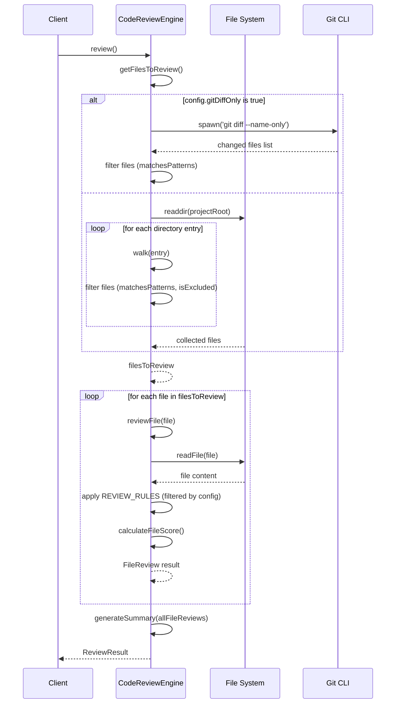

# src — modes

This document provides a comprehensive overview of the `src/modes` module, focusing on the `code-review.ts` file, which implements AI-powered code review capabilities.

## Module Overview

The `src/modes` module is designed to encapsulate distinct operational modes for the agent. Currently, its primary function is to provide an **AI-powered Code Review Mode**. This mode enables automated analysis of source code for various concerns, including:

*   Security vulnerabilities
*   Performance bottlenecks
*   Maintainability issues
*   Potential bugs
*   Adherence to best practices
*   Refactoring opportunities

The module is built around the `CodeReviewEngine` class, which orchestrates file discovery, rule application, and result aggregation.

## Core Concepts

The code review process revolves around several key data structures:

*   **`ReviewConfig`**: Defines the parameters for a code review, such as file inclusion/exclusion patterns, maximum file limits, categories to review, severity thresholds, and auto-fix enablement.
*   **`ReviewRule`**: Represents a specific code review check. Each rule has an ID, name, category, severity, a regular expression `pattern` to match against code, a `message`, optional `suggestion`, and a list of `languages` it applies to. Some rules also provide an `autoFix` function.
*   **`ReviewComment`**: An individual finding from the code review, detailing the file, line, severity, category, message, and optionally a code snippet, suggestion, and an `autoFix` definition.
*   **`ReviewFix`**: Describes a proposed change to fix a `ReviewComment`, specifying the type of change (`replace`, `insert`, `delete`), line number, and text modifications.
*   **`FileReview`**: The result of reviewing a single file, containing its path, a list of `ReviewComment`s, lines reviewed, and a calculated score.
*   **`ReviewSummary`**: An aggregated overview of the entire project review, including total files, total comments, counts by severity and category, an overall score, grade, highlights, and recommendations.
*   **`ReviewResult`**: The complete output of a project review, comprising all `FileReview`s, the `ReviewSummary`, and the duration of the review.

## CodeReviewEngine

The `CodeReviewEngine` class is the central component of the code review module. It extends `EventEmitter` to allow for progress and error reporting during long-running review operations.

### Initialization and Configuration

An instance of `CodeReviewEngine` is created with a `projectRoot` and an optional `Partial<ReviewConfig>`. The provided configuration is merged with `DEFAULT_CONFIG` to ensure all settings have sensible defaults.

```typescript
const DEFAULT_CONFIG: ReviewConfig = {
  includePatterns: ['**/*.ts', '**/*.tsx', '**/*.js', '**/*.jsx', '**/*.py'],
  excludePatterns: ['**/node_modules/**', '**/dist/**', '**/build/**', '**/*.test.*', '**/*.spec.*'],
  maxFiles: 50,
  maxLinesPerFile: 1000,
  categories: ['security', 'performance', 'maintainability', 'bug', 'best-practice'],
  severityThreshold: 'info',
  enableAutoFix: true,
  gitDiffOnly: false,
};

const engine = new CodeReviewEngine('/path/to/project', {
  severityThreshold: 'warning',
  gitDiffOnly: true,
  baseBranch: 'main',
});
```

### Review Rules

The `REVIEW_RULES` array defines the static set of checks the engine performs. Each rule is a `ReviewRule` object, specifying its ID, category, severity, a regular expression `pattern`, and a descriptive message.

For example, a security rule for hardcoded secrets:

```typescript
{
  id: 'SEC001',
  name: 'Hardcoded Secret',
  category: 'security',
  severity: 'critical',
  pattern: /(?:password|secret|api[_-]?key|token|auth)\s*[=:]\s*["'][^"']{8,}["']/gi,
  message: 'Potential hardcoded secret detected. Use environment variables instead.',
  suggestion: 'Move this value to an environment variable or configuration file.',
  languages: ['typescript', 'javascript', 'python'],
}
```

Rules can also include an `autoFix` function, which, if enabled in the configuration, can generate a `ReviewFix` object to automatically resolve the issue.

### Execution Flow

The `review()` method orchestrates the entire code review process.



#### File Discovery

The `getFilesToReview()` method determines which files to analyze based on the `ReviewConfig`:

*   If `config.gitDiffOnly` is `true`, it calls `getGitDiffFiles()`, which uses `child_process.spawn` to execute `git diff --name-only` and retrieve files changed relative to the base branch (or HEAD).
*   Otherwise, it calls `globFiles()`, which recursively walks the `projectRoot` using `fs/promises.readdir`.

Both methods filter files using `matchesPatterns()` and `isExcluded()` based on the `includePatterns` and `excludePatterns` defined in the configuration. The `globToRegex()` helper converts glob patterns into regular expressions for efficient matching.

#### File Review

The `reviewFile(filePath: string)` method performs the actual analysis for a single file:

1.  It reads the file content using `fs/promises.readFile`.
2.  It determines the programming `language` based on the file extension.
3.  It iterates through all `REVIEW_RULES`, applying only those relevant to the file's language, configured categories, and severity threshold (`meetsThreshold()`).
4.  For each applicable rule, it uses `RegExp.matchAll` to find all occurrences of the rule's pattern within the file's lines.
5.  For every match, a `ReviewComment` is created. If the rule has an `autoFix` function and auto-fixing is enabled, a `ReviewFix` is generated and attached to the comment.
6.  Finally, `calculateFileScore()` assigns a numerical score to the file based on the severity and number of comments found.

#### Summary Generation

After all files are reviewed, `generateSummary(fileReviews: FileReview[])` aggregates the results. It counts comments by severity and category, calculates an overall project score (average of file scores), assigns a letter grade, and generates high-level highlights and recommendations.

#### Auto-Fixing

The `applyFixes(fileReviews: FileReview[])` method can be called to automatically apply suggested fixes. It iterates through all `ReviewComment`s that have an `autoFix` defined. To prevent issues with line number shifts, fixes are applied in reverse order of line number within each file. It reads the file, modifies its content in memory, and then writes the updated content back to disk using `fs/promises.writeFile`.

#### Output Formatting

The `formatAsText(result: ReviewResult)` method provides a human-readable text representation of the `ReviewResult`, suitable for console output or reports.

### Event Emitter

`CodeReviewEngine` emits the following events:

*   `'progress'`: Provides updates on the current phase (e.g., 'collecting', 'reviewing'), current file count, total file count, and the file being processed.
*   `'error'`: Reports errors encountered during file processing, including the file path and the error object.

### Cleanup

The `dispose()` method removes all event listeners, preventing memory leaks when the engine instance is no longer needed.

## Usage

The module provides two main ways to initiate a code review:

### 1. Using `CodeReviewEngine` directly

For more control, including listening to progress events or applying fixes separately:

```typescript
import { CodeReviewEngine } from './modes/code-review.js';

async function runReview() {
  const projectRoot = './my-project';
  const engine = new CodeReviewEngine(projectRoot, {
    severityThreshold: 'warning',
    enableAutoFix: true,
  });

  engine.on('progress', (data) => {
    console.log(`Progress: ${data.phase} - ${data.file || ''} (${data.current || 0}/${data.total || 0})`);
  });

  engine.on('error', (data) => {
    console.error(`Error reviewing ${data.file}:`, data.error);
  });

  try {
    const result = await engine.review();
    console.log(engine.formatAsText(result));

    // Optionally apply fixes
    const { applied, failed } = await engine.applyFixes(result.files);
    console.log(`Applied ${applied} fixes, failed ${failed}.`);

  } catch (e) {
    console.error('Review failed:', e);
  } finally {
    engine.dispose(); // Clean up event listeners
  }
}

runReview();
```

### 2. Using the `reviewProject` convenience function

For a quick, one-off review without needing to manage the engine instance directly:

```typescript
import { reviewProject } from './modes/code-review.js';

async function quickReview() {
  const projectRoot = './my-project';
  const result = await reviewProject(projectRoot, {
    severityThreshold: 'critical',
    gitDiffOnly: true,
    baseBranch: 'main',
  });

  console.log(`Review Score: ${result.summary.score}/100`);
  console.log(`Critical Issues: ${result.summary.bySeverity.critical}`);
  // The engine is automatically disposed by reviewProject
}

quickReview();
```

## Integration Points

The `code-review.ts` module is largely self-contained, relying on standard Node.js APIs for its operations:

*   **File System**: It uses `fs/promises` for asynchronous file reading (`readFile`) and writing (`writeFile`) during file discovery and auto-fixing.
*   **Child Processes**: It uses `child_process.spawn` to interact with the `git` command-line interface for retrieving changed files when `gitDiffOnly` is enabled.
*   **Event Emitters**: It leverages Node.js's `events` module for progress and error reporting.

The module's public API (`CodeReviewEngine`, `createCodeReview`, `reviewProject`) is primarily consumed by tests (`tests/code-review.test.ts`), indicating its intended use as a standalone component that can be integrated into larger systems.