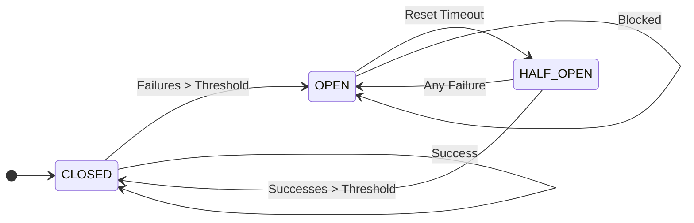
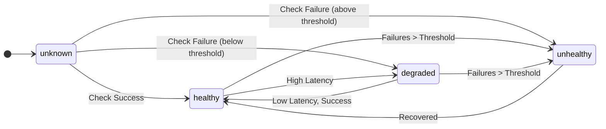

# src — networking

The `src/networking` module provides robust utilities for building resilient and fault-tolerant network interactions within the Code Buddy application. It encapsulates common patterns like Circuit Breakers and Health Checks, along with re-exporting related utilities for retries and rate limiting.

This module is crucial for ensuring the stability and reliability of services that interact with external APIs or internal microservices, preventing cascading failures and providing insights into endpoint health.

## 1. Overview

The `src/networking` module aggregates several key functionalities:

*   **Circuit Breaker**: Implements the Circuit Breaker pattern to prevent repeated requests to failing services, allowing them time to recover.
*   **Health Check**: Monitors the health and latency of API endpoints, providing real-time status and supporting failover strategies.
*   **Related Utilities**: Re-exports `retry` mechanisms and `RateLimiter` from the `src/utils` module, centralizing networking-related tools.

This documentation focuses on the `CircuitBreaker` and `HealthCheckManager` components, as they are defined within this module.

## 2. Circuit Breaker (`src/networking/circuit-breaker.ts`)

The `CircuitBreaker` class implements the Circuit Breaker pattern, a critical fault-tolerance mechanism. It prevents an application from repeatedly trying to execute an operation that is likely to fail, thereby saving resources and preventing cascading failures.

### 2.1 Core Concepts

The circuit breaker operates through three primary states:

*   **CLOSED**: The normal state. Requests are allowed to pass through to the target service. If failures occur, they are counted. If the failure count exceeds a `failureThreshold` within a `failureWindow`, the circuit transitions to `OPEN`.
*   **OPEN**: The circuit is tripped. Requests are immediately blocked and an error is thrown without attempting to call the service. After a `resetTimeout` period, the circuit transitions to `HALF_OPEN`.
*   **HALF_OPEN**: A probationary state. A limited number of requests are allowed to pass through to test if the service has recovered.
    *   If these test requests succeed (reaching `successThreshold`), the circuit transitions back to `CLOSED`.
    *   If any request fails, the circuit immediately transitions back to `OPEN`.

### 2.2 `CircuitBreaker` Class

The `CircuitBreaker` class manages the state and logic for a single circuit.

#### 2.2.1 Initialization and Options

A `CircuitBreaker` instance is created with `CircuitBreakerOptions`:

```typescript
interface CircuitBreakerOptions {
  failureThreshold?: number; // Default: 5
  resetTimeout?: number;     // Default: 30000ms (30 seconds)
  successThreshold?: number; // Default: 2
  failureWindow?: number;    // Default: 60000ms (60 seconds)
  isFailure?: (error: unknown) => boolean; // Custom error check
  onStateChange?: (from: CircuitState, to: CircuitState) => void; // Callback
}

const breaker = new CircuitBreaker({
  failureThreshold: 3,
  resetTimeout: 15000,
  isFailure: (err) => err instanceof NetworkError, // Only trip on network errors
});
```

#### 2.2.2 Executing Operations

The primary way to interact with the circuit breaker is through the `execute` method:

```typescript
async execute<T>(fn: () => Promise<T>): Promise<T>
```

This method wraps an asynchronous function (`fn`) and applies the circuit breaker logic:

1.  It first calls `this.canExecute()` to determine if the current state allows the request.
    *   If `OPEN` and `resetTimeout` has passed, it transitions to `HALF_OPEN` and allows the request.
    *   If `OPEN` and `resetTimeout` has *not* passed, it immediately throws an `Error('Circuit breaker is OPEN - request blocked')`.
2.  If allowed, it executes `fn()`.
3.  On successful completion of `fn()`, `this.onSuccess()` is called, potentially transitioning the circuit from `HALF_OPEN` to `CLOSED`.
4.  On failure of `fn()`, `this.onFailure()` is called (if `options.isFailure` returns true for the error), potentially transitioning the circuit from `CLOSED` or `HALF_OPEN` to `OPEN`.

#### 2.2.3 State Management

The internal methods `onSuccess()`, `onFailure()`, `canExecute()`, and `transitionTo()` manage the circuit's state transitions and failure/success counts.

*   `onSuccess()`: Increments `consecutiveSuccesses`. If in `HALF_OPEN` and `consecutiveSuccesses` meets `successThreshold`, it calls `transitionTo('CLOSED')`.
*   `onFailure()`: Increments `failedRequests`, resets `consecutiveSuccesses`, and records the failure timestamp. It filters out failures older than `failureWindow`. If in `HALF_OPEN` or if `failures.length` meets `failureThreshold` in `CLOSED` state, it calls `transitionTo('OPEN')`.
*   `canExecute()`: Determines if a request should proceed based on the current `state` and `nextAttempt` timestamp (for `OPEN` state).
*   `transitionTo(newState: CircuitState)`: Handles the actual state change, resetting relevant counters (`failures`, `consecutiveSuccesses`) and setting `nextAttempt` if transitioning to `OPEN`. It also emits `stateChange` events and calls the `onStateChange` callback if provided.

#### 2.2.4 Utility Methods

*   `getState(): CircuitState`: Returns the current state of the circuit.
*   `getStats(): CircuitBreakerStats`: Provides detailed statistics about the circuit's performance and state.
*   `reset(): void`: Manually forces the circuit to `CLOSED` state, clearing failure counts.
*   `trip(): void`: Manually forces the circuit to `OPEN` state.
*   `isHealthy(): boolean`: Returns `true` if the circuit is `CLOSED`.
*   `getTimeUntilRetry(): number`: Returns the remaining time in milliseconds until the circuit attempts recovery (only relevant in `OPEN` state).
*   `formatStats(): string`: Provides a human-readable string representation of the circuit's statistics.
*   `dispose(): void`: Cleans up event listeners.

#### 2.2.5 Events

The `CircuitBreaker` extends `EventEmitter` and emits the following events:

*   `success`: On successful execution of `fn`.
*   `failure`: On failed execution of `fn` (and `isFailure` returns true).
*   `stateChange`: When the circuit transitions between states, with `{ from: CircuitState, to: CircuitState }`.
*   `reset`: When `reset()` is called.
*   `trip`: When `trip()` is called.

#### 2.2.6 Global Circuit Breaker Registry

The module also provides global functions for managing named circuit breakers:

*   `getCircuitBreaker(name: string, options?: CircuitBreakerOptions): CircuitBreaker`: Retrieves an existing circuit breaker by name or creates a new one if it doesn't exist. This is useful for managing multiple breakers across different services or endpoints.
*   `getAllCircuitBreakerStats(): Record<string, CircuitBreakerStats>`: Returns statistics for all registered named circuit breakers.
*   `resetAllCircuitBreakers(): void`: Resets all registered named circuit breakers to `CLOSED`.

#### 2.2.7 Circuit Breaker State Diagram



### 2.3 Usage Example

```typescript
import { getCircuitBreaker } from './networking/circuit-breaker.js';

const myServiceBreaker = getCircuitBreaker('my-external-service', {
  failureThreshold: 5,
  resetTimeout: 60000, // 1 minute
  successThreshold: 3,
});

myServiceBreaker.on('stateChange', ({ from, to }) => {
  console.log(`Circuit for 'my-external-service' changed from ${from} to ${to}`);
});

async function callExternalService(): Promise<string> {
  return myServiceBreaker.execute(async () => {
    console.log('Attempting to call external service...');
    // Simulate an API call
    const response = await fetch('https://api.example.com/data');
    if (!response.ok) {
      throw new Error(`Service responded with status: ${response.status}`);
    }
    const data = await response.text();
    console.log('Service call successful.');
    return data;
  });
}

// Example usage loop
setInterval(async () => {
  try {
    const result = await callExternalService();
    // console.log('Received:', result.substring(0, 20));
  } catch (error: any) {
    console.error('Service call failed or blocked:', error.message);
    console.log('Current breaker state:', myServiceBreaker.getState());
    if (myServiceBreaker.getState() === 'OPEN') {
      console.log(`Retry in: ${Math.ceil(myServiceBreaker.getTimeUntilRetry() / 1000)}s`);
    }
  }
  console.log(myServiceBreaker.formatStats());
  console.log('---');
}, 5000);
```

## 3. Health Check (`src/networking/health-check.ts`)

The `HealthCheckManager` provides a centralized way to monitor the health and performance of various API endpoints. It tracks status, latency, and failure counts, enabling applications to make informed decisions about routing requests or alerting operators.

### 3.1 Core Concepts

*   **Endpoint Monitoring**: Continuously checks specified URLs.
*   **Health Status**: Categorizes endpoint health as `healthy`, `degraded`, `unhealthy`, or `unknown`.
*   **Latency Tracking**: Records the response time for each check.
*   **Failure Thresholds**: Determines when an endpoint transitions from `degraded` to `unhealthy`.
*   **Custom Checks**: Allows for custom logic beyond simple HTTP HEAD requests.

### 3.2 `HealthCheckManager` Class

The `HealthCheckManager` class is responsible for managing and performing health checks.

#### 3.2.1 Initialization and Options

A `HealthCheckManager` instance is created with `HealthCheckOptions`:

```typescript
interface HealthCheckOptions {
  interval?: number;          // Default: 30000ms (30 seconds)
  timeout?: number;           // Default: 5000ms (5 seconds)
  failureThreshold?: number;  // Default: 3
  degradedThreshold?: number; // Default: 2000ms (2 seconds)
  maxHistory?: number;        // Default: 100
  checkFn?: (url: string) => Promise<boolean>; // Custom check function
}

const manager = new HealthCheckManager({
  interval: 10000, // Check every 10 seconds
  failureThreshold: 2,
  checkFn: async (url) => {
    // Custom logic, e.g., check a specific API endpoint
    const response = await fetch(`${url}/health`);
    return response.status === 200;
  },
});
```

#### 3.2.2 Endpoint Management

*   `addEndpoint(url: string): void`: Registers an endpoint for monitoring. An initial `checkEndpoint` is performed immediately.
*   `removeEndpoint(url: string): void`: Deregisters an endpoint and stops its continuous monitoring.
*   `startMonitoring(url: string): void`: Begins continuous, interval-based health checks for a registered endpoint. If the endpoint isn't added, it calls `addEndpoint` first.
*   `stopMonitoring(url: string): void`: Halts continuous monitoring for an endpoint.

#### 3.2.3 Performing Checks

*   `checkEndpoint(url: string): Promise<HealthCheckResult>`: Executes a single health check for a given URL. This method updates the internal `EndpointHealth` record, calculates latency, and determines the new `HealthStatus`. It also emits `check`, `unhealthy`, and `recovered` events.
*   `private performCheck(url: string): Promise<boolean>`: This private method performs the actual check. If `options.checkFn` is provided, it uses that. Otherwise, it defaults to an HTTP `HEAD` request with a configurable `timeout`.

#### 3.2.4 Reporting and Querying

*   `getHealth(url: string): EndpointHealth | undefined`: Retrieves the detailed health status for a specific endpoint.
*   `getAllHealth(): EndpointHealth[]`: Returns an array of `EndpointHealth` objects for all monitored endpoints.
*   `getHealthiestEndpoint(urls: string[]): string | null`: Given a list of URLs, it returns the URL of the healthiest endpoint based on status and latency. This is useful for failover or load balancing.
*   `getSummary()`: Provides a count of endpoints by their health status (`total`, `healthy`, `degraded`, `unhealthy`, `unknown`).
*   `formatHealth(): string`: Generates a human-readable string summary of all endpoint health statuses.
*   `dispose(): void`: Cleans up all active monitoring intervals and event listeners.

#### 3.2.5 Events

The `HealthCheckManager` extends `EventEmitter` and emits the following events:

*   `check`: After every health check, with `{ url: string, result: HealthCheckResult }`.
*   `unhealthy`: When an endpoint transitions to `unhealthy`, with `{ url: string, result: HealthCheckResult }`.
*   `recovered`: When an endpoint recovers from a failure state to `healthy`, with `{ url: string, result: HealthCheckResult }`.

#### 3.2.6 Global Health Check Manager

The module provides global functions for managing a singleton `HealthCheckManager` instance:

*   `getHealthCheckManager(options?: HealthCheckOptions): HealthCheckManager`: Retrieves the singleton instance of `HealthCheckManager`, creating it if it doesn't exist.
*   `resetHealthCheckManager(): void`: Disposes of the current singleton instance and sets it to `null`, allowing a new one to be created.

#### 3.2.7 Health Status State Diagram



### 3.3 Usage Example

```typescript
import { getHealthCheckManager } from './networking/health-check.js';

const healthManager = getHealthCheckManager({
  interval: 5000, // Check every 5 seconds
  degradedThreshold: 1000, // Degraded if latency > 1s
  failureThreshold: 2, // Unhealthy after 2 consecutive failures
});

healthManager.addEndpoint('https://jsonplaceholder.typicode.com/posts/1');
healthManager.addEndpoint('https://non-existent-service.com/health'); // Will fail
healthManager.addEndpoint('https://httpbin.org/delay/1'); // Will be degraded due to latency

healthManager.on('check', ({ url, result }) => {
  // console.log(`Checked ${url}: ${result.status} (${result.latency}ms)`);
});

healthManager.on('unhealthy', ({ url, result }) => {
  console.warn(`🚨 Endpoint UNHEALTHY: ${url} - ${result.error}`);
});

healthManager.on('recovered', ({ url }) => {
  console.info(`✅ Endpoint RECOVERED: ${url}`);
});

// Start continuous monitoring
healthManager.startMonitoring('https://jsonplaceholder.typicode.com/posts/1');
healthManager.startMonitoring('https://non-existent-service.com/health');
healthManager.startMonitoring('https://httpbin.org/delay/1');


// Periodically log summary
setInterval(() => {
  console.log('\n--- Health Check Report ---');
  console.log(healthManager.formatHealth());
  const healthiest = healthManager.getHealthiestEndpoint([
    'https://jsonplaceholder.typicode.com/posts/1',
    'https://non-existent-service.com/health',
    'https://httpbin.org/delay/1'
  ]);
  console.log(`Healthiest endpoint: ${healthiest || 'None'}`);
  console.log('---------------------------\n');
}, 15000);

// Clean up after a while
setTimeout(() => {
  console.log('Disposing health check manager...');
  healthManager.dispose();
}, 60000);
```

## 4. Related Utilities

The `src/networking/index.ts` file re-exports several related utilities from the `src/utils` module, centralizing access to common networking patterns:

*   **Retry Mechanisms**:
    *   `retry`, `retryWithResult`, `withRetry`: Functions for retrying failed operations.
    *   `Retry`: A class for more configurable retry logic.
    *   `RetryPredicates`, `RetryStrategies`: Enums/interfaces for defining retry conditions and backoff strategies.
    These are useful for handling transient network errors or temporary service unavailability.
*   **Rate Limiting**:
    *   `RateLimiter`: A class for controlling the rate of function execution.
    *   `getRateLimiter`: A global function to get or create named rate limiters.
    *   `rateLimited`: A decorator/higher-order function to apply rate limiting to functions.
    These prevent overwhelming services with too many requests in a short period.

Developers should refer to the documentation for `src/utils/retry.ts` and `src/utils/rate-limiter.ts` for detailed usage of these re-exported utilities.

## 5. Conclusion

The `src/networking` module provides a robust foundation for building resilient and observable network interactions. By leveraging `CircuitBreaker` for fault tolerance and `HealthCheckManager` for proactive monitoring, developers can create more stable and reliable applications that gracefully handle external service dependencies. The re-export of retry and rate-limiting utilities further enhances this capability, offering a comprehensive toolkit for network-aware development.