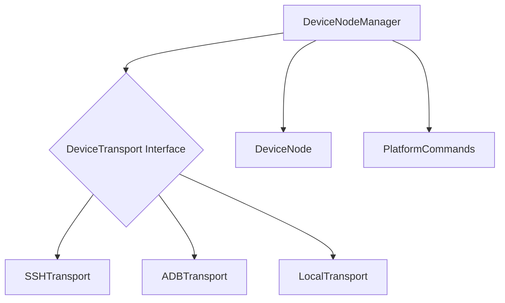
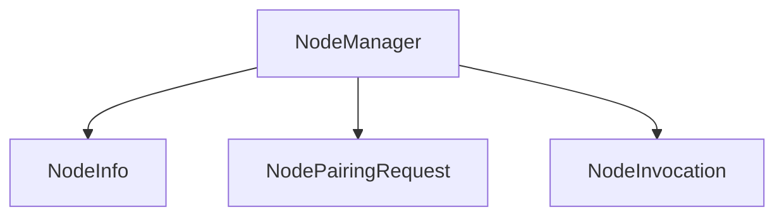

# src — nodes

The `src/nodes` module is a foundational component for interacting with external computational entities, whether they are physical devices or companion applications running on those devices. It provides two distinct but complementary systems:

1.  **Device Node System**: For direct, low-level control and interaction with physical devices (e.g., servers, phones) using native system commands.
2.  **Companion Node System**: For managing companion applications that connect to a central Gateway (e.g., via WebSockets) and offer higher-level, app-specific capabilities.

This document details both systems, their core components, functionality, and how they integrate into the broader codebase.

---

## 1. Device Node System

The Device Node System, primarily managed by `DeviceNodeManager`, enables the application to directly control and query physical devices like macOS, Linux, and Android machines. It achieves this by abstracting the underlying communication mechanism through various `DeviceTransport` implementations. This system is ideal for scenarios requiring direct shell access, file transfer, or native OS-level actions.

### 1.1 Core Components

*   **`DeviceNodeManager` (`src/nodes/device-node.ts`)**:
    *   A singleton class responsible for managing all paired `DeviceNode` instances.
    *   Handles the persistence of paired devices to a local JSON file (`~/.codebuddy/devices.json`).
    *   Orchestrates the creation, connection, and disconnection of `DeviceTransport` instances.
    *   Provides methods for pairing new devices, unpairing existing ones, listing devices, and executing device-specific actions (e.g., `cameraSnap`, `screenshot`, `systemRun`).
    *   Uses ephemeral `PairingToken`s for secure, time-limited device pairing.

*   **`DeviceNode` Interface (`src/nodes/device-node.ts`)**:
    *   Represents a paired device.
    *   Key properties include `id`, `name`, `type` (`macos`, `linux`, `android`, `local`), `transportType` (`ssh`, `adb`, `local`), and a list of detected `capabilities`.

*   **`DeviceTransport` Interface (`src/nodes/transports/base-transport.ts`)**:
    *   Defines the contract for how to communicate with a device.
    *   All concrete transport implementations must adhere to this interface.
    *   Core methods: `connect()`, `disconnect()`, `execute(command)`, `uploadFile()`, `downloadFile()`, `isConnected()`, `getCapabilities()`.

*   **Concrete `DeviceTransport` Implementations (`src/nodes/transports/`)**:
    *   **`SSHTransport` (`ssh-transport.ts`)**: Communicates with remote macOS or Linux devices using `ssh` for command execution and `scp` for file transfers. It handles SSH key paths, usernames, and ports.
    *   **`ADBTransport` (`adb-transport.ts`)**: Interacts with Android devices via the Android Debug Bridge (`adb`). It includes specialized methods for Android-specific capabilities like `listCameras`, `capturePhoto`, `listContacts`, `getCalendarEvents`, `listNotifications`, `getSensorData`, `getBatteryInfo`, and `getNetworkInfo`.
    *   **`LocalTransport` (`local-transport.ts`)**: Executes commands directly on the host machine where the application is running. File transfers are a no-op as the filesystem is directly accessible.

*   **`platform-commands.ts`**:
    *   Provides the `PlatformCommands` interface and concrete implementations (`MacOSCommands`, `LinuxCommands`, `AndroidCommands`).
    *   Maps generic device actions (e.g., `screenshot`, `cameraSnap`, `screenRecord`, `getLocation`) to platform-specific shell commands. This allows `DeviceNodeManager` to execute actions without knowing the exact command syntax for each OS.

### 1.2 How it Works

1.  **Initialization**: When `DeviceNodeManager.getInstance()` is called, it attempts to load previously paired devices from `~/.codebuddy/devices.json`.
2.  **Pairing (`pairDevice`)**:
    *   A new `DeviceNode` entry is created with basic information (ID, name, transport type).
    *   The appropriate `DeviceTransport` (e.g., `SSHTransport` for `ssh` transportType) is instantiated and connected.
    *   The transport's `getCapabilities()` method is called to auto-detect the device's supported features.
    *   For SSH connections, `uname -s` is executed to refine the `DeviceType` (e.g., from a default 'macos' to 'linux').
    *   The newly paired device is saved to disk.
3.  **Device Actions (e.g., `cameraSnap`, `screenshot`)**:
    *   The `DeviceNodeManager` first retrieves the `DeviceNode` by its ID.
    *   It verifies that the device has the required capability.
    *   It obtains a connected `DeviceTransport` instance using `getTransport()`, which re-connects if necessary.
    *   The `DeviceType` is mapped to a `DevicePlatform` using `toPlatform()`.
    *   Platform-specific commands are retrieved from `getPlatformCommands()`.
    *   The command string is then executed on the device via `transport.execute()`.
    *   The device's `lastSeen` timestamp is updated.

### 1.3 Architecture Diagram

### 1.4 Integration

*   **CLI Tools**: `DeviceNodeManager` is used by `src/tools/device-tool.ts` and integrated into the CLI via `commands/cli/device-commands.ts` for managing paired devices.
*   **Testing**: Unit tests for transports are found in `tests/unit/device-transports.test.ts`, and feature tests involving device pairing are in `tests/features/tailscale-dashboard-nodes.test.ts`.

---

## 2. Companion Node System

The Companion Node System, managed by `NodeManager`, focuses on interacting with dedicated companion applications (nodes) that run on various platforms (macOS, iOS, Android, Linux, Windows). These companion apps are expected to connect to a central Gateway (e.g., via WebSockets) and expose higher-level, app-specific capabilities.

### 2.1 Core Components

*   **`NodeManager` (`src/nodes/index.ts`)**:
    *   A singleton class that extends `EventEmitter`.
    *   Manages `NodeInfo` objects (representing connected companion apps) and `NodePairingRequest`s (for pending pairings).
    *   Handles the pairing process, node lifecycle (heartbeats, status updates), and dispatching capability invocations.
    *   Configurable with parameters like `pairingCodeLength`, `pairingTimeoutMs`, and `maxNodes`.

*   **`NodeInfo` Interface (`src/nodes/index.ts`)**:
    *   Represents a connected companion application.
    *   Includes properties like `id`, `name`, `platform` (`macos`, `ios`, `android`, `linux`, `windows`), `capabilities`, `status` (`online`, `offline`, `pairing`), `pairedAt`, `lastSeen`, and optional metadata like `version` and `batteryLevel`.

*   **`NodeCapability` Type (`src/nodes/index.ts`)**:
    *   Defines specific, application-level capabilities that a companion app can offer (e.g., `camera.snap`, `location.get`, `sms.send`, `voice.wake`). These are more granular than `DeviceCapability`s.

*   **`NodePairingRequest` Interface (`src/nodes/index.ts`)**:
    *   Stores details for a pending pairing, including a short `code`, `platform`, `name`, `capabilities`, and `expiresAt`.

*   **`NodeInvocation` / `NodeInvocationResult` Interfaces (`src/nodes/index.ts`)**:
    *   Structures for requesting a capability on a node and receiving its result. `NodeInvocation` specifies the `nodeId`, `capability`, and optional `params`. `NodeInvocationResult` indicates `success`, `data`, `error`, and `durationMs`.

*   **`PLATFORM_CAPABILITIES` Constant (`src/nodes/index.ts`)**:
    *   A map defining the default `NodeCapability`s expected for each `NodePlatform`.

### 2.2 How it Works

1.  **Initialization**: `NodeManager.getInstance()` initializes the manager, optionally with custom configuration.
2.  **Pairing Request (`requestPairing`)**:
    *   A short, human-readable pairing code is generated.
    *   A `NodePairingRequest` is created, stored internally, and associated with an expiry time.
    *   The `NodeManager` emits a `pairing:requested` event, allowing other parts of the system (e.g., a WebSocket server) to present this code to the user or the companion app.
3.  **Pairing Approval (`approvePairing`)**:
    *   The provided pairing code is validated against pending requests (checking for existence and expiry).
    *   The `NodePairingRequest` is removed.
    *   A unique `NodeInfo` object is created for the new node, assigned default capabilities based on its platform, and marked as `online`.
    *   The `NodeManager` emits a `node:paired` event.
4.  **Node Lifecycle (`heartbeat`, `markOffline`)**:
    *   Companion apps are expected to send regular heartbeats via `heartbeat()` to keep their `lastSeen` timestamp updated and maintain an `online` status.
    *   `markOffline()` can be called to explicitly set a node's status to `offline`.
5.  **Capability Invocation (`invoke`)**:
    *   When a capability is invoked (e.g., `cameraSnap`, `getLocation`), the `NodeManager` first validates that the node exists, is online, and supports the requested capability.
    *   It then emits a `node:invoke` event, passing the `node` and `invocation` details. **Crucially, the actual communication with the companion app (e.g., sending a WebSocket message) is expected to be handled by an external listener to this event.**
    *   A placeholder `NodeInvocationResult` is returned, indicating that the invocation was dispatched.

### 2.3 Architecture Diagram

### 2.4 Integration

*   **CLI Tools**: `NodeManager` is integrated into the CLI via `commands/cli/node-commands.ts` for listing, describing, pairing, approving, removing, and invoking capabilities on companion nodes.
*   **Event-Driven Architecture**: As an `EventEmitter`, `NodeManager` allows other modules (e.g., a WebSocket server handling companion app connections) to subscribe to `pairing:requested`, `node:paired`, `node:invoke`, and `node:offline` events to implement the actual communication and state changes.

---

## 3. Relationship and Distinctions

While both systems deal with "nodes," they serve different purposes and employ distinct interaction models:

*   **Device Node System**:
    *   **Focus**: Direct, low-level system access to a device's operating system.
    *   **Communication**: Direct SSH, ADB, or local shell execution.
    *   **Capabilities**: Generic OS-level actions (e.g., `screenshot`, `system_run`, `file_transfer`).
    *   **Use Case**: Controlling headless servers, performing system administration tasks, or interacting with devices that don't run a dedicated companion app.

*   **Companion Node System**:
    *   **Focus**: Application-level interactions with a dedicated companion app.
    *   **Communication**: Implied WebSocket-based communication (handled by external listeners to `NodeManager` events).
    *   **Capabilities**: More granular, app-oriented actions (e.g., `camera.snap`, `sms.send`, `voice.wake`).
    *   **Use Case**: Leveraging rich APIs and UI provided by a companion app on a user's personal device (phone, desktop).

In essence, the **Device Node System** treats a device as a remote computer, while the **Companion Node System** treats it as a platform hosting a specialized application.

---

## 4. API Reference (Key Types/Interfaces)

### Device Node System

*   **`DeviceType`**: `'macos' | 'linux' | 'android' | 'local'`
*   **`DeviceCapability`**: Union type for capabilities like `'camera'`, `'screenshot'`, `'system_run'`, `'location'`, etc.
*   **`TransportType`**: `'ssh' | 'adb' | 'local'`
*   **`PairingToken`**: `{ token: string; createdAt: number; expiresAt: number; consumed: boolean; }`
*   **`DeviceNode`**: `{ id: string; name: string; type: DeviceType; transportType: TransportType; capabilities: DeviceCapability[]; paired: boolean; lastSeen: number; address?: string; port?: number; username?: string; keyPath?: string; pairingToken?: PairingToken; }`
*   **`ExecuteResult`**: `{ exitCode: number; stdout: string; stderr: string; }`
*   **`ExecuteOptions`**: `{ timeout?: number; cwd?: string; env?: Record<string, string>; }`
*   **`TransportConfig`**: `{ deviceId: string; name?: string; address?: string; port?: number; username?: string; keyPath?: string; }`
*   **`DeviceTransport`**: Interface defining methods for device communication.

### Companion Node System

*   **`NodePlatform`**: `'macos' | 'ios' | 'android' | 'linux' | 'windows'`
*   **`NodeCapability`**: Union type for capabilities like `'camera.snap'`, `'screen.capture'`, `'location.get'`, `'notification.send'`, etc.
*   **`NodeInfo`**: `{ id: string; name: string; platform: NodePlatform; capabilities: NodeCapability[]; pairedAt: Date; lastSeen: Date; status: 'online' | 'offline' | 'pairing'; version?: string; osVersion?: string; batteryLevel?: number; }`
*   **`NodePairingRequest`**: `{ code: string; platform: NodePlatform; name: string; capabilities: NodeCapability[]; expiresAt: Date; }`
*   **`NodeInvocation`**: `{ nodeId: string; capability: NodeCapability; params?: Record<string, unknown>; timeoutMs?: number; }`
*   **`NodeInvocationResult`**: `{ success: boolean; data?: unknown; error?: string; durationMs?: number; }`
*   **`NodeManagerConfig`**: `{ pairingCodeLength: number; pairingTimeoutMs: number; heartbeatIntervalMs: number; maxNodes: number; }`

---

## 5. How to Contribute and Extend

### Extending the Device Node System

*   **Adding a New `DeviceTransport`**:
    1.  Create a new class that implements the `DeviceTransport` interface (e.g., `BluetoothTransport`).
    2.  Add the new transport type to the `TransportType` union.
    3.  Modify `DeviceNodeManager.createTransport()` to instantiate your new transport based on its `TransportType`.
    4.  Implement `getCapabilities()` in your new transport to accurately reflect what it can do.
*   **Adding a New `DeviceCapability`**:
    1.  Add the new capability string to the `DeviceCapability` union type.
    2.  Update the `getCapabilities()` method in relevant `DeviceTransport` implementations to detect and report this new capability.
    3.  If the capability involves executing a shell command, add a corresponding method to the `PlatformCommands` interface in `platform-commands.ts` and implement it for `MacOSCommands`, `LinuxCommands`, and `AndroidCommands`.
    4.  Add a new action method to `DeviceNodeManager` (e.g., `async newAction(deviceId: string, ...args: any[])`) that checks for the capability, gets the transport, retrieves platform commands, and executes the appropriate command.
*   **Extending `PlatformCommands`**:
    1.  If a new generic action is needed, add it to the `PlatformCommands` interface.
    2.  Implement the new method in `MacOSCommands`, `LinuxCommands`, and `AndroidCommands` with the appropriate shell commands.

### Extending the Companion Node System

*   **Adding a New `NodePlatform`**:
    1.  Add the new platform string to the `NodePlatform` union type.
    2.  Update the `PLATFORM_CAPABILITIES` map in `src/nodes/index.ts` to define the default capabilities for this new platform.
*   **Adding a New `NodeCapability`**:
    1.  Add the new capability string to the `NodeCapability` union type.
    2.  Update the `PLATFORM_CAPABILITIES` map for relevant platforms.
    3.  If it's a common capability, consider adding a convenience method to `NodeManager` (e.g., `async newCapability(nodeId: string, ...args: any[])`) that calls `this.invoke()`.
    4.  Ensure that any external listener to the `node:invoke` event is updated to handle the new capability.

---