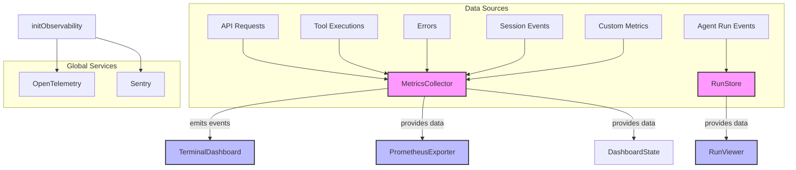

# src — observability

The `src/observability` module provides comprehensive monitoring, logging, and tracing capabilities for Code Buddy. It's designed to give developers and users insights into the system's performance, resource usage, agent behavior, and error states.

This module encompasses:
*   **Real-time Metrics Collection**: In-memory tracking of key performance indicators (KPIs) like token usage, costs, response times, and tool execution statistics.
*   **Agent Run Persistence**: A file-system based store for detailed agent run logs, including events, metrics, and artifacts, enabling post-mortem analysis and replay.
*   **Tool Performance Tracking**: Specific metrics for individual tools to inform RAG (Retrieval Augmented Generation) optimization and identify bottlenecks.
*   **Distributed Tracing**: Integration with OpenTelemetry for end-to-end request tracing.
*   **Error Reporting**: Integration with Sentry for centralized error tracking.
*   **Terminal & Prometheus Dashboards**: Built-in CLI dashboard for quick insights and a Prometheus-compatible exporter for external monitoring systems.

## Architecture Overview

The observability module acts as a central hub for various types of operational data. It collects data from different parts of the Code Buddy application and provides multiple ways to consume and visualize this information.



## Core Components

### 1. Real-time Metrics & Dashboard (`dashboard.ts`)

This file defines the core in-memory metrics collection system and its immediate consumers.

#### `MetricsCollector` Class

The `MetricsCollector` is the central, in-memory repository for real-time operational metrics. It extends `EventEmitter`, allowing other parts of the application to subscribe to metric updates.

**Key Responsibilities:**
*   **Metric Registration**: Allows defining custom metrics with types (`counter`, `gauge`, `histogram`).
*   **Data Recording**: Methods like `record()`, `increment()`, `recordAPIRequest()`, `recordToolExecution()`, `recordError()`, `startSession()`, `recordMessage()`, and `endSession()` capture various events and update internal state.
*   **Data Aggregation**: Maintains aggregated metrics for providers, tools, and sessions.
*   **State Retrieval**: Provides methods like `getDashboardState()`, `getTotalTokens()`, `getToolMetrics()`, `getProviderMetrics()`, etc., to query the current state.
*   **History Management**: Stores a rolling window of `maxHistoryPoints` for each metric and `maxErrors` for recent errors.
*   **Event Emission**: Emits events (`metric`, `api:request`, `tool:executed`, `error`, `session:started`, `session:ended`, `reset`) for real-time updates.

**Data Structures:**
*   `MetricPoint`: A single data point with `timestamp`, `value`, and optional `labels`.
*   `Metric`: Defines a metric's `name`, `type`, `description`, `unit`, and an array of `points`.
*   `ToolMetrics`: Aggregated statistics for a specific tool (calls, duration, success/error counts).
*   `ProviderMetrics`: Aggregated statistics for an LLM provider/model (requests, tokens, cost, latency).
*   `SessionMetrics`: Detailed metrics for a single user session.
*   `ErrorRecord`: Details of a recorded error.
*   `DashboardState`: A high-level summary of the system's current operational status.

**Usage Pattern:**
Most interactions with `MetricsCollector` happen via the `getMetricsCollector()` singleton function.

```typescript
import { getMetricsCollector } from './observability/dashboard.js';

const collector = getMetricsCollector();

// Record an API request
collector.recordAPIRequest({
  provider: 'openai',
  model: 'gpt-4',
  promptTokens: 100,
  completionTokens: 50,
  cost: 0.001,
  latency: 500,
  success: true,
});

// Record a tool execution
collector.recordToolExecution({
  name: 'bash',
  duration: 1200,
  success: true,
});

// Listen for events
collector.on('metric', (data) => {
  console.log(`New metric: ${data.name} = ${data.value}`);
});
```

#### `TerminalDashboard` Class

Provides a human-readable, ASCII-art representation of the `MetricsCollector`'s state, suitable for display in a terminal.

**Key Responsibilities:**
*   **Rendering**: The `render()` method generates a formatted string containing an overview, rates, provider metrics, top tool metrics, and recent errors.
*   **Live Refresh**: `startLiveRefresh()` and `stopLiveRefresh()` enable continuous updates to the terminal output.

**Usage Pattern:**
Typically instantiated via `getTerminalDashboard()` and used for CLI monitoring.

```typescript
import { getTerminalDashboard } from './observability/dashboard.js';

const dashboard = getTerminalDashboard();

// Print once
console.log(dashboard.render());

// Or start live refresh
dashboard.startLiveRefresh(1000, (output) => {
  // Clear console and print new output
  process.stdout.write('\x1Bc');
  console.log(output);
});
```

#### `PrometheusExporter` Class

Converts the `MetricsCollector`'s data into a Prometheus-compatible text format, allowing integration with external monitoring systems like Prometheus and Grafana.

**Key Responsibilities:**
*   **Exporting**: The `export()` method generates a string adhering to the Prometheus exposition format, including metric types, help strings, and labeled values.

**Usage Pattern:**
Used when Code Buddy needs to expose its metrics to a Prometheus server.

```typescript
import { getPrometheusExporter } from './observability/dashboard.js';

const exporter = getPrometheusExporter();
const prometheusMetrics = exporter.export();
// This string can be served via an HTTP endpoint for Prometheus to scrape.
```

### 2. Agent Run Persistence (`run-store.ts`, `run-viewer.ts`)

This subsystem focuses on persistently storing detailed information about individual agent runs, enabling historical analysis, debugging, and replay.

#### `RunStore` Class

The `RunStore` manages the lifecycle and storage of agent runs on the local filesystem. Each run gets its own directory under `~/.codebuddy/runs/run_<id>/`, containing `events.jsonl`, `metrics.json`, and an `artifacts/` directory.

**Key Responsibilities:**
*   **Run Lifecycle**: `startRun()`, `forkRun()`, and `endRun()` manage the creation, branching, and completion of agent runs.
*   **Event Logging**: `emit()` and `appendEvent()` write structured `RunEvent` objects to an append-only `events.jsonl` file for each run.
*   **Artifact Storage**: `saveArtifact()` stores files (e.g., generated patches, logs) associated with a run.
*   **Metric Updates**: `updateMetrics()` and `saveMetrics()` persist run-specific metrics.
*   **Run Retrieval**: `getRun()`, `listRuns()`, `getEvents()`, `streamEvents()`, and `getArtifact()` provide methods to read stored run data.
*   **Pruning**: Automatically prunes old runs to keep the `MAX_RUNS` (30) most recent ones.
*   **Singleton Pattern**: `RunStore.getInstance()` ensures a single instance across the application.
*   **Active Run Tracking**: `_currentRunId` and `setActiveRunStore()` track the currently active run, allowing for convenient `appendEvent()` calls without needing the run ID explicitly.

**Data Structures:**
*   `RunEvent`: A timestamped event with a `type` (e.g., `run_start`, `tool_call`, `error`) and `data`.
*   `RunMetadata`: Optional metadata for a run, including `channel`, `userId`, `sessionId`, `tags`, and `parentRolloutId` for lineage tracking.
*   `RunMetrics`: Detailed metrics for a run (tokens, cost, duration, tool calls).
*   `RunSummary`: High-level information about a run (ID, objective, status, timestamps).
*   `RunRecord`: A complete snapshot of a run, combining `RunSummary`, `RunMetrics`, and a list of `artifacts`.

**Usage Pattern:**
The `RunStore` is typically accessed via `RunStore.getInstance()`. The `_activeStore` global variable allows for simplified event emission from various parts of the codebase.

```typescript
import { RunStore, getActiveRunStore, setActiveRunStore } from './observability/run-store.js';

const store = RunStore.getInstance();

// Start a new run
const runId = store.startRun('Fix bug in file X', { tags: ['bugfix', 'critical'] });

// Set as active for convenience
setActiveRunStore(store);

// Emit events during the run
getActiveRunStore()?.appendEvent('step_start', { description: 'Analyzing problem' });
getActiveRunStore()?.appendEvent('tool_call', { toolName: 'bash', args: { command: 'ls -la' } });

// Save an artifact
store.saveArtifact(runId, 'plan.md', '# Plan to fix bug...');

// Update metrics
store.updateMetrics(runId, { totalTokens: 500, totalCost: 0.01 });

// End the run
store.endRun(runId, 'completed');
setActiveRunStore(null);

// Later, list runs
const recentRuns = store.listRuns();
```

#### `RunViewer` Functions (`run-viewer.ts`)

Provides utility functions for displaying and interacting with `RunStore` data in the terminal.

**Key Functions:**
*   `showRun(runId: string)`: Prints a comprehensive summary of a run, including metrics, artifacts, and a detailed timeline of events.
*   `tailRun(runId: string)`: Streams events from a run in real-time, similar to `tail -f`.
*   `replayRun(runId: string, rerun = true)`: Displays a run's timeline and identifies test commands, with an option to re-execute them.
*   `listRuns(limit = 20)`: Lists recent runs with their summaries.

**Usage Pattern:**
These functions are typically invoked from CLI commands (e.g., `buddy run show <id>`, `buddy run tail <id>`).

```typescript
import { showRun, tailRun, listRuns } from './observability/run-viewer.js';

// From a CLI command handler
async function handleShowCommand(runId: string) {
  await showRun(runId);
}

async function handleTailCommand(runId: string) {
  await tailRun(runId);
}

function handleListCommand() {
  listRuns();
}
```

### 3. Tool Performance Tracking (`tool-metrics.ts`)

This module specifically tracks the performance and reliability of individual tools, which can be crucial for optimizing agent behavior, especially in RAG scenarios.

#### `ToolMetricsTracker` Class

Maintains a rolling window of latency and success/failure counts for each tool.

**Key Responsibilities:**
*   **Recording**: `record(toolName, success, latencyMs)` captures execution data for a tool.
*   **Metric Retrieval**: `getMetric()` for a single tool, `getAllMetrics()` for all tools.
*   **Reliability Scoring**: `getReliabilityScore()` calculates a weighted score (80% success rate, 20% speed) to inform RAG tool selection.
*   **Summary Formatting**: `formatSummary()` provides a human-readable overview of tool performance.
*   **Singleton Pattern**: `getToolMetricsTracker()` ensures a single instance.

**Data Structures:**
*   `ToolMetric`: Aggregated metrics for a tool (total calls, success/failure counts, rates, various latency percentiles).
*   `ToolRecord`: Internal structure holding raw data for a tool, including a `latencies` array for percentile calculations.

**Usage Pattern:**
Accessed via `getToolMetricsTracker()` and used by the tool execution layer to record performance and by the agent's decision-making logic to select tools.

```typescript
import { getToolMetricsTracker } from './observability/tool-metrics.js';

const tracker = getToolMetricsTracker();

// When a tool executes
tracker.record('bash', true, 150);
tracker.record('file_read', false, 300);

// To get a reliability score for RAG
const bashReliability = tracker.getReliabilityScore('bash'); // e.g., 0.9
const fileReadReliability = tracker.getReliabilityScore('file_read'); // e.g., 0.4

// To display a summary
console.log(tracker.formatSummary());
```

### 4. Distributed Tracing & Error Reporting (`index.ts`, `tracing.ts`)

This part of the module handles global observability integrations, specifically for distributed tracing and error reporting.

#### `initObservability()` Function (`index.ts`)

The main entry point for initializing global observability services.

**Key Responsibilities:**
*   **Telemetry Check**: Uses `isTelemetryEnabled()` from `src/utils/telemetry-config.js` to determine if observability services should be initialized.
*   **OpenTelemetry Initialization**: Calls `initTracing()` to set up distributed tracing.
*   **Sentry Initialization**: Initializes Sentry for error reporting if `process.env.SENTRY_DSN` is set.

**Usage Pattern:**
Called once at application startup.

```typescript
import { initObservability } from './observability/index.js';

// In your main application entry point
initObservability();
```

#### `initTracing()` Function (`tracing.ts`)

Initializes the OpenTelemetry Node.js SDK for distributed tracing.

**Key Responsibilities:**
*   **Endpoint Configuration**: Uses `process.env.OTEL_EXPORTER_OTLP_ENDPOINT` to configure the OTLP trace exporter. If not set, tracing is disabled.
*   **Resource Attributes**: Sets service name (`codebuddy`) and version for traces.
*   **Instrumentations**: Configures default instrumentations (e.g., `HttpInstrumentation`) to automatically capture traces for common operations.
*   **Graceful Shutdown**: Registers a `SIGTERM` handler to ensure traces are flushed before shutdown.

**Usage Pattern:**
Called internally by `initObservability()`. Developers can add more specific instrumentations here if needed for custom modules.

#### Sentry Integration (`index.ts`)

Integrates with Sentry for error reporting.

**Key Responsibilities:**
*   **DSN Check**: Initializes Sentry only if `process.env.SENTRY_DSN` is provided.
*   **Configuration**: Sets environment, release, and `tracesSampleRate` based on `NODE_ENV` and `npm_package_version`.

**Usage Pattern:**
Errors caught by Sentry's default handlers or explicitly reported via `Sentry.captureException()` will be sent to the configured Sentry DSN.

## Integration Points & Usage Patterns

*   **Core Engine**: The main agent loop and tool execution logic will interact heavily with `MetricsCollector` (e.g., `recordAPIRequest`, `recordToolExecution`, `recordError`) and `RunStore` (e.g., `startRun`, `appendEvent`, `endRun`, `saveArtifact`).
*   **LLM Providers**: Each LLM provider integration should call `MetricsCollector.recordAPIRequest()` after each API call.
*   **Tools**: Individual tools should call `ToolMetricsTracker.record()` after their execution to log performance and success/failure. They might also use `RunStore.appendEvent()` for detailed run logs.
*   **User Sessions**: The session management layer will use `MetricsCollector.startSession()`, `recordMessage()`, and `endSession()`.
*   **CLI Commands**: Commands related to `buddy run` will use `RunViewer` functions (`showRun`, `tailRun`, `listRuns`, `replayRun`).
*   **Telemetry Configuration**: The `isTelemetryEnabled()` utility function acts as a global switch for enabling/disabling external observability services (Sentry, OpenTelemetry).

## Configuration & Environment Variables

*   `SENTRY_DSN`: (string, optional) The DSN for your Sentry project. If set, Sentry will be initialized for error reporting.
*   `OTEL_EXPORTER_OTLP_ENDPOINT`: (string, optional) The URL for your OpenTelemetry Collector or compatible OTLP endpoint. If set, OpenTelemetry tracing will be initialized.
*   `NODE_ENV`: (string, e.g., `production`, `development`) Used by Sentry to set the environment and adjust `tracesSampleRate`.
*   `npm_package_version`: (string) Automatically picked up from `package.json` and used by Sentry and OpenTelemetry for release/service versioning.

## Future Considerations

*   **Persistent MetricsCollector**: Currently, `MetricsCollector` is in-memory and resets on application restart. For long-term historical trends, integrating it with a persistent store (e.g., a time-series database or writing to `RunStore` for aggregated session metrics) could be beneficial.
*   **Custom OpenTelemetry Instrumentations**: As Code Buddy grows, custom instrumentations for specific internal modules or database interactions could provide richer trace data.
*   **Advanced RunStore Querying**: For very large numbers of runs, a more robust indexing or database solution for `RunStore` summaries might be considered, rather than loading all `summary.json` files on startup.
*   **Web Dashboard**: A web-based dashboard could provide a more interactive and visual experience than the terminal dashboard.