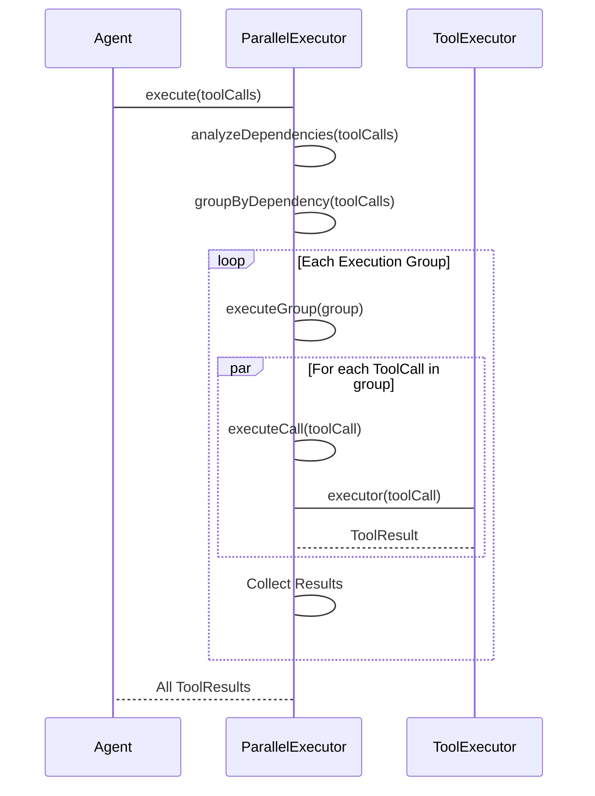

# src — optimization

The `src/optimization` module is a critical component designed to enhance the performance, cost-efficiency, and user experience of the LLM-powered CLI application. It integrates various research-backed techniques to address common challenges in LLM interactions, such as high API costs, latency, and inefficient tool utilization.

This module aims to:
*   **Reduce LLM API Costs:** By intelligently routing requests to appropriate models and caching repetitive prompt components.
*   **Minimize Latency:** By pre-computing common data, optimizing streaming responses, and executing independent tasks in parallel.
*   **Improve LLM Efficiency & Accuracy:** By dynamically filtering tools and structuring prompts for optimal caching.
*   **Preserve Developer Flow State:** By targeting sub-500ms response times for critical operations.

The module is structured into several sub-modules, each focusing on a specific optimization strategy.

---

## 1. Core Concepts & Principles

The optimizations implemented here are grounded in recent advancements in LLM research:

*   **FrugalGPT (Model Tier Routing):** Dynamically selects the most cost-effective LLM for a given task complexity, reducing overall API spend while maintaining quality.
*   **Less-is-More (Dynamic Tool Filtering):** Reduces the number of tools presented to the LLM, leading to faster and more accurate tool selection by the model, and lower token counts.
*   **LLMCompiler / AsyncLM (Parallel Tool Execution):** Identifies and executes independent tool calls concurrently, significantly speeding up multi-step operations.
*   **Prompt Caching (OpenAI/Anthropic):** Leverages LLM provider caching mechanisms and internal caching to avoid re-sending identical or highly similar prompt sections, saving costs and latency.
*   **Latency Optimization:** Focuses on human-computer interaction principles to ensure critical operations respond within thresholds that maintain user flow state.

---

## 2. Module Components

### 2.1. `src/optimization/cache-breakpoints.ts` — Anthropic Prompt Caching

This module provides specific optimizations for Anthropic Claude models, leveraging their `cache_control` feature.

**Purpose:**
Anthropic Claude's KV-cache typically only activates when the *entire* prompt is identical. In dynamic applications, this rarely happens due to changing elements like current time, active todos, or memory context. By injecting an `ephemeral` cache control marker, the stable prefix of the system prompt (identity, tools, instructions) can be cached independently of the dynamic suffix, leading to significant cost savings (up to 10x).

**How it Works:**
1.  **`buildStableDynamicSplit(systemPrompt: string)`:** Analyzes a system prompt string to identify the boundary between its "stable" (unchanging) and "dynamic" (per-turn changing) sections. It uses a predefined list of `DYNAMIC_MARKERS` (e.g., "Current Time", "Active Todos") to find the first line indicating a dynamic section.
2.  **`injectAnthropicCacheBreakpoints(messages: CodeBuddyMessage[])`:** Modifies the last system message in a message array by adding `cache_control: { type: 'ephemeral' }`. This signals to Anthropic that everything *before* this marker can be cached. This function should only be called when the active LLM provider is Anthropic.

**Key APIs:**
*   `injectAnthropicCacheBreakpoints(messages: CodeBuddyMessage[]): CacheBreakpointMessage[]`
*   `buildStableDynamicSplit(systemPrompt: string): StableDynamicSplit`
*   `isAnthropicModel(modelOrProvider: string): boolean`

**Integration Points:**
*   Used by the LLM interaction layer (e.g., `src/providers/anthropic-provider.ts`) to prepare messages before sending them to the Anthropic API.
*   `buildStableDynamicSplit` can be used by prompt construction logic to ensure system prompts are structured optimally for caching.

---

### 2.2. `src/optimization/latency-optimizer.ts` — Latency Optimization

This module is dedicated to measuring, tracking, and actively reducing perceived latency to maintain developer flow state.

**Purpose:**
To ensure that common operations complete within acceptable timeframes (e.g., sub-500ms) by providing tools for measurement, pre-computation, and streaming optimization.

**How it Works:**
The `LatencyOptimizer` class acts as a central hub for latency management:
1.  **Measurement:** `startOperation` and `endOperation` (or the `measure` wrapper) record the duration of any async task against predefined `OPERATION_TARGETS`.
2.  **Pre-computation Cache:** The `precompute` function allows expensive computations to be performed ahead of time and cached with a TTL. Subsequent requests for the same data retrieve it instantly from the cache. It uses an LRU-like eviction strategy.
3.  **Warmup Tasks:** `registerWarmup` allows tasks to be queued and executed during application startup to pre-load data or initialize services, reducing first-use latency.
4.  **Statistics:** Gathers detailed statistics on operation durations, target adherence, and cache performance.

The `StreamingOptimizer` specifically tracks the time to first token and total streaming time for LLM responses, crucial for perceived responsiveness.

**Key APIs:**
*   `LatencyOptimizer` (class): Manages measurements, pre-computation, and warmup.
    *   `startOperation(operation: string): string`
    *   `endOperation(id: string): LatencyMeasurement | null`
    *   `measure<T>(operation: string, fn: () => Promise<T>): Promise<T>`
    *   `precompute<T>(key: string, compute: () => Promise<T>, ttlMs?: number): Promise<T>`
    *   `registerWarmup(task: () => Promise<void>): void`
    *   `getStats(): object`
    *   `getCacheStats(): object`
*   `StreamingOptimizer` (class): Tracks streaming specific metrics.
    *   `recordFirstToken(latencyMs: number): void`
    *   `recordTotalTime(latencyMs: number): void`
    *   `getStats(): object`
*   `getLatencyOptimizer(): LatencyOptimizer` (Singleton accessor)
*   `getStreamingOptimizer(): StreamingOptimizer` (Singleton accessor)
*   `LATENCY_THRESHOLDS`: Constants for defining acceptable latency.
*   `OPERATION_TARGETS`: Map of common operations to their target latencies.

**Integration Points:**
*   `src/providers/base-provider.ts` uses `getStreamingOptimizer` to track LLM response streaming.
*   `src/services/vfs/unified-vfs-router.ts` uses `measureLatency` to track file operations.
*   Any potentially slow async operation can be wrapped with `measureLatency` or `precompute`.
*   `src/optimization/index.ts` uses `getLatencyOptimizer().getStats()` for the overall optimization report.

```mermaid
graph TD
    A[Application Code] -->|Calls| B{measureLatency("operation", asyncFn)}
    B --> C[getLatencyOptimizer()]
    C --> D[LatencyOptimizer.startOperation()]
    D --Emit "operation:start"--> E[Event Listeners]
    B --> F[asyncFn()]
    F --> G[LatencyOptimizer.endOperation()]
    G --Emit "operation:end"--> E
```

---

### 2.3. `src/optimization/model-routing.ts` — Model Tier Routing

This module implements a "FrugalGPT" approach to intelligently select the most appropriate LLM for a given task, balancing cost and capability.

**Purpose:**
To reduce LLM API costs by routing requests to cheaper, smaller models for simple tasks, and reserving more powerful, expensive models for complex or reasoning-heavy tasks.

**How it Works:**
1.  **`classifyTaskComplexity(message: string, ...)`:** Analyzes the user's message and conversation history to determine the task's complexity (`simple`, `moderate`, `complex`, `reasoning_heavy`), whether it requires vision, long context, etc. It uses keyword matching and message length heuristics.
2.  **`selectModel(classification: TaskClassification, ...)`:** Based on the task classification, it recommends an optimal model from `GROK_MODELS`. It prioritizes vision models if required, then routes based on complexity. User preferences and available models are also considered.
3.  **`ModelRouter` (class):** Manages the routing configuration (`RoutingConfig`), tracks model usage, and calculates estimated cost savings. It can adjust routing decisions based on `costSensitivity`.

**Key APIs:**
*   `ModelRouter` (class): Manages routing logic and statistics.
    *   `route(message: string, ...): RoutingDecision`
    *   `recordUsage(modelId: string, tokens: number, cost: number): void`
    *   `getUsageStats(): Map<string, { calls: number; tokens: number; cost: number }>`
    *   `getTotalCost(): number`
    *   `getEstimatedSavings(): { saved: number; percentage: number }`
*   `classifyTaskComplexity(message: string, ...): TaskClassification`
*   `selectModel(classification: TaskClassification, ...): RoutingDecision`
*   `calculateCost(tokens: number, modelId: string): number`
*   `getCostComparison(tokens: number): Array<{ model: string; tier: ModelTier; cost: number; savings: string }>`
*   `getModelRouter(): ModelRouter` (Singleton accessor)
*   `initializeModelRouter(config: Partial<RoutingConfig>): ModelRouter`
*   `GROK_MODELS`: Predefined configurations for various Grok models.
*   `DEFAULT_ROUTING_CONFIG`: Default settings for the router.

**Integration Points:**
*   `agent/facades/model-routing-facade.ts` uses `ModelRouter.route` via `autoRouteIfEnabled` to determine which model to use for LLM calls.
*   `commands/handlers/research-handlers.ts` uses `getCostComparison` and `getEstimatedSavings` for reporting.
*   `src/optimization/index.ts` uses `getModelRouter().getEstimatedSavings()` for the overall optimization report.

```mermaid
graph TD
    A[User Request] --> B{ModelRouter.route(message)}
    B --> C[classifyTaskComplexity(message)]
    C --> D{TaskClassification}
    D --> E[selectModel(classification)]
    E --> F{RoutingDecision}
    F --> G[ModelRouter.recordUsage(model, tokens, cost)]
    G --> H[LLM API Call]
```

---

### 2.4. `src/optimization/parallel-executor.ts` — Parallel Tool Executor

This module enables the concurrent execution of independent tool calls, significantly reducing the overall time taken for multi-tool operations.

**Purpose:**
To speed up complex agent workflows by identifying and executing tool calls that do not depend on each other in parallel, based on research from LLMCompiler and AsyncLM.

**How it Works:**
1.  **`analyzeDependencies(calls: ToolCall[])`:** Scans a list of `ToolCall` objects to identify explicit (`dependencies` field) and implicit dependencies (e.g., a `read` operation depending on a prior `write` to the same file, or a `bash` test command depending on prior file modifications).
2.  **`groupByDependency(calls: ToolCall[])`:** Uses the dependency analysis to group tool calls into "execution levels." All calls within a single level can be executed in parallel, while levels must be executed sequentially.
3.  **`ParallelExecutor` (class):** Takes a list of `ToolCall`s and an `executor` function (which knows how to run a single tool). It iterates through the execution groups, running calls within each group concurrently, respecting `maxConcurrency`, `timeoutMs`, and `retryCount` options.

**Key APIs:**
*   `ParallelExecutor` (class): Orchestrates parallel execution.
    *   `execute(calls: ToolCall[]): Promise<ToolResult[]>`
    *   `getStats(): object`
*   `analyzeDependencies(calls: ToolCall[]): Map<string, string[]>`
*   `groupByDependency(calls: ToolCall[]): ExecutionGroup[]`
*   `estimateSpeedup(calls: ToolCall[]): object`
*   `createParallelExecutor(executor: ToolExecutor, options?: Partial<ExecutionOptions>): ParallelExecutor`
*   `DEFAULT_EXECUTION_OPTIONS`: Default settings for concurrency, timeouts, and retries.

**Integration Points:**
*   The agent's tool execution logic would use `createParallelExecutor` and then `executor.execute()` when it has multiple tool calls to make.
*   `src/optimization/index.ts` uses `estimateSpeedup` for the overall optimization report.



---

### 2.5. `src/optimization/prompt-cache.ts` — Prompt Cache Manager

This module provides a generic caching mechanism for LLM prompt components, reducing redundant API calls.

**Purpose:**
To reduce LLM API costs and latency by caching frequently used or static parts of prompts (system instructions, tool definitions, context blocks).

**How it Works:**
The `PromptCacheManager` class implements an in-memory cache with:
1.  **Content Hashing:** Uses SHA256 to generate unique hashes for prompt content, serving as cache keys.
2.  **LRU Eviction:** When the cache reaches `maxEntries`, the least recently used entries are removed.
3.  **TTL Expiration:** Entries automatically expire after `ttlMs` (default 5 minutes, matching OpenAI's auto-cache behavior).
4.  **Component-Specific Caching:** Provides methods to cache system prompts, tool definitions, and arbitrary context blocks.
5.  **Statistics:** Tracks cache hits, misses, total tokens saved, and estimated cost savings.
6.  **`structureForCaching(messages: CodeBuddyMessage[])`:** Reorders messages to place static system messages first, maximizing the chance of LLM provider-side caching.

**Key APIs:**
*   `PromptCacheManager` (class): Manages the cache.
    *   `cacheSystemPrompt(prompt: string): string`
    *   `cacheTools(tools: CodeBuddyTool[]): string`
    *   `cacheContext(key: string, content: string): string`
    *   `isCached(content: string): boolean`
    *   `getStats(): CacheStats`
    *   `formatStats(): string`
    *   `clear(): void`
    *   `warmCache(prompts: { system?: string; tools?: CodeBuddyTool[] }): void`
    *   `structureForCaching(messages: CodeBuddyMessage[]): CodeBuddyMessage[]`
*   `getPromptCacheManager(config?: Partial<CacheConfig>): PromptCacheManager` (Singleton accessor)
*   `initializePromptCache(config?: Partial<CacheConfig>): PromptCacheManager`
*   `DEFAULT_CACHE_CONFIG`: Default settings for cache size, TTL, and cost estimation.

**Integration Points:**
*   `src/services/prompt-builder.ts` uses `cacheSystemPrompt` to cache the core system instructions.
*   `agent/facades/infrastructure-facade.ts` uses `getStats()` to report cache performance.
*   `commands/handlers/research-handlers.ts` uses `warmCache` to pre-populate the cache.
*   LLM providers can use `structureForCaching` before sending messages to the API.

---

### 2.6. `src/optimization/tool-filtering.ts` — Dynamic Tool Filtering

This module implements a "Less-is-More" strategy to dynamically filter the list of available tools based on the current task context.

**Purpose:**
To improve the LLM's ability to select the correct tool, reduce the number of tokens sent in the tool definitions, and thereby decrease latency and cost.

**How it Works:**
1.  **`buildTaskContext(userMessage: string, ...)`:** Creates a comprehensive `TaskContext` object by extracting keywords, detecting file operations, execution needs, and classifying the overall `TaskType` from the user's message and current environment.
2.  **`scoreToolRelevance(tool: ChatCompletionFunctionTool, context: TaskContext)`:** For each available tool, it calculates a relevance score based on:
    *   Direct matches in the user message.
    *   Matching `TaskType` categories.
    *   Keyword hints.
    *   File extension relevance.
    *   Description keyword overlap.
    *   A base score for "essential" tools (e.g., Read, Write, Bash).
3.  **`filterTools(allTools: ChatCompletionFunctionTool[], context: TaskContext, ...)`:** Sorts all tools by their relevance score and returns the top `maxTools` (default 10), ensuring a minimum relevance threshold is met and essential tools are always present.

**Key APIs:**
*   `filterTools(allTools: ChatCompletionFunctionTool[], context: TaskContext, maxTools?: number, minRelevance?: number): ChatCompletionFunctionTool[]`
*   `buildTaskContext(userMessage: string, currentFile?: string, mentionedFiles?: string[]): TaskContext`
*   `classifyTaskType(context: TaskContext): TaskType`
*   `extractKeywords(message: string): string[]`
*   `getFilteringStats(allTools: ChatCompletionFunctionTool[], context: TaskContext): object`

**Integration Points:**
*   The agent's planning or tool selection phase uses `filterTools` to narrow down the list of tools before presenting them to the LLM.
*   `src/optimization/index.ts` mentions tool filtering as always enabled.

```mermaid
graph TD
    A[User Message] --> B{buildTaskContext(message)}
    B --> C[TaskContext]
    C --> D{filterTools(allTools, context)}
    D --> E[scoreToolRelevance(tool, context)]
    E --> F[Sorted & Filtered Tools]
    F --> G[LLM Tool Selection]
```

---

### 2.7. `src/optimization/index.ts` — Optimization Module Entry Point

This file serves as the main entry point for the entire optimization module, aggregating exports and providing initialization and reporting functions.

**Purpose:**
To provide a unified interface for initializing all optimization components and generating a consolidated report on their performance and impact.

**How it Works:**
1.  **Exports:** Re-exports all public APIs from the individual optimization sub-modules, making them easily accessible from a single import.
2.  **`initializeOptimizations(config?: object)`:** A convenience function to initialize the `ModelRouter` and `LatencyOptimizer` with optional configurations. It ensures singletons are set up correctly.
3.  **`getOptimizationReport(): Promise<object>`:** Gathers statistics from the `ModelRouter` and `LatencyOptimizer` to provide a comprehensive overview of the optimizations' effectiveness, including cost savings, latency metrics, and estimated speedups.

**Key APIs:**
*   `initializeOptimizations(config?: { enableToolFiltering?: boolean; enableModelRouting?: boolean; enableLatencyTracking?: boolean; modelRoutingConfig?: Partial<RoutingConfig>; }): { modelRouter: ModelRouter; latencyOptimizer: LatencyOptimizer; }`
*   `getOptimizationReport(): Promise<object>`
*   All exports from `tool-filtering.ts`, `model-routing.ts`, `parallel-executor.ts`, `latency-optimizer.ts`, `prompt-cache.ts`.

**Integration Points:**
*   The main application bootstrap or agent initialization logic calls `initializeOptimizations` to set up the system.
*   Reporting or debugging interfaces call `getOptimizationReport` to display performance metrics.

---

## 3. Usage Examples (Conceptual)

### Initializing Optimizations

```typescript
import { initializeOptimizations, getOptimizationReport } from './optimization/index.js';

async function setupAgent() {
  const { modelRouter, latencyOptimizer } = initializeOptimizations({
    enableModelRouting: true,
    modelRoutingConfig: {
      costSensitivity: "high",
      excludeModels: ["grok-2-vision"]
    }
  });

  // Register a warmup task for the latency optimizer
  latencyOptimizer.registerWarmup(async () => {
    console.log("Warming up common data...");
    await latencyOptimizer.precompute("common_config", async () => ({ setting: "value" }), 300000);
  });
  await latencyOptimizer.warmup();

  console.log("Optimizations initialized.");

  // ... rest of agent setup
}

async function generateReport() {
  const report = await getOptimizationReport();
  console.log("Optimization Report:", report);
}
```

### Using Model Routing

```typescript
import { getModelRouter, classifyTaskComplexity } from './optimization/model-routing.js';

async function makeLLMCall(userMessage: string, conversationHistory: string[]) {
  const router = getModelRouter();
  const routingDecision = router.route(userMessage, conversationHistory);

  console.log(`Recommended model: ${routingDecision.recommendedModel} (${routingDecision.reason})`);

  // Use routingDecision.recommendedModel for the actual API call
  // const response = await llmProvider.chat(routingDecision.recommendedModel, messages);

  // Record usage after the call
  const actualTokensUsed = 1500; // Get this from the LLM response
  const actualCost = routingDecision.estimatedCost; // Or calculate based on actual tokens
  router.recordUsage(routingDecision.recommendedModel, actualTokensUsed, actualCost);
}
```

### Using Parallel Tool Execution

```typescript
import { createParallelExecutor, ToolCall, ToolResult } from './optimization/parallel-executor.js';

// A mock tool executor
const mockToolExecutor = async (call: ToolCall): Promise<any> => {
  console.log(`Executing tool: ${call.name} with args:`, call.arguments);
  await new Promise(resolve => setTimeout(resolve, Math.random() * 500 + 100)); // Simulate work
  if (call.name === "fail_tool") throw new Error("Tool failed!");
  return { result: `output from ${call.name}` };
};

async function executeMultipleTools() {
  const toolCalls: ToolCall[] = [
    { id: "t1", name: "read_file", arguments: { path: "file1.txt" } },
    { id: "t2", name: "read_file", arguments: { path: "file2.txt" } },
    { id: "t3", name: "write_file", arguments: { path: "file3.txt", content: "new content" }, dependencies: ["t1", "t2"] },
    { id: "t4", name: "bash", arguments: { command: "npm test" }, dependencies: ["t3"] },
  ];

  const executor = createParallelExecutor(mockToolExecutor, { maxConcurrency: 2 });
  const results: ToolResult[] = await executor.execute(toolCalls);

  console.log("Parallel execution results:", results);
  console.log("Execution stats:", executor.getStats());
}
```

### Using Prompt Caching

```typescript
import { getPromptCacheManager } from './optimization/prompt-cache.js';
import type { CodeBuddyMessage, CodeBuddyTool } from '../codebuddy/client.js';

async function prepareMessagesForLLM(systemPrompt: string, tools: CodeBuddyTool[], userMessage: string) {
  const cacheManager = getPromptCacheManager();

  // Cache system prompt and tools
  cacheManager.cacheSystemPrompt(systemPrompt);
  cacheManager.cacheTools(tools);

  // Example of structuring messages for optimal caching
  const rawMessages: CodeBuddyMessage[] = [
    { role: "system", content: systemPrompt },
    { role: "user", content: userMessage }
  ];
  const structuredMessages = cacheManager.structureForCaching(rawMessages);

  console.log("Prompt cache stats:", cacheManager.formatStats());

  return structuredMessages;
}
```