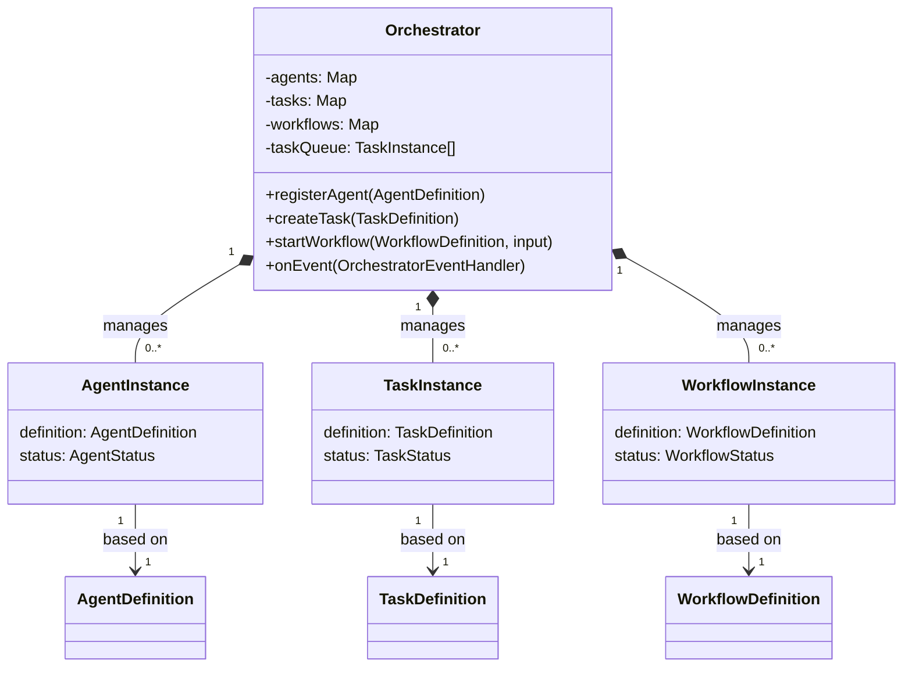

# src — orchestration

The `src/orchestration` module is the core of the multi-agent system, responsible for defining, managing, and coordinating autonomous agents to execute complex tasks and workflows. It provides the framework for agents to collaborate, communicate, and progress towards a common goal, abstracting away the complexities of task scheduling, resource allocation, and inter-agent communication.

This documentation covers the module's fundamental concepts, its central `Orchestrator` class, the pre-defined agents and workflow templates, and how to extend or integrate with this system.

## Core Concepts

The orchestration module revolves around three primary entities: **Agents**, **Tasks**, and **Workflows**.

### Agents

Agents are the autonomous entities capable of performing specific actions. Each agent has a defined role, a set of capabilities (tools and task types it can handle), and a system prompt guiding its behavior.

*   **`AgentDefinition`**: Describes an agent's static properties, such as `id`, `name`, `role`, `description`, `capabilities` (e.g., `tools`, `taskTypes`, `maxConcurrency`), and `priority`.
*   **`AgentCapabilities`**: Specifies the tools an agent can use (e.g., `web_search`, `file_write`), the types of tasks it's suited for (e.g., `research`, `coding`), and its operational limits (`maxConcurrency`).
*   **`AgentRole`**: A categorical identifier for an agent's primary function (e.g., `'coordinator'`, `'researcher'`, `'coder'`).
*   **`AgentInstance`**: Represents a registered agent within the `Orchestrator`, tracking its `status` (`idle`, `busy`), `completedTasks`, `failedTasks`, and `lastActivity`.

### Tasks

Tasks are the atomic units of work that agents execute. They are defined with specific requirements and can have dependencies on other tasks.

*   **`TaskDefinition`**: Outlines a task's static properties, including `id`, `type`, `name`, `description`, `input`, `requiredRole`, `requiredCapabilities`, `dependsOn` (other task IDs), `priority`, `timeout`, and `maxRetries`.
*   **`TaskPriority`**: Defines the urgency of a task (`low`, `medium`, `high`, `critical`), influencing its position in the orchestrator's queue.
*   **`TaskStatus`**: Tracks the lifecycle of a task (`pending`, `queued`, `assigned`, `in_progress`, `completed`, `failed`, `cancelled`).
*   **`TaskInstance`**: Represents a task being managed by the `Orchestrator`, including its current `status`, `assignedAgent`, `output`, `error`, and `retries`.

### Workflows

Workflows define a sequence of steps, potentially involving multiple agents and tasks, to achieve a larger objective. They can incorporate complex logic like parallel execution, conditionals, and loops.

*   **`WorkflowDefinition`**: Describes a workflow's structure, including `id`, `name`, `description`, and an ordered array of `steps`.
*   **`WorkflowStep`**: A single logical unit within a workflow. Steps can be of various `type`s:
    *   `'task'`: Executes one or more `TaskDefinition`s.
    *   `'parallel'`: Executes multiple `branches` of steps concurrently.
    *   `'conditional'`: Executes `trueBranch` or `falseBranch` based on a `condition`.
    *   `'loop'`: Repeats `loopBody` steps as long as `loopCondition` is true.
*   **`WorkflowInstance`**: Represents an active execution of a `WorkflowDefinition`, tracking its `status`, `input`, `output`, `currentStep`, and the `TaskInstance`s it has created.

## The Orchestrator Class

The `Orchestrator` class (`src/orchestration/orchestrator.ts`) is the central component of this module. It extends `EventEmitter` to provide a robust eventing mechanism for external monitoring and integration.

### Key Responsibilities

1.  **Agent Management**:
    *   `registerAgent(definition: AgentDefinition)`: Adds a new agent to the orchestrator's pool.
    *   `unregisterAgent(agentId: string)`: Removes an agent.
    *   `findAvailableAgent(task: TaskDefinition)`: Selects the most suitable idle agent based on task requirements (role, capabilities) and agent priority/load.
    *   `updateAgentStatus(agentId: string, status: AgentStatus)`: Changes an agent's operational status.

2.  **Task Management**:
    *   `createTask(definition: TaskDefinition)`: Instantiates a new task.
    *   `queueTask(taskId: string)`: Adds a task to the internal priority queue (`taskQueue`). Tasks are inserted based on their `TaskPriority` using `insertIntoQueue`.
    *   `assignTask(taskId: string, agentId: string)`: Assigns a queued task to an available agent, updating both task and agent statuses.
    *   `startTask(taskId: string)`: Marks a task as `in_progress`.
    *   `completeTask(taskId: string, output: Record<string, unknown>)`: Marks a task as `completed`, records its output, and frees the assigned agent. Triggers `processQueue`.
    *   `failTask(taskId: string, error: string)`: Marks a task as `failed`. If `maxRetries` are configured, it re-queues the task. Frees the assigned agent. Triggers `processQueue`.
    *   `cancelTask(taskId: string)`: Marks a task as `cancelled` and frees the agent.

3.  **Workflow Execution**:
    *   `startWorkflow(definition: WorkflowDefinition, input: Record<string, unknown>)`: Initiates a workflow, creating a `WorkflowInstance` and managing its lifecycle.
    *   `executeWorkflow(instance: WorkflowInstance)`: Iterates through workflow steps, calling `executeWorkflowStep` for each.
    *   `executeWorkflowStep(instance: WorkflowInstance, step: WorkflowStep, context: Record<string, unknown>)`: Dispatches to specific handlers based on `step.type`:
        *   `executeTaskStep`: Creates and queues tasks, waits for their completion using `waitForTask`, and adds their output to the workflow `context`. It uses `resolveVariables` to substitute `$variable` references in task inputs from the current `context`.
        *   `executeParallelStep`: Runs multiple branches of steps concurrently using `Promise.all`.
        *   `executeConditionalStep`: Evaluates a `condition` using `evaluateCondition` and executes either the `trueBranch` or `falseBranch`.
        *   `executeLoopStep`: Repeatedly executes `loopBody` steps as long as `loopCondition` evaluates to true.
    *   `resolveVariables(obj: Record<string, unknown>, context: Record<string, unknown>)`: Recursively substitutes string values starting with `$` (e.g., `$files`, `$task_create-plan`) with their corresponding values from the workflow `context`.
    *   `evaluateCondition(condition: string, context: Record<string, unknown>)`: Evaluates a JavaScript-like condition string against the current workflow `context`. This function delegates to `safeEvalCondition` from `src/sandbox/safe-eval.ts` for secure evaluation.

4.  **Queue Processing**:
    *   `start()`: Initiates the orchestrator's operation, enabling `processQueue`.
    *   `stop()`: Halts the orchestrator.
    *   `processQueue()`: The core scheduling loop. It iterates through the `taskQueue`, checks task dependencies, finds available agents using `findAvailableAgent`, and assigns/starts tasks. This method is called after tasks complete or fail to ensure continuous processing.

5.  **Messaging**:
    *   `sendMessage(message: Omit<AgentMessage, 'id' | 'timestamp'>)`: Allows agents (or external systems) to send messages to each other or broadcast. Messages are stored in an internal `messageQueue`.
    *   `getMessagesForAgent(agentId: string)`: Retrieves messages intended for a specific agent.

6.  **Statistics and Logging**:
    *   `getStats()`: Provides runtime metrics like active/idle agents, task counts, average task duration, and throughput.
    *   `log(level: 'debug' | 'info' | 'warn' | 'error', message: string)`: Internal logging mechanism respecting the configured `logLevel`.

7.  **Event Handling**:
    *   `onEvent(handler: OrchestratorEventHandler)`: Registers a callback function to receive various orchestrator events (e.g., `agent_created`, `task_completed`, `workflow_started`). This is crucial for external monitoring, UI updates, or integrating with other systems.

### Configuration (`OrchestratorConfig`)

The `Orchestrator` can be configured via its constructor with options like `maxAgents`, `maxTasks`, `taskQueueSize`, `defaultTimeout`, `autoScale`, and `logLevel`.

## Pre-defined Agents (`src/orchestration/agents/index.ts`)

This file exports a collection of `AgentDefinition` objects, representing common roles in a software development lifecycle. These agents are ready to be registered with the `Orchestrator`.

*   **`CoordinatorAgent`**: High priority, manages workflows, breaks down tasks, assigns to others.
*   **`ResearcherAgent`**: Gathers information, analyzes code, summarizes findings.
*   **`CoderAgent`**: Writes, modifies, and refactors code.
*   **`ReviewerAgent`**: Reviews code for quality, security, and best practices.
*   **`TesterAgent`**: Creates and runs tests, analyzes coverage.
*   **`DocumenterAgent`**: Creates and maintains documentation.
*   **`PlannerAgent`**: Analyzes requirements, creates implementation plans.
*   **`ExecutorAgent`**: Executes shell commands, build scripts, manages processes.

The `DefaultAgents` array contains all these pre-defined agents.
Utility functions like `createCustomAgent`, `getAgentByRole`, and `getAgentsByCapability` are provided for managing agent definitions.

## Workflow Templates (`src/orchestration/workflows/templates.ts`)

This file provides pre-built `WorkflowDefinition` objects for common development scenarios. These templates demonstrate how to structure complex multi-agent interactions using the `Orchestrator`'s capabilities.

*   **`CodeReviewWorkflow`**: Orchestrates code analysis, parallel quality, security, and test coverage reviews, followed by a summary.
*   **`FeatureImplementationWorkflow`**: Guides agents through planning, coding, testing, reviewing, and documenting a new feature.
*   **`BugFixWorkflow`**: Defines steps for bug investigation, implementing a fix, and parallel verification (testing and code review).
*   **`RefactoringWorkflow`**: Manages code analysis for refactoring, planning, creating a checkpoint, applying refactoring, and parallel validation (testing and review).

The `WorkflowTemplates` object provides a lookup for these definitions, and `getWorkflowTemplate` and `listWorkflowTemplates` offer convenient access.

## Module Entry Point (`src/orchestration/index.ts`)

This file serves as the public interface for the `orchestration` module. It re-exports all essential types, the `Orchestrator` class, agent definitions, and workflow templates.

It also provides two convenience factory functions:

*   **`createOrchestrator(config?: Partial<OrchestratorConfig>)`**: Creates an `Orchestrator` instance and automatically registers all `DefaultAgents`. This is the recommended way to get a fully functional orchestrator quickly.
*   **`createMinimalOrchestrator(agentRoles: string[], config?: Partial<OrchestratorConfig>)`**: Creates an `Orchestrator` instance and registers only the agents specified by their roles. Useful for scenarios requiring a subset of agents.

## Integration Points and Extensibility

*   **External Event Handling**: The `Orchestrator.onEvent()` method allows external systems (e.g., a UI, a logging service, or another orchestrator) to subscribe to and react to all significant events occurring within the orchestration system.
*   **Custom Agents**: Developers can define their own `AgentDefinition`s using `createCustomAgent` or by directly creating objects conforming to the `AgentDefinition` interface. These custom agents can then be registered with the `Orchestrator`.
*   **Custom Workflows**: New `WorkflowDefinition`s can be created to define bespoke multi-agent processes. The `WorkflowStep` types (task, parallel, conditional, loop) provide a powerful declarative language for complex logic.
*   **`safeEvalCondition`**: The `evaluateCondition` method relies on `src/sandbox/safe-eval.ts` to securely evaluate conditions within workflows. This ensures that arbitrary code execution is prevented, maintaining system stability and security.
*   **`plugins-teams-output.test.ts`**: The call graph indicates that `failTask` is called from a test file, suggesting that the orchestrator's failure handling is a critical part of its test suite.
*   **`session-replay.ts`**: The `onEvent` method is called from `src/advanced/session-replay.ts`, indicating that the orchestrator's events are used to reconstruct or log session activities, which is a powerful debugging and auditing feature.

## Contributing to the Orchestration Module

When contributing to this module:

*   **New Agents**: Define new `AgentDefinition`s in `src/orchestration/agents/index.ts` (or a new file if many are added) with clear `role`, `description`, `capabilities` (tools, task types), and `systemPrompt`.
*   **New Workflow Templates**: Create new `WorkflowDefinition`s in `src/orchestration/workflows/templates.ts` (or a new file) to encapsulate common multi-agent patterns. Ensure tasks within workflows correctly reference agent roles/capabilities and use variable substitution (`$variable`) for dynamic inputs.
*   **Orchestrator Enhancements**: When modifying the `Orchestrator` class, consider:
    *   **Concurrency**: How changes affect `maxConcurrency` limits and task scheduling.
    *   **Error Handling**: Ensure robust error paths, retries, and clear error messages.
    *   **Events**: Emit relevant events for new states or actions to maintain observability.
    *   **Performance**: Optimize queue processing and agent assignment logic.
    *   **Security**: Be mindful of any new inputs that might be evaluated, ensuring they pass through secure sandboxing mechanisms like `safeEvalCondition`.
*   **Types**: Always update or create new types in `src/orchestration/types.ts` for any new data structures or states introduced.
*   **Testing**: Write comprehensive unit and integration tests for any new agents, workflows, or orchestrator logic.