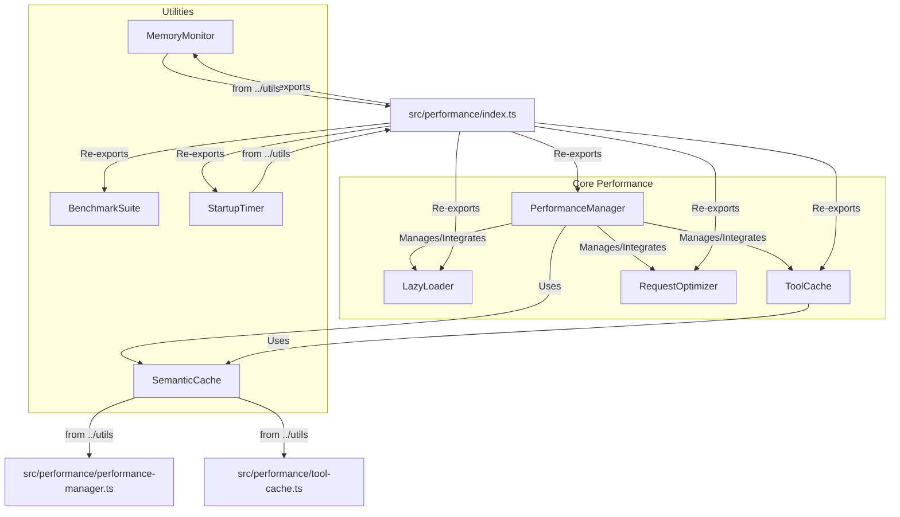

# src — performance

The `src/performance` module is the central hub for all performance-related optimizations, monitoring, and benchmarking within the codebase. Its primary goal is to ensure the application, especially when interacting with LLMs and external tools, operates efficiently, quickly, and within defined resource constraints.

This module provides mechanisms for:
*   **Reducing startup time:** Through lazy loading of heavy dependencies.
*   **Optimizing runtime execution:** Via intelligent caching of tool calls and API responses, and efficient management of external requests.
*   **Monitoring and analysis:** Offering detailed metrics for various operations, resource usage, and comprehensive benchmarking capabilities.

## Module Architecture

The `performance` module is structured around a central `PerformanceManager` that orchestrates several specialized components.



### Key Components

1.  **`PerformanceManager`**: The central orchestrator.
2.  **`LazyLoader`**: Manages on-demand loading of modules.
3.  **`ToolCache`**: Caches results of deterministic tool calls.
4.  **`RequestOptimizer`**: Optimizes external API requests.
5.  **`BenchmarkSuite`**: Provides comprehensive LLM performance benchmarking.
6.  **Re-exported Utilities**: `MemoryMonitor` and `StartupTimer` from `src/utils`.

---

## 1. `PerformanceManager` (`src/performance/performance-manager.ts`)

The `PerformanceManager` is the core component for managing and coordinating all performance-related aspects of the application. It acts as a unified interface for enabling/disabling optimizations, recording metrics, and retrieving performance summaries.

### Purpose

*   **Orchestration:** Initializes and integrates `LazyLoader`, `ToolCache`, `RequestOptimizer`, and `SemanticCache`.
*   **Monitoring:** Provides a centralized mechanism to `recordMetric` for any operation, tracking duration, success, and cache status.
*   **Budgeting:** Can emit events if an operation exceeds a configured performance budget.
*   **Reporting:** Aggregates statistics from all integrated components into a comprehensive `PerformanceSummary`.

### How it Works

Upon `initialize()`, the manager sets up instances of `LazyLoader`, `ToolCache`, `RequestOptimizer`, and `SemanticCache` based on its configuration. It then subscribes to events from these components (e.g., `module:loaded` from `LazyLoader`, `hit`/`miss` from `ToolCache`, `success`/`failure`/`deduplicated` from `RequestOptimizer`) to automatically record performance metrics.

Developers can use `measureOperation()` (a utility function wrapping `manager.measure()`) to easily track the performance of any asynchronous function.

### Core API

*   `initialize(): Promise<void>`: Sets up all configured performance systems.
*   `recordMetric(metric: Omit<PerformanceMetrics, 'timestamp'>): void`: Manually records a performance metric.
*   `measure<T>(operation: string, fn: () => Promise<T>, metadata?: Record<string, unknown>): Promise<T>`: Measures the execution time of an async function and records it.
*   `getSummary(): PerformanceSummary`: Returns an aggregated summary of all performance metrics and component stats.
*   `clearCaches(): void`: Clears all managed caches (`ToolCache`, `SemanticCache`).
*   `invalidateForFile(filePath: string): void`: Invalidates cache entries related to a specific file.
*   `resetStats(): void`: Resets all collected metrics and component statistics.
*   `updateConfig(config: Partial<PerformanceConfig>): void`: Updates the manager's configuration.

### Configuration (`PerformanceConfig`)

Controls which optimizations are enabled, performance budgets, and metric retention.

```typescript
interface PerformanceConfig {
  enabled: boolean;           // Overall enable/disable switch
  lazyLoading: boolean;
  toolCaching: boolean;
  requestOptimization: boolean;
  apiCaching: boolean;
  budgetMs: number;           // Threshold for 'budget:exceeded' event
  enableMetrics: boolean;
  metricsRetention: number;   // How many metrics to keep
}
```

### Events

The `PerformanceManager` extends `EventEmitter` and emits various events:
*   `initialized`: When all performance systems are set up.
*   `metric`: When a new metric is recorded.
*   `budget:exceeded`: When an operation exceeds the configured `budgetMs`.
*   `caches:cleared`: When all caches are cleared.
*   `cache:invalidated`: When a cache entry is invalidated.
*   `stats:reset`: When statistics are reset.
*   `config:updated`: When the configuration is changed.
*   `error`: For errors originating from managed components.

### Singleton Access

The `getPerformanceManager()` function ensures a single instance of the manager throughout the application lifecycle. `initializePerformanceManager()` is an async helper to get and initialize the manager.

---

## 2. `LazyLoader` (`src/performance/lazy-loader.ts`)

The `LazyLoader` is designed to improve application startup time by deferring the loading of heavy modules until they are actually needed.

### Purpose

*   **Faster Startup:** Avoids loading all dependencies at once.
*   **Resource Efficiency:** Only loads modules that are actively used.
*   **Controlled Loading:** Allows for priority-based preloading and parallel loading.

### How it Works

Modules are `register()`ed with a `loader` function (typically an `import()`) and a `name`. When `get(name)` is called, the module's `loader` is executed only if the module hasn't been loaded yet. Once loaded, the instance is cached for subsequent calls.

The `schedulePreload()` and `scheduleIdlePreload()` methods allow for intelligent background loading of modules after initial startup or during idle times, based on configured priorities and dependencies.

### Core API

*   `register<T>(name: string, loader: () => Promise<T>, options?: { priority?: number; dependencies?: string[] }): void`: Registers a module for lazy loading.
*   `get<T>(name: string): Promise<T>`: Retrieves a module, loading it if necessary.
*   `isLoaded(name: string): boolean`: Checks if a module is already loaded.
*   `preload(moduleNames?: string[]): Promise<void>`: Manually triggers preloading of specified or configured modules.
*   `schedulePreload(): void`: Schedules preloading of configured modules after a delay.
*   `scheduleIdlePreload(moduleNames: string[]): void`: Schedules preloading of modules during idle time.
*   `unload(name: string): boolean`: Unloads a module to free memory.
*   `getMetrics(): LoadMetrics[]`: Returns detailed load metrics for each module.
*   `getStats()`: Provides a summary of loaded modules and total/average load times.
*   `getOptimizationHints()`: Suggests improvements based on load metrics.

### Configuration (`LazyLoaderConfig`)

```typescript
interface LazyLoaderConfig {
  preloadDelay: number;       // Delay before starting preload
  preloadModules: string[];   // Modules to preload automatically
  enableMetrics: boolean;
  maxParallelLoads: number;   // Max concurrent loads during preload
  idlePreload: boolean;       // Enable idle-time preloading
}
```
`LoadPriority` constants (`CRITICAL`, `HIGH`, `NORMAL`, `LOW`, `DEFERRED`) help categorize modules for preloading.

### Events

*   `module:registered`: When a module is registered.
*   `module:loaded`: When a module successfully loads.
*   `module:error`: If a module fails to load.
*   `preload:complete`: When a preload operation finishes.
*   `preload:error`: If an error occurs during preloading.

### Integration

The module provides `registerCommonModules()`, `initializeLazyLoader()`, and `initializeCLILazyLoader()` to quickly set up the loader with common application dependencies and specific strategies for CLI startup. `createDeferredLoader()` is a helper for deferring initialization until after initial UI render.

### Singleton Access

`getLazyLoader()` provides a singleton instance. `resetLazyLoader()` clears and resets it.

---

## 3. `ToolCache` (`src/performance/tool-cache.ts`)

The `ToolCache` optimizes tool calls by caching their results, especially for deterministic operations. It leverages semantic similarity to match similar queries, not just exact matches.

### Purpose

*   **Reduce Redundant Work:** Avoids re-executing expensive or time-consuming tool calls with similar inputs.
*   **Improve Latency:** Serves results instantly from cache.
*   **Cost Savings:** Reduces API calls to external services if tool calls involve them.

### How it Works

`ToolCache` wraps a `SemanticCache` instance. When `getOrExecute()` is called, it first checks if the tool call is `isCacheable()` (based on tool name, arguments, and exclusion patterns). If cacheable, it attempts to retrieve a semantically similar result from the underlying `SemanticCache`. If a hit occurs, the cached result is returned. Otherwise, the `executeFn` is called, its result is stored in the cache, and then returned.

Mutable tools (e.g., `bash`, `create_file`) are explicitly excluded from caching.

### Core API

*   `isCacheable(toolName: string, args: Record<string, unknown>): boolean`: Determines if a given tool call can be cached.
*   `getOrExecute(toolName: string, args: Record<string, unknown>, executeFn: () => Promise<ToolResult>): Promise<CachedToolResult>`: Retrieves a cached result or executes the tool and caches its output.
*   `invalidate(toolName?: string, pattern?: string | RegExp): number`: Invalidates cache entries by tool name or a regex pattern.
*   `invalidateForFile(filePath: string): number`: Invalidates cache entries that might be affected by changes to a specific file.
*   `clear(): void`: Clears the entire tool cache.
*   `getStats(): ToolCacheStats`: Returns statistics on cache hits, misses, and estimated time saved.
*   `resetStats(): void`: Resets cache statistics.
*   `getCacheInfo()`: Provides detailed cache information including config and underlying `SemanticCache` stats.

### Configuration (`ToolCacheConfig`)

```typescript
interface ToolCacheConfig {
  enabled: boolean;
  ttlMs: number;              // Time-to-live for cache entries
  maxEntries: number;
  similarityThreshold: number; // For semantic matching
  cacheableTools: Set<string>; // List of tools that can be cached
  excludePatterns: RegExp[];   // Patterns in args that prevent caching
}
```
`MUTABLE_TOOLS` is a hardcoded set of tools that are never cached.

### Events

The `ToolCache` forwards `cache:hit` and `cache:miss` events from its internal `SemanticCache` as `hit` and `miss` respectively.

### Integration

*   **`withCache()`**: A utility function to easily wrap a tool execution with caching logic.
*   **`@Cacheable` Decorator**: A decorator to apply caching to methods directly, simplifying integration for tool implementations.

### Singleton Access

`getToolCache()` provides a singleton instance. `resetToolCache()` disposes and resets it.

---

## 4. `RequestOptimizer` (`src/performance/request-optimizer.ts`)

The `RequestOptimizer` is designed to make external API requests more robust and efficient by managing concurrency, batching, deduplication, and retries.

### Purpose

*   **Concurrency Control:** Prevents overwhelming external APIs or local resources.
*   **Deduplication:** Avoids sending identical requests concurrently.
*   **Resilience:** Implements retry logic with exponential backoff for transient failures.
*   **Batching:** Groups requests within a short window to potentially reduce overhead (though explicit batching logic is not fully implemented in the provided code, the `batchWindowMs` suggests this intent).

### How it Works

Requests are submitted via `execute()` with a `key` (for deduplication) and an `executeFn`. Requests are added to an internal `queue` and processed by `processQueue()` respecting `maxConcurrent` limits.

*   **Deduplication:** If `deduplicate` is enabled and a request with the same `key` is already pending, the existing promise is returned.
*   **Retries:** `executeWithRetry()` handles retries with exponential backoff for failed requests, up to `maxRetries`.
*   **Timeout:** Each request is wrapped with a timeout.

### Core API

*   `execute<T>(key: string, executeFn: () => Promise<T>, options?: { priority?: number; deduplicate?: boolean }): Promise<T>`: Queues and executes a request with optimizations.
*   `executeImmediate<T>(executeFn: () => Promise<T>, options?: { retries?: number; timeout?: number }): Promise<T>`: Executes a request immediately without queuing, but still applies retries and timeout.
*   `getStats(): RequestStats`: Returns statistics on total, successful, failed, retried, and deduplicated requests, along with average latency and current concurrency.
*   `resetStats(): void`: Resets all collected request statistics.
*   `clear(): void`: Clears the pending request queue and deduplication map.
*   `getQueueStatus()`: Provides current queue and concurrency status.

### Configuration (`RequestConfig`)

```typescript
interface RequestConfig {
  maxConcurrent: number;      // Max parallel requests
  batchWindowMs: number;      // Window for batching (currently used for scheduling queue processing)
  maxRetries: number;
  retryBaseDelayMs: number;   // Base delay for exponential backoff
  timeoutMs: number;          // Timeout for individual requests
  deduplicate: boolean;
}
```

### Events

*   `success`: When a request completes successfully.
*   `failure`: When a request fails after all retries.
*   `deduplicated`: When a request is deduplicated.
*   `retry`: When a request is retried.

### Integration

*   **`executeParallel()`**: A utility function to execute multiple requests in parallel with a specified concurrency limit.
*   **`batchRequests()`**: A utility function to batch requests, leveraging the optimizer's deduplication.

### Singleton Access

`getRequestOptimizer()` provides a singleton instance. `resetRequestOptimizer()` clears and resets it.

---

## 5. `BenchmarkSuite` (`src/performance/benchmark-suite.ts`)

The `BenchmarkSuite` provides a comprehensive framework for measuring the performance of LLM interactions.

### Purpose

*   **Quantify LLM Performance:** Measure key metrics like Time To First Token (TTFT), Tokens Per Second (TPS), and overall latency.
*   **Resource Usage:** Track VRAM usage (if enabled) and estimate cost.
*   **Comparative Analysis:** Allows for comparing different models or configurations.
*   **Regression Testing:** Identify performance regressions over time.

### How it Works

The `run()` method orchestrates the benchmarking process:
1.  **Warmup Runs:** Executes a few runs to "warm up" the LLM or system, preventing initial cold-start penalties from skewing results.
2.  **Benchmark Runs:** Executes the specified number of runs, either `sequentially` or `concurrently` based on configuration.
3.  **`executeRun()`:** For each run, it calls a provided `BenchmarkCallback` (which typically wraps an LLM API call), measures TTFT, total time, token counts, and calculates TPS and cost.
4.  **`calculateSummary()`:** After all runs, it aggregates the results, calculates percentile statistics (p50, p95, p99), averages, and standard deviations for key metrics.

### Core API

*   `constructor(config: BenchmarkConfig)`: Initializes the suite with configuration.
*   `run(model: string, callback: BenchmarkCallback): Promise<BenchmarkResults>`: Executes the benchmark. The `callback` is the function that interacts with the LLM.
*   `formatResults(results: BenchmarkResults): string`: Formats the benchmark results into a human-readable string.
*   `exportJSON(results: BenchmarkResults): string`: Exports results as a JSON string.
*   `compare(baseline: BenchmarkResults, current: BenchmarkResults): BenchmarkComparison`: Compares two sets of benchmark results.
*   `getConfig(): Required<BenchmarkConfig>`: Returns the current configuration.
*   `updateConfig(config: Partial<BenchmarkConfig>): void`: Updates the configuration.

### Configuration (`BenchmarkConfig`)

```typescript
interface BenchmarkConfig {
  warmupRuns?: number;
  runs?: number;
  concurrency?: number;
  timeout?: number;
  monitorVRAM?: boolean;
  prompts?: BenchmarkPrompt[]; // Prompts to use for benchmarking
}
```
`DEFAULT_PROMPTS` provides a set of diverse prompts for common use cases.

### Events

The `BenchmarkSuite` extends `EventEmitter` and emits progress events:
*   `phase`: Indicates the current phase (warmup or benchmark).
*   `warmup`: Progress during warmup runs.
*   `run`: Progress during actual benchmark runs.
*   `runComplete`: Details of a single run's result.
*   `batchComplete`: Details of a batch of concurrent runs.
*   `complete`: When the entire benchmark finishes, providing the `BenchmarkResults`.

### Integration

*   Uses `countTokens` and `calculateCost` from `../utils/token-counter.js` for token and cost estimation.
*   The `BenchmarkCallback` is a flexible interface allowing any LLM interaction to be benchmarked.

### Singleton Access

`getBenchmarkSuite()` provides a singleton instance. `resetBenchmarkSuite()` clears and resets it.

---

## 6. Re-exported Utilities (`src/performance/index.ts`)

The `src/performance/index.ts` file re-exports several utility modules from `src/utils` that are crucial for performance monitoring and analysis, making them easily accessible under the `performance` module namespace.

### `MemoryMonitor` (`../utils/memory-monitor.js`)

Provides functionality to monitor application memory usage, including RSS, heap total, and heap used. It can track memory pressure and provide snapshots over time.

*   **Key Functions:** `getMemoryMonitor`, `startMemoryMonitoring`, `stopMemoryMonitoring`, `getMemoryUsage`, `getMemoryPressure`.
*   **Types:** `MemorySnapshot`, `MemoryMetrics`, `MemoryMonitorConfig`.

### `StartupTimer` (`../utils/startup-timing.js`)

A utility for measuring and tracking different phases of application startup. This helps identify bottlenecks and optimize initialization sequences.

*   **Key Functions:** `initStartupTiming`, `startPhase`, `endPhase`, `measurePhase`, `completeStartup`, `getStartupMetrics`, `getElapsedTime`, `timedImport`, `timedLazy`.
*   **Types:** `StartupPhase`, `StartupMetrics`.

---

## How to Contribute and Extend

*   **Adding New Lazy Modules:** Use `getLazyLoader().register()` to add new heavy modules that should be loaded on demand. Consider their `priority` and `dependencies`.
*   **Caching New Tools:** Use the `withCache()` helper or the `@Cacheable` decorator for new deterministic tool implementations. Ensure the tool is added to `ToolCacheConfig.cacheableTools`.
*   **Optimizing API Calls:** Wrap external API calls with `getRequestOptimizer().execute()` to benefit from deduplication, concurrency control, and retries.
*   **Benchmarking New Models/Configurations:** Implement a `BenchmarkCallback` for your LLM interaction and use `getBenchmarkSuite().run()` to gather performance data.
*   **Adding New Performance Metrics:** Use `getPerformanceManager().recordMetric()` to track custom operations.
*   **Extending Monitoring:** The `PerformanceManager` emits events for various activities. Listen to these events to integrate with external monitoring systems or custom dashboards.
*   **Configuration:** All components expose `updateConfig()` methods, allowing dynamic adjustment of performance parameters at runtime.