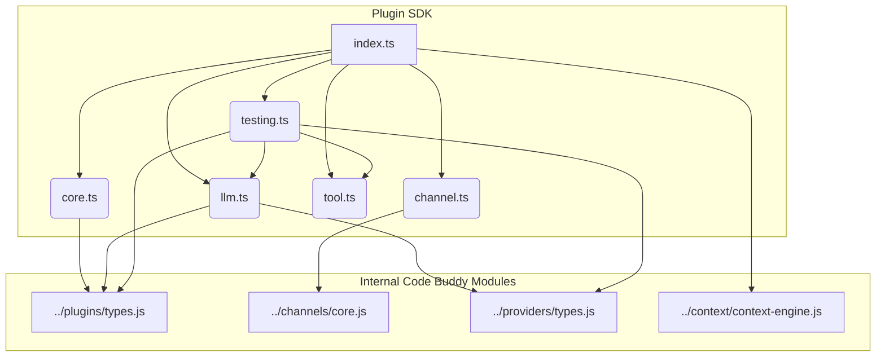

# src — plugin-sdk

The `src/plugin-sdk` module is the public-facing API for developing extensions for Code Buddy. It provides a set of type-safe helper functions and interfaces that simplify the creation of various plugin types: general-purpose plugins, channel integrations, LLM providers, and AI tools. Its primary goal is to offer a consistent, declarative, and robust developer experience for extending Code Buddy's capabilities.

This module acts as a facade, re-exporting and wrapping core internal types and functionalities from other Code Buddy modules (like `../plugins`, `../channels`, `../providers`, `../context`) into a developer-friendly SDK.

## Module Structure

The `plugin-sdk` is organized into several sub-modules, each focusing on a specific aspect of plugin development:

*   **`core.ts`**: Foundational types and the primary `definePlugin` helper.
*   **`channel.ts`**: Interfaces and helpers for creating channel integrations.
*   **`llm.ts`**: Interfaces and helpers for integrating new Large Language Models.
*   **`tool.ts`**: Interfaces and helpers for defining AI-callable tools.
*   **`testing.ts`**: Utilities for unit testing plugins.
*   **`index.ts`**: The main barrel export, consolidating all public SDK components.


*Figure 1: High-level dependencies within the Plugin SDK and to internal Code Buddy modules.*

## Core Plugin Development (`src/plugin-sdk/core.ts`)

This module provides the fundamental building blocks for any Code Buddy plugin.

### Key Concepts

*   **`Plugin`**: The base interface for all Code Buddy plugins, defining `activate` and `deactivate` methods.
*   **`PluginManifest`**: Metadata about the plugin, including its `id`, `name`, `version`, and `description`.
*   **`PluginContext`**: An object passed to the `activate` method, providing access to runtime services such as:
    *   `logger`: For logging messages.
    *   `config`: Plugin-specific configuration values.
    *   `dataDir`: A persistent directory for plugin data.
    *   `registerTool(tool)`: To register AI tools.
    *   `registerCommand(command)`: To register user-invokable commands.
    *   `registerProvider(provider)`: To register various service providers (e.g., LLM providers).
    *   `registerContextEngine(engine)`: To register a custom context assembly engine.
*   **`PluginLifecycle`**: An optional interface defining hooks that allow plugins to perform actions before or after their main activation/deactivation logic:
    *   `onBeforeActivate?()`: Called before `activate`. Can return `false` to abort activation.
    *   `onAfterActivate?()`: Called after successful `activate`.
    *   `onBeforeDeactivate?()`: Called before `deactivate`.
    *   `onAfterDeactivate?()`: Called after `deactivate`.

### `definePlugin` Function

The `definePlugin` function is the primary entry point for defining a general-purpose plugin. It takes a `DefinePluginConfig` object, which bundles the `manifest`, optional `lifecycle` hooks, and the main `activate` and `deactivate` functions. This function handles the orchestration of lifecycle hooks around your core logic, ensuring a consistent activation and deactivation flow.

```typescript
import { definePlugin } from '@phuetz/code-buddy/plugin-sdk/core';

export default definePlugin({
  manifest: {
    id: 'my-first-plugin',
    name: 'My First Plugin',
    version: '1.0.0',
    description: 'A simple example plugin.',
    permissions: ['read_config'],
  },
  lifecycle: {
    onBeforeActivate: async () => {
      console.log('Preparing to activate...');
      return true; // Allow activation to proceed
    },
    onAfterActivate: () => {
      console.log('Plugin fully activated!');
    },
  },
  async activate(ctx) {
    ctx.logger.info('My First Plugin activated!');
    // Access config: ctx.config.mySetting
    // Register a tool: ctx.registerTool(...)
  },
  async deactivate() {
    console.log('My First Plugin deactivated.');
    // Clean up resources
  },
});
```

## Channel Plugins (`src/plugin-sdk/channel.ts`)

This module facilitates the creation of plugins that enable Code Buddy to communicate with new messaging platforms.

### Key Concepts

*   **`ChannelPlugin`**: The core interface for any channel plugin. Implementations must provide methods for:
    *   `connect()`: Establish a connection to the messaging platform.
    *   `disconnect()`: Close the connection.
    *   `send(message: OutboundMessage)`: Send a message from Code Buddy to the platform.
    *   `getStatus()`: Report the current connection status.
    *   `onMessage(handler: (message: InboundMessage) => void)`: Register a callback to handle incoming messages from the platform.
    *   `isUserAllowed?(userId: string)`: Optional method to check if a user is authorized.
    *   `describeMessageTool?()`: Optional method to describe message-action tools exposed by the channel (Native Engine v2026.3.12 alignment).
*   **`ChannelPluginConfig`**: Defines the configuration structure for a channel, including `type`, `enabled`, `token`, `webhookUrl`, and various access control lists (`allowedUsers`, `allowedChannels`).
*   **`ChannelMessageToolDescription`**: An interface for describing message-action tools exposed by a channel, aligning with Native Engine specifications for tool discovery.
*   **Message Types**: Re-exports `InboundMessage`, `OutboundMessage`, `DeliveryResult`, `ChannelStatus`, `ChannelType`, and other related types from `../channels/core.js` for convenience.

### `defineChannel` Function

The `defineChannel` function is a type-safe helper to create a `ChannelPlugin` instance. It takes a `DefineChannelConfig` object, which requires implementations for all `ChannelPlugin` methods.

```typescript
import { defineChannel, ChannelStatus } from '@phuetz/code-buddy/plugin-sdk/channel';

let messageHandler: ((message: InboundMessage) => void) | undefined;
let isConnected = false;

const myWebChatChannel = defineChannel({
  type: 'webchat',
  async connect() {
    // Simulate connection setup
    console.log('WebChat channel connecting...');
    await new Promise(resolve => setTimeout(resolve, 500));
    isConnected = true;
    console.log('WebChat channel connected.');
    // In a real scenario, you'd set up a WebSocket server or similar
  },
  async disconnect() {
    console.log('WebChat channel disconnecting...');
    isConnected = false;
    // Clean up server/connections
  },
  async send(message) {
    console.log(`Sending message to webchat: ${message.text}`);
    // Simulate sending to connected clients
    return { success: true, timestamp: new Date() };
  },
  getStatus(): ChannelStatus {
    return { type: 'webchat', connected: isConnected, authenticated: true };
  },
  onMessage(handler) {
    messageHandler = handler;
    // In a real scenario, wire up your incoming message events to call `handler`
    // Example: simulate an incoming message after 2 seconds
    setTimeout(() => {
      if (messageHandler) {
        messageHandler({
          id: 'msg-123',
          channelId: 'webchat-general',
          sender: { id: 'user-abc', name: 'Web User' },
          text: 'Hello Code Buddy!',
          timestamp: new Date(),
          type: 'text',
        });
      }
    }, 2000);
  },
  isUserAllowed(userId: string): boolean {
    return userId.startsWith('user-'); // Only allow users with 'user-' prefix
  },
});
```

## LLM Provider Plugins (`src/plugin-sdk/llm.ts`)

This module provides the API for integrating new Large Language Models (LLMs) into Code Buddy, allowing the AI agent to use different model backends.

### Key Concepts

*   **`LLMProviderPlugin`**: Extends the base `PluginProvider` interface with LLM-specific methods:
    *   `type: 'llm'`: Identifies this as an LLM provider.
    *   `chat(messages: LLMMessage[], options?: LLMChatOptions)`: The primary method for conversational interactions.
    *   `complete?(prompt: string, options?: LLMChatOptions)`: Optional method for simple text generation.
    *   `listModels()`: Returns a list of available models from this provider.
    *   `getModelInfo?(modelName: string)`: Optional method to get detailed information for a specific model.
*   **`ModelInfo`**: Describes an LLM model, including its `name`, `contextWindow`, `maxOutput`, optional `pricing`, and capabilities like `supportsVision` or `supportsToolCalling`.
*   **`LLMChatOptions`**: Defines parameters for LLM interactions, such as `temperature`, `maxTokens`, `stop` sequences, and `model` selection.

### `defineLLMProvider` Function

The `defineLLMProvider` function is a type-safe helper to create an `LLMProviderPlugin`. It requires an `id`, `name`, `initialize`, `chat`, and `listModels` implementation, along with optional `shutdown`, `complete`, and `getModelInfo`.

```typescript
import { defineLLMProvider } from '@phuetz/code-buddy/plugin-sdk/llm';
import type { LLMMessage } from '@phuetz/code-buddy/providers/types'; // Internal type

const myLLMProvider = defineLLMProvider({
  id: 'my-custom-llm',
  name: 'My Custom LLM Provider',
  priority: 10, // Higher priority means preferred
  config: {
    apiKey: process.env.MY_LLM_API_KEY,
  },
  async initialize() {
    if (!this.config?.apiKey) {
      throw new Error('My LLM Provider requires an API key.');
    }
    console.log('My LLM Provider initialized.');
  },
  async shutdown() {
    console.log('My LLM Provider shutting down.');
  },
  async chat(messages: LLMMessage[], options) {
    console.log(`Chat request for model: ${options?.model || 'default'}`);
    // Simulate API call to your LLM
    const lastMessage = messages[messages.length - 1];
    return `Echo: ${lastMessage.content}`;
  },
  async listModels() {
    return [
      { name: 'my-llm/fast-model', contextWindow: 8192, maxOutput: 1024 },
      { name: 'my-llm/large-model', contextWindow: 32768, maxOutput: 4096, supportsToolCalling: true },
    ];
  },
  async getModelInfo(modelName: string) {
    const models = await this.listModels();
    return models.find(m => m.name === modelName);
  },
});
```

## Tool Plugins (`src/plugin-sdk/tool.ts`)

This module provides the API for defining tools that the AI agent can invoke to perform specific actions or retrieve information.

### Key Concepts

*   **`ToolPlugin`**: An interface representing a collection of `ToolDefinition`s.
*   **`ToolDefinition`**: Describes a single tool, including:
    *   `name`: A unique, snake\_case identifier (e.g., `fetch_weather`).
    *   `description`: A human-readable description, crucial for the LLM to understand when to use the tool.
    *   `parameters`: A `ParametersSchema` (JSON Schema) defining the tool's arguments.
    *   `readOnly?`: A boolean indicating if the tool is read-only (safe for parallel execution).
    *   `tags?`: Optional tags for categorization and RAG selection.
    *   `execute(args: Record<string, unknown>)`: The function that performs the tool's action.
*   **`ToolResult`**: The standardized return type for `tool.execute()`, indicating `success`, `output` (for the LLM), `error`, and optional `metadata`.
*   **`ParametersSchema`**: Defines the JSON Schema for tool arguments, following the OpenAI function calling format. It includes `type: 'object'`, `properties` (a map of `ParameterProperty`), and `required` fields.

### `defineToolPlugin` Function

The `defineToolPlugin` function is a helper to define a tool plugin. It takes an `id`, `name`, and an array of `ToolDefinition`s. It also includes validation to ensure unique tool names within the plugin.

```typescript
import { defineToolPlugin } from '@phuetz/code-buddy/plugin-sdk/tool';

export default defineToolPlugin({
  id: 'weather-tools',
  name: 'Weather Information Tools',
  tools: [
    {
      name: 'get_current_weather',
      description: 'Get the current weather conditions for a specified city.',
      parameters: {
        type: 'object',
        properties: {
          city: {
            type: 'string',
            description: 'The name of the city.',
          },
          unit: {
            type: 'string',
            enum: ['celsius', 'fahrenheit'],
            default: 'celsius',
            description: 'The unit of temperature.',
          },
        },
        required: ['city'],
      },
      readOnly: true,
      async execute({ city, unit }) {
        try {
          // Simulate API call to a weather service
          const temperature = Math.floor(Math.random() * 15) + 15; // 15-30°C
          const conditions = ['sunny', 'cloudy', 'rainy'][Math.floor(Math.random() * 3)];
          const tempUnit = unit === 'fahrenheit' ? 'F' : 'C';
          const displayTemp = unit === 'fahrenheit' ? (temperature * 9/5) + 32 : temperature;

          return {
            success: true,
            output: `The weather in ${city} is ${conditions} with a temperature of ${displayTemp}°${tempUnit}.`,
            metadata: { city, unit, temperature: displayTemp, conditions },
          };
        } catch (error: any) {
          return { success: false, error: `Failed to fetch weather: ${error.message}` };
        }
      },
    },
  ],
});
```

## Advanced Topics

### Context Engine Alignment (`delegateCompactionToRuntime`)

The `delegateCompactionToRuntime()` function is a sentinel, primarily for documentation and future runtime hooks. It signals to the Code Buddy runtime that a plugin's context engine (if it provides one) does *not* handle its own context compaction. This means the runtime should apply its built-in auto-compaction logic before calling the engine's `assemble()` method.

Plugins that provide custom context engines should set `ownsCompaction = false` (or omit it) and can use this function to explicitly state this intent. This aligns with the "Native Engine v2026.3.13-1" specification.

```typescript
import { delegateCompactionToRuntime } from '@phuetz/code-buddy/plugin-sdk';
import type { ContextEngine, AssembleResult } from '@phuetz/code-buddy/plugin-sdk';

class MyCustomContextEngine implements ContextEngine {
  readonly ownsCompaction = delegateCompactionToRuntime().ownsCompaction; // Explicitly delegate

  async assemble(messages: any[], tools: any[], maxTokens: number): Promise<AssembleResult> {
    // The runtime will have already compacted `messages` if ownsCompaction is false
    // Your logic here focuses on assembling the final prompt
    return {
      messages: messages,
      tokens: messages.length * 4, // Simplified token count
      truncated: false,
    };
  }
}
```

## Testing Utilities (`src/plugin-sdk/testing.ts`)

This module provides mock objects and assertion helpers for unit testing plugins without depending on the full Code Buddy runtime.

### Key Components

*   **`createMockPluginContext(overrides?: MockPluginContextOptions): MockPluginContext`**:
    *   Creates a mock `PluginContext` instance.
    *   It tracks all registered tools, commands, and providers, allowing you to assert that your plugin correctly registers its components during activation.
    *   Includes a `MockLogger` for inspecting log calls.
    *   Example:
        ```typescript
        import { createMockPluginContext } from '@phuetz/code-buddy/plugin-sdk/testing';
        import myToolPlugin from './my-tool-plugin'; // Your plugin

        describe('My Tool Plugin', () => {
          it('should register its tools correctly', async () => {
            const ctx = createMockPluginContext();
            await myToolPlugin.activate(ctx); // Assuming tool plugins have an activate method or are directly registered

            expect(ctx.registeredTools).toHaveLength(1);
            expect(ctx.registeredTools[0].name).toBe('get_current_weather');
            expect(ctx.logger.messages).toContainEqual(
              expect.objectContaining({ level: 'info', message: 'Plugin activated!' })
            );
          });
        });
        ```
*   **`createMockLLMProvider(options?: MockLLMProviderOptions): MockLLMProviderInstance`**:
    *   Generates a mock `LLMProviderPlugin`.
    *   Can be configured with canned responses for `chat()` and `complete()` methods.
    *   Tracks all calls made to these methods, enabling assertions on LLM interactions.
    *   Example:
        ```typescript
        import { createMockLLMProvider } from '@phuetz/code-buddy/plugin-sdk/testing';

        describe('Mock LLM Provider', () => {
          it('should return canned responses and track calls', async () => {
            const provider = createMockLLMProvider({
              responses: ['First response', 'Second response'],
            });

            const result1 = await provider.chat([{ role: 'user', content: 'Hi' }]);
            expect(result1).toBe('First response');
            expect(provider.chatCalls).toHaveLength(1);

            const result2 = await provider.chat([{ role: 'user', content: 'How are you?' }]);
            expect(result2).toBe('Second response');
            expect(provider.chatCalls).toHaveLength(2);
          });
        });
        ```
*   **`assertToolResult(result: ToolResult, expected: Partial<ToolResult>): void`**:
    *   A utility function to assert the properties of a `ToolResult`.
    *   Checks `success`, `output` (partial string match), and `error` (partial string match), throwing descriptive errors on mismatches.
    *   Example:
        ```typescript
        import { assertToolResult } from '@phuetz/code-buddy/plugin-sdk/testing';
        import { ToolResult } from '@phuetz/code-buddy/plugin-sdk/tool';

        describe('assertToolResult', () => {
          it('should assert successful tool results', () => {
            const result: ToolResult = { success: true, output: 'Data fetched: 123' };
            assertToolResult(result, { success: true, output: 'Data fetched' });
          });

          it('should assert failed tool results', () => {
            const result: ToolResult = { success: false, error: 'Network error' };
            expect(() => assertToolResult(result, { success: true })).toThrow(/Expected tool result success to be true, got false/);
            assertToolResult(result, { success: false, error: 'Network' });
          });
        });
        ```
*   **`MockLogger`**: An interface and implementation for a logger that records all messages, allowing tests to verify log output. This is integrated into `MockPluginContext`.

These testing utilities are crucial for maintaining the quality and reliability of plugins by enabling isolated and efficient unit testing.