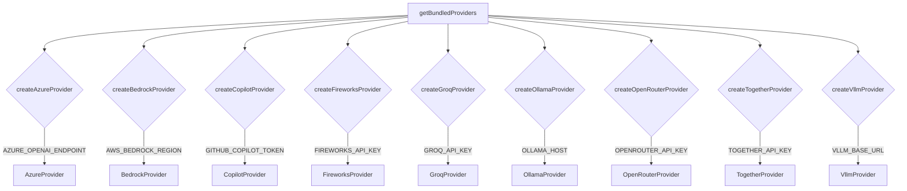

# src — plugins

The `src/plugins` module is the core of Native Engine's extensibility, enabling the system to integrate with various Large Language Model (LLM) providers, execute custom tools, and offer dynamic capabilities. It encompasses bundled providers, a robust plugin marketplace, secure sandboxing, conflict detection, hot-reloading for development, and integration with code graph analysis tools like GitNexus.

This documentation covers:
*   **Core Concepts**: Fundamental interfaces and types that define plugins and providers.
*   **Bundled LLM Providers**: Pre-integrated LLM services that ship with Native Engine.
*   **Plugin Management System**: How plugins are discovered, installed, loaded, and managed.
*   **Secure Execution**: The mechanisms for running plugins safely in isolated environments.
*   **Conflict Resolution**: Ensuring smooth operation by detecting and resolving naming conflicts.
*   **Developer Experience**: Features like hot-reloading for efficient plugin development.
*   **GitNexus Integration**: Leveraging code graph analysis for advanced capabilities.

---

## Core Concepts

At the heart of the plugin system are several key interfaces and types:

*   **`PluginProvider`**: The primary interface for LLM providers. It defines methods like `initialize()`, `shutdown()`, `chat()`, and `complete()`. Each provider has a unique `id`, `name`, `type` (e.g., 'llm'), `priority`, and `config`.
*   **`ProviderOnboardingHooks`**: An optional but crucial part of `PluginProvider` for providers that require user interaction for setup. These hooks facilitate:
    *   `auth()`: Verifying API keys or credentials.
    *   `discovery.run()`: Automatically finding available models (e.g., deployments, foundation models).
    *   `wizard.modelPicker()`: Suggesting a default model from discovered options.
    *   `onModelSelected()`: Callback when a model is chosen.
*   **`DiscoveredModel`**: Represents an LLM model found during `discovery.run()`, including its `id`, `name`, `contextWindow`, `description`, and `capabilities`.
*   **`PluginTool`**: Defines a callable function exposed by a plugin, including its `name`, `description`, `parameters`, and an `execute` method.
*   **`Plugin`**: A broader interface for any plugin, encompassing metadata like `id`, `name`, `version`, `author`, `dependencies`, and `tools` (which can be static or dynamically resolved via a function).
*   **`PluginContext`**: Provides runtime context to plugins, such as `workspaceRoot`, `configDir`, `agentId`, and `sessionId`.
*   **`PluginPermissions`**: Specifies the granular permissions a plugin requires (e.g., `filesystem`, `network`, `shell`, `env`). This is critical for sandboxed execution.

---

## Bundled LLM Providers (`src/plugins/bundled/`)

This directory contains pre-integrated LLM providers that are shipped with Native Engine. They are automatically discovered and registered if their respective environment variables are set. This provides out-of-the-box support for popular LLM services.

The `getBundledProviders()` function in `src/plugins/bundled/index.ts` serves as the central entry point for discovering and instantiating these providers. It checks for the necessary environment variables and returns an array of active `PluginProvider` instances.

### Common Provider Structure

Each bundled provider follows a similar pattern:
1.  **Environment Variable Check**: A function (e.g., `getAzureEndpoint()`, `getBedrockRegion()`) checks for the presence of a specific environment variable. If not found, the `createXProvider()` function returns `null`, effectively disabling the provider.
2.  **Configuration Retrieval**: Functions to retrieve API keys, regions, or base URLs from environment variables.
3.  **`buildOnboardingHooks()`**: For providers that support it, this function creates the `ProviderOnboardingHooks` object. These hooks handle:
    *   **`auth()`**: Verifies credentials by making a simple API call (e.g., listing models).
    *   **`discovery.run()`**: Fetches available models from the API and maps them to `DiscoveredModel` objects. Includes fallback to `KNOWN_X_MODELS` if API discovery fails.
    *   **`wizard.modelPicker()`**: Provides a default model selection logic for onboarding.
4.  **`createXProvider()`**: The main factory function that returns a `PluginProvider` object. It defines:
    *   `id`, `name`, `type`, `priority`.
    *   `config`: Provider-specific configuration.
    *   `initialize()` and `shutdown()` lifecycle methods.
    *   `chat()` and `complete()` methods for interacting with the LLM API. These typically involve `fetch` calls with appropriate headers and body.

### Specific Bundled Providers

*   **`azure-provider.ts` (Azure OpenAI)**
    *   **Activation**: `AZURE_OPENAI_ENDPOINT`
    *   **Auth**: `AZURE_OPENAI_API_KEY` or `AZURE_OPENAI_AD_TOKEN`
    *   **API Version**: `AZURE_OPENAI_API_VERSION` (defaults to `2024-02-01`)
    *   **Model Discovery**: Lists Azure OpenAI deployments. Infers context window from `KNOWN_AZURE_MODELS`.
    *   **Chat**: Targets `/openai/deployments/{deployment}/chat/completions`.
*   **`bedrock-provider.ts` (AWS Bedrock)**
    *   **Activation**: `AWS_BEDROCK_REGION` or `AWS_REGION`
    *   **Auth**: `AWS_ACCESS_KEY_ID` and `AWS_SECRET_ACCESS_KEY` (optionally `AWS_SESSION_TOKEN`). Uses a simplified SigV4 signing implementation (`createAwsAuthHeaders`).
    *   **Model Discovery**: Lists Bedrock foundation models. Uses `KNOWN_BEDROCK_MODELS` for detailed info.
    *   **Chat**: Targets `/model/{modelId}/converse` using Bedrock's Converse API.
*   **`copilot-provider.ts` (GitHub Copilot)**
    *   **Activation**: `GITHUB_COPILOT_TOKEN`
    *   **Chat**: Targets `https://api.githubcopilot.com/chat/completions`.
*   **`fireworks-provider.ts` (Fireworks AI)**
    *   **Activation**: `FIREWORKS_API_KEY`
    *   **Base URL**: `https://api.fireworks.ai/inference/v1` (OpenAI-compatible)
    *   **Model Discovery**: Fetches `/models` endpoint.
    *   **Chat**: Targets `/chat/completions`.
*   **`groq-provider.ts` (Groq)**
    *   **Activation**: `GROQ_API_KEY`
    *   **Base URL**: `https://api.groq.com/openai/v1` (OpenAI-compatible)
    *   **Model Discovery**: Fetches `/models` endpoint. Uses `KNOWN_MODELS` for context window info.
    *   **Chat**: Targets `/chat/completions`.
*   **`ollama-provider.ts` (Ollama)**
    *   **Activation**: `OLLAMA_HOST` (defaults to `http://localhost:11434`)
    *   **Model Discovery**: Fetches `/api/tags` endpoint. Infers context window from `KNOWN_CONTEXT_WINDOWS`.
    *   **Chat**: Targets `/api/chat`.
*   **`openrouter-provider.ts` (OpenRouter)**
    *   **Activation**: `OPENROUTER_API_KEY`
    *   **Base URL**: `https://openrouter.ai/api/v1`
    *   **Chat**: Targets `/chat/completions`. Includes `HTTP-Referer` and `X-Title` headers.
*   **`together-provider.ts` (Together AI)**
    *   **Activation**: `TOGETHER_API_KEY`
    *   **Base URL**: `https://api.together.xyz/v1` (OpenAI-compatible)
    *   **Model Discovery**: Fetches `/models` endpoint.
    *   **Chat**: Targets `/chat/completions`.
*   **`vllm-provider.ts` (vLLM)**
    *   **Activation**: `VLLM_BASE_URL`
    *   **Model Discovery**: Fetches `/v1/models` endpoint (OpenAI-compatible).
    *   **Chat**: Targets `/v1/chat/completions`.

---

## Plugin Management System

The plugin management system orchestrates the entire lifecycle of plugins, from discovery to secure execution.

### `PluginMarketplace` (`src/plugins/marketplace.ts`)

The `PluginMarketplace` class manages the discovery, installation, updates, and loading of plugins. It acts as the central registry for all plugins, whether installed from a remote registry or loaded locally.

**Key Responsibilities:**
*   **Discovery & Search**: Interacts with a remote registry (`registryUrl`) to search for available plugins (`search()`, `getPluginDetails()`).
*   **Installation & Updates**: Downloads plugin packages, verifies checksums, extracts them to a local `pluginsDir`, and manages version compatibility (`install()`, `update()`, `checkUpdates()`).
*   **Lifecycle Management**: Enables/disables plugins (`enable()`, `disable()`), loads/unloads their code (`loadPlugin()`, `unloadPlugin()`), and manages their configuration.
*   **API Exposure**: Provides a `PluginAPI` object to loaded plugins, allowing them to register commands, tools, providers, and hooks, and interact with configuration and storage.
*   **Event Emitter**: Emits events for various lifecycle stages (e.g., `install:start`, `plugin:loaded`, `command:registered`).

**Core Flow:**
1.  `initialize()`: Ensures plugin directories exist and loads previously installed plugins from `manifest.json`.
2.  `loadInstalledPlugins()`: Reads `manifest.json` and attempts to `loadPlugin()` for each enabled plugin.
3.  `loadPlugin(pluginId)`:
    *   Resolves the plugin's entry point.
    *   If `sandboxPlugins` is true (default), it creates an `IsolatedPluginRunner` for secure execution.
    *   Initializes the plugin's module, passing it a `PluginAPI` instance.
    *   Registers any commands, tools, providers, or hooks exposed by the plugin.
4.  `saveManifest()`: Persists the state of installed plugins to disk.

### `PluginManager` (from `src/plugins/plugin-system.ts` - *exported by `index.ts`*)

While the full source for `PluginManager` is not provided, its exports in `src/plugins/index.ts` and its interactions implied by other files (like `IsolatedPluginRunner` and `PluginMarketplace`) suggest it acts as a higher-level orchestrator.

**Inferred Responsibilities:**
*   **Central Plugin Registry**: Manages all types of plugins (system, tool, middleware, bundled).
*   **Activation/Deactivation**: Coordinates the `initialize`/`activate`/`deactivate`/`shutdown` calls across different plugin types.
*   **Context Provisioning**: Provides `PluginContext` to plugins.
*   **Integration**: Bridges `PluginMarketplace` (for external plugins) with `getBundledProviders` (for internal ones) and `PluginConflictDetector` (for safe registration).

### `IsolatedPluginRunner` (`src/plugins/isolated-plugin-runner.ts`)

This class is critical for security and stability, running each plugin in its own Node.js Worker Thread. This isolates plugin code from the main application process, preventing malicious or buggy plugins from affecting the core system.

**Key Features:**
*   **Worker Thread Isolation**: Plugins run in a separate thread with restricted `resourceLimits` (memory, stack size).
*   **Secure Communication**: All messages between the main thread and the worker are validated (`validateWorkerMessage()`) to prevent injection or malformed data.
*   **Permissions Enforcement**: `validateConfig()` checks requested `PluginPermissions`, and `getSafeEnv()` filters sensitive environment variables before passing them to the worker.
*   **Timeouts**: Operations within the worker are subject to timeouts (`defaultTimeout`) to prevent runaway processes. If a timeout occurs, the worker is terminated.
*   **Lifecycle Management**: `start()`, `activate()`, `deactivate()`, `call()`, and `terminate()` methods manage the worker's lifecycle and plugin interactions.
*   **Tool/Command Registration Proxy**: When a plugin registers a tool or command, `IsolatedPluginRunner` creates a proxy on the main thread. When `execute()` is called on this proxy, it dispatches a message back to the worker for execution.

**Security Measures:**
*   **`validateConfig()`**: Checks plugin ID format, path traversal attempts, and permission validity.
*   **`validateWorkerMessage()`**: Ensures incoming messages from the worker conform to expected types and payload structures, sanitizing lengths to prevent memory exhaustion.
*   **`getSafeEnv()`**: Filters out sensitive environment variables (e.g., API keys, database credentials) before passing them to the worker's environment.

### `PluginConflictDetector` (`src/plugins/conflict-detection.ts`)

This class prevents naming collisions between plugin IDs, tool names, and built-in functionalities. It ensures that plugins can be registered safely without overwriting or conflicting with existing components.

**Key Features:**
*   **Built-in Tool Conflict Check**: Prevents plugin IDs or tool names from clashing with Native Engine's core tools.
*   **Duplicate Plugin/Tool Check**: Ensures only one plugin with a given ID is registered, and that tool names are unique across active plugins.
*   **Dependency Resolution**: Checks if a plugin's declared dependencies are met before registration.
*   **Allowlisting**: Provides a configurable allowlist (`AllowlistConfig`) to explicitly permit or deny specific tools, plugins, or groups of plugins.
*   **`registerPlugin()`**: Orchestrates the conflict checks, tool resolution (including dynamic tools via functions), and registration of allowed tools.
*   **`isToolAllowed()`**: Determines if a tool should be registered based on the allowlist and whether the plugin is marked as `required`.

**Usage Flow (`registerPlugins`):**
1.  Plugins are sorted by `priority` (required plugins first).
2.  For each plugin, `checkConflicts()` is called. If conflicts exist, the plugin is blocked.
3.  Plugin tools are resolved (if dynamic).
4.  `checkToolConflicts()` is run for the plugin's tools.
5.  Each tool is checked against the allowlist using `isToolAllowed()`.
6.  Allowed tools are registered, and metadata (`PluginToolMeta`) is attached.

### `PluginHotReloader` (`src/plugins/hot-reload.ts`)

Designed to enhance developer experience, the `PluginHotReloader` watches plugin directories for file changes and triggers reloads without requiring a full application restart.

**Key Features:**
*   **File System Watcher**: Uses `fs.watch` to monitor plugin directories recursively.
*   **Configurable Patterns**: `watchPatterns` and `ignorePatterns` allow fine-grained control over which files trigger reloads.
*   **Debouncing**: Prevents rapid, successive reloads by delaying the reload trigger (`debounceMs`).
*   **Reload Callback**: A `reloadCallback` function (typically provided by `PluginManager`) is invoked to perform the actual plugin reload logic.
*   **Notifications**: Can emit notifications on reload start, completion, or error.

**Core Flow:**
1.  `watch(pluginId, pluginPath, manifest)`: Sets up a file system watcher for a given plugin.
2.  `handleFileChange()`: Filters changes based on `shouldIgnore()` and `shouldWatch()` patterns.
3.  `triggerReload()`: Debounces the reload, then calls the `reloadCallback` and emits events.

---

## GitNexus Integration (`src/plugins/gitnexus/`)

GitNexus provides code graph analysis capabilities, allowing Native Engine to understand the structure, relationships, and business processes within a codebase. This integration is currently in "stub mode" but lays the groundwork for powerful code intelligence features.

### `GitNexusManager` (`src/plugins/gitnexus/GitNexusManager.ts`)

This class manages the GitNexus CLI tool, handling its installation, repository analysis, and the lifecycle of its MCP (Model Context Protocol) server.

**Key Responsibilities:**
*   **CLI Management**: Checks if `gitnexus` is installed (`isInstalled()`) and runs `npx gitnexus analyze` to index a repository (`analyze()`).
*   **Index Status**: Determines if a repository has been indexed (`isRepoIndexed()`) and retrieves analysis statistics (`getStats()`) from `.gitnexus/meta.json`.
*   **MCP Server Lifecycle**: Starts (`startMCPServer()`) and stops (`stopMCPServer()`) the GitNexus MCP server as a child process, which provides a programmatic interface to the code graph.

### `GitNexusMCPClient` (`src/plugins/gitnexus/GitNexusMCPClient.ts`)

The `GitNexusMCPClient` is responsible for communicating with a running GitNexus MCP server to query the code graph.

**Key Features (Stubbed):**
*   **Connection Management**: `connect()` and `disconnect()` methods manage the client's connection state.
*   **Code Graph Tools**: Exposes methods that will eventually map to GitNexus's analytical tools:
    *   `query(q: string)`: Natural-language search over the code graph.
    *   `context(symbolName: string)`: Get call/import graph and process membership for a symbol.
    *   `impact(target: string, direction: 'upstream' | 'downstream')`: Blast-radius analysis.
    *   `cypher(query: string)`: Raw Cypher queries against the graph.
*   **Code Graph Resources**: Provides access to high-level insights:
    *   `getClusters()`: Module clusters with cohesion scores.
    *   `getProcesses()`: Detected business processes.
    *   `getRepoContext()`: High-level repository metadata.
    *   `getArchitectureMap()`: Mermaid architecture diagram.

**Note on Stub Mode**: Currently, all `GitNexusMCPClient` methods return empty or default results. The actual MCP transport and integration with the `gitnexus` CLI will be implemented in a future release.

### `GitPinnedMarketplace` (`src/plugins/git-pinned-marketplace.ts`)

This marketplace manages plugins that are "pinned" to specific Git commit SHAs. This ensures reproducibility and auditability for plugin installations, especially for internal or highly sensitive plugins.

**Key Features:**
*   **SHA-based Installation**: `install(repoSpec)` allows installing plugins from a Git repository at a specific commit SHA (e.g., `org/repo@sha`).
*   **Verification**: `verify(name)` can be used to check if an installed plugin's SHA matches the remote.
*   **Trust Warnings**: Provides `getTrustWarning()` for unverified plugins, emphasizing the security implications.
*   **Local Storage**: Stores pinned plugin metadata in `~/.codebuddy/plugins/git-pinned/plugins.json`.

---

## How it Connects to the Rest of the Codebase

The `src/plugins` module is a foundational layer for Native Engine's capabilities:

*   **LLM Integration**: The bundled providers are the primary way Native Engine interacts with external LLMs, enabling core AI functionalities like `chat` and `complete`.
*   **Tooling**: Plugins can register `PluginTool` instances, which are then made available to the agent for execution. This extends Native Engine's action space dynamically.
*   **Commands**: Plugins can register `CommandHandler` functions, allowing them to extend the CLI or other command interfaces.
*   **Hooks**: Plugins can subscribe to system events via `HookHandler`s, enabling them to react to and influence Native Engine's internal operations.
*   **Agent Infrastructure**: The `PluginMarketplace` and `PluginManager` are likely integrated into the agent's startup sequence to load and activate necessary plugins.
*   **Security**: `IsolatedPluginRunner` and `PluginConflictDetector` are crucial for maintaining the security and stability of the entire application when integrating third-party code.
*   **Code Intelligence**: GitNexus integration provides the foundation for advanced code understanding, which can power agent reasoning, code generation, and impact analysis.

---

## Contribution Guide

### Adding a New Bundled LLM Provider

1.  **Create a new file**: In `src/plugins/bundled/`, create `your-provider-name-provider.ts`.
2.  **Implement `PluginProvider`**:
    *   Define a unique `YOUR_PROVIDER_ID`.
    *   Implement `getYourProviderConfig()` to retrieve necessary environment variables (e.g., `YOUR_API_KEY`, `YOUR_REGION`). If the key is not set, return `null` from `createYourProvider()`.
    *   Implement `buildOnboardingHooks()` if your provider supports model discovery or requires authentication verification. This should include `auth()`, `discovery.run()`, and `wizard.modelPicker()`.
    *   Implement `chat()` and `complete()` methods to interact with your provider's API. Ensure proper error handling and `fetch` calls.
3.  **Export `createYourProvider()`**: This function should return `PluginProvider | null`.
4.  **Register in `index.ts`**:
    *   Import `createYourProvider` in `src/plugins/bundled/index.ts`.
    *   Call `createYourProvider()` in `getBundledProviders()` and push the result to the `providers` array if not null.
5.  **Update `src/plugins/types.ts`**: If your provider introduces new capabilities or specific model types, ensure `DiscoveredModel` and related types can accommodate them.

### Understanding Plugin Lifecycle for Custom Plugins

If you are developing a custom plugin for Native Engine, understanding the lifecycle is key:

1.  **Manifest (`package.json` or `manifest.json`)**: Your plugin must declare its `id`, `name`, `version`, `main` entry point, `engines.grok` compatibility, and `permissions`.
2.  **Installation**: When a user installs your plugin via the `PluginMarketplace`, it's downloaded, extracted, and its metadata is stored.
3.  **Loading (`PluginMarketplace.loadPlugin`)**:
    *   Your plugin's `main` entry point (e.g., `index.js`) is loaded into an `IsolatedPluginRunner` worker thread.
    *   Your plugin receives a `PluginAPI` object, which it uses to register its commands, tools, providers, and hooks.
4.  **Activation (`IsolatedPluginRunner.activate`)**: Your plugin's `activate()` method (if defined) is called, allowing it to perform setup tasks.
5.  **Execution**:
    *   **Tools/Commands**: When an agent or user invokes a tool/command registered by your plugin, the `execute()` or `handler()` method in your worker thread is called via the `IsolatedPluginRunner`'s message passing.
    *   **Hooks**: When a system event fires, your registered `HookHandler` is invoked.
6.  **Deactivation (`IsolatedPluginRunner.deactivate`)**: Your plugin's `deactivate()` method is called, allowing it to clean up resources.
7.  **Unloading (`PluginMarketplace.unloadPlugin`)**: The `IsolatedPluginRunner` worker thread is terminated, completely removing your plugin's code from memory.

Always design your plugins with security and resource limits in mind, as they will run in a sandboxed environment. Request only the necessary `permissions` and handle errors gracefully.