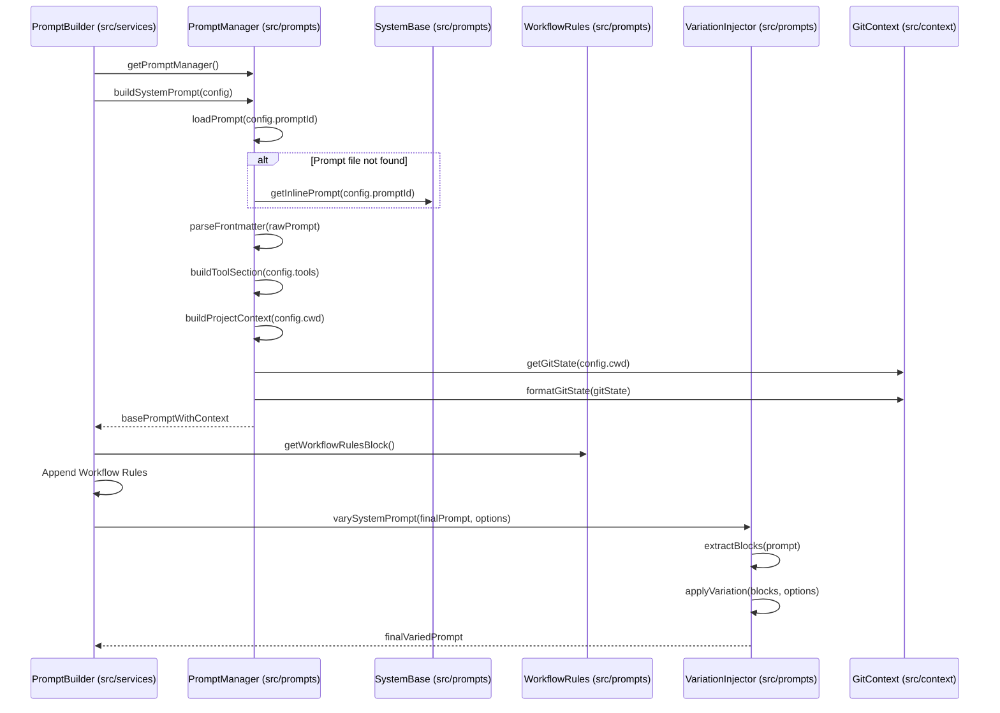

# src — prompts

The `src/prompts` module is the central hub for managing, composing, and delivering system prompts to Code Buddy's underlying Large Language Models (LLMs). It ensures that the AI agent receives precise instructions, context, and safety guidelines tailored to the current task, operational mode, and even the specific model being used.

This module is critical for defining Code Buddy's identity, capabilities, and behavioral guardrails. It supports dynamic prompt construction, external customization, and adaptive prompt selection based on model characteristics.

## Core Concepts

1.  **System Prompts:** These are the foundational instructions given to the LLM, defining its role (`<identity>`), rules (`<security_rules>`, `<tool_usage_rules>`), available tools (`<available_tools>`), and expected response style (`<response_style>`).
2.  **Dynamic Composition:** Prompts are not static strings. They are built dynamically from various sections (base prompt, context, tools, project info, user instructions, workflow rules) which are assembled based on configuration and runtime data.
3.  **External Prompts:** Inspired by systems like `mistral-vibe`, Code Buddy allows users to define and customize system prompts using Markdown files (`.md`) stored in `~/.codebuddy/prompts/`. This enables flexible customization without modifying the core codebase.
4.  **Model Alignment:** Different LLMs have varying levels of inherent safety and instruction following capabilities. This module can detect model types (e.g., "well-aligned" vs. "needs extra security") and automatically select a suitable prompt complexity.
5.  **Prompt Variation:** To prevent LLMs from developing brittle, memorized response patterns, a "variation injector" subtly shuffles and rephrases non-critical sections of the prompt on each session.

## Module Components

The `prompts` module is composed of several key files, each with a distinct responsibility:

### `src/prompts/prompt-manager.ts`

This file contains the `PromptManager` class, which is the primary orchestrator for loading, caching, and building system prompts. It handles the logic for finding prompts in user-defined directories, falling back to built-in files, and finally to inline defaults.

**Key Responsibilities:**

*   **Prompt Loading:** Searches for prompt files (`.md`) in `~/.codebuddy/prompts/` (user-defined) first, then in the application's built-in prompts directory, and finally uses hardcoded inline prompts if no file is found.
*   **Dynamic Prompt Building:** The `buildSystemPrompt` method assembles a complete system prompt by combining a base prompt with various contextual sections (OS info, model info, project context, tool definitions, memory, user instructions).
*   **Model Alignment Detection:** Provides utility functions (`isWellAlignedModel`, `needsExtraSecurity`, `autoSelectPromptId`) to classify LLMs and suggest appropriate prompt IDs (e.g., 'minimal', 'secure', 'default').
*   **Frontmatter Parsing:** Extracts metadata (description, argument hints, tags) from YAML frontmatter in Markdown prompt files.
*   **Caching:** Caches loaded prompt content to avoid redundant file reads.
*   **User Prompt Initialization:** Can create an example prompt file in the user's custom prompts directory.

**Key Classes & Functions:**

*   `PromptManager`: The main class for prompt operations.
    *   `loadPrompt(promptId: string)`: Loads a prompt's content by ID.
    *   `buildSystemPrompt(config: PromptConfig)`: Assembles a full system prompt based on the provided configuration.
    *   `listPrompts()`: Returns a list of all available prompt IDs and their sources (user/builtin).
    *   `getPromptMeta(promptId: string)`: Retrieves parsed frontmatter metadata for a prompt.
*   `getPromptManager()`: Singleton accessor for the `PromptManager` instance.
*   `isWellAlignedModel(modelName: string)`: Checks if a model has strong built-in safety.
*   `needsExtraSecurity(modelName: string)`: Checks if a model requires explicit safety instructions.
*   `autoSelectPromptId(modelName: string)`: Recommends a prompt ID based on model alignment.
*   `PromptConfig`: Interface defining options for `buildSystemPrompt`.
*   `PromptSection`: Interface for internal prompt sections used during composition.
*   `PromptMeta`: Interface for prompt frontmatter metadata.

### `src/prompts/system-base.ts`

This file defines the core, hardcoded system prompts and their modular additions. These serve as the default content that `PromptManager` can load or extend.

**Key Responsibilities:**

*   **Base Prompt Definition:** Provides `getBaseSystemPrompt`, which includes the AI's identity, current context (date, CWD, OS, Node.js version), critical security rules, available tools, and general tool usage rules.
*   **Mode-Specific Additions:** Defines distinct blocks of instructions (`YOLO_MODE_ADDITIONS`, `SAFE_MODE_ADDITIONS`, `CODE_MODE_ADDITIONS`, `RESEARCH_MODE_ADDITIONS`) that modify the AI's behavior for different operational modes.
*   **Chat-Only Prompts:** Offers simplified prompts (`getChatOnlySystemPrompt`, `getChatOnlySystemPromptEN`) for scenarios where tools are disabled, focusing purely on conversational capabilities.
*   **Security Rules:** Encapsulates the `SECURITY_RULES` constant, which is a non-negotiable set of instructions for instruction integrity, data protection, and command safety, based on best practices like OWASP.

**Key Functions & Constants:**

*   `getBaseSystemPrompt(...)`: Generates the comprehensive base system prompt.
*   `getSystemPromptForMode(...)`: Combines the base prompt with mode-specific additions.
*   `getChatOnlySystemPrompt(...)`, `getChatOnlySystemPromptEN(...)`: Provides prompts for chat-only interactions.
*   `SECURITY_RULES`: A string constant containing critical safety instructions.
*   `YOLO_MODE_ADDITIONS`, `SAFE_MODE_ADDITIONS`, `CODE_MODE_ADDITIONS`, `RESEARCH_MODE_ADDITIONS`: String constants defining behavioral overrides for different modes.

### `src/prompts/variation-injector.ts`

This module implements the "Prompt Variation Injector" pattern, inspired by Manus AI. Its purpose is to introduce subtle, randomized structural variations into the system prompt to prevent LLMs from falling into brittle, repetitive patterns due to memorized few-shot examples.

**Key Responsibilities:**

*   **Block Extraction:** Identifies and extracts the "reminder" or "guideline" sections of a prompt into individual blocks (e.g., bullet points).
*   **Order Shuffling:** Randomizes the order of these extracted blocks.
*   **Phrasing Alternatives:** Replaces canonical instruction phrases with semantically equivalent alternatives from a predefined pool.
*   **Seeded Randomness:** Uses a lightweight `xorshift32` algorithm for deterministic variation if a seed is provided, useful for testing or consistent session behavior.

**Key Functions & Types:**

*   `varySystemPrompt(prompt: string, options: VariationOptions)`: The main entry point to apply variations to a full system prompt string.
*   `applyVariation(blocks: string[], options: VariationOptions)`: Applies shuffling and phrasing alternatives to a list of prompt blocks.
*   `extractBlocks(prompt: string)`: Parses a prompt string to separate its stable prefix, variable blocks, and suffix.
*   `VariationOptions`: Interface to configure the variation behavior (seed, rate, shuffle, phrasing).

### `src/prompts/workflow-rules.ts`

This file provides a block of concrete, measurable workflow rules designed to guide the AI agent through complex tasks. These rules are intended to be injected into the system prompt to improve planning, auto-correction, and verification behaviors.

**Key Responsibilities:**

*   **Define Workflow Triggers:** Specifies clear conditions for when the AI should initiate a plan (e.g., creating new files, touching multiple files, complex requests).
*   **Auto-Correction Protocol:** Outlines steps for the AI to take when tool calls fail repeatedly, emphasizing diagnosis and re-planning.
*   **Verification Contract:** Mandates specific checks (TypeScript, tests, diff review, behavioral demonstration) before marking a task as complete.
*   **Uncertainty Protocol:** Guides the AI on how to proceed when requirements are ambiguous, encouraging documented assumptions over blocking for clarification.
*   **Elegance Gate:** Prompts the AI to consider simpler approaches for larger changes.
*   **Subagent Delegation Triggers:** Provides criteria for when to delegate tasks to subagents.
*   **Lessons Integration:** Encourages the use of a `lessons_add` and `lessons_search` mechanism for continuous learning.

**Key Functions:**

*   `getWorkflowRulesBlock()`: Returns a string containing the entire block of workflow orchestration rules.

## How Prompts Are Constructed

The `prompts` module works in concert with `src/services/prompt-builder.ts` (an external consumer) to construct the final system prompt. The general flow is as follows:

1.  **Initialization:** The `PromptBuilder` (or other consumers) obtains an instance of `PromptManager` via `getPromptManager()`.
2.  **Base Prompt Assembly:** `PromptManager.buildSystemPrompt()` is called with a `PromptConfig` object.
    *   It first loads the specified `promptId` (e.g., 'default', 'minimal', 'secure') from user files, built-in files, or inline definitions.
    *   It then dynamically adds sections like OS/model context, memory context, and tool definitions.
    *   If `includeProjectContext` is true, it fetches Git state and key project files via `getGitState` and `formatGitState` from `src/context/git-context.ts`.
3.  **Workflow Rules Injection:** The `PromptBuilder` then appends the concrete workflow rules obtained from `getWorkflowRulesBlock()` to the prompt.
4.  **Prompt Variation:** Finally, the `PromptBuilder` passes the fully assembled prompt to `varySystemPrompt()` from `src/prompts/variation-injector.ts` to introduce subtle, randomized changes before sending it to the LLM.

## Integration and Usage

*   **`src/agent/codebuddy-agent.ts`**: Uses `getChatOnlySystemPrompt` when switching to a chat-only mode.
*   **`src/services/prompt-builder.ts`**: The primary consumer, orchestrating the `PromptManager`, `WorkflowRules`, and `VariationInjector` to construct the final system prompt for the agent.
*   **CLI Commands (`src/cli/list-commands.ts`, `commands/slash/prompt-commands.ts`)**: Utilize `PromptManager.listPrompts()` and `PromptManager.getPromptMeta()` to display available prompts and their metadata to the user.
*   **Customizing Prompts**: Developers and users can create or modify Markdown files in `~/.codebuddy/prompts/` to define their own system prompts, which will be prioritized over built-in ones. These custom prompts can include YAML frontmatter for metadata.

## Developer Notes

*   **Adding New Context Sections:** To add new dynamic sections to the system prompt, modify `PromptManager.buildSystemPrompt` to include the new content with an appropriate `priority`.
*   **Extending Model Alignment:** If new LLMs are introduced, update the `WELL_ALIGNED_MODELS` and `NEEDS_EXTRA_SECURITY` arrays in `prompt-manager.ts` to ensure correct prompt selection.
*   **New Phrasing Variations:** To expand the prompt variation capabilities, add new canonical phrases and their alternatives to the `PHRASING_POOLS` object in `variation-injector.ts`.
*   **Security Rules:** The `SECURITY_RULES` block in `system-base.ts` is paramount. Any changes to it must be carefully reviewed to ensure no critical guardrails are compromised.
*   **Built-in Prompt Location:** The `getBuiltinPromptsDir` function handles various deployment scenarios (local dev, npm global install, etc.) to locate the built-in prompt files. When adding new built-in prompts, ensure they are placed in the `prompts/` directory at the project root.