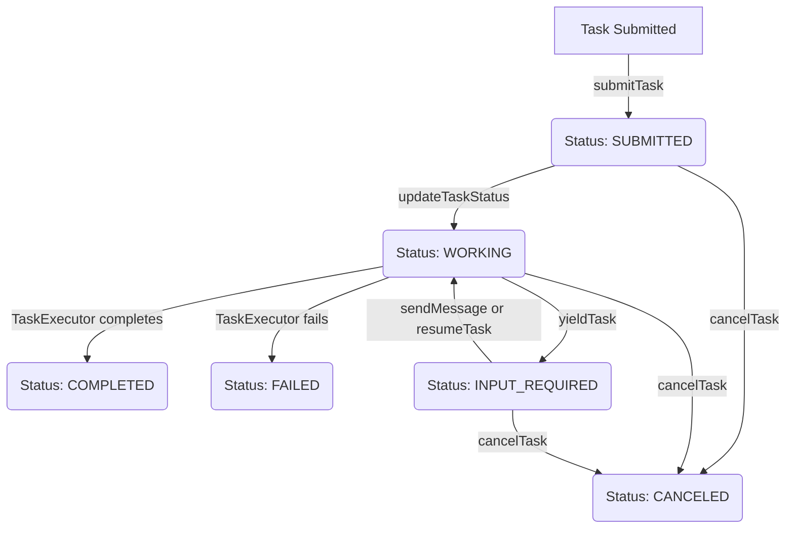

# src — protocols

The `src/protocols` module defines the communication standards and implementations for inter-agent and enhanced agent interactions within the Code Buddy system. It currently encompasses two primary protocols:

1.  **A2A (Agent-to-Agent) Protocol**: Handles the core mechanics of task delegation, lifecycle management, and message exchange between agents.
2.  **ACP (Enhanced Agent Communication Protocol)**: Provides advanced capabilities like context injection, tool delegation, and dynamic capability discovery, typically exposed via HTTP endpoints.

This module is crucial for enabling Code Buddy to operate as a multi-agent system, allowing different specialized agents to collaborate and delegate work.

---

## A2A Protocol: Agent-to-Agent Communication (`src/protocols/a2a/index.ts`)

The A2A protocol implements a standardized way for agents to communicate, delegate tasks, and manage their lifecycle. It's designed for robust, asynchronous task execution and multi-turn interactions.

### Purpose

The A2A protocol facilitates:

*   **Task Delegation**: An orchestrator agent can submit a task to a specialist agent.
*   **Lifecycle Management**: Tasks progress through defined states (submitted, working, completed, failed, etc.).
*   **Multi-Turn Interactions**: Agents can request further input or yield control, allowing for complex conversational flows.
*   **Discovery**: Agents can publish their capabilities for others to discover.

### Core Concepts

The protocol is built around several key data structures:

*   **`AgentCard`**: A discovery document (`/.well-known/agent.json` equivalent) describing an agent's name, description, URL, version, and a list of `AgentSkill`s.
*   **`AgentSkill`**: Defines a specific capability an agent possesses, including its ID, name, description, and supported input/output MIME types.
*   **`Task`**: The central unit of work. It encapsulates:
    *   `id`, `sessionId` (for grouping multi-turn interactions).
    *   `status` (`TaskState` with `TaskStatus` enum).
    *   `messages` (`A2AMessage`s exchanged between user/agent).
    *   `artifacts` (outputs produced by the task).
    *   `history` (a log of `TaskState` changes).
    *   `yieldPayload` (for pausing and resuming tasks).
*   **`A2AMessage`**: A communication unit within a task, consisting of `Part`s (text or file content) and a `role` (`user` or `agent`).
*   **`Artifact`**: Output generated by a task, also composed of `Part`s.
*   **`YieldPayload`**: A mechanism to pause a task, providing a reason, an optional state snapshot, and a hint for resumption.

### Task Lifecycle

Tasks progress through various states, managed by the `A2AAgentServer`.

### Key Components

#### `A2AAgentServer`

This class represents an agent that *receives* and *executes* tasks. It acts as the server-side implementation of the A2A protocol.

*   **Constructor**: `new A2AAgentServer(card: AgentCard, executor: TaskExecutor)`
    *   Requires an `AgentCard` to describe its capabilities.
    *   Requires a `TaskExecutor` function, which is the core logic for how this agent processes a `Task`.
*   **`submitTask(request: { id, sessionId?, message, metadata? })`**: Initiates a new task. It sets the task status to `SUBMITTED`, then `WORKING`, calls the provided `TaskExecutor`, and updates the status to `COMPLETED` or `FAILED` based on the executor's outcome.
*   **`sendMessage(taskId: string, message: A2AMessage)`**: Used for multi-turn interactions. Adds a new message to an existing task that is in `INPUT_REQUIRED` status, then re-enters the `TaskExecutor`.
*   **`yieldTask(taskId: string, payload: Omit<YieldPayload, 'timestamp'>)`**: Pauses a `WORKING` task, setting its status to `INPUT_REQUIRED` and storing the `YieldPayload`. This allows an orchestrator to intervene or provide further input.
*   **`resumeTask(taskId: string, resumeMessage?: A2AMessage, injectedState?: Record<string, unknown>)`**: Resumes a task that was previously yielded. It clears the `yieldPayload`, optionally injects state into the task's metadata, and re-enters the `TaskExecutor`.
*   **`getAgentCard()`**: Returns the agent's discovery document.
*   **`getTask(id: string)`**: Retrieves a task by its ID.
*   **`cancelTask(id: string)`**: Attempts to cancel a task if it's not already completed or failed.
*   **Event Emitter**: `A2AAgentServer` extends `EventEmitter` and emits events for key task lifecycle changes:
    *   `task:submitted`
    *   `task:completed`
    *   `task:failed`
    *   `task:canceled`
    *   `task:yielded`
    *   `task:resumed`

#### `A2AAgentClient`

This class represents an entity (typically an orchestrator) that *sends* tasks to other agents. In this implementation, it's designed for in-process communication with `A2AAgentServer` instances.

*   **`registerAgent(key: string, agent: A2AAgentServer)`**: Registers an `A2AAgentServer` instance under a unique key, allowing the client to interact with it locally.
*   **`submitTask(agentKey: string, request: string, metadata?: Record<string, string>)`**: Submits a new task to a registered agent. It internally calls the `submitTask` method of the target `A2AAgentServer`.
*   **Discovery Methods**:
    *   `getAgentCard(key: string)`: Retrieves the `AgentCard` of a registered agent.
    *   `listAgents()`: Returns keys of all registered agents.
    *   `findAgentsWithSkill(skillId: string)`: Finds agents that declare a specific skill.
*   **`getTask(agentKey: string, taskId: string)`**: Retrieves a task from a registered agent.

#### Helper Functions

*   **`createAgentCard(config: { name, description, skills, url? })`**: A utility to easily construct an `AgentCard` object.
*   **`getTaskResult(task: Task)`**: Extracts the primary result from a completed task, prioritizing artifacts, then the last agent message, or falling back to the task status message.

### Integration Points

*   **`server/routes/a2a-protocol.ts`**: This module uses `A2AAgentClient` to expose A2A functionality via HTTP endpoints, allowing external systems to interact with Code Buddy's local agents. It also uses `createAgentCard` and `getTaskResult`.
*   **`server/routes/acp.ts`**: Also uses `A2AAgentClient` for certain operations, demonstrating how different protocols can leverage the same underlying agent communication layer.
*   **`TaskExecutor` Implementations**: Any module that wants to act as an A2A agent must provide a `TaskExecutor` function to `A2AAgentServer`, defining its specific task processing logic.

---

## ACP Protocol: Enhanced Agent Communication Protocol (`src/protocols/acp/acp-server.ts`)

The ACP protocol provides a set of advanced HTTP endpoints for interacting with Code Buddy, focusing on context management, tool execution, and dynamic capability discovery. It's designed to enhance agent communication beyond basic task delegation.

### Purpose

The ACP protocol aims to:

*   **Inject Context**: Allow external systems to feed contextual information directly into Code Buddy's context engine.
*   **Delegate Tools**: Enable external agents or orchestrators to trigger Code Buddy's internal tools.
*   **Discover Capabilities**: Provide a programmatic way to query Code Buddy's available tools and general agent capabilities.

### Core Concepts

*   **`ACPContextPayload`**: Defines the structure for injecting context, including `type`, `content`, `metadata`, and `priority`.
*   **`ACPDelegatePayload`**: Defines the structure for delegating tool execution, specifying the `tool` name, `args`, and an optional `timeout`.
*   **`ACPCapability`**: Describes a single tool, including its `name`, `description`, `parameters` (JSON Schema), `readOnly` status, and `category`.
*   **`ACPCapabilitiesResponse`**: The response structure for the `/capabilities` endpoint, listing all available tools and general agent metadata.

### `createACPServerRoutes` Function

This is a factory function that returns an Express `Router` configured with the ACP endpoints. It's designed to be integrated into an existing Express application.

*   **`createACPServerRoutes(options: { asyncHandler, getContextEngine?, getToolRegistry? })`**:
    *   `asyncHandler`: A wrapper function (e.g., from `server/middleware/error-handler.ts`) to handle asynchronous Express route errors.
    *   `getContextEngine()`: An optional getter function that returns an instance of the `ContextEngine` (e.g., from `src/context/context-manager-v2.ts`). If provided, the `/context` endpoint will use it.
    *   `getToolRegistry()`: An optional getter function that returns an instance of a tool registry (e.g., from `src/mcp/mcp-client.ts`). If provided, the `/delegate` and `/capabilities` endpoints will use it.

#### Endpoints

1.  **`POST /api/acp/context`**
    *   **Payload**: `ACPContextPayload`
    *   **Functionality**:
        *   Validates `type` and `content`.
        *   If `getContextEngine()` is provided and returns an object with an `ingest` method, it calls `engine.ingest()` to inject the context.
        *   If no context engine is available, it logs that the context is "stored" (implying it's acknowledged but not actively processed).
        *   Returns `200 OK` with success status and details of the injected context.
        *   Handles errors during injection, returning `500 Internal Server Error`.
    *   **Dependencies**: `logger`, `getContextEngine().ingest()` (from `src/context/context-manager-v2.ts`).

2.  **`POST /api/acp/delegate`**
    *   **Payload**: `ACPDelegatePayload`
    *   **Functionality**:
        *   Validates `tool` and `args`.
        *   If `getToolRegistry()` is provided and returns an object with an `executeTool` method, it calls `registry.executeTool(tool, args)`.
        *   Implements a timeout mechanism (default 30s, max 2min) for tool execution.
        *   Returns `200 OK` with success status, tool name, and the result of the execution.
        *   Handles cases where the tool registry is unavailable (`503 Service Unavailable`) or tool execution fails/times out (`500 Internal Server Error`).
    *   **Dependencies**: `logger`, `getToolRegistry().executeTool()` (from `src/mcp/mcp-client.ts` or similar).

3.  **`GET /api/acp/capabilities`**
    *   **Functionality**:
        *   Constructs a response containing a list of available tools and general agent capabilities.
        *   If `getToolRegistry()` is provided and returns an object with a `listTools` method, it populates the `tools` array in the response by calling `registry.listTools()`.
        *   Includes hardcoded agent metadata (name, version, capabilities).
        *   Returns `200 OK` with the `ACPCapabilitiesResponse`.
    *   **Dependencies**: `logger`, `getToolRegistry().listTools()` (from `src/mcp/mcp-client.ts` or similar).

### Integration Points

*   **`server/routes/acp.ts`**: This is the primary consumer of `createACPServerRoutes`. It calls this function to mount the ACP endpoints onto the main Express application, providing the necessary `getContextEngine` and `getToolRegistry` implementations from the Code Buddy core.
*   **`src/context/context-manager-v2.ts`**: The `ContextEngine`'s `ingest` method is called by the `/context` endpoint.
*   **`src/mcp/mcp-client.ts`**: The `ToolRegistry`'s `executeTool` and `listTools` methods are called by the `/delegate` and `/capabilities` endpoints, respectively.
*   **`src/utils/logger.js`**: Used for logging operational details and errors within the ACP server.
*   **`server/middleware/error-handler.ts`**: Provides the `asyncHandler` wrapper for robust error handling in Express routes.

---

## Relationship Between A2A and ACP

While both protocols deal with agent communication, they serve different purposes and operate at different levels:

*   **A2A** is a lower-level, task-oriented protocol focused on the *lifecycle* of a delegated unit of work. It defines the core concepts of tasks, messages, and artifacts, and provides an in-process client/server for managing these.
*   **ACP** is a higher-level, HTTP-based protocol that *enhances* agent communication by providing specific endpoints for common advanced operations like context injection and tool delegation. It can be seen as a specialized interface that might leverage or complement the underlying A2A task management.

For instance, an external orchestrator might use ACP's `/delegate` endpoint to ask Code Buddy to run a tool, and Code Buddy might internally use A2A to delegate parts of that tool's execution to another specialized *local* agent. The `server/routes/acp.ts` module demonstrates this by using `A2AAgentClient` alongside `createACPServerRoutes`, indicating that the ACP endpoints might interact with the A2A layer.