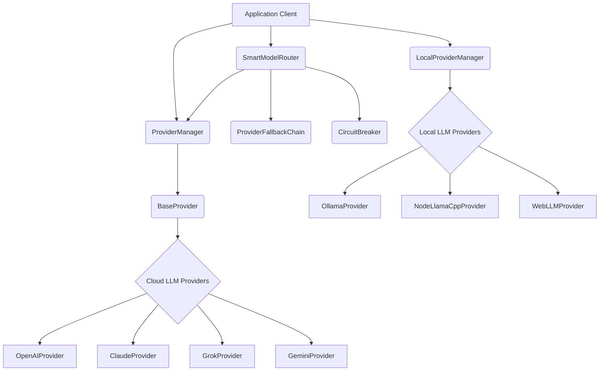

# src — providers

The `src/providers` module is the core of Code Buddy's AI interaction layer, providing a unified, resilient, and intelligent interface for communicating with various Large Language Models (LLMs). Its primary purpose is to abstract away the complexities and differences between diverse LLM APIs, enabling the application to seamlessly switch between cloud-based and local models, manage their health, optimize for cost and performance, and handle failures gracefully.

This module is critical for Code Buddy's flexibility, allowing it to support a wide range of AI capabilities, from general chat to complex tool-use and multimodal interactions, while ensuring reliability and efficient resource utilization.

## Module Architecture Overview

The `src/providers` module is structured around a set of interfaces and abstract classes that define a common contract for LLM interaction. Concrete implementations for specific LLMs (e.g., OpenAI, Claude, Gemini, Grok, Ollama) extend these base components. On top of this, the module provides sophisticated orchestration layers for managing multiple providers, handling fallbacks, and intelligently routing requests based on various criteria.

Here's a high-level view of the module's architecture:

## Core Abstraction: `base-provider.ts`

This file defines the fundamental contract and common behaviors for all LLM providers within Code Buddy.

### `AIProvider` Interface

The `AIProvider` interface is the cornerstone of the provider abstraction. It defines the methods that any LLM provider must implement, ensuring a consistent API for the rest of the application.

**Key Methods:**

*   `initialize(config: ProviderConfig)`: Sets up the provider with API keys, base URLs, and other settings.
*   `isReady(): boolean`: Checks if the provider is initialized and ready for requests.
*   `chat(options: CompletionOptions): Promise<LLMResponse>`: Sends a non-streaming chat completion request.
*   `stream(options: CompletionOptions): AsyncIterable<StreamChunk>`: Sends a streaming chat completion request, returning an async iterable of chunks.
*   `getModels(): Promise<string[]>`: Retrieves a list of models supported by the provider.
*   `supports(feature: ProviderFeature): boolean`: Checks if the provider supports specific features (e.g., `streaming`, `tools`, `vision`, `json_mode`).
*   `estimateTokens(content: string | LLMMessage[]): number`: Provides a rough estimate of token count for context management.
*   `getPricing(): { input: number; output: number }`: Returns pricing information for the provider's default model.
*   `dispose(): void`: Cleans up resources.

### `BaseProvider` Abstract Class

`BaseProvider` is an abstract class that implements common functionality shared across all concrete `AIProvider` implementations. It extends `EventEmitter` to allow providers to emit lifecycle events (e.g., `ready`).

**Key Features:**

*   **Configuration Management:** Stores `ProviderConfig` and provides a `validateConfig()` method (which can be overridden).
*   **Readiness State:** Manages the `ready` flag.
*   **Latency Tracking:** The `trackStreamLatency` protected method wraps streaming operations to record first-token and total response times using `getStreamingOptimizer` from `../optimization/latency-optimizer.js`. The public `chat` method also uses `measureLatency`.
*   **Default Implementations:** Provides default logic for `getModels()`, `supports()`, and `estimateTokens()`, which concrete providers can override for specific behaviors.
*   **`complete()` Abstract Method:** This method is the core of non-streaming completion and must be implemented by subclasses. The public `chat()` method delegates to it.

## Cloud LLM Implementations

Code Buddy includes dedicated implementations for popular cloud-based LLM APIs, each extending `BaseProvider` and adapting to the specific API's requirements.

### `openai-provider.ts` (`OpenAIProvider`)

*   **Purpose:** Interacts with OpenAI's GPT models (e.g., GPT-4o, GPT-4 Turbo).
*   **SDK:** Uses the official `openai` SDK.
*   **Key Logic:**
    *   `initialize()`: Dynamically imports the `openai` SDK and initializes the client.
    *   `formatMessages()`: Converts Code Buddy's `LLMMessage` format to OpenAI's `ChatCompletionMessageParam`.
    *   `formatTools()`: Converts Code Buddy's `ToolDefinition` to OpenAI's tool format.
    *   Handles streaming tool calls by accumulating deltas.
*   **Features:** Supports `vision` and `json_mode`.

### `claude-provider.ts` (`ClaudeProvider`)

*   **Purpose:** Interacts with Anthropic's Claude models (e.g., Claude 3/3.5).
*   **SDK:** Uses the `@anthropic-ai/sdk`.
*   **Key Logic:**
    *   `initialize()`: Dynamically imports the Anthropic SDK.
    *   `formatMessages()`: Handles Claude's specific message formatting, including separating system prompts, mapping tool results to `user` role, and structuring assistant tool calls with `tool_use` blocks.
    *   `formatTools()`: Converts tool definitions to Anthropic's `input_schema` format.
*   **Features:** Supports `vision` and `json_mode`.

### `grok-provider.ts` (`GrokProvider`)

*   **Purpose:** Interacts with xAI's Grok models.
*   **SDK:** Leverages the `openai` SDK due to Grok's OpenAI-compatible API.
*   **Key Logic:** Similar to `OpenAIProvider` in its message and tool formatting, adapting to the OpenAI-compatible API.
*   **Features:** Supports `vision` if the configured model includes it.

### `gemini-provider.ts` (`GeminiProvider`)

*   **Purpose:** Interacts with Google's Gemini models.
*   **API Interaction:** Uses `fetch` directly to the Gemini REST API, avoiding a heavy SDK dependency.
*   **Key Logic:**
    *   `formatRequest()`: Transforms Code Buddy's `CompletionOptions` into Gemini's specific JSON request body, including `systemInstruction` and `generationConfig`.
    *   `convertParameterTypes()`: Recursively converts tool parameter types to uppercase, as required by the Gemini API.
    *   `shouldForceToolUse()`: Implements logic to detect if a user query requires tool use (e.g., keywords like "météo", "news") and sets the `functionCallingConfig.mode` to `ANY` for the first iteration.
    *   **Resilience:** Incorporates `retry` with `RetryStrategies.llmApi` and `RetryPredicates.llmApiError` for robust API calls.
*   **Features:** Supports `vision` (multimodal) and `json_mode`.

## Local LLM Ecosystem: `local-llm-provider.ts`

This module enables Code Buddy to run LLMs locally, providing offline capabilities and reducing reliance on cloud services. It defines an interface for local providers and includes implementations for various local LLM runtimes.

### `LocalLLMProvider` Interface

Defines the contract for local LLM providers, similar to `AIProvider` but tailored for local execution.

### `NodeLlamaCppProvider`

*   **Purpose:** Provides direct integration with `llama.cpp` via `node-llama-cpp` bindings.
*   **Advantages:** No external server needed, lowest latency, fine-grained control, supports various hardware (CUDA, Metal, CPU).
*   **Key Logic:**
    *   Manages `LlamaModel` and `LlamaContext` instances.
    *   Requires a local GGUF model file (`.gguf`).
    *   Includes logic to check for model file existence and provides helpful error messages (`ModelNotFoundError`).
    *   Simulates streaming by chunking the full response.
*   **Dependencies:** `node-llama-cpp` (optional, dynamically imported).

### `WebLLMProvider`

*   **Purpose:** Enables browser-based LLM inference using WebGPU via `@mlc-ai/web-llm`.
*   **Advantages:** Zero server requirements, runs in browser/Electron, progressive model download.
*   **Limitations:** Requires WebGPU support, not for pure Node.js environments.
*   **Key Logic:**
    *   Uses `MLCEngine` from `@mlc-ai/web-llm`.
    *   Emits `progress` events during model loading.
    *   `isAvailable()` checks for WebGPU support in the `navigator`.
*   **Dependencies:** `@mlc-ai/web-llm` (optional, dynamically imported).

### `OllamaProvider`

*   **Purpose:** Interacts with a local Ollama server via its HTTP API.
*   **Advantages:** Mature local LLM solution, easy model management (pull, list, remove), OpenAI-compatible API.
*   **Key Logic:**
    *   `initialize()`: Checks if the Ollama server is running and pulls the specified model if not available locally. Emits `model:pulling` and `progress` events.
    *   `pullModel()`: Handles streaming model download progress.
    *   Uses `fetch` for API calls, with `retry` and `safeStreamRead` for robustness.
*   **Dependencies:** Requires an external Ollama server running.

### `LocalProviderManager`

This class orchestrates the local LLM providers.

*   **Responsibilities:**
    *   `registerProvider()`: Initializes and registers a `LocalLLMProvider` instance.
    *   `setActiveProvider()`: Sets the currently active local provider.
    *   `autoDetectProvider()`: Attempts to find the best available local provider (priority: Ollama > node-llama-cpp > WebLLM).
    *   `complete()` and `stream()`: Delegates requests to the active provider, with basic fallback logic.
*   **Singleton:** `getLocalProviderManager()` provides a singleton instance.
*   **`autoConfigureLocalProvider()`:** A utility function to automatically set up the best local provider, optionally preferring a specific type.

## Provider Registry & Legacy Support: `additional-providers.ts`

This file contains a registry of additional LLM providers that Code Buddy supports, primarily those with OpenAI-compatible APIs.

*   **`ProviderConfig` Interface:** Defines the structure for provider configurations, including `id`, `name`, `baseUrl`, `apiKeyEnv`, `models`, `defaultModel`, `maxOutputTokens`, `contextWindow`, and feature flags.
*   **`ADDITIONAL_PROVIDERS` Array:** A hardcoded list of providers like Mistral, Deepgram, MiniMax, Moonshot, Venice AI, and Z.AI.
*   **Utility Functions:** `getAdditionalProvider()`, `getProviderForModel()`, `listAvailableProviders()`, `listAllProviders()`, and `resolveProviderConfig()` provide ways to query and resolve configurations for these providers.
*   **Deprecation:** This module is explicitly marked as `@deprecated`. Providers are being migrated to a plugin-based system (`src/plugins/bundled/`) in Native Engine v2026.3.14. Developers should avoid adding new providers here and instead contribute to the new plugin architecture.

## Resilience and Fallback

To ensure robust and reliable AI interactions, the module incorporates patterns for handling failures and providing automatic fallback.

### Circuit Breaker: `circuit-breaker.ts`

The circuit breaker pattern prevents repeated attempts to a failing service, allowing it to recover and preventing cascading failures.

*   **`CircuitState` Enum:** Defines the three states: `CLOSED` (normal operation), `OPEN` (rejects calls immediately), and `HALF_OPEN` (allows limited test calls for recovery).
*   **`CircuitBreaker` Class:**
    *   `execute<T>(fn: () => Promise<T>)`: Wraps an asynchronous function, applying the circuit breaker logic.
    *   `onSuccess()` / `onFailure()`: Updates internal state based on call outcomes.
    *   `transitionTo()`: Manages state changes (CLOSED -> OPEN -> HALF_OPEN -> CLOSED).
    *   Emits `open`, `close`, `half-open` events.
*   **`CircuitOpenError`:** A custom error thrown when the circuit is open.
*   **Global Registry:** `getCircuitBreaker()`, `resetCircuitBreaker()`, `resetAllCircuitBreakers()`, `getAllCircuitBreakerStats()` manage a map of circuit breakers, typically one per provider or endpoint.

### Provider Fallback Chain: `fallback-chain.ts`

This component manages an ordered list of providers and automatically switches to healthy alternatives when the primary fails.

*   **`FallbackConfig` Interface:** Configures thresholds for failures, cooldown periods, and auto-promotion behavior.
*   **`ProviderHealth` Interface:** Provides a detailed health status for each provider.
*   **`ProviderFallbackChain` Class:**
    *   `setFallbackChain(providers: ProviderType[])`: Defines the ordered list of providers.
    *   `getNextProvider(skipCurrent = false)`: Returns the next healthy provider, skipping unhealthy ones or attempting recovery after a cooldown.
    *   `recordSuccess()` / `recordFailure()`: Updates health metrics for a provider.
    *   `isProviderHealthy()`: Determines if a provider is healthy based on failure count, cooldown, and consecutive slow responses.
    *   `promoteProvider()` / `promoteNextHealthyProvider()`: Reorders the chain to make a healthy provider primary.
    *   Emits events like `provider:fallback`, `provider:unhealthy`, `provider:recovered`, `provider:promoted`.
*   **Singleton:** `getFallbackChain()` provides a singleton instance.

## Orchestration and Smart Routing

These components sit at the top of the provider hierarchy, making intelligent decisions about which LLM to use for a given request.

### Provider Manager: `provider-manager.ts`

The `ProviderManager` is the central hub for managing cloud LLM providers. It acts as a registry and selector for the main AI services.

*   **Responsibilities:**
    *   `registerProvider(type: ProviderType, config: ProviderConfig)`: Initializes and stores `AIProvider` instances.
    *   `createProvider()`: A factory method for instantiating `GrokProvider`, `ClaudeProvider`, `OpenAIProvider`, and `GeminiProvider`.
    *   `setActiveProvider(type: ProviderType)`: Sets the default provider for general requests.
    *   `selectBestProvider()`: Implements basic logic to choose a provider based on requirements like `requiresVision`, `requiresLongContext`, or `costSensitive`.
    *   `complete()`: Delegates completion requests to the currently active provider.
*   **Singleton:** `getProviderManager()` provides a singleton instance.

### Smart Model Router: `smart-router.ts` (not fully provided, but inferred from `index.ts` and call graph)

The `SmartModelRouter` is designed for advanced, dynamic routing of LLM requests. It integrates the `ProviderManager`, `ProviderFallbackChain`, and `CircuitBreaker` to make intelligent routing decisions.

*   **Key Responsibilities (inferred):**
    *   `route()`: The primary method for determining which provider and model to use for a request. This likely involves:
        *   Evaluating task complexity (`classifyTaskComplexity` from `../optimization/model-routing.ts`).
        *   Considering explicit provider/model preferences (`routeToForced`).
        *   Checking provider health via `ProviderFallbackChain` (`getFallbackRoute`, `getNextProvider`, `isProviderHealthy`).
        *   Estimating costs (`estimateCost`).
        *   Potentially downgrading models based on cost or performance (`shouldDowngrade`).
    *   `recordSuccess()` / `recordFailure()`: Updates metrics for the chosen provider, potentially interacting with `ProviderFallbackChain` and `CircuitBreaker`.
*   **Singleton:** `getSmartRouter()` provides a singleton instance.

## Key Data Structures (`types.ts` - inferred)

While `types.ts` was not provided, its existence and contents are crucial for the module's unified interface. It defines common types used across all providers:

*   `ProviderType`: Union type for provider identifiers (e.g., `'openai'`, `'claude'`, `'grok'`).
*   `LLMMessage`: Standardized message format (role, content, tool\_calls, etc.).
*   `ToolCall`: Represents a function call requested by the LLM.
*   `ToolDefinition`: Defines the schema for a tool/function.
*   `LLMResponse`: Standardized response format from an LLM completion.
*   `StreamChunk`: Represents a piece of data in a streaming response (content, tool\_call, done).
*   `ProviderConfig`: Generic configuration for an LLM provider.
*   `CompletionOptions`: Options for an LLM completion request (messages, tools, temperature, maxTokens, systemPrompt, etc.).
*   `ProviderFeature`: Union type for features an LLM might support (e.g., `'streaming'`, `'tools'`, `'vision'`, `'json_mode'`).

## Integration Points & Usage

The `src/providers` module is a foundational layer, integrated throughout Code Buddy:

*   **Application Client:** Directly interacts with `ProviderManager`, `SmartModelRouter`, and `LocalProviderManager` to initiate LLM requests.
*   **Commands:** The `createProviderCommand` (from `src/commands/provider.ts`) uses `getProviderManager` to configure and manage providers.
*   **Offline Mode:** `callNewProvider` (from `src/offline/offline-mode.ts`) leverages `autoConfigureLocalProvider` and `complete` from `local-llm-provider.ts` for local LLM operations.
*   **Optimization:** `BaseProvider` and `SmartModelRouter` integrate with `src/optimization/latency-optimizer.js` and `src/optimization/model-routing.ts` for performance and cost-aware decisions.
*   **Utilities:** Relies on `src/utils/logger.js` for logging, `src/utils/retry.js` for API call resilience, `src/utils/stream-helpers.js` for robust stream processing, and `src/utils/errors.js` for custom error handling.
*   **Testing:** Extensive unit and integration tests (`tests/llm-provider.test.ts`, `tests/unit/providers.test.ts`, `tests/unit/provider-manager.test.ts`) validate the functionality of individual providers and the overall system.
*   **Scripts:** Various internal scripts (e.g., `scripts/test-real-conditions-gemini.ts`) use specific providers for testing and benchmarking.

This module provides a robust, extensible, and intelligent framework for Code Buddy's interactions with the rapidly evolving landscape of Large Language Models.