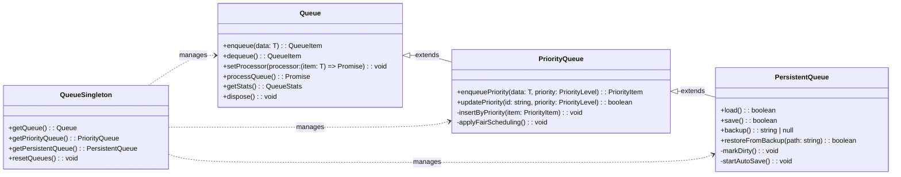

# src — queue

The `src/queue` module provides a robust and flexible set of queue implementations designed for asynchronous task processing, supporting priority-based ordering and disk persistence. It's a foundational component for managing background tasks, event processing, or any scenario requiring reliable, ordered execution of data.

## Module Overview

The `queue` module is built around an inheritance hierarchy, starting with a basic FIFO queue and extending it with priority and persistence capabilities. It also includes a singleton pattern for easy global access to queue instances.

**Key Capabilities:**

*   **Basic FIFO Queue (`Queue`)**: Handles simple first-in, first-out task processing with configurable concurrency, retries, and event emission.
*   **Priority Queue (`PriorityQueue`)**: Extends the basic queue to process items based on defined priority levels (low, normal, high, critical), including fair scheduling to prevent starvation.
*   **Persistent Queue (`PersistentQueue`)**: Further extends the priority queue with file-system persistence, ensuring queue state survives application restarts and providing backup/restore functionalities.
*   **Singleton Access**: Provides convenient global access to pre-configured queue instances.

### Architecture Diagram

The module's core components are structured as an inheritance chain, allowing for progressive enhancement of queue functionality:



## Core Queue Implementations

### 1. `Queue<T>` (Base FIFO Queue)

The `Queue` class is the fundamental building block, providing a generic FIFO (First-In, First-Out) queue with asynchronous processing capabilities.

**Purpose:**
To manage a list of tasks or data items, process them sequentially or concurrently, and handle retries for failed operations.

**Key Features:**

*   **FIFO Ordering**: Items are processed in the order they are enqueued.
*   **Asynchronous Processing**: Supports a `processor` function that returns a `Promise`, allowing for non-blocking task execution.
*   **Concurrency Control**: Configurable `concurrency` for parallel processing of items.
*   **Retry Mechanism**: Items can be retried up to `maxRetries` times with a `retryDelay` if the processor fails.
*   **Event-Driven**: Emits events for various lifecycle stages (`enqueue`, `dequeue`, `process`, `processed`, `error`, `retry`, `full`, `empty`, `drain`).
*   **Statistics**: Tracks `processedCount`, `failedCount`, and `avgProcessingTime`.

**Usage Pattern:**

1.  **Instantiate**: `const myQueue = new Queue<MyTaskType>(options);`
2.  **Set Processor**: Define how items are processed:
    ```typescript
    myQueue.setProcessor(async (taskData: MyTaskType) => {
      // Perform async operation with taskData
      console.log(`Processing task: ${taskData.id}`);
      await someExternalService.doWork(taskData);
      return 'success';
    });
    ```
3.  **Enqueue Items**: Add tasks to the queue:
    ```typescript
    myQueue.enqueue({ id: 'task1', payload: 'data' });
    myQueue.enqueueMany([{ id: 'task2', payload: 'more data' }, { id: 'task3', payload: 'even more' }]);
    ```
4.  **Listen to Events**: React to queue activity:
    ```typescript
    myQueue.on('processed', (item, result) => console.log(`Item ${item.id} processed: ${result}`));
    myQueue.on('error', (item, error) => console.error(`Item ${item.id} failed: ${error.message}`));
    myQueue.on('drain', () => console.log('Queue is empty and all items processed.'));
    ```
5.  **Manual Processing (if `autoProcess` is false)**:
    ```typescript
    await myQueue.processQueue();
    ```

**Core Methods & Properties:**

*   `constructor(options?: QueueOptions)`: Initializes the queue.
*   `enqueue(data: T, metadata?: Record<string, unknown>): QueueItem<T> | null`: Adds an item.
*   `dequeue(): QueueItem<T> | undefined`: Removes and returns the next item.
*   `setProcessor(processor: (item: T) => Promise<unknown>): void`: Sets the async function to process items.
*   `processQueue(): Promise<void>`: Starts processing items. Automatically called if `autoProcess` is true and a processor is set.
*   `processItem(item: QueueItem<T>): Promise<void>` (protected): Handles individual item processing, including retries.
*   `getStats(): QueueStats`: Returns current queue statistics.
*   `dispose(): void`: Clears the queue and removes all event listeners.

**Execution Flow (`autoProcess` enabled):**
1.  `enqueue()` is called.
2.  If `options.autoProcess` is true and a `processor` is set, `processQueue()` is invoked.
3.  `processQueue()` manages concurrency, repeatedly calling `dequeue()` and `processItem()`.
4.  `processItem()` executes the `processor` function. On success, `processedCount` is incremented. On failure, if `item.attempts < options.maxRetries`, the item is re-enqueued (using `items.unshift(item)`) after a `retryDelay`. Otherwise, `failedCount` is incremented.

### 2. `PriorityQueue<T>`

The `PriorityQueue` class extends `Queue`, introducing the concept of item priority.

**Purpose:**
To ensure that more important tasks are processed before less important ones, even if they were enqueued later.

**Key Features:**

*   **Priority Levels**: Supports `low`, `normal`, `high`, and `critical` priority levels.
*   **Priority-based Ordering**: Items are stored and dequeued based on their `priorityValue`.
*   **Fair Scheduling**: An optional mechanism (`fairScheduling: true`) that boosts the priority of items that have been waiting for too long (`maxWaitTime`), preventing starvation of lower-priority tasks.
*   **Priority Management**: Methods to `updatePriority`, `escalate`, and `deescalate` an item's priority.

**Usage Pattern:**

1.  **Instantiate**: `const myPriorityQueue = new PriorityQueue<MyTaskType>(options);`
2.  **Enqueue with Priority**:
    ```typescript
    myPriorityQueue.enqueuePriority({ id: 'urgent', payload: 'critical data' }, 'critical');
    myPriorityQueue.enqueuePriority({ id: 'background', payload: 'low priority' }, 'low');
    myPriorityQueue.enqueue({ id: 'default', payload: 'normal priority' }); // Uses defaultPriority
    ```
3.  **Manage Priorities**:
    ```typescript
    myPriorityQueue.updatePriority('background', 'normal');
    myPriorityQueue.escalate('background'); // Boosts to 'high'
    ```
4.  **Get Priority-Specific Stats**:
    ```typescript
    const priorityStats = myPriorityQueue.getPriorityStats();
    console.log(priorityStats.byPriority.critical); // Count of critical items
    ```

**Core Methods & Properties:**

*   `constructor(options?: PriorityQueueOptions)`: Initializes the priority queue.
*   `enqueuePriority(data: T, priority?: PriorityLevel, metadata?: Record<string, unknown>): PriorityItem<T> | null`: Adds an item with a specified priority. Overrides `enqueue` to use `defaultPriority`.
*   `insertByPriority(item: PriorityItem<T>)` (protected): Inserts an item into the `items` array at the correct position based on its `priorityValue`. This method also calls `applyFairScheduling()` if enabled.
*   `applyFairScheduling()` (protected): Iterates through items and boosts `priorityValue` for those exceeding `maxWaitTime`.
*   `updatePriority(id: string, priority: PriorityLevel): boolean`: Changes an item's priority and re-sorts the queue.
*   `escalate(id: string): boolean`: Increases an item's priority by one level.
*   `deescalate(id: string): boolean`: Decreases an item's priority by one level.
*   `getPriorityStats()`: Returns statistics specific to priority levels.

### 3. `PersistentQueue<T>`

The `PersistentQueue` class extends `PriorityQueue`, adding the crucial ability to save and load the queue's state to/from disk.

**Purpose:**
To provide durable queues that can survive application restarts, ensuring no tasks are lost and processing can resume from where it left off.

**Key Features:**

*   **File-based Persistence**: Stores queue items and basic stats in a JSON file on the local filesystem.
*   **Auto-Save**: Can be configured to automatically save the queue state on every modification (`autoSave: true`) or at a fixed `saveInterval`.
*   **Recovery**: Automatically loads the queue state from disk upon instantiation.
*   **Backup & Restore**: Provides methods to create backups and restore from them.
*   **Configurable Storage**: Allows specifying `storageDir` and `filename`.

**Usage Pattern:**

1.  **Instantiate**:
    ```typescript
    const myPersistentQueue = new PersistentQueue<MyTaskType>({
      filename: 'my-app-tasks.json',
      autoSave: true,
      storageDir: '/var/lib/my-app/queues'
    });
    // Upon instantiation, it will automatically try to load from 'my-app-tasks.json'
    ```
2.  **Operations**: All `PriorityQueue` operations (enqueue, dequeue, updatePriority) will now automatically trigger a save if `autoSave` is enabled or mark the queue as dirty for interval saving.
3.  **Manual Save/Load**:
    ```typescript
    myPersistentQueue.save();
    myPersistentQueue.load();
    ```
4.  **Backup/Restore**:
    ```typescript
    const backupPath = myPersistentQueue.backup();
    if (backupPath) console.log(`Backup created at: ${backupPath}`);

    const latestBackup = myPersistentQueue.listBackups()[0];
    if (latestBackup) myPersistentQueue.restoreFromBackup(latestBackup);
    ```
5.  **Cleanup**:
    ```typescript
    myPersistentQueue.deleteStorage(); // Deletes the main queue file
    myPersistentQueue.dispose(); // Stops auto-save, saves if dirty, clears in-memory queue
    ```

**Core Methods & Properties:**

*   `constructor(options?: PersistentQueueOptions)`: Initializes the persistent queue. Calls `ensureStorageDir()`, `load()`, and `startAutoSave()`.
*   `ensureStorageDir()` (protected): Creates the `storageDir` if it doesn't exist.
*   `load(): boolean`: Reads and deserializes queue data from `storageFilePath`.
*   `save(): boolean`: Serializes and writes current queue data to `storageFilePath`.
*   `startAutoSave()` (protected): Initiates the `setInterval` for periodic saving if `autoSave` is false and `saveInterval` is set.
*   `stopAutoSave()` (protected): Clears the auto-save timer.
*   `markDirty()` (protected): Sets an internal flag indicating the queue needs saving. If `autoSave` is true, it immediately calls `save()`.
*   **Overrides**: `enqueuePriority`, `dequeue`, `removeById`, `clear`, `updatePriority` all call `markDirty()` after their superclass operation.
*   `deleteStorage(): boolean`: Deletes the queue's persistence file.
*   `backup(): string | null`: Creates a timestamped backup of the queue.
*   `restoreFromBackup(backupPath: string): boolean`: Loads queue state from a specified backup file.
*   `dispose()`: Overrides the base `dispose` to stop auto-save and perform a final save if dirty.

**Persistence Format (`SerializedQueue<T>`):**
The queue data is stored as a JSON object with a `version`, `createdAt`, `lastSavedAt`, an array of `items` (each `SerializedQueueItem<T>`), and `stats`. This structured format allows for potential future migrations and easier debugging.

## Singleton Management (`src/queue/queue-singleton.ts`)

This module provides a convenient way to access globally shared instances of `Queue`, `PriorityQueue`, and `PersistentQueue`. This is useful for scenarios where different parts of an application need to interact with the same queue instance without explicitly passing it around.

**Key Functions:**

*   `getQueue<T = unknown>(options?: QueueOptions): Queue<T>`: Returns a singleton instance of `Queue`. If called for the first time, it initializes it with the provided options.
*   `getPriorityQueue<T = unknown>(options?: PriorityQueueOptions): PriorityQueue<T>`: Returns a singleton instance of `PriorityQueue`.
*   `getPersistentQueue<T = unknown>(options?: PersistentQueueOptions): PersistentQueue<T>`: Returns a singleton instance of `PersistentQueue`.
*   `resetQueues(): void`: Disposes of all singleton queue instances and sets them to `null`. This is primarily useful for testing or when a complete reset of the queue system is required.
*   `getQueuesSummary()`: Provides a snapshot of statistics for all initialized singleton queues.

**Usage:**

```typescript
import { getPersistentQueue, resetQueues } from './queue-singleton';

// Get the global persistent queue instance
const taskQueue = getPersistentQueue<MyTaskType>({
  filename: 'global-tasks.json',
  autoSave: true,
});

taskQueue.enqueuePriority({ id: 'global-task-1', data: 'important' }, 'high');

// Later, in another part of the application
const anotherReference = getPersistentQueue<MyTaskType>(); // Gets the *same* instance
anotherReference.enqueue({ id: 'global-task-2', data: 'less important' });

// When shutting down or for testing
resetQueues();
```

## Integration and Dependencies

*   **`events` (Node.js built-in)**: All queue classes extend `EventEmitter` to provide a rich eventing system for monitoring queue activity.
*   **`fs`, `path`, `os` (Node.js built-ins)**: Used by `PersistentQueue` for file system operations (reading, writing, creating directories, determining home directory for default storage).
*   **`logger` (`../utils/logger.js`)**: Used by `PersistentQueue` to log warnings, e.g., for queue version mismatches during loading.

## Contributing and Extending

*   **Extending Functionality**: The inheritance model makes it straightforward to extend existing queue types. For example, you could create a `NetworkQueue` that extends `PersistentQueue` to synchronize its state with a remote server.
*   **Custom Processors**: The `setProcessor` method is the primary extension point for defining custom task logic.
*   **Event Listeners**: Leverage the extensive event system (`on`, `once`, `emit`) to integrate queue events into other parts of the application (e.g., UI updates, notifications, metrics collection).
*   **Persistence Format**: If the `SerializedQueue` format needs to change in the future, ensure backward compatibility or implement migration logic within the `load()` method of `PersistentQueue`. The `QUEUE_VERSION` constant is provided for this purpose.
*   **Performance**: For very high-throughput scenarios, consider the impact of `fairScheduling` (which re-sorts the queue) and `autoSave` (which performs disk I/O on every modification). Adjust `saveInterval` and `concurrency` as needed.